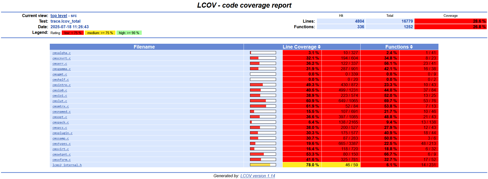
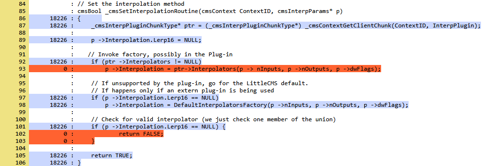

# afl-cov-fast

本篇总结 [afl-cov-fast](https://github.com/airbus-seclab/afl-cov-fast) 的使用方法, 主要用来可视化源代码行级别的覆盖情况.

> [afl-cov-fast](https://github.com/airbus-seclab/afl-cov-fast) is a tool to generate code coverage from AFL test cases. It aims to  efficiently generate a "zero coverage" report of functions and lines  never covered by a fuzzing campaign, both when code is available and in  binary-only mode via the QEMU and Frida backends.
>
> A typical use-case is to run an [AFL++](https://github.com/AFLplusplus/AFLplusplus) campaign to find bugs. After running the fuzzer for a while, one wants  to know if the code has been properly covered. If not, it is interesting to understand why (are patches required? should a wider variety of  samples be added to the corpus? should the configuration be modified?).
>
> There are existing projects to help with this endeavor:
>
> -  [afl-cov](https://github.com/vanhauser-thc/afl-cov),
> -  [aflq_fast_cov](https://github.com/eqv/aflq_fast_cov),
> -  [pyafl_qemu_trace](https://github.com/novafacing/pyafl_qemu_trace).


## Instances





输入一个特定的 testcases 集合, 可以直观地观察项目中每个源文件的覆盖率情况和具体的每行代码的覆盖次数, 覆盖次数为 0 的代码行会被标为红色, 非 0 覆盖次数的代码行被标为蓝色. 


## Install

In Ubuntu 20.04 +, 经过测试环境依赖必须要 clang 和 llvm-tools 的**版本统一**, 比如同时为 15 或者 16.

**Requirements**

- Python 3.6 or newer; (python3.10 is ok)
- The Python `tqdm` package;
- `lcov` (for the `lcov` and `genhtml` commands); (15 is ok)
- `llvm` (for the `llvm-profdata` command); (15 is ok)
- `llvm-tools` (for the `llvm-cov` command). (15 is ok)

```shell
git clone --recursive https://github.com/airbus-seclab/afl-cov-fast.git

# install AFL++ for executing the input corpus
cd /path/to/afl-cov-fast
git clone -b dev https://github.com/AFLplusplus/AFLplusplus.git
cd AFLplusplus
make distrib
cd ../tests

# install dependencies
pip install tqdm
sudo apt update
sudo apt install lcov llvm-15-tools

# test
which llvm-profdata
# if not working, link it to /usr/local/bin
sudo rm /usr/local/bin/llvm-profdata
sudo ln -s /usr/bin/llvm-profdata-15 /usr/local/bin/llvm-profdata

# <final dependencies installed effect>
❯ llvm-profdata --help
OVERVIEW: LLVM profile data tools

USAGE: llvm-profdata <command> [args...]
USAGE: llvm-profdata <command> -help

See each individual command --help for more details.
Available commands: merge, show, overlap
❯ lcov --version
lcov: LCOV version 1.14
❯ llvm-cov --version
Ubuntu LLVM version 15.0.7
  Optimized build.
  Default target: x86_64-pc-linux-gnu
  Host CPU: goldmont
```


## Running

以 LCMS 项目为示例演示

### Compiling

```shell
git clone https://github.com/mm2/Little-CMS.git

# cp cms_transform_fuzzer.cc to Little-CMS/
cd Little-CMS

# clang
export CC=clang
export CFLAGS="-O2 -Wall -Wextra -D_FORTIFY_SOURCE=2 -fstack-protector-strong -fstack-clash-protection -fPIE -pie -fPIC -Wl,-z,relro -Wl,-z,now -Wl,-z,noexecstack -Wl,-z,separate-code -fprofile-instr-generate -fcoverage-mapping"
export CXX=clang++
export CXXFLAGS="-O2 -Wall -Wextra -D_FORTIFY_SOURCE=2 -fstack-protector-strong -fstack-clash-protection -fPIE -pie -fPIC -Wl,-z,relro -Wl,-z,now -Wl,-z,noexecstack -Wl,-z,separate-code -fprofile-instr-generate -fcoverage-mapping -std=c++11"
export SRC=$(pwd)
export FUZZER_LIB=/path/to/afl-cov-fast/AFLplusplus/libAFLDriver.a
export OUT=$(pwd)

./autogen.sh
./configure
make -j $(nproc)

# set compiler as afl-clang-fast to instrument the target for fuzzing
export CC=/path/to/afl-cov-fast/AFLplusplus/afl-clang-fast
export CXX=/path/to/afl-cov-fast/AFLplusplus/afl-clang-fast++

# <error reading options?>
$CXX $CXXFLAGS $SRC/cms_transform_fuzzer.cc -I include/ src/.libs/liblcms2.a \
    $FUZZER_LIB -o $OUT/cms_transform_fuzzer
# then use this by expanding the FLAGS in the command
$CXX -O2 -Wall -Wextra -D_FORTIFY_SOURCE=2 -fstack-protector-strong -fstack-clash-protection -fPIE -pie -fPIC -Wl,-z,relro -Wl,-z,now -Wl,-z,noexecstack -Wl,-z,separate-code -fprofile-instr-generate -fcoverage-mapping -std=c++11 \
		$SRC/cms_transform_fuzzer.cc -I include/ src/.libs/liblcms2.a \
    $FUZZER_LIB -o $OUT/cms_transform_fuzzer
```

### Fuzzing

```shell
cd /path/to/afl-cov-fast
mkdir local_test
cd local_test
# move your testing aflpp_corpus to `/path/to/afl-cov-fast/local_test`
cp /path/to/cms_transform_fuzzer .

export AFL_SKIP_CPUFREQ=1
export AFL_I_DONT_CARE_ABOUT_MISSING_CRASHES=1
# AFL++ fuzzing for a while like 2 mins or 2 hours
../AFLplusplus/afl-fuzz -t 3000 -i ./aflpp_corpus -o aflpp_output $@ -- ./cms_transform_fuzzer @@
```


### Coverage

生成覆盖信息的 html 文件

```shell
../afl-cov-fast.py -m llvm --code-dir '/path/to/aflpp_benchmarks/lcms/Little-CMS' --afl-fuzzing-dir '/path/to/afl-cov-fast/lcms/aflpp_output' --coverage-cmd './cms_transform_fuzzer @@' --binary-path './cms_transform_fuzzer' $@
```

使用 python 自带的 http 服务模块来查看结果, 浏览器打开 `localhost:4000`

```shell
cd ./aflpp_output/cov/web
python -m http.server 4000
```


## References

[1] https://www.sstic.org/2025/presentation/afl-cov-fast/

[2] https://github.com/airbus-seclab/afl-cov-fast

