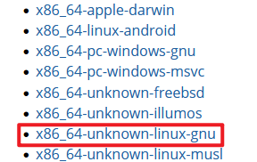

# Rust 基础语法 I

环境安装, 变量, 数据类型, 函数, 注释, 控制流 if-else, 控制流 循环

## 环境安装

下载安装软件 [https://www.rust-lang.org/tools/install](https://www.rust-lang.org/tools/install)

以 Ubuntu20.04 操作系统为例, 选择 `x86_64-unknown-linux-gnu`



下载至Ubuntu系统运行, 或者使用命令行完成安装

```shell
# one line command to install rust
curl --proto '=https' --tlsv1.3 https://sh.rustup.rs -sSf | sh

# output example
info: downloading installer

Welcome to Rust!

This will download and install the official compiler for the Rust
programming language, and its package manager, Cargo.

Rustup metadata and toolchains will be installed into the Rustup
home directory, located at:

  /home/fa1c4/.rustup

This can be modified with the RUSTUP_HOME environment variable.

The Cargo home directory is located at:

  /home/fa1c4/.cargo

This can be modified with the CARGO_HOME environment variable.

The cargo, rustc, rustup and other commands will be added to
Cargo's bin directory, located at:

  /home/fa1c4/.cargo/bin

This path will then be added to your PATH environment variable by
modifying the profile files located at:

  /home/fa1c4/.profile
  /home/fa1c4/.bashrc
  /home/fa1c4/.zshenv

You can uninstall at any time with rustup self uninstall and
these changes will be reverted.

Current installation options:


   default host triple: x86_64-unknown-linux-gnu
     default toolchain: stable (default)
               profile: default
  modify PATH variable: yes

1) Proceed with standard installation (default - just press enter)
2) Customize installation
3) Cancel installation
>1
...

# set the environment variables
source $HOME/.cargo/env

# test installation
rustc --version # rust compiler
# rustc 1.83.0 (90b35a623 2024-11-26)
cargo --version # rust package manager like pip for python
# cargo 1.83.0 (5ffbef321 2024-10-29)
```

基本使用

```shell
# compile single rust source code
rustc test.rs

# for general development it's recommended use cargo to maintain rust project
# create new rust project which named test_proj
cargo new test_proj
# it will generate Cargo.toml(Tom's Obvious, Minimal Language, the configure file of Cargo), src/main.rs
# probably include .git, .gitignore

# if you didn't create project from scratch and write some code firstly
# convert the source code into cargo project by moving all code into src directory and write the Cargo.toml file yourself

# build the project using cargo
cargo build
# it will generate cargo.lock file at root directory of rust project
# which contains the trace information of versions of packages. Do not modify it.

# compile and run the project using cargo
cargo run

# check if the source code can pass compiling process without generating binary
cargo check 
# this command checking source code error more efficiently than cargo build

# release version, speedup the binary execution with longer compiling time 
cargo build --release
# the binary will generate at target/release instead of target/debug
```


## 变量 & 常量

声明变量使用 `let` 关键字, 默认不可变 `immutable`, 声明变量时, 在变量前面加上 `mut`, 使得变量可变.

同个名字声明变量, 会隐藏 (shadowing) 之前的变量, 重新声明的变量类型可以改变

```rust
let x = 1;
let x = x + 1; // shadowing
let x = x * 2; // shadowing
println!("The value of x is {}", x); // x == 4;
```


常量 `constant` 在绑定值以后也不可变, 与 `immutable` 的差别: `constant` 一直不可变, 但是 `immutable` 可以重定义为 `mut`.

常量 `constant` 可以在任何作用域声明, 包括全局作用域. 并且, 常量只能绑定到常量表达式, 只能绑定在不运行也能计算出的表达式.

常量 `constant` 使用全大写字母, 每个单词用下划线分开

```rust
const MAX_VAL: u32 = 100_000; // using _ to split const for readable
```


## 数据类型

标量类型: 整数类型, 浮点类型, 布尔类型, 字符类型

整数类型

| Length  | Signed [-(2^n - 1), 2^(n-1) - 1]     | Unsigned [0, 2^n - 1]                |
| ------- | ------------------------------------ | ------------------------------------ |
| 8-bit   | i8                                   | u8                                   |
| 16-bit  | i16                                  | u16                                  |
| 32-bit  | i32                                  | u32                                  |
| 64-bit  | i64                                  | u64                                  |
| 128-bit | i128                                 | u128                                 |
| arch    | isize (32-bit if arch32 else 64-bit) | usize (32-bit if arch32 else 64-bit) |

浮点类型

| Length | Precision |
| ------ | --------- |
| 32-bit | f32       |
| 64-bit | f64       |


布尔类型 `bool`: {true, false}. 字符类型 `char` 占用 32-bit 大小, Unicode标量值. 


 复合类型: 元组(Tuple), 数组(Array)

Tuple 可以存放多个类型, Array 只能存放相同类型, Tuple 和 Array 长度固定. Array是在 stack 上分配内存.

```rust
let tup: (i32, f64, u8) = (50, 2.33, 1);
println!("{} {} {}", tup.0, tup.1, tup.2);
// 50, 2.33, 1

let (x, y, z) = tup;
println!("{} {} {}", x, y, z);
// 50, 2.33, 1

let months: [&str; 12] = [
	"January", "February", "March", "April", "May", "June",
    "July", "August", "September", "October", "November", "December"
];
```

可变数组: vector 由标准库提供


## 函数

Rust 基于 snake case 命名规范, 函数和变量名的所有字母小写并用下划线分开单词. 函数参数必须声明类型. `->` 声明返回值类型. 返回值为函数体中最后一个表达式的值 (注意, 不是 statement 语句以 `;` 结尾, 而是 expression 表达式)

```rust
fn test_print() {
    println!("testing println!");
}

fn print_x_y(x: i32, y: i32) {
	println!("value of x: {}", x);
    println!("value of y: {}", y);
}

// last expression is 5, so the return value is 5
fn get_const() -> i32 {
	5
}
```


## 控制流: IF ELSE

if 的条件必须是 bool 类型

```rust
let number = 3;

if number < 5 {
	println!("number is smaller than 5");
} else if number == 5  {
    println!("number is equal to 5");
} else {
	println!("number is greater than 5");
}

// syntactic sugar
let condition = true;
let number = if condition {1} else {0};
```


## 控制流: 循环

### loop

相当于无限循环, 用 `break` 退出

```rust
let mut counter = 0;

let result = loop {
    counter += 1;
    if counter == 10 {
        break counter * 2;
    }
};
```


### while

while 的逻辑是基于 for 实现的, 效率低于 for

```rust
let mut number = 10;
while number != 0 {
    number -= 1;
}
```


### for

for 遍历集合比 loop 和 while 更高效且不易出错.

```rust
let arr = [10, 20, 30];
for elem in arr.iter() {
    println!("{}", elem);
}

for elem in (1..4).rev() {
    println!("{}", elem);
}
```


