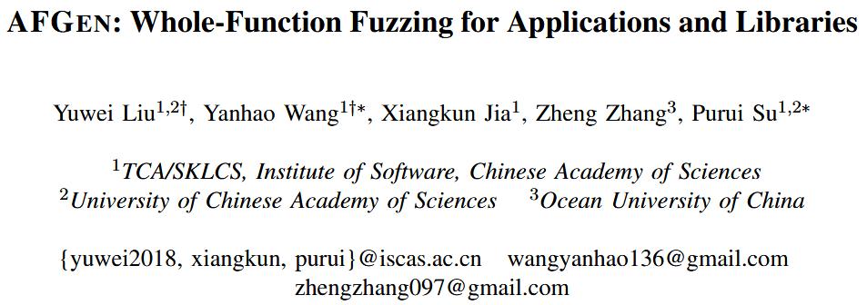
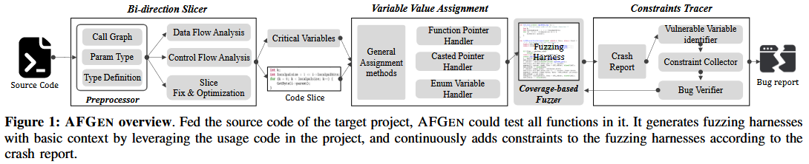
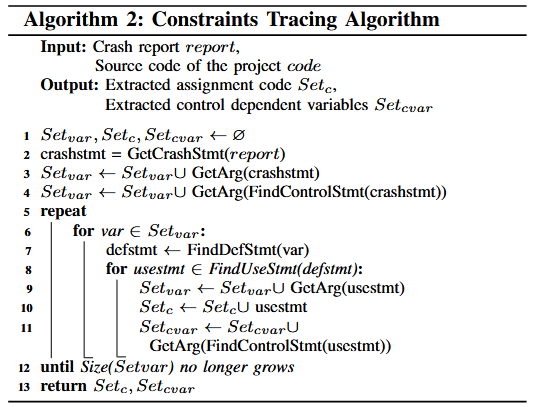
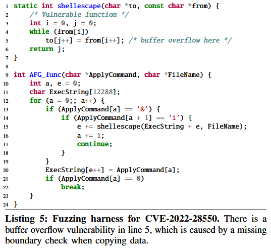

# AFGEN: Whole-Function Fuzzing for Applications and Libraries [S&P 2024]

当前自动为库中的 API 函数生成模糊测试驱动 (fuzzing harness) 的研究, 应用于项目 (库) 中的任意内部函数依然面临挑战. 内部函数之间的复杂依赖关系导致其运行环境更为复杂, 且参数受限更多, 使得高效生成模糊测试驱动变得困难. 本文提出一种“全函数模糊测试” (whole-function fuzzing) 方法 AFGEN, 这是一种“自底向上”的策略, 旨在通过覆盖所有函数来对应用程序和库进行模糊测试. 作者认为, 能够在牺牲一定精度的前提下实现函数的全面覆盖, 并通过精细设计降低误报率. AFGEN 首先基于控制流和数据流依赖关系对目标函数的调用语句进行切片, 再根据变量类型为切片代码中必要变量赋值, 并进一步分析与崩溃相关变量的约束语句, 从而生成误报率较低的模糊测试驱动. 

作者收集了来自 11 个开源项目的 102 个已知漏洞. AFGEN 成功为所有存在漏洞的函数生成了模糊测试驱动, 并识别出了其中 66 个漏洞, 超过了所有对比工具, 是第二优秀工具 (AFL++) 的两倍. 

## Challenges

**C1: Constructing proper program context.** 上下文包括与目标函数相关的变量和函数, 例如调用函数和参数. 获取目标函数的准确和全面的程序上下文是困难的, 但又至关重要, 因为如果上下文不正确, 模糊测试驱动 (fuzzing harness) 甚至无法编译. 对于 API 函数, 上下文通常较为简单, 且可以通过文档和使用示例轻松获得. 然而, 内部函数的程序上下文可能更加复杂, 且文档或使用示例较少. 

**C2: Assigning valid values for variables.** API 的参数通常是基础类型, 如标量或内存缓冲区. 即使某些参数较为复杂, 比如具有多个成员的结构体, 库通常也会提供一个初始化函数来处理它们. 然而, 内部函数的参数通常更为复杂 (例如嵌套结构体), 并且它们的初始化语句很难提取. 因此, 作者需要根据变量的类型为它们赋予有效值. 对于不同类型, 如整数、结构体或指针, 作者必须使用不同的方法来赋值. 

**C3: Satisfying program constraints.** 对于内部函数来说, 提取参数的依赖关系和初始化过程是困难的, 而作者需要使赋值和提取的控制流满足程序约束. 否则, 模糊测试驱动可能会意外崩溃, 从而导致大量的误报. 

## Method

Figure 1 展示 AFGEN 的总体框架. 给定模糊测试目标的源代码, AFGEN 首先对代码进行预处理, 提取结构信息、函数依赖关系以及其他后续分析所需的信息. 通过函数依赖关系, AFGEN 定位调用目标函数的函数, 并切割出调用目标函数的代码片段. 如果切割后的代码中某些变量未初始化, AFGEN 会根据变量类型和结构信息为它们赋值, 从而合成一个有效的模糊测试驱动. AFGEN 运行模糊测试驱动并生成崩溃报告. AFGEN 分析崩溃报告, 提取与崩溃相关的变量, 查找定义或初始化这些变量的代码, 并最终将代码插入回模糊测试驱动中. 

### Bi-direction Slicer

双向切片器 (Bi-direction Slicer) 接受目标项目的源代码作为输入, 并输出项目中任何函数的代码切片. 它利用预处理器扫描源代码并提取函数的基本信息, 如调用者和被调用者之间的关系、所有函数参数的类型以及这些类型的定义. 双向切片器接着分析数据流和控制流依赖关系, 追踪使用或与目标函数连接的代码切片. 调用关系用于定位使用目标函数的代码片段. 控制流依赖语句使得生成的模糊测试驱动与开发者如何使用该函数的原始逻辑匹配, 并为调用准备上下文. 数据流依赖语句帮助驱动程序适当地初始化并为提取的变量 (即函数参数、局部变量和全局变量) 赋值. 

算法 1 展示了切片过程, 包括提取控制流和数据流、添加必要的代码以使模糊测试驱动可编译、以及移除一些无害代码以提高性能. 具体来说, 如果一个函数包含任何指向目标函数的调用语句, 作者将其标记为调用函数, 并对每个找到的调用函数进行切片 (第 1 行、第 3 行). 切片器将把调用函数中的函数调用语句 (即 `IsCallOf`) 添加到输出语句集 (`Setcode`) 中, 并将其参数添加到关键变量集 (`Setvar`)  (第 8 行至第 10 行). 此外, 它还会将与关键变量具有数据流依赖关系的语句 (即 `IsDataRelated`) 和与输出语句具有控制流依赖关系的语句 (即 `IsControlRelated`) 添加到输出语句集, 并将这些语句中使用的变量添加到关键变量集中 (第 8 行至第 10 行). 在此, 作者认为一个语句与输出语句集有控制流依赖关系, 如果输出语句位于它的主体中, 或者它终止程序 (即 `return` 和 `assert`) 并位于输出语句的主体中. 对于数据流依赖关系, 作者检查语句是否是关键变量的最近赋值语句. 如果一个切片语句是一个调用语句, AFGEN 会进一步对其进行前向切片, 以获取被调用函数中的关键变量 (第 11 行至第 12 行). AFGEN 会重复以上过程, 直到输出语句集 `Setcode` 不再变化 (第 13 行), 此时输出语句集中的语句就是切片后的代码片段. 默认情况下, 作者对直接调用目标函数的函数进行切片, 因为进一步切片高级函数可能会导致代码量爆炸, 从而使得完整测试目标函数变得更加困难. 

### Variable Value Assigner

由切片器组件生成的切片代码仍然不能直接编译. 这是因为切片代码中的一些变量, 如目标函数的调用函数参数和全局变量, 尚未定义或初始化. 变量值赋值组件根据变量类型为未初始化的变量赋值, 从而使模糊测试驱动可编译并可执行. 具体来说, 作者的模糊测试引擎会随机生成一个数据缓冲区, 模糊测试驱动需要将该缓冲区分割并从中取出数据为未初始化的变量赋值. 作者列出了以下几种常见的赋值方法: 

1. **Directly Assignment**: 对于基本类型和具有固定大小的数组类型, AFGEN 根据类型的长度从模糊引擎生成的数据中获取值, 并将其赋给变量. 
2. **Allocation before Assignment**: 对于指针和没有固定大小的数组 (例如, `int[]`), AFGEN 分配一个内存缓冲区, 将分配的缓冲区地址赋给变量, 并将生成的数据填充到缓冲区中. 分配的缓冲区应足够大, 以容纳内存解引用操作. 某些指针变量指向的数据类型没有固定大小, 在为固定长度变量赋值之后, AFGEN 会计算剩余输入数据的大小, 并将剩余的字节分配给大小不固定的变量. 
3. **Open File before Assignment**: 与赋值前分配方法类似, AFGEN 创建一个新文件, 将文件指针赋给变量, 并将生成的数据写入新文件. 在设置其他固定长度变量后, 也会初始化文件变量. 

然而, 仍有一些类型的变量无法通过上述方法处理, 包括函数指针变量、类型转换指针变量和枚举变量. 对于这些类型的变量, 作者提出了以下特定方法: 

1. **Function Pointer Types**: 函数指针变量不同于其他指针变量, 它指向一个特定的函数, 而不是数据缓冲区. 因此, 作者不能使用上述方法来初始化它. 对于这种变量类型, AFGEN 扫描源代码以提取该变量的赋值语句, 并将相同的函数赋给该变量, 这是通过预处理器组件实现的. 然而, 可能在源代码中找不到该变量的赋值语句. 在这种情况下, AFGEN 会搜索参数类型与函数指针变量类型相同的函数, 然后将该函数赋给该变量. 
2. **Casted Pointer Types**: 对于一些指针变量, 由于 C/C++ 对指针类型转换没有限制, 开发者可以将任何指针转换为任何其他指针类型, 因此作者无法在声明时获取其实际类型. 如果作者根据声明时的类型为这些变量赋值, 模糊测试驱动可能会意外崩溃. AFGEN 需要记录转换后的类型, 以便为这些指针变量赋予正确的值. 具体来说, AFGEN 在切片过程中识别类型转换语句, 因此只有与目标函数相关的类型转换语句会被记录. 当转换类型比原始类型更复杂时, AFGEN 会将原始类型替换为转换后的类型. 例如, 当原始类型为 `void*`, 而转换类型为结构体指针时, AFGEN 会将 `void*` 替换为结构体指针. 
3. **Enumeration Variables**: 枚举变量会被赋予特定的值, 通常用于决定程序执行的分支. 如果 AFGEN 为枚举变量赋予随机数据, 它们很可能会变得无效, 在这种情况下程序只会执行默认分支. 为了提高驱动程序的有效性, AFGEN 会提取枚举变量的所有候选值, 并根据模糊输入为其赋值. 

### Constraints Tracer

如 Algorithm 2 所示, 约束跟踪器 (Constraints Tracer) 根据之前模糊测试驱动触发的崩溃报告来跟踪约束. 为了提高跟踪器的效率, AFGEN 仅跟踪与崩溃点直接相关的变量约束, 即崩溃发生的语句中的变量以及控制语句中的变量 (第 2 行至第 4 行). AFGEN 定位给定变量的定义 (第 7 行), 对变量进行数据流和控制流分析, 并记录赋值语句和控制流相关变量作为约束 (第 8 行至第 11 行). 然后, AFGEN 重复定位和记录新记录变量的过程, 直到没有新变量被发现 (第 12 行). 最后, AFGEN 构建一个分配树, 每个节点表示一个变量, 每条边表示一个赋值语句, 根节点表示与崩溃直接相关的变量. 因此, 作者获得了作为跟踪约束的记录赋值语句集 `Setc` 和控制流依赖变量集 `Setcvar`. 

回到 Listing 4, 作者使用相同颜色的框来表示定义关系, 灰色箭头表示一个变量与被指向的变量之间的数据流依赖. AFGEN 分析了第 16 行的缓冲区溢出崩溃报告, 并得出结论, `fidx` (第 16 行) 和 `c` (第 14 行) 是与崩溃相关的变量. 对于第 16 行的 `fidx`, AFGEN 定位其定义位置在第 15 行 (用蓝色框标出). 如果赋值语句的右值是一个结构体的成员, AFGEN 会记录该成员, 而不是整个结构体. 因此, AFGEN 将控制流相关变量 `c` 和数据流相关变量 `qtab_idx` (由灰色箭头指向) 记录为下一轮分析的输入. 最终, AFGEN 提取出的缓冲区溢出的约束是第 4 行、第 5 行和第 8 行.

在获取跟踪约束后, 作者需要从数据流和控制流的角度修改约束, 以提高模糊测试的有效性. 在记录的约束中, 一些变量的数据来自程序输入, 而一些约束涉及新的变量. 对这些变量的额外修改可以分为两类: 

1. **Program Input**: 如果约束变量的数据来自程序输入, 用户可以在没有额外限制的情况下确定这些变量. 因此, AFGEN 将这些变量赋予随机数据. 库中常见的程序输入形式是通过 `fread` 等函数从文件或标准输入获取的. 某些库包含使用库中 API 的示例程序, 对于这些程序, 程序输入通过 `main` 函数的 `argv` 参数进行赋值. 此外, 如果在记录语句中对这些变量应用了其他修改, AFGEN 会将这些修改添加到模糊测试驱动中. 
2. **New Control Variable**: 如果 AFGEN 跟踪了当前变量的约束, 并在之前跟踪的约束中跟踪了新变量的约束, 记录的变量数量会迅速增加, 从而降低了模糊测试驱动的可用性和效率. 根据作者的实验, 作者将嵌套跟踪的阈值设置为 1, 这意味着 AFGEN 会直接用模糊输入中的值替换新变量. 

## Evaluation

### RQ1 & RQ2 ...

### RQ3: Effectiveness of Finding Unknown Vulnerabilities

根据触发方式, 作者将漏洞分为四种类型, 如 Table 9 所示: 一般性 (General) 、API、CPL 和选项 (Option). **一般性 (General) **包括理论上仅通过改变输入文件即可触发的漏洞, 无需额外的选项. 对于这种类型的漏洞, 作者仅将 AFGEN 与其他模糊测试工具进行比较, 因为这些工具并未设计用于发现其他类型的漏洞. **API** 代表通过 API 而不是应用程序入口点触发的漏洞. **CPL** 包括需要额外编译选项才能触发的漏洞. 例如, ngiflib 中的 CVE-2021-36530 和 CVE-2021-36531, 如果没有特定的编译命令, 在其他模糊测试工具的模糊测试过程中无法触发. **选项 (Option) **表示通过特定命令行选项触发的漏洞. 例如, CVE-2022-28550 是一个栈溢出漏洞, 可以通过命令行选项触发. 

漏洞代码和模糊测试驱动如列表 5 所示. 脆弱函数 `shellescape()` 在第 5 行没有进行边界检查就复制了数据. 由于调用语句中接收数据缓冲区 `ExecString` 的大小较大 (12288), 模糊测试器需要为 `ApplyCommand` 分配足够的 “&i”, 以便多次调用该函数 (第 13 行至第 15 行) 来触发漏洞. 而在程序中, `ApplyCommand` 是从特定的命令行选项中读取的, 这使得灰盒模糊测试工具很难为其分配期望的数据. 而 AFGEN 可以直接变异 `ApplyCommand` 中的数据, 并迅速发现这个漏洞. 

