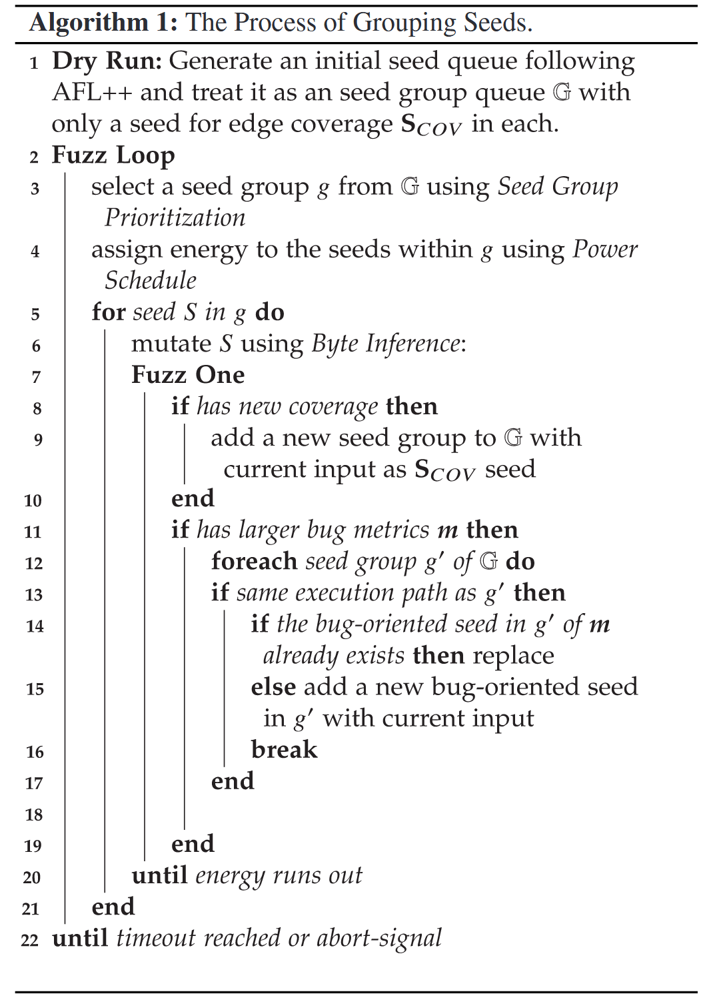
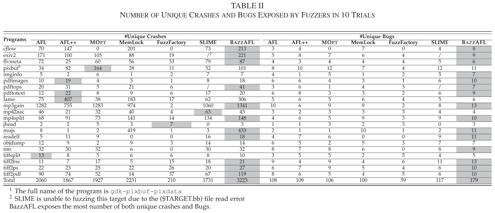

# BAZZAFL: Moving Fuzzing Campaigns Towards  Bugs via Grouping Bug-Oriented Seeds [TDSC 2025]

基于覆盖率引导的灰盒模糊测试 (CGF) 旨在将模糊测试活动引导到能够触发漏洞的执行路径上. 这个过程分为两个步骤, 包括到达可疑代码区域并探索其执行状态. 许多 CGF 方法提出了高效到达可疑代码区域和个体执行状态的方案, 但未能有效探索复杂的执行状态. 挑战在于如何探索执行状态, 使得模糊测试能够检测到多种类型的漏洞, 同时保持代码覆盖率. 为了解决这个问题, 作者提出了 BAZZAFL 来研究代码覆盖率和多种类型的漏洞. BAZZAFL 的核心在于维护一组种子群体, 其中每个种子保存一个目标上的最佳性能. 通过种子群体, BAZZAFL 基于多目标优化优先探索最可能包含漏洞的代码区域, 并根据香农熵自适应地在群体中的种子之间分配能量. 同时, 在变异过程中, BAZZAFL 倾向于变异能够改变执行状态的字节. 

## Methods

### Seed Group Prioritization

对于相同的代码区域, 一个种子无法行使最有可能触发所有类型漏洞的执行状态. 相反, 包含多个种子的种子群体可以行使所有类型漏洞的最可疑执行状态. 五个种子被收集以构建一个种子群体. 相同群体中的种子具有相同的执行路径, 但群体中的某个面向漏洞的种子在漏洞度量上表现优于其他种子. 例如, 如果某个种子 s 发现了新的覆盖 (边), 作者将创建一个新的种子群体 g, 并将 s 设置为基本种子. 请注意, 此时, 种子群体中只有一个种子. 稍后, 在模糊测试过程中, 如果 BAZZAFL 发现一个与 g 中的种子具有相同执行路径并在某个漏洞度量上表现更好的种子, BAZZAFL 会将其作为面向漏洞的种子加入种子群体 g (如果已经存在则替换) . 在优先级排序过程中, 如果 g 在多个度量上优于其他种子群体, 它将根据作者的种子群体优先级排序获得更高的优先级. 算法1展示了 BAZZAFL 的基本流程. 

算法 1 中的其他四个面向漏洞的种子是为四种不同类型的漏洞设计的. 选择这四种漏洞是因为它们是通过模糊测试发现的常见漏洞. 值得注意的是, 如果其他类型的漏洞能够量化其触发的可能性, 作者也可以添加更多的漏洞类型. 漏洞是复杂且难以预测的, 但某些漏洞发生在满足特定条件时, 即漏洞特征. 基于种子群体, BAZZAFL 优先探索包含漏洞的代码区域并探索执行状态. 由于过多的种子会降低模糊测试的性能, BAZZAFL 会在输入在漏洞度量上表现更好时替换种子. 

漏洞触发的可能性度量

+ 边覆盖 (Edge Coverage) ：作者设置两个度量, 执行速度 (m1) 和种子覆盖的边数量 (m2) 

+ 内存违规漏洞 (Memory Violation Bug, MV) ：作者使用内存访问操作的数量作为度量 (m3) 

+ 越界漏洞 (Out-of-bounds Bug, OOB) ：作者使用一个比例来衡量内存访问距离边界的远近 (m4) . 该比例定义为 r = cur / max, 其中 cur 是内存块中的当前索引, max 是最大大小. 

+ 内存消耗漏洞 (Memory Consumption Bug, MC) ：消耗更多内存的输入比消耗较少内存的输入更有可能触发MC漏洞. 为了衡量一个种子在MC漏洞方面的质量, 作者使用分配内存的大小作为度量 (m5) . 

+ 算法复杂度漏洞 (Algorithmic Complexity Bug, AC) ：导致异常多基本块执行的输入更有可能触发此漏洞. 为了衡量一个种子在AC漏洞方面的质量, 作者使用执行的基本块数量 (m6) . 

将多个度量的种子群体选择问题建模为多目标优化问题, 由于模糊测试逐渐向漏洞靠拢, 作者使用非支配排序方法来为不同的轮次找到多个帕累托最优解. 作者的多目标问题的目标是优先选择所有种子群体G中的一个子集G, 使得具有更好度量值的种子群体会被首先选中. 

**非支配排序方法**：多目标优化的常用解决方案是计算帕累托前沿. 帕累托前沿是一个非支配解, 定义为：

$$
P(\mathbb{G})=\left\{g \in \mathbb{G} \mid\left\{g^{\prime} \in \mathbb{G} \mid g^{\prime} \succ g, g^{\prime} \neq g\right\}=\emptyset\right\}
$$

其中, 当且仅当满足以下条件时, 称 g' 支配 g

$$
\begin{aligned}
& m_1\left(g^{\prime}\right)<m_1(g) \\
& m_i\left(g^{\prime}\right)>m_i(g), \quad \forall i \in\{2, \ldots, 6\}
\end{aligned}
$$

对于目标 m1 (执行速度), 越小越好；对于其他目标, 越大越好. 简而言之, 只有当种子在所有 6 个度量上都比另一个种子差时, 作者才认为该种子被支配. 在模糊测试的背景下, 帕累托前沿是动态变化的, 因为每个种子群体中的度量值在模糊测试过程中发生变化. 因此, 作者使用非支配排序进化方法来计算动态变化的帕累托前沿. 基本上, 每个种子群体都会被分配一个等级, 初始值为 0. 在计算帕累托前沿的过程中, 如果 g′ 支配 g, 则 rank(g) 增加1. 因此, 帕累托前沿包含具有最小等级的种子群体. 对于不同的模糊测试活动, 最小等级的值可能会发生变化, 从而导致帕累托前沿的变化. 对于每次模糊测试活动, BAZZAFL 会优先选择最小等级的种子群体. 

然而, 在某些情况下, 这六个度量无法同时满足, 导致没有优先选择的种子群体. 在这种情况下, 作者放宽了多目标问题中的约束条件. 作者优先移除那些触发漏洞的可能性比其他度量小的度量. 首先, 作者删除度量 m1 (执行速度), 因为作者的最终目标是发现漏洞, 而且它与度量 AC 和 MC 部分冲突. 然后, 如果删除 m1 后仍无法选择赢家群体, 作者将删除度量 m2 (覆盖的边数量) . 接下来, m6 (执行的基本块数量) 将是第三个被删除的度量, 因为 AC 发生的可能性低于其他漏洞类型. 最后, 作者将删除度量 m3 (内存访问操作的数量), 因为 OOB 比其他类型的内存违规漏洞更可能发生. 作者至少保留两个度量, 以保证问题仍然是一个多目标问题. 

### Power Schedule

BAZZAFL通过将模糊测试理解为一个学习过程, 并基于香农熵计算能量, 从而优化功率调度. 具体来说, 如果一个种子能够揭示更多程序的信息, 那么这个种子将分配更多的能量. 对于边覆盖, 信息是种子变异所发现的边. 对于四种漏洞, 信息是它们通过种子的变异所增加的度量值. 

$$
H^t=\log \left(\sum_{j=1}^S p_j^t\right)-\frac{\sum_{i=1}^S p_i^t \log \left(p_i^t\right)}{\sum_{j=1}^S p_j^t}
$$

$$
H_{B U G}^t=-\sum_{i=1}^S p_i^t \log \left(p_i^t\right)
$$

$$
H_{\text {total }}^t=H_{C O V G}^t+H_{M V G}^t+H_{O O B G}^t+H_{M C G}^t+H_{A C G}^t,
$$

其中, $$p_i^t$$ 是从种子 t 生成的输入属于 $$D_i$$ 物种 (species) 的概率, 估计公式为 $$\hat{p}_i^t=Y_i^t / n$$, 其中 $$Y_i^t$$ 是从种子 t 生成且属于 $$D_i$$ 的输入个数, n 是总输入数. 最后种子群体的能量用熵比例加权平均计算. 每个种子的加权平均的权重 (比例) 计算公式为: 

$$
R^{g_i}=\frac{H_{\text {total }}^{g_i}}{\sum_{k=1}^5 H_{\text {total }}^{g_k}}, \quad i=1,2,3,4,5
$$

### Byte Inference for Mutation

为了有效地将模糊测试活动引导到能够触发漏洞的执行状态, BAZZAFL 推测能够改变与漏洞相关的度量值的字节. 字节推断的基础是观察到种子中的一部分字节与漏洞度量相关. 作者在确定性阶段考虑字节推断的变异器, 包括位级、字节级和字级的变异器. 具体来说, 作者选择那些可以确定变异字节位置的变异器, 例如 FLIP_BIT 和 SWAP32. 作者不考虑在破坏性变异阶段进行字节推断. 对于每个面向漏洞的种子, Fig. 2 中的字节推断更有可能变异与其目标漏洞相关的字节. 需要注意的是, 由于确定性变异器的低效性, 作者只对一个种子 (用于边覆盖) 执行字节推断, 然后使用该结果变异种子群体中的其他面向漏洞的种子. 至于模糊测试的其他阶段, 作者主要使用非确定性变异器进行测试. 

BAZZAFL 通过**观察字节变异的结果来建立输入字节与漏洞度量之间的关系**. 它首先记录变异字节的位置, 然后根据漏洞度量的变化确定变异位置是否与相应的度量相关. 例如, 当作者同时改变种子 a 和 b 的字节时, 某个漏洞度量发生了变化. 然后, 作者单独将 a 和 b 恢复到它们的原始值. 如果 a 的变化导致漏洞度量的变化, 而 b 的变化不影响漏洞度量, 那么可以推断 a 是相关的, 而 b 是不相关的. 假设一个字节的变化通过双重检查 (比较变异前后度量值) 导致了漏洞度量值的变化, 那么该字节与漏洞度量之间的关系得以确认. 例如, 如果一个字节的变化导致了 MC 度量值的变化, BAZZAFL 将记录该字节为与种子 $$s_M$$ 相关的字节. 当变异一个针对 MC 设计的种子 $$s_M$$ 时, BAZZAFL 更有可能变异与 MC 漏洞相关的字节. 

由于同一群体中的种子具有相同的执行路径, 面向漏洞的字节推断在种子之间是共享的. 例如, 如果一个面向 MC 的种子的变异发现了一些与 AC 相关的字节, 这些字节将被记录到面向 AC 的种子中. 字节推断的使用还可以减少种子群体中变异的开销. 由于种子群体中的种子执行相同的执行路径, 它们的变异有很高的可能性会重叠, 即不同种子的变异可能会检查相同的执行状态. 因此, 当面向漏洞的种子专注于它们各自与漏洞相关的字节时, 它可以减少字节变异的开销. 

## Evaluation

