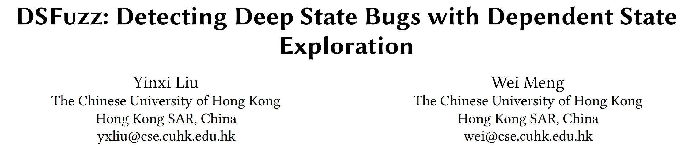
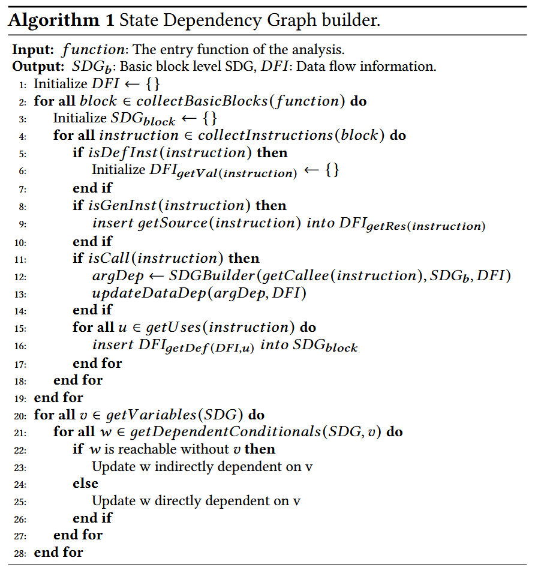
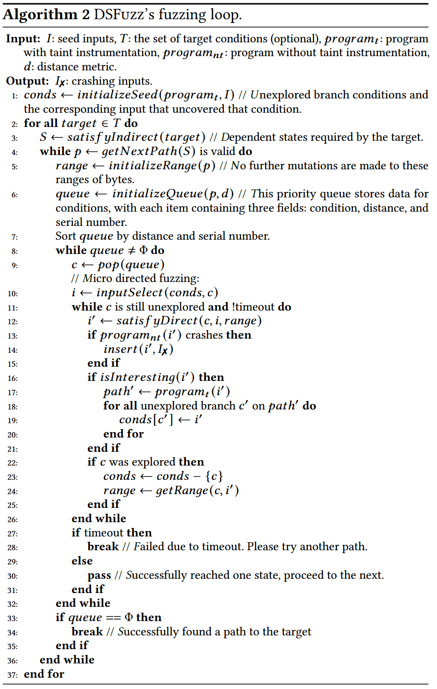
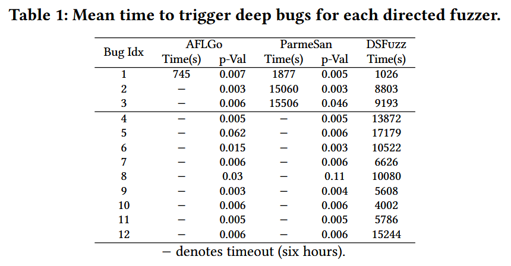

# DSFuzz: Detecting Deep State Bugs with Dependent State Exploration [CCS 2023]

Fuzzing 的变异策略没有考虑间接控制依赖, 导致无法高效探索识别关键字节的搜索空间. 论文提出定向模糊测试方法 DSFuzz, 专注于满足一组间接控制依赖可达的深度目标, 通过分析深层状态间接依赖的条件, 它可以生成相应分支所需的关键字节. 此外, DSFuzz 排除无关目标状态的控制流, 只在有限搜索空间中进行变异. 发现 8 个其他工具未发现的 Bugs.

## Contributions

1. 发现具有间接控制依赖的深度程序状态广泛存在, 但很难用最先进的技术达到
2. 提出通过识别隐式需要的依赖状态并逐步到达它们来满足间接控制依赖
3. 实现 DSFuzz, 一种有效到达深度状态的定向fuzzing方案 (未找到开源代码)

## Methods

首先识别依赖状态转换并构建状态依赖图 (state dependency graph, SDG), 然后识别深层状态并将其设置为目标. 该方法首先通过 def-use 分析构建表示直接控制依赖的边, 然后通过静态过程间数据流分析存储数据流信息, 最后利用数据流信息识别间接控制依赖. 

模糊器必须遵循 SDG 上所需的状态转换才能到达目标深度状态. 该任务可以分为多个阶段, 在每个阶段, DSFuzz 通过状态转移路径上从当前到达的状态到下一个依赖状态的一次转移, 逐步接近目标状态. 为了进行状态转换, 它将下一个依赖状态设置为目标, 然后进行微定向模糊测试. 为了有效地到达先前到达的状态, 它识别它们依赖的输入字节并保存它们的值. 这是通过对每次状态转换的条件进行污点分析来实现的, 然后分析影响这些条件值的输入范围. 通过仅对依赖状态转移的条件语句进行污点分析, DSFuzz 避免了在无法推导依赖输入字节的污点分析上浪费能量. 然后仅改变影响当前状态转换的输入字节, 以解决微定向模糊测试任务.

算法1描述分析直接/间接控制依赖关系和构建SDG. 间接依赖的识别: 控制的状态设置变量的值, 该值在之后的条件语句中用于转换到目标状态, 并且到达目标状态的路径不一定先到达依赖状态 (否则是直接依赖). 

深度状态的计算公式, 假设目标状态 b 的所有间接依赖为 $$c_i \in C$$, 满足 $$c_i$$ 的概率为 $p_i$. 假设程序跳转到每个分支的概率相同, 且假设每个条件满足的概率互相独立. 设到达目标状态 b 的 m 条路径分别有 $$N_i$$ 个分支, 则到达 b 的概率为 $$P = \Pi p_i = \frac{1}{N_1} * ... * \frac{1}{N_i} * ... * \frac{1}{N_m}$$.

算法2描述 DSFuzz 的测试循环, 其在主要 fuzzing loop 里增加 micro fuzzing campaign 来找到当前目标状态的分支满足条件.

减少探索空间的三种策略

+ 使用优先于较短路径的广度优先搜索方法进行过渡路径探索
+ 在耗尽所有较短路径后, 如果需要探索由 l 个状态组成的较长路径, 则检索其访问的前缀, 以重用已知输入
+ 如果 DSFuzz 在超时时间内未能探索其包含的任何状态, 则进行路径修剪, 具有修剪前缀的路径不会被探索

## Evaluation

### Bugs Detection

### Component-wise Analysis

