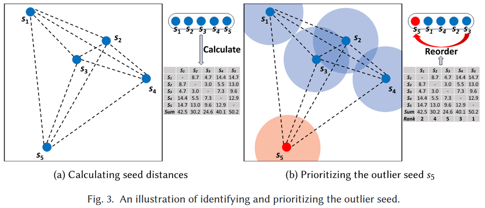
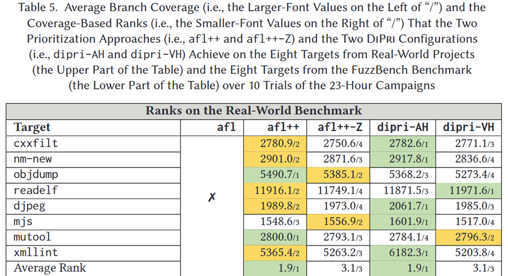

# DiPri: Distance-Based Seed Prioritization for Greybox Fuzzing [TOSEM 2025]

种子优先级排序对灰盒模糊测试非常重要, 好的种子排序可以提高发现代码和挖掘漏洞的效率. 现在的 SOTA 方法, 如 Alphuzz 和 K-scheduler 应用复杂的策略来进行种子调度, 虽然效果显著但是额外开销大且不易扩展. 论文提出基于“距离”的种子优先级: 计算队列里各个种子之间的“距离”, 优先选择“离群的种子” (与其他种子最远的那些). 直觉上, 这些离群种子更可能把执行带到以前没探索过的代码区域, 从而提高发现新路径/新缺陷的机会. 

在 AFL++ 上做了大规模实验: 24 个 C/C++ 目标 (8 个真实项目、8 个 FuzzBench、8 个 Magma) , 总计超 5 万 CPU 小时. 1) 对覆盖率的影响不大: 真实项目上分支覆盖略升; FuzzBench 上分支覆盖略降. 2) 对找漏洞有帮助: 在 Magma 上多触发了 5 个已知缺陷. 

为验证可扩展性, 还把 DiPri 集成到 Java 的 Zest 上, 在 5 个真实 Java 程序上跑了 8000+ CPU 小时: 结果显示 DiPri 可扩展性不错, 而且更稳定地帮助发现漏洞. 

## Methods

### Motivating Example

+ 在当前种子队列里, 优先选择“离群”的那个种子

+ 实心圆点代表种子, 而浅色的圆圈则模拟了由位于中心位置的种子生成的子代输入所能探索到的区域

### Workflow

+ 距离驱动的种子优先级: 先评估、再重排, 挑出“离群”的那颗做下一轮的父种子

+ 以覆盖为中心的结果解析: 把每次执行得到的覆盖信息做成“覆盖向量”, 作为后续距离计算的输入, 并绑定到对应输入上. 

### Optimization

+ 经典 ART 的痛点是“距离计算很贵”: DiPri 用增量式优先级计算降低开销
+ 只在满足“需要优先化”的条件时触发计算; 触发时只关注“上次优先化之后新增的种子”
  + VANILLA: 只要队列有新增就优先化
  + PERIODICAL: 按固定时间间隔做; 若间隔太长而上次排过的种子已用尽, 也会提前触发, 避免退化成“队列顺序”
  + ADAPTIVE: 等“上次排过的那批种子都用完”再触发

## Evaluation

### RQ1: How does DiPri perform under different configurations?

ADAPTIVE 整体优于 PERIODICAL 和 VANILLA

### RQ2: How does DiPri compare to other seed prioritization approaches?

### RQ3: How does DiPri compare to SOTA seed scheduling techniques?

+ dipri-AH 比较 Alphuzz 在 8 个目标里有 6 个平均覆盖更高
+ 比较 k-scheduler 在 4 个目标里有 3 个平均覆盖更高

### RQ4: How effective is the distance-based seed evaluation?

总体最好是 dipri-AH (ADAPTIVE+Hamming) 

