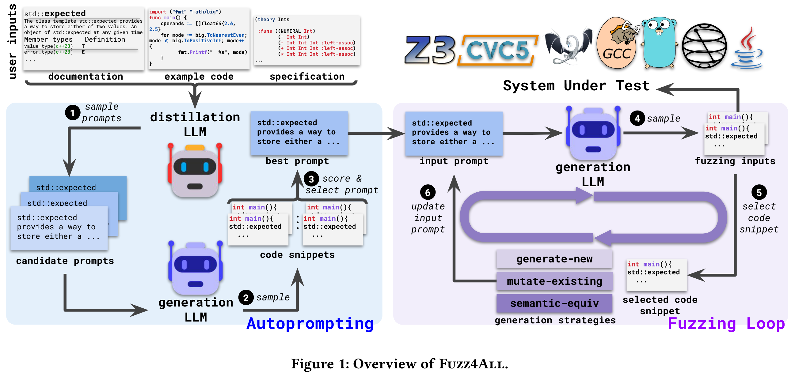

# Fuzz4All: Universal Fuzzing with Large Language Models [ICSE 2024]

现有的模糊测试工具局限于单语言或单版本软件, 而且局限于语言的特性. 本文提出 Fuzz4All, 第一个具有普适性的模糊测试器, 它可以针对多种不同的输入语言以及这些语言的多种不同特性. 关键思想是利用大型语言模型 (LLM) 作为输入生成和变异引擎, 这使该方法能够为任何实际相关的语言产生多样化和现实的输入. Fuzz4All 由自动提示技术, 创建非常适合模糊测试的 LLM 提示, 以及由 LLM 驱动的模糊测试循环组成. 

在 9 个被测系统上评估 Fuzz4All, 包括 6 种不同语言 C、C++、Go、SMT2、Java 和 Python, 通用模糊测试的覆盖率高于现有的特定语言模糊测试. Fuzz4All 已经在 GCC、Clang、Z3、CVC5、OpenJDK 和 Qiskit 量子计算平台等广泛使用的系统中发现了 98 个 bug (其中 64 个为新 bug).

## Contributions

1. 为模糊测试引入了一个新的维度, 直接利用 LLM 的多语言能力对许多 SUTs (system under test) 进行模糊测试
2. 提出一种新的自动提示方法, 自动将用户输入提炼为一个能有效生成 SUT 输入的提示, 来支持通用和有针对性的模糊测试
3. 提出一种输入生成算法, 通过选择示例和生成策略迭代地修改提示, 不断生成新的模糊测试输入

## Methods

Fuzz4All 建立在两个模型上, 一个是减少给定用户输入的蒸馏 LLM, 一个是创建模糊测试输入的生成 LLM, 以平衡不同 LLM 提供的成本和收益之间的权衡. 由于蒸馏 LLM 需要理解和提取任意用户输入, 使用一个具有强大的自然语言理解能力的、大型的基础模型 (GPT4). 然而, 由于自回归生成的高推理成本, 直接使用如此大的模型进行输入生成将是低效的. 相反, 为了执行高效的模糊测试, Fuzz4All 使用一个更小的模型作为生成 LLM (StarCoder).

整体流程: Fuzz4All 通过使用大型的、最先进的蒸馏 LLM 来采样多个不同的候选提示来执行自动提示步骤. 每个候选提示被传递到生成LLM 以生成代码片段 (即模糊测试输入). 

Fuzz4All 然后选择产生最高质量模糊测试输入的提示. 使用通过自动提示选择的最佳提示作为生成LLM 的初始输入提示, 然后进入模糊测试循环, 其中 Fuzz4All 对生成 LLM 连续采样以生成模糊测试输入. 

为避免生成许多相似的模糊测试输入, Fuzz4All 在每次迭代中不断更新输入提示, 选择之前生成的输入作为示例. 除了示例之外, Fuzz4All 还在初始提示符中添加了一个生成指令, 指导模型生成新的模糊测试输入. 

重复这个过程, 同时不断地将生成的模糊测试输入传递给 SUT, 并根据用户定义的 oracle 检查其行为, 例如崩溃.

