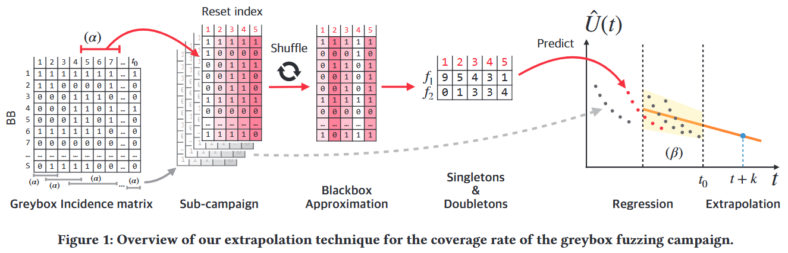
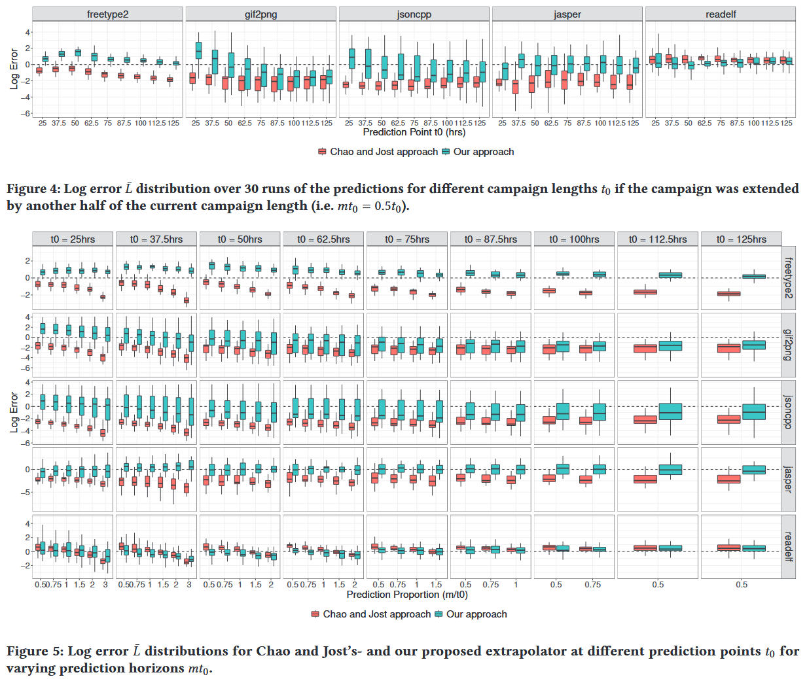
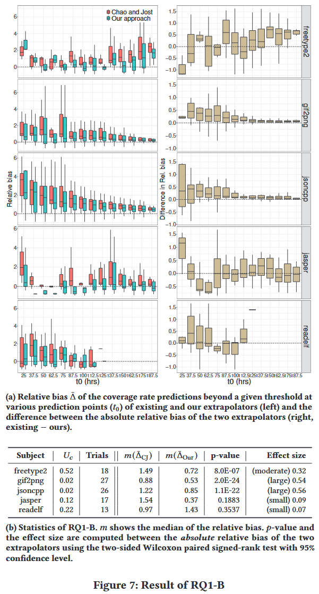
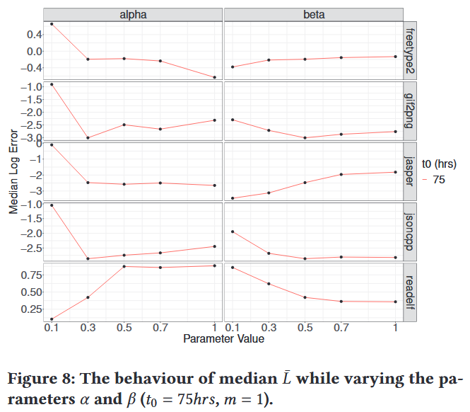

# Extrapolating Coverage Rate in Greybox Fuzzing [ICSE 2024]

为应对灰盒模糊测试中固有的自适应偏差 (即样本不是独立同分布的), 本文评估现有统计技术在预测覆盖率 $$U(t_0 + k)$$ (从当前时刻 $$t_0$$ 起经过 $$k$$ 个时间单位之后的覆盖率) 方面的表现; 并提出一种新的外推方法, 用于应对自适应偏差问题. 本文方法 Fuzztastic, 从已收集的覆盖率数据中高效模拟大量黑盒模糊测试过程, 估计每个黑盒测试的覆盖率, 并通过简单的回归方法对灰盒模糊测试的覆盖率进行外推. 

Fuzztastic 在 5 个实验对象中的 4 个上, 预测误差比现有基准方法至少低一个数量级. 与现有的外推方法相比, Fuzztastic 在进行长期预测 (如预测当前模糊测试时长的三倍) 时表现尤为出色. 

## Contributions

1. 首次提出在灰盒模糊测试场景下覆盖率外推的问题, 并评估 Chao 和 Jost 提出的最先进的生物统计学外推方法
2. 提出一种新颖的外推方法, 通过从灰盒模糊测试中各子测试阶段的稳定平均分布中构造黑盒测试过程, 并对其估算结果进行回归, 以此解决灰盒模糊测试中的自适应偏差问题
3. 在多个真实软件程序上开展灰盒模糊测试实验, 涵盖不同测试时长和预测跨度. 还进行消融实验, 评估估算性能对参数选择的敏感程度
4. https://doi.org/10.5281/zenodo.10575734

## Methods

在灰盒模糊测试过程中, 每当一个能提高覆盖率的输入被生成并加入语料库时, 其对应的覆盖元素集合 $$D_i$$ 的分布 $$\{\pi_i\}^S_{i=1}$$ 就会发生变化, 从而引入自适应偏差. 然而, 在灰盒测试过程的**局部区域**中, 这种分布变化要小得多. 如果能够从这些局部区域的**稳定平均分布**中自动构造出随机的黑盒测试过程 (即 bootstrap 黑盒测试), 就能逐步缓解每个局部区域中的自适应偏差问题. **图 1** 展示 Fuzzstatic 的整体流程: 

1. 从灰盒测试的覆盖矩阵 (incidence matrix) 中提取任意子测试过程 (sub-campaign), 相当于对矩阵进行子集操作

2. 对得到的子矩阵按列打乱顺序, 从而采样该灰盒子测试过程中的 (不变的) 平均覆盖分布, 这个步骤被称为黑盒近似 (blackbox approximation)

3. 所得黑盒过程的覆盖概况与原灰盒子测试过程保持一致, 例如: 若灰盒测试中某个覆盖元素 $$i$$ 被覆盖 $$Y_i = 10$$ 次, 则黑盒近似的结果中该元素同样会被覆盖 $$Y_i' = 10$$ 次. 但关键在于: 黑盒近似并不受到自适应偏差的影响

**算法 1** 更详细地展示提出的覆盖率外推方法的具体流程

输入: 灰盒模糊测试过程中生成的**覆盖矩阵** $$W_{t_0 \times S}$$, 其中 $$t_0$$ 表示当前模糊测试的时间步数 (或样本数量), $$S$$ 表示覆盖元素的数量, **预测跨度** $$mt_0$$, 两个**可调参数** $$\alpha$$ 和 $$\beta$$, 用于控制方法中的某些权衡 (例如子过程的选取比例、黑盒样本数量) 

输出: **预测的覆盖率估计值** $$\hat{U}(t_0 + mt_0)$$

## Evaluation

### RQ1-A. Coverage Rate Prediction Accuracy

### RQ1-B. Point-in-Time Prediction Accuracy

### RQ2. Evaluation of Parameter Sensitivity

