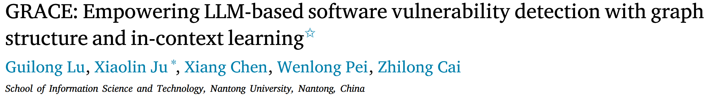
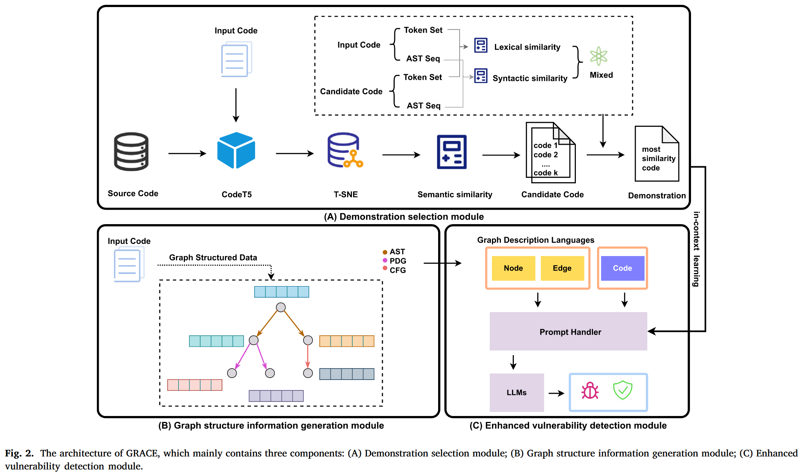
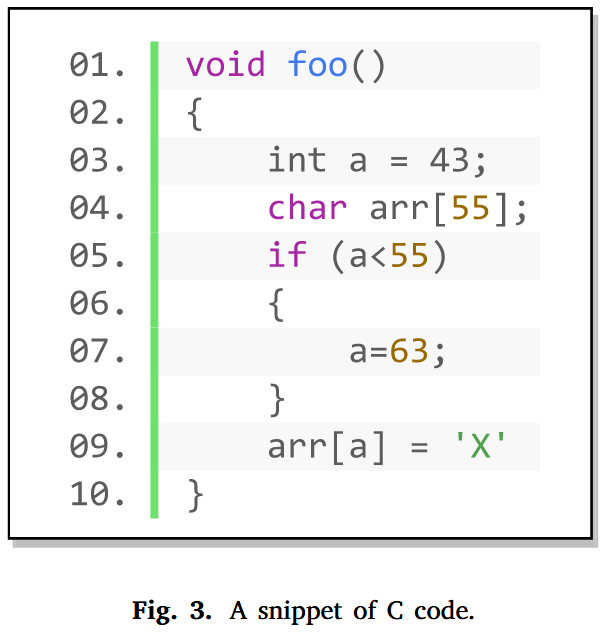
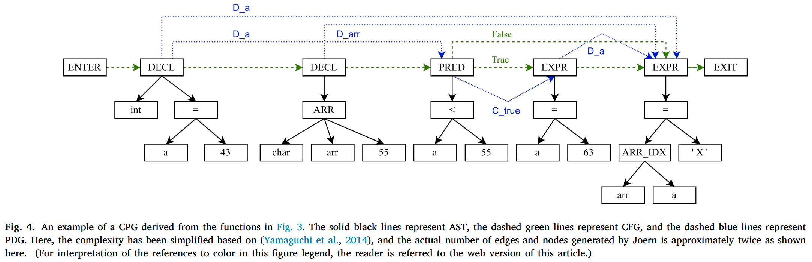
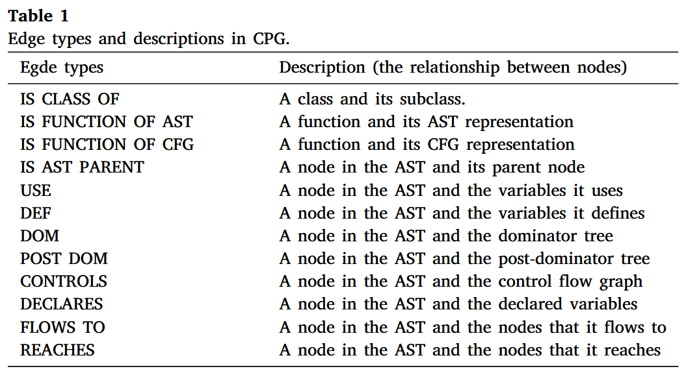
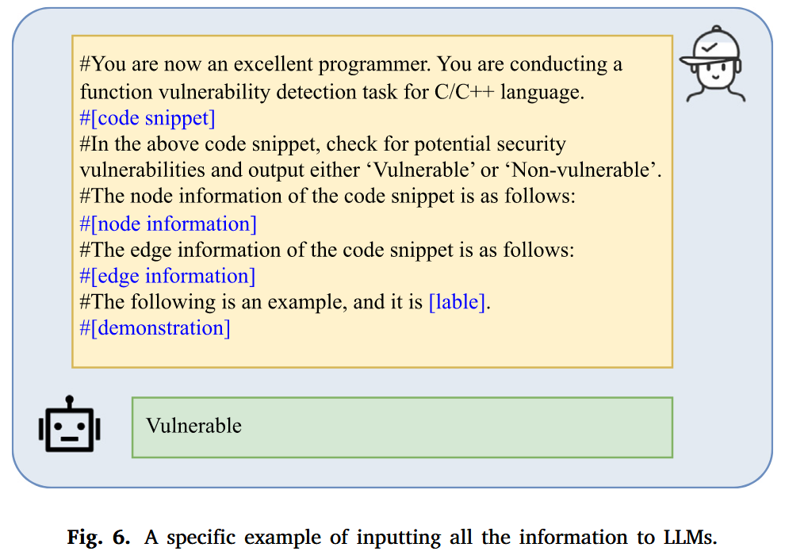
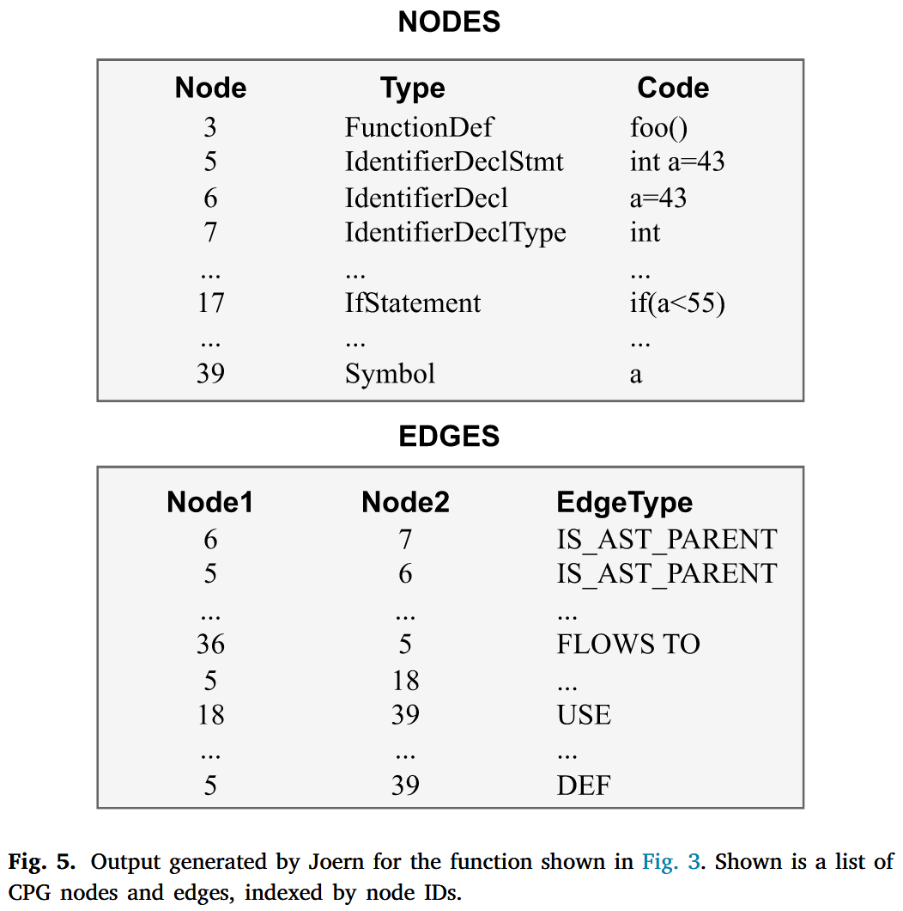
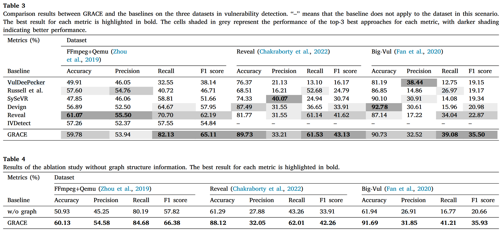

论文提出一种的漏洞检测方法 GRACE, 通过结合代码中的图结构信息和上下文学习, 增强了基于大语言模型 (LLM) 的软件漏洞检测能力. 我们还设计了一种有效的示例检索方法, 通过考虑目标代码的语义、词汇和句法相似性, 识别高度相关的代码示例, 以便为上下文学习提供更好的示例. 

## Methods

### Demonstration selection module

为了获得高质量的示例, 我们设计了一种新颖的检索方法, 通过联合建模语义相似性、词汇相似性和句法相似性, 识别最相似的示例, 以便为上下文学习提供更好的示例. 我们首先利用 codeT5 模型提取代码的语义特征, 并通过 T-SNE 降低特征的维度. 然后, 我们通过计算目标代码与训练集之间的 L2 距离来度量语义相似性. 基于此相似性, 我们从训练集中检索与目标代码最相似的前 K 个代码片段. 最后, 我们结合词汇和句法相似性, 识别出最相似的实例, 位于前 K 个候选中. 具体来说, 对于词汇相似性, 我们将代码片段视为词汇集合, 并使用统计方法量化 $$\Omega$$ 和 $$\Gamma$$ 之间的相似性. 其中 $$\Omega$$ 表示目标代码的词汇集合, $$\Gamma$$ 表示候选代码的词汇集合. 

$$
lexical\_similarity = |\Omega \cap \Gamma| / |\Omega \cup \Gamma|
$$

对于句法相似性, 我们考虑源代码的 AST 信息. 具体来说, 我们首先使用 Joern 将代码解析为相应的AST. 然后, 采用 SimSBT 遍历 AST 类型节点, 并生成更好地捕捉树结构的序列. 对于两个代码片段 A 和 B, 我们通过 SimSBT 获得有序序列 a 和 b, 然后计算 a 和 b 之间的编辑距离, 以量化序列相似性. 

$$
syntactic\_similarity = (sum(len(a), len(b)) - levenshtein(a, b))\ /\ sum(len(a), len(b))
$$

$$
mixed\_score(\bold{A}, \bold{B}) = \omega \times lexical\_similarity(\bold{A}, bold{B}) + (1 - \omega) \times syntactic\_similarity(\bold{A}, \bold{B})
$$

### Graph structure information generation module

我们利用 Joern 工具生成源代码的代码属性图 (CPG) 表示. CPG 结合了控制流图 (CFG) 、程序依赖图 (PDG) 和抽象语法树 (AST) . 如 Fig. 4 所示, 一个 C 语言函数 (如 Fig. 3 所示) 被转换为一个由多种类型的节点和边组成的图. 图中的节点和黑色边代表 AST, 捕捉了函数的语法信息. 然而, 仅凭 AST 不足以为模型提供推理函数语义所需的充分信息. 因此, CPG 通过数据流和控制流等语义信息增强了 AST. 具体来说, 在 Fig. 4 中, 带有“D_a”标签的蓝色边表示节点之间的数据依赖关系, 意味着变量“a”中定义的值在该节点的子树中被使用. 类似地, 绿色边表示执行顺序, 如条件分支. 通过结合语法和语义, 我们使模型能够更好地理解函数传达的信息. 

### Vulnerability detection module

## Evaluation

