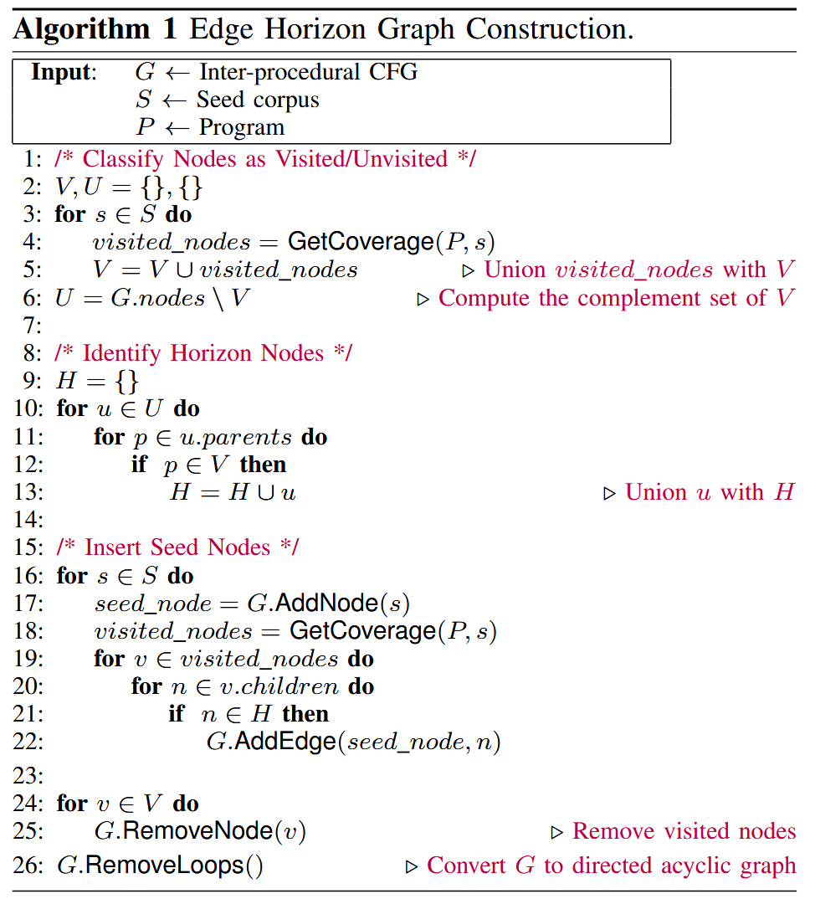
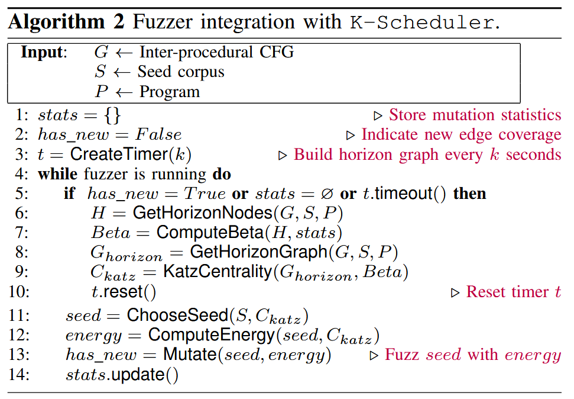
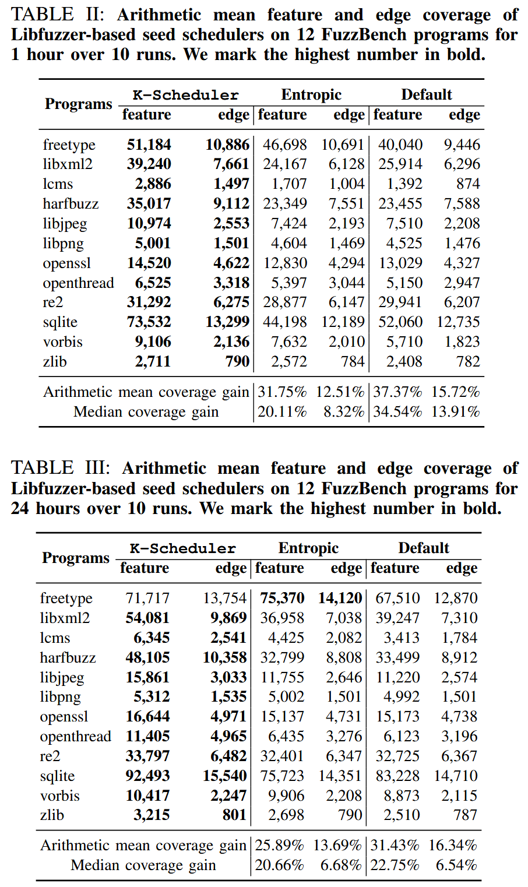

# Effective Seed Scheduling for Fuzzing with Graph Centrality Analysis [2022 SP]

现有方法根据种子的历史变异数据进行调度, 但忽略了其底层控制流图的结构. 理想的策略是根据从种子到突变的所有可到达和可行的边的计数来调度种子, 但计算所有边非常昂贵. 因此, 种子调度策略必须接近这个数量. 对所有边近似的计数应该有 3 个属性: (i) 如果从种子可到达的边更多, 它应该增加; (ii) 如果突变历史信息表明某条边难以到达或距离当前访问的边很远, 则应减少该阈值; (iii) 在大型 CFG 上计算应该高效. 

图分析中的中心性度量 (centrality) 提供这三个属性, 因此可以通过变异种子有效地近似达到未访问边的可能性. 作者构建了一个图, 称为edge horizon graph, 将种子连接到它们最近的未访问节点, 并计算种子节点的中心性, 以衡量改变种子的潜在边覆盖增益. 

实现 K (Katz centrality) - Scheduler 方法, 与流行的种子调度策略进行比较. 在 12 个谷歌 FuzzBench 程序上的实验结果表明, K-Scheduler 的特征覆盖率比 Entropic 提高25.89%, 边覆盖率比第二好的基于 AFL 的种子调度器提高了 4.21%. 它还比次优的基于 AFL 的种子调度器多发现了 3 个新bug. 

## Contributions

1. 将模糊测试中的种子调度建模为图中心性分析问题
2. 设计边界图 (edge horizon graph), 并使用 Katz 中心性来计算中心性分数, 该分数近似于从种子开始的可达和可行的未访问 CFG 边的数量
3. K-Scheduler 集成到 Libfuzzer 和 AFL 中, 开源: https://github.com/Dongdongshe/K-Scheduler

## Methods

图 1 描述 K-Scheduler 的工作流程. 给定一个程序、种子库和目标程序的过程间控制流图, 修改控制流图以产生一个仅由种子、水平和非水平未访问节点组成的边界图. 然后使用 Katz 中心性在边界图上进行中心性分析. 模糊器对中心度分数最高的种子进行优先排序. 当模糊器的突变到达以前未访问的节点时, 删除这些新访问的节点, 并在更新的边界图上重新计算 Katz 中心性. 

### Edge Horizon Graph Construction

### Seed Scheduling

## Evaluation

### RQ1: Seed scheduling comparison

### RQ4: Impact of Design Choices

