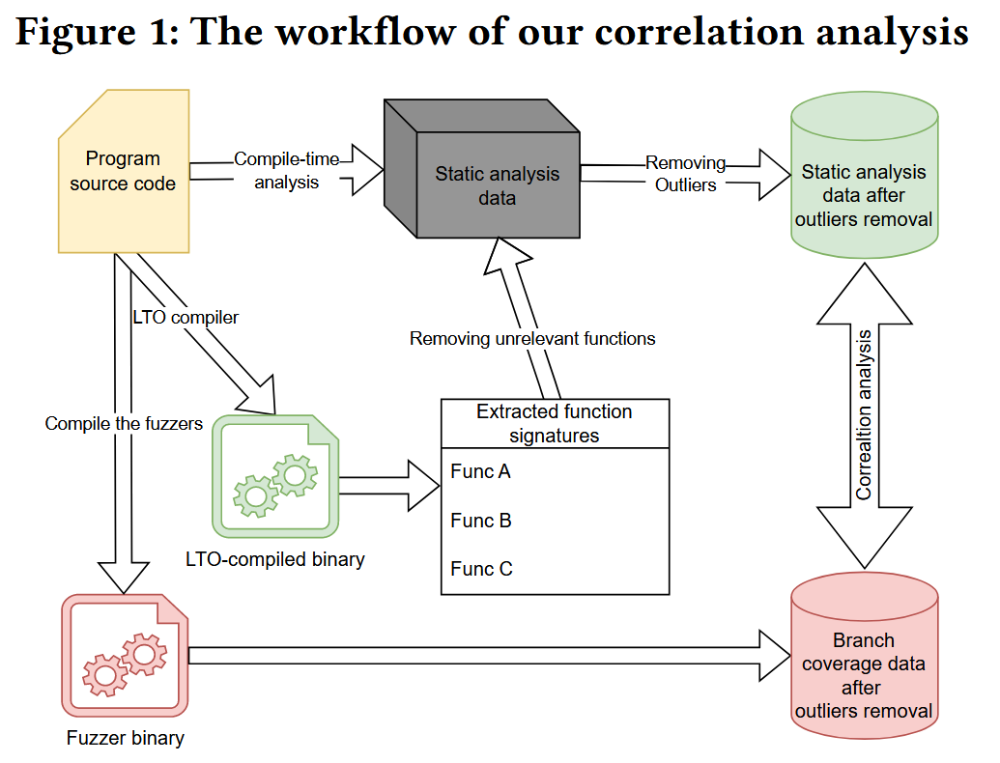
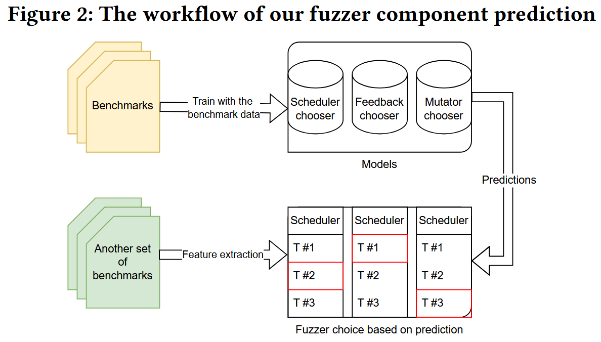

# On Understanding and Forecasting Fuzzers Performance with Static Analysis [CCS 2024]

对于模糊测试的实践者来说, 必须理解不同技术对测试结果的影响, 并根据要测试的程序选择理想的配置. 现有的研究比较组装好的fuzzer, 却没有评估单独一种技术对测试结果的贡献, 并且组合后的模糊测试器很难被分解为相互独立的组件.

论文引入一种新方法, 在编译时提取静态分析特征与各种模糊测试技术的性能结果相关联. 该方法使用不同的度量来揭示程序静态属性与模糊器动态运行时性能之间的关系. 展示了**机器学习**模型如何使用通过**静态分析**收集的信息, 为特定程序提出定制的模糊器配置.

在11个测试程序中，与 AFLplusplus, LibFuzzer 和 Honggfuzz 相比, 使用建议配置的模糊测试程序取得了最好的性能提升.

## Method

方法主要探究程序特征和 fuzzer performance 之间的关系. 

### Features

程序特征 (函数) 主要分7类

| Types                                      | Including                                                    |
| ------------------------------------------ | :----------------------------------------------------------- |
| Generic features (binary)                  | program binary size number of the basic blocks the average nested level of the source code |
| Instruction type (LLVM IR)                 | frequency of each type of LLVM instruction                   |
| Types of the instruction operand (LLVM IR) | occurrence of the types used in the operands                 |
| CFG & DDG (function)                       | loop-back edges length of the shortest path and its average number of edges and nodes |
| API (function)                             | malloc & free memcpy & strcmp                           |
| Comparisons (LLVM IR)                      | comparison of integer, float, vector                         |
| initial set of seeds (inputs)              | region, line, function, branch coverage acquired through running initial seeds |

使用 cohen 'd 来量化使用不同优化技术的 fuzzer 之间的差异, 公式中的 $$\mu_1$$, $$\mu_2$$ 分别是第一和第二数据组的均值, $$s_p$$ 是两组的合并标准差 (pooled standard deviation). 注意: 非增量开发的 fuzzer 如 AFL++, LibFuzzer, HonggFuzz, 使用 cohen'd 来量化差异则不合理.
$$
d=\frac{\mu_1-\mu_2}{s_p}
$$

关联分析 (Correlation Analysis) 还计算特征之间的 Spearman’s correlations 和 Kendall' $$\tau$$ 共3种相关系数来分析程序特征和 fuzzer 性能关联.

### Prediction

最终目标是通过基于目标应用程序的特征从一组可用方法中选择所有主要组件来自动配置模糊器. 使用随机森林 ML 分类器来预测哪种组合会提供更好的结果. 作者为每种技术构建了一个随机森林分类器, 并通过提供程序特征和相应模糊器的性能作为输入来训练它们. 

模型使用输入数据估计 Cohen 效应值作为输出. 在技术选择上, 作者选择了每个技术类别中正面效应值最高的技术. 为了减少参数的数量, 考虑到训练数据有限的事实, 作者根据相关性分析的结果对用于训练模型的特征列表进行了预过滤, 只使用与同组中的至少一种技术相关的特征作为该组的训练数据.

将 prediction-best 模糊测试器与每次只实现一种技术的12个单一技术模糊测试器一起运行. 作者称无法评估模糊器的每个组合, 因为资源限制, 为每个程序的所有120个 (= 6×5×4) 组合进行实验是不可实现的. 运行12种单一技术的模糊器, 再通过实验确定哪种技术实际上最适合被测程序. 因此, 可以通过比较真正的最佳技术来评估模型预测的准确性.

## Conclusions

1. 诸如explore、fast、weighted之类的调度器在更大的程序、更大的输入和更高的初始覆盖率下工作得很好, 因此, 需要调度的测试用例数量也会增加. 这些调度器的性能受调度器要调度的语料库条目数量的影响. 
2. 复杂的反馈, 如ngram4、ngram8 和 naive-ctx, 会随着程序和输入数量的增加而表现得更差. 相反, 一些 ngram 模糊器与路径复杂度呈正相关, value-profile 与一些 comparison 特征呈正相关.
3. cmplog 和 grimoire 与 comparison 特征的相关性并不强. 相反, 它们与模糊测试的初始状态相关.
4. 在AFL++、LibFuzzer 和 HonggFuzz 上的实验结果与上面的研究结果一致.

