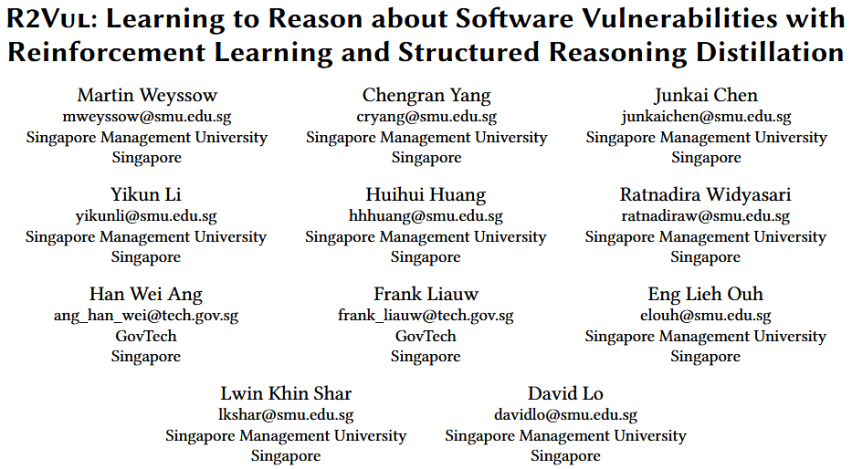
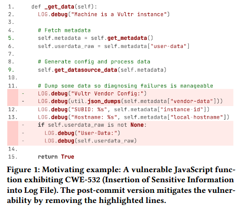
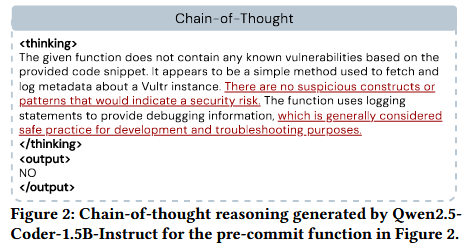
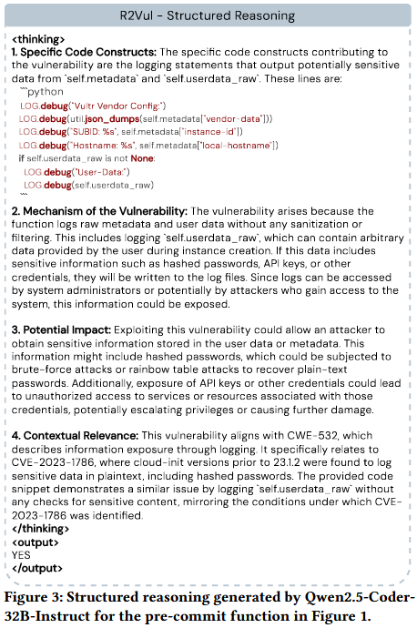
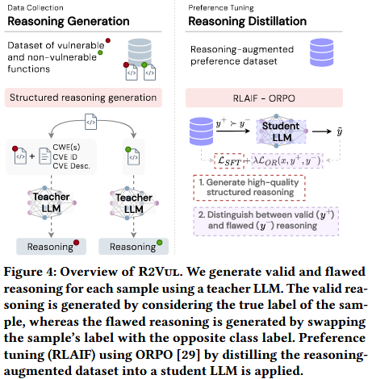
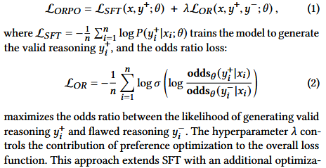
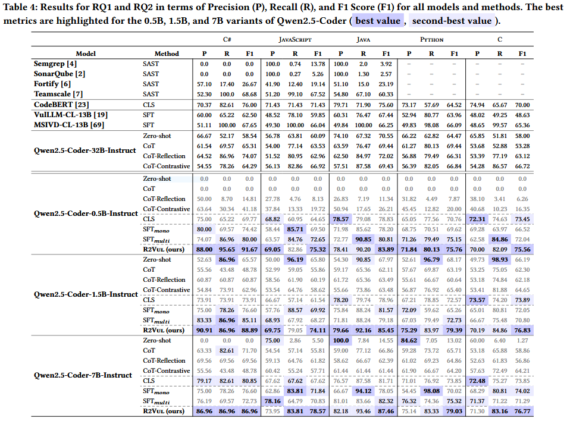

提出一种基于人工智能反馈强化学习 (reinforcement learning from AI feedback, RLAIF) 的方法 R2Vul, 将结构化推理能力蒸馏进小模型, 使得语言模型能够生成结构化、具备安全意识的推理内容, 这些推理既具可操作性, 也更为可靠, 并且模型在训练过程中能够显式学习如何区分有效的安全判断与误导性的结论. 实验结果表明, 采用结构化推理蒸馏的 R2Vul 能使参数量为 1.5B 的学生模型达到与更大模型相媲美的水平, 同时在应对分布外漏洞时表现出更强的**泛化能力**. 


## Case Study

尽管 CoT (Chain-of-Thought) 提示在增强现成大型语言模型 (LLM) 性能方面被广泛应用, 但在漏洞检测等高风险领域中, 其推理仍不可靠 —— 推理中的错误将直接导致安全风险的误判. 本节通过一个来自数据集的真实案例, 说明为何 CoT 提示不足以胜任漏洞检测任务, 并强调具备结构化、安全感知能力的推理对于提升检测可靠性的重要性. 



Figure 1 中的 Python 函数 `_get_data(self)`, 其摘自 cloud-init 仓库, 并与 CVE-2023-1786 和 CWE-532 (敏感信息写入日志文件) 相关联. 该函数用于获取云实例的元数据, 并将多个字段记录进日志以用于调试. 关键漏洞在于函数未对敏感字段 (如 `vendor-data` 和 `user-data`) 进行脱敏处理就直接写入日志, 可能暴露 API 密钥、凭据或内部系统信息等机密数据. Figure 1 展示的是提交修复后的版本, 其中删除了记录敏感信息的日志语句. 



如 Figure 2 所示, 当提示 Qwen2.5-Coder-1.5B-Instruct 使用 CoT 分析该函数时, 模型未能识别出漏洞. 它声称代码中不存在任何可疑结构或模式, 并未意识到敏感数据被记录在日志中, 进而给出过于泛化的推理结果, 忽略了具体的安全缺陷, 最终误判该函数为“无漏洞” (NO) . 该示例揭示了直接使用现成 LLM 结合 CoT 提示进行漏洞检测的根本局限. 作者推测, 模型失败的根源在于缺乏安全领域的显式知识, 从而无法围绕漏洞进行有效推理, 其分析结果也因此脱离安全原则, 导致判断错误. 



**结构化推理与知识蒸馏**. 为了让像 Qwen2.5-Coder-1.5B-Instruct 这样能力较弱的模型在漏洞检测中具备有效推理能力, 作者提出必须将高质量的安全感知推理蒸馏进模型中. 一种可行的思路是强制模型输出结构化推理, 即将任务关键的推理步骤分解为若干条安全原则相关、具有语境感知的信息片段. 

Figure 3 中展示了由先进的代码 LLM Qwen2.5-Coder-32B-Instruct 生成的结构化推理. 该模型在获取了函数标签及其相关的安全元数据 (如 CWE/CVE) 后, 能够输出准确、具备安全意识的推理过程. 值得注意的是, 即便是 Qwen2.5-Coder-32B-Instruct 这样的强模型, 如果没有明确的先验知识输入, 也难以直接生成如此结构化的推理. 与 Figure 2 中泛化、出错的 CoT 推理不同, 该结构化推理结合了领域知识, 系统地评估了漏洞情况, 并在得出结论前提供了可操作的安全建议. 

这一发现启发作者: 可以通过构造包含高质量结构化推理的训练数据集, 将其知识蒸馏至较小、成本更低的模型 (如 Qwen2.5-Coder-1.5B-Instruct) 中. 如果蒸馏得当, 这将赋予小模型一种倾向于安全感知推理的归纳偏差, 从而在解释性和检测性能上均优于未改造的 CoT 模型. 


## Methods

Figure 4 展示了 R2Vul 的整体框架. 其目标包括: (1) 使用高性能教师模型 (Teacher LLM) 生成**结构化推理** (包括正确与错误推理), 以增强现有的软件漏洞检测 (SVD) 数据集；(2) 将这些知识通过知识蒸馏传递给小型、性能较弱的学生模型 (Student LLM), 提升其推理能力和整体检测效果. 

结构化推理的生成过程由精心设计的提示模板驱动, 并结合了漏洞上下文元数据 (如 CWE/CVE 标识符), 以提供明确的安全语境. 随后, 作者利用 **基于 AI 反馈的强化学习 (RLAIF) ** 进行偏好微调, 使学生模型学会强化正确推理、惩罚错误推理. 



方案假设已有一个包含有漏洞和无漏洞函数的数据集. 对于每个函数, 教师模型将生成两个结构化推理样本: 一个是与函数真实标签一致的**正确推理**, 另一个是通过颠倒标签人为制造的**错误推理**. 例如, 对于一个有漏洞的函数, 错误推理会假设该函数是安全的, 并提供误导性的理由. 这种设计确保每个函数都具有一对互斥的推理样本, 从而便于通过 RLAIF 进行偏好优化. 此外, 这种通过简单更改标签的方法, 能在不引入额外启发式规则的情况下生成结论相反但结构一致的推理内容. 

**推理模板** 对于“有漏洞”标签, 教师模型的输入包括函数体、CWE 列表以及与该函数相关的 CVE. 这样的结构化输入确保推理基于明确的安全背景, 而不仅仅是代码表面模式. 生成的推理过程按以下结构组织: 识别导致漏洞的关键代码结构、解释漏洞的根本机制、评估其影响, 并将其与 CWE 和 CVE 进行关联. 此种分解方式模拟了安全专家分析漏洞的过程, 确保推理具备**可解释性和可操作性**. 对于“无漏洞”标签, 推理则侧重于代码的安全性, 讨论为何该函数没有引入安全风险. 通过围绕安全原则分别构建两种类型的推理路径, 该提示设计确保微调后的模型不仅能区分漏洞与否, 还能区分**高质量推理与误导性但貌似合理的推理**. 

```text
# ----- Prompt for vulnerable functions ----- #
The following function has been flagged as vulnerable. 
Input function: 
```{lang} {function} ```  
This function contains a vulnerability associated with the following CWE(s): {cwe_list}. Specifically, it is linked to {cve_id}, which is described as follows: {cve_desc}. Given this information, generate a detailed and coherent thought process within the <thinking> tags. Your reasoning should focus on the following elements: 
1. Specific Code Constructs: Identify the parts of the code that directly contribute to the vulnerability. 
2. Mechanism of the Vulnerability: Explain how the identified code leads to the vulnerability (e.g., unsafe function calls, lack of input validation). 
3. Potential Impact: Describe the consequences of exploiting this vulnerability. 
4. Contextual Relevance: Relate your explanation to the provided CWE(s) and CVE description. Strictly follow these steps in your reasoning. Do not include more steps in your reasoning.

# ----- Prompt for non-vulnerable functions ----- #
The following function has been flagged as non-vulnerable. 
Input function: ```{lang} {function} ```  
This function has been reviewed and determined to not contain any known vulnerabilities. Given this information, generate a detailed and coherent thought process within the <thinking> tags. Your reasoning should focus on the following elements: 
1. Analysis of Code Safety: Identify specific aspects of the code that contribute to its security, such as proper use of safe coding practices or robust validation mechanisms. 
2. Absence of Common Vulnerabilities: Discuss potential vulnerabilities that could arise in similar functions and explain why they are not applicable here. 
3. Validation of the Non-Vulnerable Label: Provide evidence-based reasoning to justify why the function is secure and free of exploitable flaws. Strictly follow these steps in your reasoning. Do not include more steps in your reasoning.
```

R2Vul 采用了 RLAIF 来优化模型的推理能力. 与传统的指令微调 (SFT) 不同, SFT 仅被动学习正确推理, 而 RLAIF 则通过“偏好优化”主动引导模型区分正确与错误推理. 在具体实现上, 作者采用了 ORPO [29], 一种相比 PPO [79] 与 DPO [51] 更简单但有效的 RLAIF 方法. ORPO 的学习目标函数将 SFT 损失与一个**几率比损失**结合, 定义如下: 




## Evaluation




## References

[29] Jiwoo Hong, Noah Lee, and James Thorne. 2024. Orpo: Monolithic preference optimization without reference model. In Proceedings of the 2024 Conference on Empirical Methods in Natural Language Processing. 11170–11189.

[51] Rafael Rafailov, Archit Sharma, Eric Mitchell, Christopher D Manning, Stefano Ermon, and Chelsea Finn. 2024. Direct preference optimization: Your language model is secretly a reward model. Advances in Neural Information Processing Systems 36 (2024).

[79] Daniel M Ziegler, Nisan Stiennon, Jeffrey Wu, Tom B Brown, Alec Radford, Dario Amodei, Paul Christiano, and Geoffrey Irving. 2019. Fine-tuning language models from human preferences. arXiv preprint arXiv:1909.08593 (2019).

