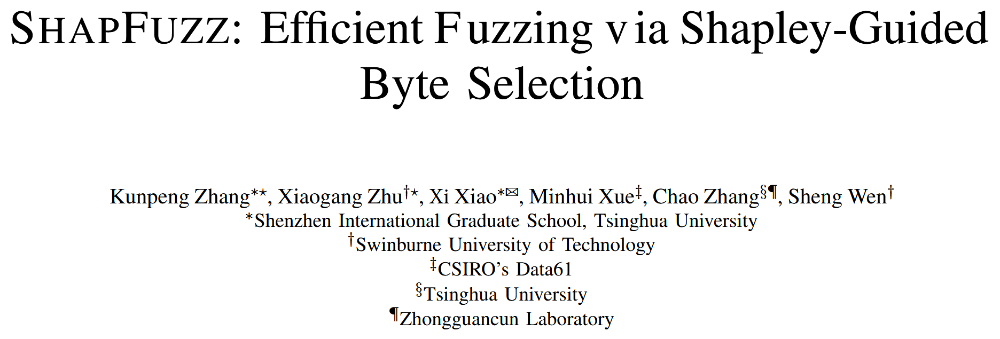

# SHAPFUZZ: Efficient Fuzzing via Shapley-Guided Byte Selection [NDSS 2024]

以往的研究通常专注于建立输入字节与路径约束之间的关系, 却忽视一个事实: 并非所有与约束相关的字节都能触发新的代码路径. 本文通过 **Shapley 值分析** 来理解字节位置对模糊测试性能的影响, 发现某些字节位置比其他位置贡献更大, 且这一特性在不同的种子之间往往是稳定的. 作者提出一种新的解决方案, 称为 **SHAPFUZZ**, 用于在模糊测试过程中指导字节选择与变异. SHAPFUZZ 在每次测试输入时以较低的开销更新字节的 Shapley 值 (即重要性), 并使用 **上下文多臂赌博机算法 (contextual multi-armed bandit)** 在变异高 Shapley 值字节与低频率选择字节之间进行权衡. 

作者基于 AFL++ 实现该方案的原型, 并将其与 10 个最新的模糊测试工具进行了评估, 其中包括 5 个字节调度模糊器 (byte-scheduling fuzzers) 和 5 个常用模糊器. 与字节调度模糊器相比, SHAPFUZZ 能发现更多的边. 在三组不同的初始种子下, 它暴露的漏洞数量也超过最优基线工具. 

## Contributions

1. 基于 Shapley 分析, 表明反复变异少部分位置可以提高代码发现的效率, 一个字节可能与多个路径约束相关
2. 将字节选择过程形式化为 Shapley 分析, 并将 Shapley 值的计算转化为可以在模糊测试过程中逐步更新的形式. 提出 SHAPFUZZ, 利用Shapley 值来指导字节选择过程, 并提出一种上下文多臂老虎机方法来优化 Shapley 引导的字节选择
3. 基于 AFL++ 实现 SHAPFUZZ, 并在 UNIFUZZ 和 MAGMA 平台上进行评估, 开源: https://github.com/ShapFuzz/ShapFuzz 

## Methods

### Shapley Analysis and CMAB

(1) Shapley Analysis: 在合作博弈论中, 一组玩家参与博弈并获得收益. 最著名的解决方案是 Shapley 值, 它是一种在合作博弈中分配收益的方法. Shapley 值是每个玩家对所有可能联盟的边际贡献的加权平均值

(2) CMAB (contextual multiarmed bandit): 多臂老虎机用于研究探索和利用知识之间的权衡. 上下文多臂老虎机问题是多臂老虎机问题的一种变体, 在每次试验中, 玩家在做出决策前会获得上下文信息. 由于不同上下文中的臂的期望奖励可能不同, 玩家在选择臂时需要考虑上下文的影响

## Evaluation

