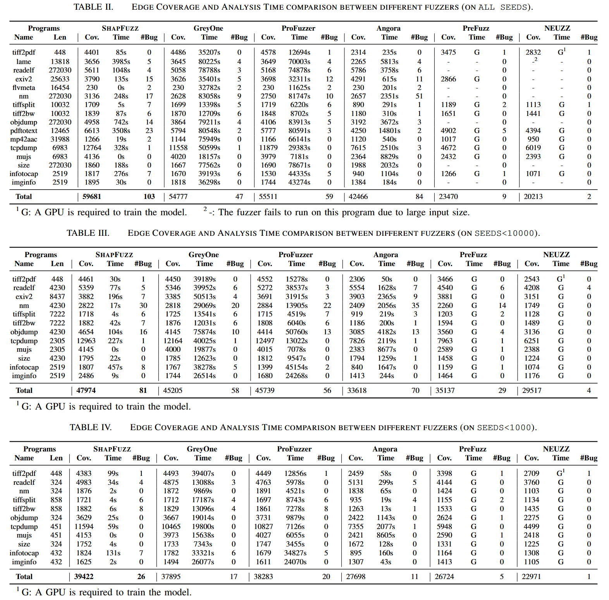
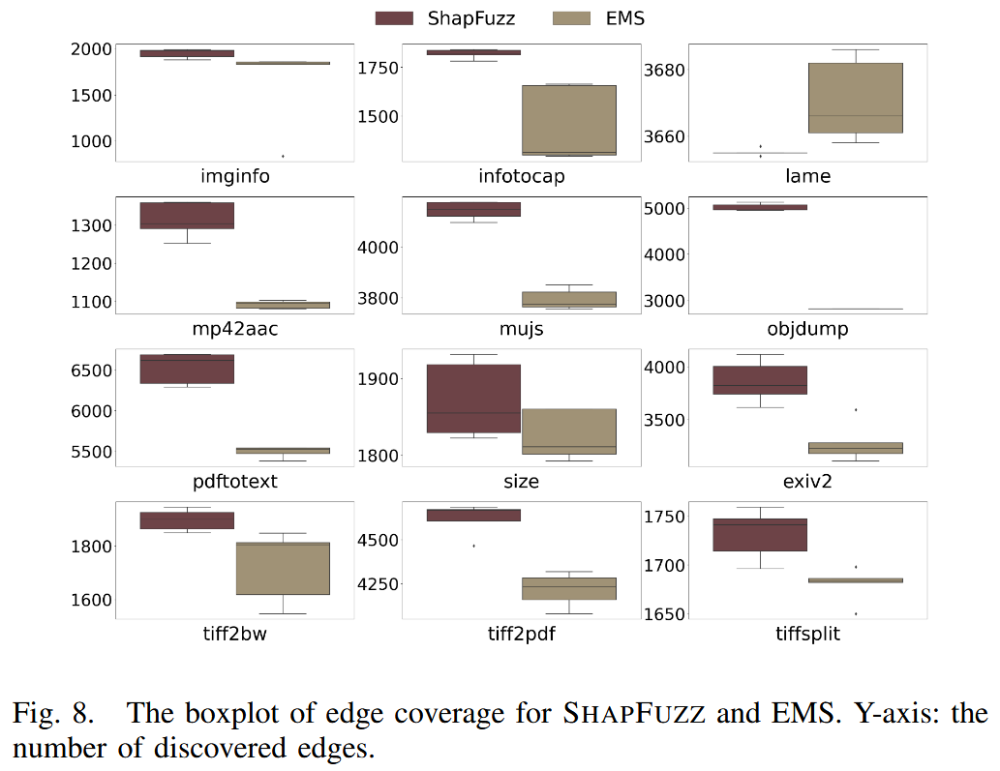

# SHAPFUZZ: Efficient Fuzzing via Shapley-Guided Byte Selection [NDSS 2024]

以往的研究通常专注于建立输入字节与路径约束之间的关系, 却忽视一个事实: 并非所有与约束相关的字节都能触发新的代码路径. 本文通过 **Shapley 值分析** 来理解字节位置对模糊测试性能的影响, 发现某些字节位置比其他位置贡献更大, 且这一特性在不同的种子之间往往是稳定的. 作者提出一种新的解决方案, 称为 **SHAPFUZZ**, 用于在模糊测试过程中指导字节选择与变异. SHAPFUZZ 在每次测试输入时以较低的开销更新字节的 Shapley 值 (即重要性), 并使用**上下文多臂赌博机算法 (contextual multi-armed bandit)** 在变异高 Shapley 值字节与低频率选择字节之间进行权衡. 

作者基于 AFL++ 实现该方案的原型, 并将其与 10 个最新的模糊测试工具进行了评估, 其中包括 5 个字节调度模糊器 (byte-scheduling fuzzers) 和 5 个常用模糊器. 与字节调度模糊器相比, SHAPFUZZ 能发现更多的边. 在三组不同的初始种子下, 它暴露的漏洞数量也超过最优基线工具. 

## Contributions

1. 基于 Shapley 分析, 表明反复变异少部分位置可以提高代码发现的效率, 一个字节可能与多个路径约束相关
2. 将字节选择过程形式化为 Shapley 分析, 并将 Shapley 值的计算转化为可以在模糊测试过程中逐步更新的形式. 提出 SHAPFUZZ, 利用Shapley 值来指导字节选择过程, 并提出一种上下文多臂老虎机方法来优化 Shapley 引导的字节选择
3. 基于 AFL++ 实现 SHAPFUZZ, 并在 UNIFUZZ 和 MAGMA 平台上进行评估, 开源: https://github.com/ShapFuzz/ShapFuzz 

## Methods

Insight: 只有一小部分字节对新代码的发现贡献最大, 因此可以利用 Shapley 分析来获取这些重要字节, 并在模糊测试过程中给予它们更多的能量. 因为通常与约束相关的字节会与多个 CMP 指令相关联, 专注于高重要性的字节可以提高在未见路径中发现代码的效率. 

SHAPFUZZ 聚焦于字节变异, 并量化字节位置的重要性. 将多个种子之间的字节变异理解为 Shapley 分析过程, 并利用 Shapley 值量化每个字节的贡献. 图 4 展示 SHAPFUZZ 框架, 该框架利用字节的 Shapley 值来提高模糊测试的效率. 将种子中字节的调度视为一个合作博弈, 并计算每个字节的 Shapley 值. 为减轻 Shapley 分析的开销, 推导来自同一原始种子且长度不变的种子属于同一个合作博弈, 并共享相同的字节 Shapley 值. 将这样的种子归为一个家族, 在每个家族中计算共享的 Shapley 值. 通过将更多的能量分配给具有更高 Shapley 值的字节, 可以提高模糊测试效率. 为在变异高 Shapley 值字节和低频选择字节之间做出权衡, SHAPFUZZ 使用 CMAB 来构建概率分布, 以优化权衡. 

### Shapley Analysis and CMAB

(1) Shapley Analysis: 在合作博弈论中, 一组玩家参与博弈并获得收益. 最著名的解决方案是 Shapley 值, 它是一种在合作博弈中分配收益的方法. Shapley 值是每个玩家对所有可能联盟的边际贡献的加权平均值

(2) CMAB (contextual multiarmed bandit): 多臂老虎机用于研究探索和利用知识之间的权衡. 上下文多臂老虎机问题是多臂老虎机问题的一种变体, 在每次试验中, 玩家在做出决策前会获得上下文信息. 由于不同上下文中的臂的期望奖励可能不同, 玩家在选择臂时需要考虑上下文的影响

### Shapley Analysis Among Bytes

Shapley 值是合作博弈论中一种用来公平地分配合作伙伴之间收益的解决方案. 在合作博弈中, N 个玩家通过特征函数形成联盟并获得收益. Shapley 值可以用来量化每个玩家在博弈中的贡献. 在合作博弈论中, 玩家 $$x_j$$ 对联盟的 Shapley 值为 $$\phi_j$$, 计算公式:

$$
\phi_j=\sum_{G \subseteq X \backslash\left\{x_j\right\}} \frac{|G|!(N-|G|-1)!}{N!}\left(\mathcal{F}\left(G \cup\left\{x_j\right\}\right)-\mathcal{F}(G)\right)
$$

其中, $$N$$ 为玩家数,  $$G$$ 为 $$m$$ 个玩家组成的联盟, $$X$$ 是所有玩家的集合, $$X \backslash \{x_j\}$$ 是去掉玩家 $$x_j$$ 后所有可能玩家联盟. $$F(*)$$ 是计算联盟可获收益 $$R$$ 的特征函数. $$\mathcal{F}\left(G \cup\left\{x_j\right\}\right)-\mathcal{F}(G)$$ 是玩家 $$x_j$$ 在联盟 $$G$$ 的边界收益. 

合作博弈是种子中字节的调度, 包括选择字节和变异选择的字节. 这个博弈会发现 n 个边缘, Shapley 值用于分析每个字节对 n 个边缘发现的贡献. 博弈中的玩家是种子 $$S_0$$ 中的一个字节, 联盟是某些字节同时变异. 覆盖引导模糊测试的目标是发现新代码, 将收益定义为通过变异种子 $$S_0$$ 生成的输入 $$i$$ 所发现的新边数量. 为确保收益在模糊测试过程一致, 自新边 (self-new edge) 被定义为与初始种子 $$S_0$$ 相比, 输入 $$i$$ 所发现的新边. 使用自新边可以提供关于输入字节和路径约束之间关系的更多信息. 对于大多数模糊测试器, 新边是“有状态的”, 因为变异的顺序会影响结果. 为此, 使用自新边来避免收益的变化. 

如果变异没有改变原始种子 $$S_0$$ 的长度, 那么新种子 $$S_1$$ 实际上是种子 $$S_0$$ 的 Shapley 分析中的一个组合. 如果长度发生变化, 那么字节的位置以及 Shapley 分析中的玩家数量都会发生变化. 在不改变长度的情况下, 种子 $$S_1$$ 的任何变异仍然属于种子 $$S_0$$ 的 Shapley 分析. 将这些种子归为一个家族. 家族中的种子满足以下条件: 1) 继承自同一个原始种子, 2) 通过与原始种子的比较获取玩家子集, 3) 具有相同的长度. 家族可以减少 Shapley 分析的开销, 因为它将不同的种子聚集到同一个 Shapley 分析中. 

### Temporary Shapley Value Update

**Shapley 值的转化** 由于一个字节包含了位置 (在输入中的顺序) 和值, 所有可能的字节变异组合都包括字节位置的组合以及字节值的组合. 当选择字节的子集 $$G$$ 时, 字节位置是固定的, 但字节值有不同的组合. 子集 $$G$$ 的收益来自所有字节值的组合. 在模糊测试中, 字节值的组合是通过变异 $$G$$ 中选择的位置生成的输入. 此外, 子集 $$G$$ 的收益是通过累积属于 $$G$$ 的所有输入的收益来获得的. 

$$
\begin{aligned}
\phi_j & =\sum_{G \subseteq X \backslash\left\{x_j\right\}} k(G)\left(\mathcal{F}\left(G \cup\left\{x_j\right\}\right)-\mathcal{F}(G)\right) \\
& =\sum_{P \subseteq X \backslash\left\{x_j\right\}} k(P)\left(\sum_{v \in V} \mathcal{F}\left(\{v\} \cup\left\{x_j\right\}\right)-\sum_{v \in V} \mathcal{F}(\{v\})\right) \\
& =\sum_{P \subseteq X \backslash\left\{x_j\right\}} k(P)\left(\sum_{v \in V}\left(\mathcal{F}\left(\{v\} \cup\left\{x_j\right\}\right)-\mathcal{F}(\{v\})\right)\right), \\
& =\sum_{P \subseteq X \backslash\left\{x_j\right\}} \sum_{v \in V} k(P)\left(\mathcal{F}\left(\{v\} \cup\left\{x_j\right\}\right)-\mathcal{F}(\{v\})\right) \\
& =\sum_{P \subseteq X \backslash\left\{x_j\right\}} \sum_{v \in V} \varphi_{j, v}
\end{aligned}
$$

当生成更多输入时, 累积它们的 $$\phi$$ 值来更新字节 $$x_j$$ 的 Shapley 值. 为简化计算, 将 $$k(P)$$ 设为1. 这样用 Shapley 值来引导模糊测试, 而无需改变大多数模糊测试逻辑. 

通过以下方式更新 Shapley 值: 1) 忽略那些没有发现自新边的生成输入, 2) 当发现自新边缘时, 减少字节的组合数. 如果变异没有发现自新边, 那么 $$F(*) = 0$$. 在模糊测试中, 当发现自新边缘时, 恢复字节的变异以检查这些字节是否是冗余的. 如果恢复字节的变异不改变自新边缘的结果, 那么该字节就是冗余字节. 为简化计算, 将去除冗余字节后的变异字节视为必要字节. 

### Shapley-guided Byte Selection

**Shapley引导字节选择** 同时字节值的变异由 AFL++ 进行. 在模糊测试过程中, Shapley 值是基于部分输入计算的, 因此不能保证具有高Shapley 值的字节始终保持高值. 此外, 家族中的种子共享原始种子的字节重要性, 尽管字节可能具有高 Shapley 值, 但在不同的执行路径中, 解决路径约束的难度是不同的. 当某些字节频繁被选择但未发现新边时, 不希望在这些字节上浪费更多能量. 因此, 需要平衡高 Shapley 值字节和低频率选择字节之间的权衡. 

为最大化代码发现, SHAPFUZZ 使用**上下文多臂赌博机 (CMAB)** 来实现 Shapley 值的权衡. CMAB 基于多臂赌博机的经验, 试图最大化奖励, 同时考虑玩家的个性 (即上下文). CMAB 中的权衡在于: 1) 关注历史表现较好的臂, 2) 更新所有臂的奖励. 

通过 Shapley 值, SHAPFUZZ 使用 CMAB 构建字节选择的概率分布. 为构建概率分布, CMAB 计算每个字节的得分. 得分较高的字节将被分配更高的选择概率. 给定一个种子 $$s$$, 从相应的执行路径 (即上下文) 中提取特征向量 $$fs$$, 以及字节 $$p$$, 字节的得分计算公式为: 

$$
Score(s, p) = E\left[\phi_p \mid f_s\right] + 0.5\ U_{s, p}
$$

其中, $$E\left[\phi_p \mid f_s\right]$$ 是期望奖励, 上置信界 (Upper Confidence Bound), 而 $$\phi$$ 是字节 $$p$$ 的 Shapley 值. 尽管不同执行路径中的相同 $$\phi_p$$ 可能对发现新代码有不同的影响, 使用 $$f_s$$ 来表示 $$\phi_p$$ 的上下文, $$f_s$$ 基于执行路径中的边提取. 

### Threats to Validity

1. **Shapley 计算的开销** 计算 Shapley 值需要分析大量的字节变异组合, 当变异位置数较多时, 计算开销较大. 尽管通过简化计算过程 (如移除冗余字节或合并必要字节的 Shapley 值) 可以减少开销, 但在某些情况下, 仍可能引入额外的计算开销. 

2. **种子长度变化** 变异操作可能改变种子的长度, 从而打乱字节位置, 导致无法在不同种子之间实现位置映射. 为解决这一问题, SHAPFUZZ 需要在种子长度变化时创建新的家族来缓解问题. 

3. **自新边缘的影响** 尽管 SHAPFUZZ 利用自新边作为度量标准, 但有时高 Shapley 值的字节可能不会带来额外的边缘发现. 如果这些字节已经与其他边缘相关联, 过多分配能量给它们可能反而降低模糊测试效率. 

4. **家族内语义一致性** 尽管在同一家族内种子共享相同的 Shapley 值, 但不同种子之间可能存在语义不一致. 例如, 字节的位置可能在变异过程中改变字节的含义, 导致即使种子长度相同, 某些字节的 Shapley 值不再适用, 从而影响模糊测试的效率. 

## Evaluation

### SHAPFUZZ vs. Byte-Scheduling Fuzzers

### SHAPFUZZ vs. Commonly Used Fuzzers

### Comparison with Byte Mutation Solution

### Ablation Study of SHAPFUZZ

