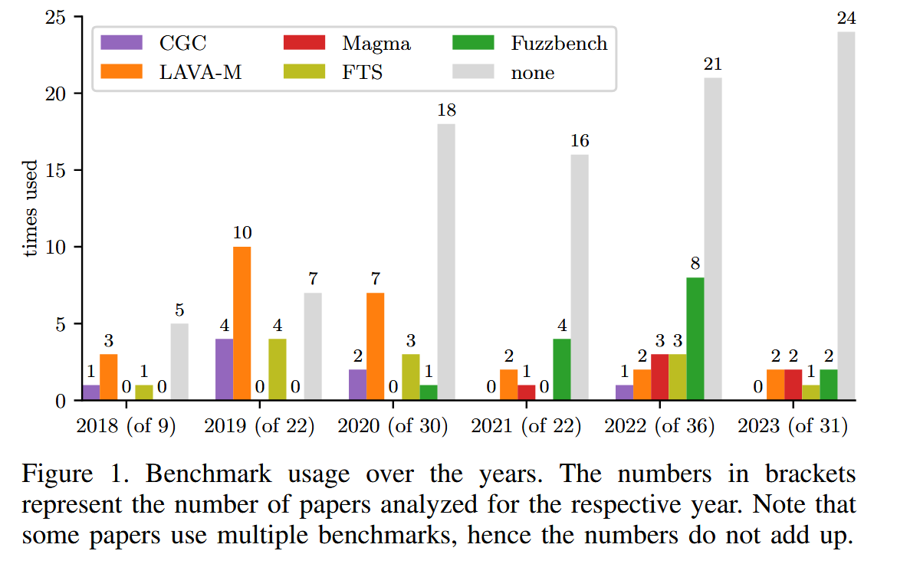
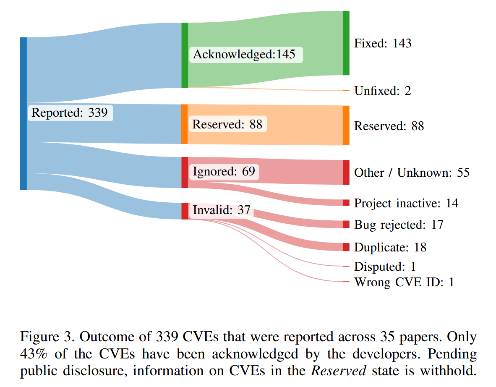

# SoK: Prudent Evaluation Practices for Fuzzing [S&P 2024]

## Introduction

作者研究和总结了 2018 - 2023 年, 共150篇CORE推荐A类会议/期刊的Fuzzing论文, 在Fuzzing Evaluation上的设计方法和实验的可复现性. 并复现了8篇论文所提方法及其评估实验. 最后在Fuzzing研究上进行实验评估方面, 提出多种推荐意见和一种最佳实践.

影响确定性和可复现性的因素: 从进程的调度, 对进程的输入和修改, 到Fuzzing环境等多个随机性来源.

对此, Klees et al. [1] 提出公平和可复现的Fuzzing Evaluation的方法

+ Recommendation 1: 基线选择相关与合理的方法
+ Recommendation 2: Benchmark选择带有已知漏洞的目标程序检测Fuzzer的漏洞检测能力
+ Recommendation 3: Fuzzing需要进行24h, 并画出性能随时间曲线; 种子库选择需要附加种子的文档说明, 并包括多种种子集比如空集和未知集.
+ Recommendation 4: Fuzzer评估侧重于漏洞挖掘能力而不是代码覆盖率; 基本块和边覆盖率实验作为补充指标.
+ Recommendation 5: 应用统计测试, 如Mann-Whitney U-test或基于引导的方法, 来验证零假设 (即与一个合理的基线相比, 新方法没有任何区别)

## Benchmarks

**FuzzBench** the successor to the Google Fuzzer Test Suite (FTS). 侧重覆盖率. 推荐

**Google’s Fuzzer-TestSuite** 侧重覆盖率. 推荐 FuzzBench

**LAVA-M** 侧重漏洞检测. 人工漏洞. 不推荐

**CGC** 侧重漏洞检测. 人工漏洞. 不推荐

**Magma** 侧重漏洞检测. 真实漏洞. 推荐

**Unibench** 侧重覆盖率

**ProFuzzBench** 状态协议Fuzzing Bench. 侧重覆盖率

**RevBugBench** 侧重漏洞检测. 真实漏洞

## Analysis & Conclusions

**代码开源** 作者从289篇papers中选出150篇专注于Fuzzing的papers, 排除将Fuzzing做为工具或者技术之一来应用到其他方向的研究papers.

#### Conclusion 1 

74%的papers公开了代码, 60%可以进行评估实验, 只有23%的papers获得由评审委员会或独立评审人员颁发的徽章.

**Benchmarks 选择** 平均每篇论文评估8.9个目标, 总计753个不同的目标, 其中76% (576个) 仅在一篇论文中被评估过. 基准测试用于可重复地衡量模糊测试工具的性能, 但61%的论文未使用任何基准测试. 各个基准测试的使用统计信息如下:

 

+ LAVA-M：17%（26篇）
+ FuzzBench：10%（15篇）
+ Google的Fuzzer Test Suite（FTS）：8%（12篇）
+ CGC：5%（8篇）
+ Magma：4%（6篇）
+ Unibench：1%（2篇）

#### Conclusion 2 

现实世界的目标通常仅限于二进制输入程序, 而大多数论文都没有使用基准. 仍在使用带有人为漏洞的基准测试.

**Baselines 选择** 最常被用作对比基准的工具包括：

- AFL：35%（53篇）
- QSym：15%（23篇）
- AFLFast：14%（21篇）
- Angora：13%（20篇）
- FairFuzz：8%（12篇）
- AFL++：9%（14篇）

#### Conclusion 3 

45%的模糊测试研究建立在非学术性的模糊测试之上, 33%建立了新的工具. 23%的模糊测试评估无法与相关的最先进的模糊测试工具或他们自己的基准进行比较.

**实验设置** 运行时间, CPU核数, 计算资源公平性, 初始种子库

#### Conclusion 4 

5%的论文分配计算资源不公平, 5%使用不同的种子集. 

**评估指标** 代码覆盖率, 已知BUG, 新BUG / CVEs

#### Conclusion 5 

20%的CVE被忽略并且不修复, 11%无效, 26%保留但无法进行分析.

**统计评估** Mann-Whitney U检验 和 t-检验

#### Conclusion 6 

63%的工作没有使用统计检验来评估其结果, 15%使用的试验不足, 无法获得可靠的结果. 73%没有提供不确定性度量.

## Case Study

**Lesson 1** 独特的崩溃不是一个可靠的指标; 相反, 作者建议使用（已知的）BUG. 建议不要使用人工的运行时环境, 如果使用了需要记录这种限制. 我们强烈建议不要获得尽可能多的CVEs. 现实世界的影响不应该根据分配的CVEs的数量来衡量.

**Lesson 2** 强烈反对将无效bug报告作为漏洞进行营销. 必须考虑开发人员的反馈（特别是在开发人员拒绝BUG报告的情况下）.

**Lesson 3** 建议对改进的技术进行基准测试, 而不是以 Fuzzer 整体作为基准测试. 建议发布所有评估工件, 包括基准测试报告和原始数据.

**Lesson 4** 依赖过时的基线版本可能会扭曲实验结果. 作者应该确保使用所有工具的最新版本进行比较.

**Lesson 5** 一个模糊测试器可能在某个指标上表现出色, 但在其他指标上却未必; 因此选择一套合适的评估指标对于为读者提供全貌至关重要.

**Lesson 6** 种子会影响模糊器的性能. 建议为所有模糊测试者提供相同的种子集, 并公布使用的种子.

**Lesson 7** 建议提供合理水平的可读性和文档, 以允许其他人理解和使用代码, 从而促进可重复性.

**Lesson 8** 使用不同插桩方法会扭曲覆盖率测量结果, 建议使用标准化的方法测量覆盖率.

## Best Practice

对 Fuzzing 的评估实验, 作者给出了最佳实践指南 [2] 

#### Reproducible Artifact 

明确指定用于比较的目标（和工具）及模糊测试器的确切版本. 使用运行时环境抽象（如Docker）, 在可行的情况下进行操作. 指明新技术实现的基准版本, 并避免将该基准的提交压缩合并.

#### Targets under Test

选定的评估目标应形成一个具有代表性的集合, 既能展示所提方法的优点, 又能与先前的工作进行可比性比较. 因此, 建议包括在其他研究中已测试过的目标. 对目标所应用的补丁应做出解释. 如果模糊测试器有某些限制（例如基于符号执行的技术无法模拟所有系统调用）, 我们建议明确说明这些限制. 同时强烈建议使用已广泛接受的基准测试, 如FuzzBench, 以便于后续的轻松复现.

#### Comparison to Other Fuzzers 

在相关领域中，与最先进的技术以及新技术实现所基于的基准（如果有的话）进行比较至关重要. 这包括那些已广泛接受并积极维护的模糊测试工具, 如AFL++. 将新模糊测试器纳入诸如FuzzBench等基准测试, 可以使其与多种模糊测试器进行比较. 如果提出的是一种具有可分离设计选择的新技术, 建议通过消融研究（ablation study）来单独评估各个设计选择. 可以通过设计基准, 逐步启用或禁用单个组件来进行对比.

#### Evaluation Setup 

选择的评估设置应详细记录, 包含以下内容:

1. 硬件细节：包括实验所用的硬件配置
2. 实验运行时间：推荐至少24小时. 若评估的模糊测试器在实验结束时仍未趋于平稳, 可能需要更长的运行时间
3. 分配的核心数与每个模糊测试器的进程数：选择单个核心可能无法代表现代系统的性能
4. 并行运行多个模糊测试器时的内核拥塞问题：应特别注意避免内核瓶颈（即使使用Docker）, 这可能导致某些系统调用处理缓慢, 影响某些模糊测试器的表现. 可以将每个模糊测试器实例封装在不同的虚拟机中, 以避免这种情况
5. 种子管理：推荐使用无信息种子或多个种子集. 种子必须描述清晰且可访问（对于有信息的种子）, 以确保实验可复现. 所有模糊测试器应公平地访问所有种子. 如果使用了有信息的种子, 建议绘制或分析初始种集的覆盖情况, 以避免将高覆盖归因于模糊测试器性能, 而非种子的影响

#### Evaluation Metrics 

评估的关键要点：

1. 度量标准：必须使用标准的、被广泛接受的度量标准, 至少应包括覆盖率和发现漏洞数量. 应同时考虑代码覆盖率和漏洞发现能力, 以避免单一度量带来的偏差
2. 覆盖率的收集：需要明确说明覆盖率的收集方式, 例如是否使用非仪器化的二进制文件、通过模拟器转换的代码块, 或使用如lcov等已建立的方法. 覆盖率不应使用碰撞的位图来衡量, 而应采用无碰撞的编码方式或其他方法
3. 相同的覆盖率度量：在比较不同的模糊测试器时, 确保所有评估使用相同的覆盖率度量标准是至关重要的
4. 选择合理的测试目标：在寻找漏洞以展示现实世界影响时, 选择合理的目标（即非设计上不安全的项目、不活跃多年或因其他原因不适合测试的项目）是关键
5. 评估其他先进模糊测试器：应同时运行其他先进的模糊测试器, 看看它们是否也能发现相同的漏洞, 从而消除针对之前未测试软件的模糊测试器的质疑
6. 崩溃去重与处理：模糊测试器发现的崩溃应进行去重, 然后再开报告. 崩溃的分类过程应明确描述. 在测试崩溃时, 建议在没有模糊测试器或覆盖率仪器的二进制文件上进行重现, 以避免复现问题.
7. CVE请求：理想情况下, 只有维护者应请求CVE. 如果维护者未请求, 研究人员仍然可以链接到漏洞报告. 避免为同一漏洞请求多个CVE, 或在未经协调或通知维护者的情况下请求CVE. 如果可能, 匿名报告漏洞或CVE有助于提供给审稿人在提交时进行访问, 从而能够检查CVE或漏洞报告的有效性.

#### Statistical Evaluation 

1. 最少运行十次试验，或通过功效分析计算合适的试验次数
2. 使用置换检验或重抽样检验避免对正态分布的假设
3. 避免多重检验问题，推荐使用**自助法ANOVA**来比较多个模糊测试器
4. 进行效应大小测量和量化不确定性

## Reference

[1] G. Klees, A. Ruef, B. Cooper, S. Wei, and M. Hicks, “Evaluating Fuzz Testing,” in ACM Conference on Computer and Communications Security (CCS), 2018.

[2] https://github.com/fuzz-evaluator/guidelines

