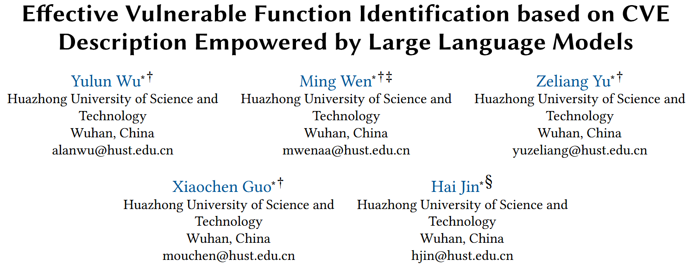
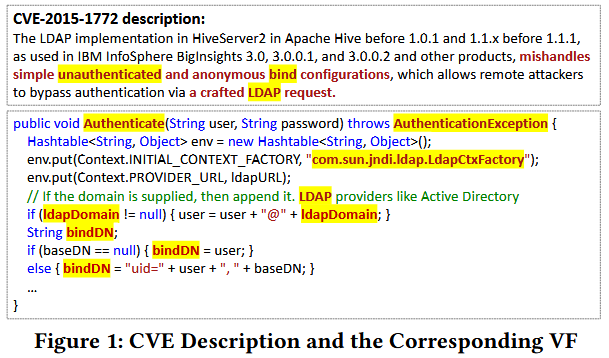
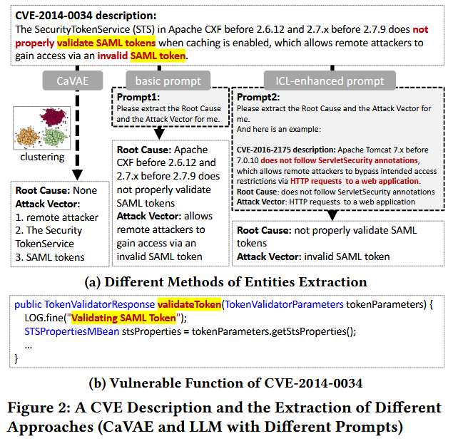
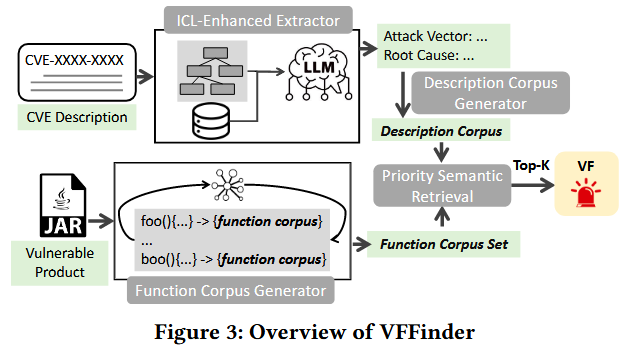
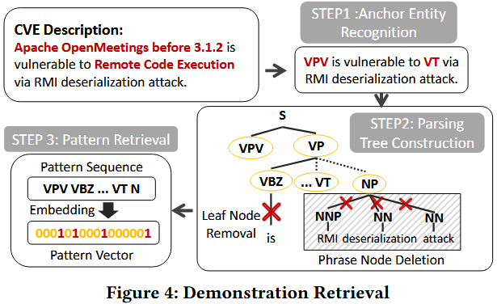
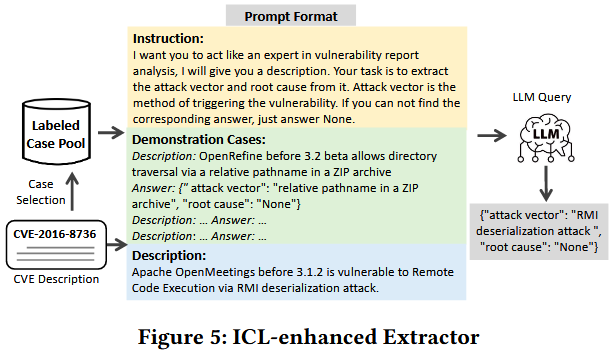
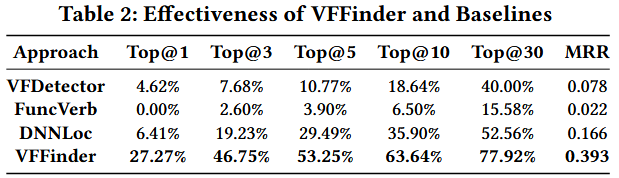
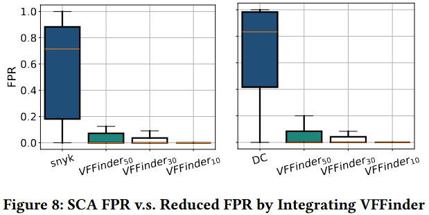

# Effective Vulnerable Function Identification based on CVE Description Empowered by Large Language Models [ASE 2024]

公共漏洞数据集 (NVD) 少有包含具体漏洞函数的信息, 现有工作根据 patches 和 Proof-of-Concept (PoC) 来检测漏洞函数, 但面临数据可用性和人工劳动的局限性. 作者提出 VFFinder, 基于 Common Vulnerabilities and Exposures (CVE) 描述信息的上下文学习 (in-context learning, ICL), 通过 LLM 来抽取关键实体 (entities), 并用优先匹配 (priority matching) 定位漏洞函数. 在 75 个大型开源项目评估 VFFinder, 结果 VFFinder 在 Top-1 和 MRR 指标上超越现有基线方法, 平均分别为 4.25x 和 2.37x. 并且和 Software Composition Analysis (SCA) 工具结合, 结果 VVFinder 可以有效降低 SCA 工具的假阳率.

## Background

基于补丁的方法通过漏洞补丁来识别脆弱函数. 具体而言, 如果某个函数的任何部分在补丁提交中被修改或删除, 则认为该函数是脆弱的. 因此, 这类方法的效果高度依赖于漏洞补丁的可获得性. 基于补丁的方法主要面临以下两个挑战:

+ **补丁可用性**: 要识别脆弱函数, 首先必须能定位到补丁本身, 而这就是一个巨大挑战. Xin 等人 [43] 构建了一个基于规则的爬虫, 用于识别 C/C++ 漏洞的补丁, 但其仅覆盖了 66.57% 的 CVE. 
+ **补丁提交混杂问题**: 众所周知, 一个补丁提交可能包含多个目的, 例如 bug 修复与新功能添加. 安全补丁同样面临此问题. 即便某个补丁提交没有被混杂, 其修改的所有函数也未必都与漏洞直接相关. 

## Motivation

如 Figure 1 所示, 在 CVE-2015-1772 的描述中, 攻击向量“LDAP 请求” (LDAP request) 与脆弱函数 (VF) 的变量名 (例如 `ladpDomain`) 相似, 其根本原因中提到“未认证” (unauthenticated) 一词, 也包含在 VF 的函数名“Authenticate”中. 

Figure 2 所示的 CVE-2014-0034 也展现了类似的关联. 其根本原因是“验证 SAML 令牌” (validate SAML tokens), 这与脆弱函数的字符串字面量及函数名“validateToken”高度一致. 攻击向量中还包含“无效” (invalid) 、“SAML” 和 “令牌” (token) 等词汇, 这些内容与 VF 的命名和特征信息也高度相似. 

**Observation I**: 尽管 CVE 的描述通常是非结构化的, 且格式多样, 但其中包含的属性, 例如**攻击向量**和**根本原因**, 往往具有指示性, 有助于定位脆弱函数. 

**Observation II**: 无监督分类方法无法准确识别上述属性信息, 而大型语言模型 (LLM) 具备从自然语言描述中识别这些信息的能力. 此外, 当 LLM 被提供具有相似结构的示例进行上下文学习 (ICL) 时, 其表现可以进一步提升. 

## Methods

Figure 3 展示 VFFinder 的整体框架, 该方法包含四个主要步骤: ICL-Enhanced Extractor、Description Corpus Generation、Function Corpus Generation 和 Priority Semantic Retrieval. 其中, ICL 增强抽取器旨在从漏洞描述中抽取出攻击向量和根本原因, 以构建精确的查询向量. 具体而言, 该模块采用一种有效的模式嵌入算法, 选择合适的示例用于大型语言模型 (LLM) 的示范学习, 从而完成信息提取任务. 随后, VFFinder 基于提取出的攻击向量和根本原因生成描述语料库. 而函数语料生成器则通过函数级别解析源代码文件, 提取内部代码实体, 以构建全面的函数文档. 为了更准确地刻画每个函数, VFFinder 进一步执行调用增强: 即利用函数调用图来丰富调用者与被调用者之间的上下文信息. 最后, VFFinder 采用一种优先级语义相似度匹配机制, 对所有函数进行排序, 并检索排名前 K 的函数作为脆弱函数候选输出. 

### ICL-Enhanced Extractor

作者构建了一个案例池, 用于提供已标注攻击向量和根本原因的高质量示例. 为了保证案例池的多样性, 对于连续编号的 CVE, 作者仅随机选取一个, 因为这些 CVE 的内容往往非常相似. 最终, 作者保留了 669 个 CVE, 并抓取了其描述信息. 随后, 作者对 CVE 描述中的攻击向量和根本原因进行人工标注. 作者观察到, 描述中通常通过表示“使用”的词 (如 with, by, via) 来引入具体的攻击方法, 后面紧跟名词短语. 因此, 为减少噪声, 作者仅提取这些名词短语作为攻击向量. 同样地, 作者发现部分根本原因也呈现类似结构, 通常出现在“due to”之后, 也为名词短语. 另一类根本原因则是动词短语, 其主语常为产品名称, 表示某个步骤被错误处理而导致漏洞. 为减少噪声, 作者仅提取动词短语作为根本原因. 

从概念上讲, CWE 类型与根本原因存在部分重叠. CWE 提供了根本原因的高层抽象描述, 但其信息粒度过粗, 无法支持对脆弱函数的精准定位. 因此在标注中, 作者有意识地区分了 CWE 与根本原因. 所有攻击向量和根本原因均由人工标注, 且由两位作者独立完成. 作者使用 Cohen's Kappa 系数 [51] 来评估标注一致性. 对于标注不一致的样本, 二者进行讨论并达成一致, 否则该 CVE 被舍弃. 整个过程持续了近三周, 最终获得了 642 条已标注的 CVE 描述. 

为了从案例池中选取模式相似的样本, 作者设计了一种定制的描述模式嵌入方法, 该方法强调描述中的关键实体, 抽象语法结构, 并去除无关噪声. 主要包括以下步骤: 锚点实体识别, 构建句法树, 模式检索.

**Anchor Entity Recognition**: 描述中的四类特殊实体被定义为锚点实体, 包括: VPV、漏洞类型、组件、攻击者. 这些实体在描述中的分布和顺序对于模式构建至关重要, 因此作者将其识别出来并用锚点类型进行替换. 例如: 

- **VPV (Vendor, Product, and Version information)**: 通过 LLM 识别厂商、产品和版本等信息. 
- **VT (漏洞类型) **: 常以 CWE 类型的名称出现, 由 LLM 识别. 
- **组件 (Component) **: 表示受影响的具体模块, 识别时借助 VPV 信息；若句中未包含 VPV, 则不识别组件. 
- **攻击者 (Attacker) **: 识别句中执行攻击动作的主体, 主要通过匹配“attacker”等关键词完成. 

如 Figure 4 所示, "Apache OpenMeetings before 3.1.2" 被识别为 VPV, “Remote Code Execution” 被识别为 VT. 原句“Apache OpenMeetings before 3.1.2 is vulnerable to Remote Code Execution via RMI deserialization attack”被转化为“VPV is vulnerable to VT via RMI deserialization attack”. 这些实体可由 LLM 或正则表达式轻松识别, 它们在句中的位置对于模式特征抽取极为关键. 

**Parsing Tree Construction**: 为更好地捕捉句子内部成分之间的关系, 作者使用 Stanford Parser 构建锚点替换后的句法分析树. 树中的内部节点表示语法短语 (如 S, NP, VP), 叶节点为原始词语与标点. 

为减少无关信息, 作者采用两种启发式方法对树进行剪枝: 

1. 若某个短语节点 (如 NP 或 VP) 或句子节点 (S) 下的子树中不再包含其他短语节点或句子节点, 则删除其子节点, 仅保留根节点. 
2. 删除所有非锚点和非短语类的叶子节点, 进一步抽象句子的模板结构. 

例如, 在 Figure 4 中, “RMI deserialization attack” 被视为一个整体节点, 抽象出了描述的核心结构. 

**Pattern Retrieval**: 完成句法树构建与剪枝后, 作者将所有叶节点拼接为序列表示句子模式. 使用 Autoencoder 对该序列进行嵌入, 获取句子的模式向量表示. 

然后使用余弦相似度计算待查询描述与案例池中所有样本之间的相似度, 并选取相似度最高的 Top-K 示例. 由于这些示例在锚点实体和语法结构上与查询描述相近, 能够帮助 LLM 更好地理解其语义与结构, 从而提高抽取效果. 

**Query Template.** 如 Figure 5 所示, 作者设计了用于指导 LLM 执行攻击向量和根本原因抽取的提示模板. 选用基于 `gpt-3.5-turbo-06135` 的 ChatGPT 作为 LLM 执行该任务. 

### Description Corpus Generation

基于抽取器获得的攻击向量和根本原因 (A&R), VFFinder 按如下步骤生成描述语料库: 

+ **预处理**. VFFinder 首先移除停用词 (包括标准英文停用词和标点符号), 再根据大小写分隔复合词 (例如将“validateURL”拆分为“validate”和“URL”) . 随后, 使用 Porter 词干提取算法 [52] 将词语转换为其词干形式. 作者通过 NLTK 工具实现此处理流程. 这一预处理过程可使语料更简洁, 有助于提高相似度匹配的准确性. 

+ **类名提取**. VFFinder 将类名识别为描述中的特殊实体, 通过正则表达式 (如 "in class: 类名") 从描述中提取类名. 若成功提取出类名, 将用于后续排序过程中的类匹配. 

+ **权重计算**. 在构建好的描述语料中, 有些实体出现频率较低, 但其独特性往往对识别脆弱函数至关重要. 例如 Figure 1 中攻击向量部分的 “LDAP”. 因此, VFFinder 引入 TF-IDF (词频-逆文档频率) 方法来计算各词语的重要性权重, 用于后续排序模块中的相似度计算. 

### Function Corpus Generation

函数语料用于表示每个函数, 由两部分组成: **局部语料** (从函数体中提取) 和**交互语料** (从调用关系中提取) . 已有研究表明, 函数间的调用关系可提供丰富的语义信息 [47]. 

**Local Corpus** 包括五种特征: 标识符名称、函数名、参数名、注释和字符串字面量. 前三种代码实体特征按照驼峰命名法进行分词处理. 对于注释和字符串字面量, 移除标点和停用词后, 采用与 CVE 描述相同的方法进行复合词切分. 值得注意的是, 函数所属的类名保持原样, 以便用于类匹配. 

**Interactive Corpus** 用于增强局部语料. 具体而言, 作者使用 Soot 工具 [7] 为整个项目构建函数调用图, 并利用与函数相关的调用信息来扩展函数的语义表示. 交互语料包括两种特征: 

- **调用者参数 (caller parameters) **: 表示项目中调用函数 F 时实际传入的参数, 补充了函数的输入信息. 
- **被调内联 (callee inline) **: 对于语句数不超过五条的短函数, 将其调用的其他函数的语料合并为 F 的“被调内联”表示. 

### Priority Semantic Retrieval

在该步骤中, VFFinder 通过**优先级语义匹配**对所有函数进行排序. 具体来说, 若函数所属类与描述中提取的类特征匹配, 则该函数被赋予优先级, 因为类匹配可显著缩小候选函数范围, 从而提高定位精度. 

作者采用 `angle-llama-7b-nli-20231027` 模型进行嵌入生成, 该模型基于 Llama-2-7b-hf, 并针对语义文本相似度任务进行了训练. 该模型用于对描述语料与函数语料中的实体进行嵌入, 然后通过余弦相似度计算其相似程度. 

检索流程如 Algorithm 1 所示, 输入包括描述语料 `d`、函数语料列表 `fSet`、相似度阈值 `θ` 以及需要输出的候选数 `K`, 最终返回 Top-K 个函数作为 VF 候选. 

## Evaluation

## References

[7] Jiarun Dai, Yuan Zhang, Zheyue Jiang, Yingtian Zhou, Junyan Chen, Xinyu Xing, Xiaohan Zhang, Xin Tan, Min Yang, and Zhemin Yang. 2020. BScout: Direct Whole Patch Presence Test for Java Executables. In 29th USENIX Security Symposium, USENIX Security 2020, August 12-14, 2020, Srdjan Capkun and Franziska Roesner (Eds.). USENIX Association, 1147–1164. https://www.usenix.org/conference/ usenixsecurity20/presentation/dai

[43] Xin Tan, Yuan Zhang, Chenyuan Mi, Jiajun Cao, Kun Sun, Yifan Lin, and Min Yang. 2021. Locating the Security Patches for Disclosed OSS Vulnerabilities with Vulnerability-Commit Correlation Ranking. In CCS ’21: 2021 ACM SIGSAC Conference on Computer and Communications Security, Virtual Event, Republic of Korea, November 15 - 19, 2021, Yongdae Kim, Jong Kim, Giovanni Vigna, and Elaine Shi (Eds.). ACM, 3282–3299. https://doi.org/10.1145/3460120.3484593

[47] Shangwen Wang, Ming Wen, Bo Lin, and Xiaoguang Mao. 2021. Lightweight global and local contexts guided method name recommendation with prior knowledge. In ESEC/FSE ’21: 29th ACM Joint European Software Engineering Conference and Symposium on the Foundations of Software Engineering, Athens, Greece, August 23-28, 2021, Diomidis Spinellis, Georgios Gousios, Marsha Chechik, and Massimiliano Di Penta (Eds.). ACM, 741–753. https://doi.org/10.1145/3468264.3468567

[52] Peter Willett. 2006. The Porter stemming algorithm: then and now. Program 40, 3 (2006), 219–223. https://doi.org/10.1108/00330330610681295

