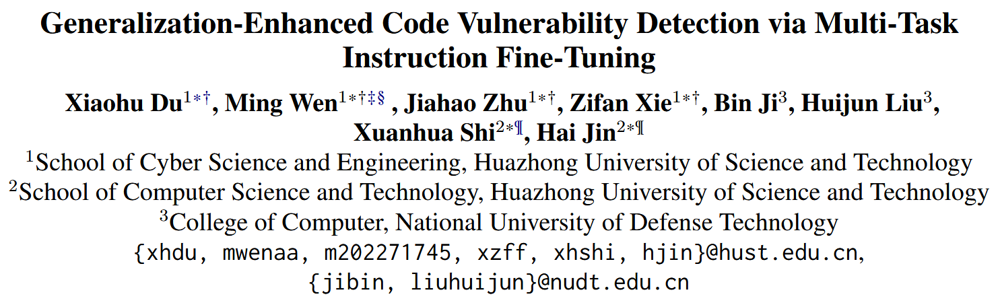

大模型只学会了源代码到漏洞标签的映射, 而非学习到漏洞根因, 导致大模型在真实漏洞 (不包括在训练集中的漏洞) 检测中效果不尽人意的限制. 为了解决这个问题, 作者提出 VulLLM, 集成多任务学习的 LLM 框架, 可以有效挖掘深层的漏洞特征. 同时, 构建两个漏洞任务: 1.根据代码补丁构建的漏洞代码定位任务; 2.根据补丁提取漏洞特征再用 GPT-4 构建的漏洞解释任务. VulLLM 利用生成式模型增强漏洞分类, 理解漏洞模式并迫使模型理解漏洞成因而非过拟合任务中的虚假特征. 在 6 个大型数据集上验证, VulLLM 在效果、泛化性和鲁棒性上超越 SOTA.


## Method


VulLLM 主要有三个部分组成: 漏洞特征提取, 漏洞解释生成, 多任务指令微调


### vulnerability features extraction

作者将 patches 中删除行定为漏洞的 **root cause**. 并提取漏洞直接相关的代码行, 及其数据依赖和控制依赖作为 **vulnerability context**. 作者用 JOERN [1] 工具提取漏洞函数的 PDG (Program Dependency Graph), 并根据数据依赖和控制依赖分别提取 k-hop 个上下文相关节点的代码, 加入到 vulnerability context. 


此外, **CVE 描述信息**对理解漏洞的根本原因极其宝贵, 它们通常能提供相关的背景和情境, 解释这些弱点是如何产生的, 以及在不同情况下它们可能如何被利用. 作者从 NVD 数据库中收集这些 CVE 描述信息.


### vulnerability interpretation generation


**Step 1** role-centric 提示词策略, 告诉 LLM 作为漏洞检测模型. 同时提供等量 vulnerable 和 non-vulnerable 示例, 其中 non-vulnerable 由 GPT-4 提供解释.

**Step 2** (Self-Verification templates) 要求验证程序是否有漏洞的答案正确性, 用 "double-check" 提示词来指示, 最后要求输出漏洞描述

**Step 3** (Self-Verification templates) 要求验证漏洞描述的答案正确性, 用 "double-check" 提示词来指示, 最后要求输出与漏洞直接相关的代码行

**Step 4** (Self-Verification templates) 要求验证漏洞行的答案正确性, 用 "double-check" 提示词来指示, 最后要求输出漏洞行的数据和控制依赖

**Step 5** (Self-Verification templates) 要求验证漏洞上下文的答案正确性, 用 "double-check" 提示词来指示, 最后要求在考虑漏洞描述和上下文时输出漏洞解释


```text
Prompt1: I want you to act as a vulnerability detection model. Is the following program buggy? [Code]

Prompt2: This program is buggy. Please double-check the answer and analyze its correctness. Next, please give the description of the vulnerability. 

Prompt3: The description of vulnerability is [CVE description]. Please double-check the answer and analyze its correctness. Next, please provide the lines of code that are directly pertinent to the identified vulnerability. 

Prompt4: The vulnerability lines are [Vulnerability lines]. Please double-check the answer and analyze its correctness. Next, please provide the data dependency and control dependency lines related to the vulnerability lines.

Prompt5: The dependency lines are [Dependency lines]. Please double-check the answer and analysis its correctness. Next, considering the vulnerability's description, please present the vulnerability interpretation by referring to the vulnerable and dependent lines.
```


### multi-task instruction fine-tuning

Dataset: PatchDB [2], DiverseVul [3], Devign [4]. 总共 797 个 projects. 

Training Tricks: 随机替换 10% 的 identifier 来增强 LLM 的泛化能力.

指令微调的模板示例


## Reference

[1] JOERN. 2023. https://github.com/joernio/ joern. Accessed: 2023-12.

[2] Xinda Wang, Shu Wang, Pengbin Feng, Kun Sun, and Sushil Jajodia. 2021. Patchdb: A large-scale security patch dataset. In Proceedings of the 51st Annual IEEE/IFIP International Conference on Dependable Systems and Networks, DSN 2021, Taipei, Taiwan, June 21-24, 2021, pages 149–160. IEEE.

[3] Yizheng Chen, Zhoujie Ding, Lamya Alowain, Xinyun Chen, and David A. Wagner. 2023. Diversevul: A new vulnerable source code dataset for deep learning based vulnerability detection. In Proceedings of the 26th International Symposium on Research in Attacks, Intrusions and Defenses, RAID 2023, Hong Kong, China, October 16-18, 2023, pages 654–668. ACM.

[4] Yaqin Zhou, Shangqing Liu, Jing Kai Siow, Xiaoning Du, and Yang Liu. 2019. Devign: Effective vulnerability identification by learning comprehensive program semantics via graph neural networks. In Proceedings of the Advances in Neural Information Processing Systems 32: Annual Conference on Neural Information Processing Systems 2019, NeurIPS 2019, December 8-14, 2019, Vancouver, BC, Canada, pages 10197–10207.

