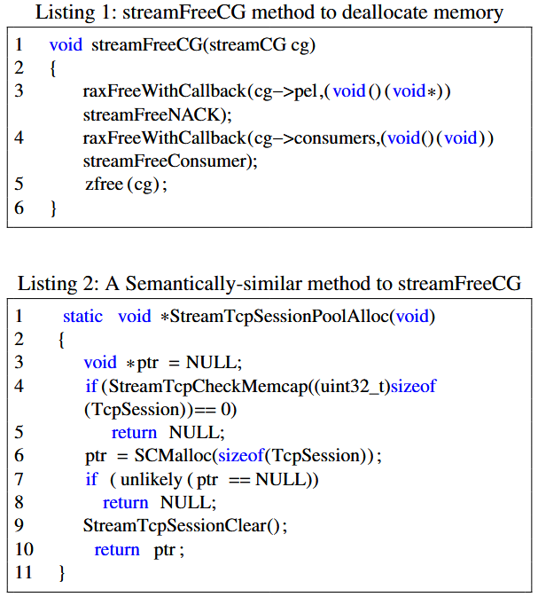
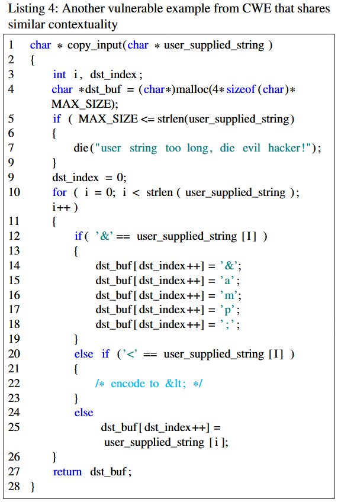
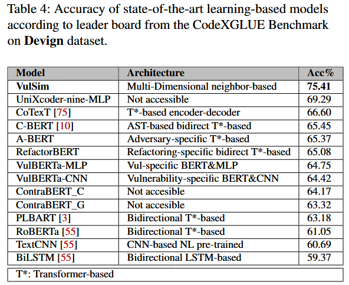

# VulSim: Leveraging Similarity of Multi-Dimensional Neighbor Embeddings for Vulnerability Detection [USENIX 2024]

C 语言中的不同漏洞类别共享一些共同特征, 包括**语义**、**上下文**和**语法**特性. 接着, 作者利用这些知识来增强深度学习 (DL) 模型在数据稀缺情况下进行漏洞检测的学习过程. 为此, 作者从有限的数据中提取多个维度的信息, 然后将这些信息整合到一个统一的空间中, 通过最近邻嵌入识别漏洞之间的相似性. 这些步骤的结合使作者能够提高使用深度学习模型进行漏洞检测的有效性和效率. 评估结果表明, 作者的方法超越了现有 SOTA 模型, 并且在未见过的数据上表现出强大的性能, 从而增强了模型的泛化能力. 

## Observations

### Semantic Dimension

语义维度指的是代码标记的自然意义和解释, 类似于自然语言中的单词. 它旨在捕获代码标记的含义. 例如, 考虑 BigVul 数据集中的两个易受攻击方法 (见列表 1 和 2). 第一个方法负责释放与 streamCG 数据结构的各个组件相关的内存, 确保使用提供的回调函数调用任何必要的清理或释放例程. 第二个方法则旨在为 TcpSession 对象分配内存. 虽然这两个方法的主要目标差异显著 (一个分配内存, 另一个释放内存), 但它们的名称中都包含“stream”这个关键字. 这种“stream”在方法名称中的重复, 表明它们与流数据的操作有关. 在 streamFreeCG 方法中, 单词“stream”不仅出现在函数名称中, 而且还出现在参数名称中. 此外, 在函数体内, “stream”在两个函数调用中被使用, 即 “streamFreeNACK” 和 “streamFreeConsumer”. 同样, 在函数 StreamTcpSessionPoolAlloc 中, “stream”一词出现在函数名称中一次, 在函数调用 “StreamTcpCheckMemcap” 和 “StreamTcpSessionClear” 中出现两次. 它们的名称和函数调用中都使用了“stream”一词, 表明这两个方法在语义上存在一定的相似性. 

作者使用SBERT模型将易受攻击和安全代码片段中的术语的语义意义转化为嵌入. 这一转化使得能够测量代码片段嵌入之间的语义相关性, 并标记未标注的实例. 通过将代码片段视为自然语言, 语义模型生成的嵌入捕捉了每个术语的语义属性. 然后通过计算它们的代码嵌入之间的距离来衡量易受攻击和非易受攻击实例之间的语义差异. 

### Contextual Dimension

上下文维度考虑的是代码周围的代码、依赖关系和操作环境. 它关注的是理解代码的预期功能和行为, 超越了代码的具体结构或语法. 考虑来自CWE网站的两个示例 (见列表 3 和 4). 第一个示例接受用户输入的IP地址, 验证其格式是否正确, 然后查找主机名并将其复制到缓冲区中. 第二个示例 (列表 4) 对输入字符串应用编码过程, 并将其存储在缓冲区中. 两者都将数据写入缓冲区. 作者认为这两个方法在上下文上是相似的. 它们都存在 CWE119 漏洞: 内存缓冲区边界内的操作限制不当. 作者观察到, 尽管目标相同, 它们在语义和语法上有所不同. 例如, 与列表 1 和 2 中的方法不同, 这两个方法没有共享含义相似的单词, 并且它们的基本结构在语法上也不同. 这个发现突显了上下文相似性的重要性, 而这两个方法在其他维度上并不相似. 

作者选择 code2vec 作为作者的上下文空间嵌入. 正如 Alon 等人 [6] 所展示的, 具有相同功能或上下文的易受攻击方法因此会被放置在更接近的空间中, 作者可以利用这些信息来检测一段代码是否存在漏洞. 

### Syntactic Dimension

语法维度指的是代码中符号的结构、语法和排列. 它强调按照语言的定义规则和惯例, 正确地形成和排列标记、关键字、运算符和其他语言构造. 例如, 考虑 BigVul 数据集中的两个方法 (见列表 5 和 6), 第一个方法存在“CWE189: 数值错误”漏洞, 第二个方法存在“CWE-119: 内存缓冲区边界内操作限制不当”漏洞. 这两个方法的基本语法结构相同. 它们共享相似的签名, 每个函数都有一个 void 返回类型, 并且不接受任何参数. 两个函数仅由一行代码组成, 调用类成员对象的方法. 尽管在语法上相似, 它们并没有共享任何相似的语义或功能. 第一个方法调用了 spec 对象上的 RecomputeSpecForDetails() 方法. 而第二个方法 InitPrefMembers() 调用了 settings 对象上的 InitPrefMembers() 方法, 暗示初始化与首选项相关的成员. 

作者选择 CodeBERT 执行语法结构嵌入, 因为它专门在源代码上进行训练. Wan 等人 [104] 也观察到, CodeBERT 在不同隐藏层中很好地保持了代码的语法结构. 

## Methods

### Models

(i) 语义空间: 为了利用 SBERT (Sentence-BERT) 生成嵌入并对方法进行语义分析. 为了进行分类, 作者将 SBERT 用作分类器. 最初, 作者将数据集按 90%-10%的比例划分为训练集和测试集. 随后, 作者将源代码输入基于变换器的二分类器中, 将其分类为易受攻击或非易受攻击. 为了保留语义空间, 作者提取了生成的嵌入用于后续分析. 为了配置模型训练过程进行分类, 作者使用了默认设置, 其中总的训练轮数为 3, 每个设备的训练批次大小为 8, 评估批次大小为 20, 学习率调度器的热身步数为 500, 权重衰减设置为 0.01.

(ii) 上下文空间: code2vec 模型 [6] 最初是在 Java 编程语言中训练的. 通过利用 Coimbra 等人提出的开源方法, 作者重新训练了 code2vec, 在用 C 编写的代码片段上, 以考虑两种语言之间的潜在差异. 为此, 作者最初使用 Astminer 生成了数据集中函数的相应 AST. 对于 27,318 个方法, Astminer 无法生成 71 个记录的 AST. 剩余的 27,247 个 AST 表示被转换为 code2vec 可接受的格式, 以重新训练模型, 学习 C 相关的 AST 模式. 按照 [21] 中的建议, 作者重新训练了网络 20 轮, 使用了原始 code2vec 的默认超参数, 批次大小为 1,024, 嵌入大小为 128, 丢弃率为 0.25. 

(iii) 语法空间: 原始的 CodeBERT 模型最初是在 6 种编程语言中训练的, 不包括 C 语言. 因此, 作者根据 CodexGLUE [55] 的说明, 针对 Devign 数据集中的 C 编写的代码片段对 CodeBERT 进行了微调. 在这种情况下, 作者使用默认设置, 对模型进行了 5 轮训练, 块大小为 400, 训练批次大小为 32, 评估批次大小为 64, 学习率为 2e-5. 

排名和评分: 作者开发了一种排名机制, 选择每个空间中相似度最高的前 n 个嵌入, 并计算权重, 如下所示: 

$$
\text { Score }=\sum_{i=0}^{n-1}(n-i) w_i
$$

其中 n 是要考虑的最接近邻居嵌入的数量, 用于标注向量. i 表示邻居的索引, 这些邻居根据与目标向量的距离按降序排列. 因此, 最接近的邻居在确定给定向量的标签时具有更高的投票 (较大贡献). $w_i$ 表示当前记录与第 i 个相似值的余弦相似度值. 这个机制在距离方差较大的情况下尤其重要. 该排名机制对于每个单独的空间独立重复. 根据该排名机制, 作者为每个测试向量生成了两个分数, 一个是选择前 n 个 weak 邻居的分数 (坏分数), 另一个是选择 safe 邻居的分数 (好分数). 更具体地说, 对于一个特定的记录, 如果第 1 个记录 (i = 1) 是好的, 并且与目标的相似度值为 $w_i$, 则该分数将添加到好分数中. 类似地, 对于 i = 2, 如果记录是坏的, 则该分数将添加到坏分数中, 依此类推. 因此, 每个向量都分配了两个分数, 表示它与易受攻击和安全代码片段的相似性. 根据每个特定空间的邻近邻居, 独立地生成这些基于邻居的分数. 最终, 这些基于邻居的分数被用于检测一段代码是否易受攻击. 

### Classification

作者采用了基于决策树的分类器. 这个选择旨在防止分类算法的复杂性掩盖语义、语法和上下文特性之间分类能力的差异. 此外, 作者优先考虑选择简单且可解释的模型, 以便对预测过程进行清晰的洞察. 作者将分类器配置为 Gini 指数, 最大深度为 3, 每个叶节点的最小样本数为 5. 对于数据集中的每个项目, 作者根据 上面描述的两组分数输入分类器. 根据这些分数, 分类器将每个样本分类为易受攻击或非易受攻击. 作者将训练集和测试集的比例设置为 90%-10%进行训练. 为了比较, 作者最初根据每个空间中易受攻击和安全分数分别对嵌入进行分类. 此外, 作者还应用了相同的分类器来评估所有三个特性集的组合效果, 创建了一个混合模型, 同时考虑所有三个特性. 在这种情况下, 作者将 6 个分数 (每个空间 2 个) 输入分类器. 分类假设是, 易受攻击和安全的代码片段将在至少一个语义、上下文、语法或混合空间中映射到具有相似特征的嵌入上. 

## Evaluation

### RQ1: Evaluating the Impact of Utilizing Neighbors’ Information from Multiple Dimensions

### RQ2: Evaluating the Effectiveness of Approach vs. State-of-the-art (SOTA)

## References

[6] ALON, U., ZILBERSTEIN, M., LEVY, O., AND YAHAV, E. code2vec: Learning distributed representations of code. ACM on Programming Languages 3, POPL (2019), 1–29.

[55] LU, S., GUO, D., REN, S., HUANG, J., SVYATKOVSKIY, A., BLANCO, A., CLEMENT, C., DRAIN, D., JIANG, D., TANG, D., LI, G., ZHOU, L., SHOU, L., ZHOU, L., TUFANO, M., GONG, M., ZHOU, M., DUAN, N., SUNDARESAN, N., DENG, S. K., FU, S., AND LIU, S. Codexglue: A machine learning benchmark dataset for code understanding and generation, 2021.

[104] WAN, Y., ZHAO, W., ZHANG, H., SUI, Y., XU, G., AND JIN, H. What do they capture? a structural analysis of pre-trained language models for source code. In Proceedings of the 44th International Conference on Software Engineering (2022), pp. 2377–2388.