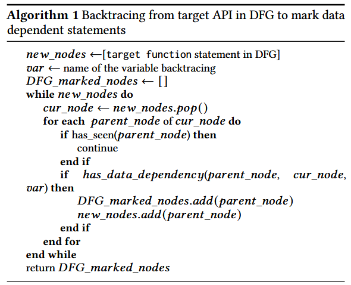
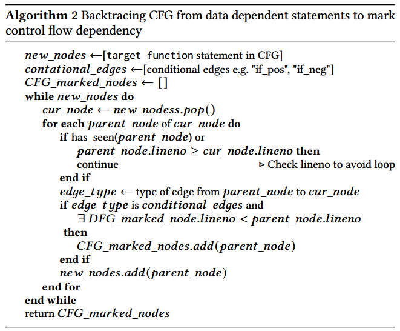
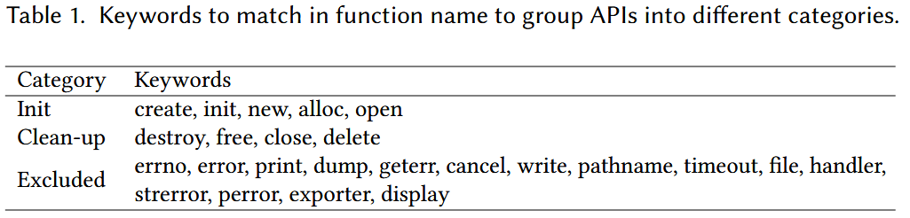

# WildSync: Automated Fuzzing Harness Synthesis via Wild API Usage Recovery [ISSTA 2025]

当将 fuzzing 应用于软件库的 API 时, 高质量的 fuzzing harness 是必不可少的, 它使得 fuzzer 能够以准确的顺序和参数执行 API. 现有的工作通常由于依赖编译器分析或运行时执行跟踪, 导致在可扩展性和有效性方面受到限制, 这些方法需要手动配置和设置. 作者对多个积极进行 fuzzing 的库的调查表明, 许多由各种开源项目外部使用的导出 API 函数仍未被现有的 harness 或单元测试文件覆盖. 这些 API 函数缺乏测试增加了漏洞未被发现的风险, 可能导致安全问题. 

为了解决现有 fuzzing 方法覆盖不足的问题, 作者提出了一种新方法 WildSync, 通过提取未测试函数在实际场景中的使用模式来自动生成 fuzzing harness, 使用基于轻量级抽象语法树解析的技术从外部源代码中提取 API 使用模式. 实验中, WildSync 成功为 24 个在 OSS-Fuzz 上积极进行 fuzzing 的库生成了 469 个新 harness, 同时还为 3 个广泛使用的库生成了 harness. 经过测试, 覆盖率显著提高, 覆盖超过 1300 个函数和 16000 行代码, 同时还发现了 7 个以前未检测到的漏洞. 

## Methods

作者观察到, 许多库的核心功能是基于构造库特定的非原始类型数据结构. 一个库中的函数, 若接受相同的非原始数据类型作为参数, 通常会展现出共享的数据语义. 通过利用现有的 harness, 这些 harness 有助于将 fuzz 输入转换为这些特定数据结构, 作者能够有效地测试之前未覆盖的、也接受相同数据结构的函数. 由于这些核心数据结构已经在现有 harness 中实例化, 作者的分析可以局限于外部代码库中的一小部分, 从中推断出正确的 API 使用模式. 这使得作者能够识别调用新目标 API 所需的前置条件和约束条件, 并确保其符合预期的使用方式, 而无需对整个消费者代码库进行广泛分析. 

在这个思路指导下, 作者开发了 WildSync, 能够自动合成未测试库 API 的 fuzzing harness, 并使用这些 API 在实际环境中的使用情况. WildSync 首先根据从 Linux 发行版的包管理器获得的库依赖信息, 搜索目标库的外部使用情况. 然后, 它从依赖库的源代码中提取目标库的使用情况. 通过依赖基于抽象语法树 (AST) 解析的数据流分析, WildSync 从外部源代码中提取 API 使用情况. 这种轻量级的静态代码分析方法使得 WildSync 可以轻松扩展, 而无需依赖消费者代码的编译信息. 

### Example

例子展示外部代码如何使用来自 vorbis 库的 `ov_time_seek` 函数. 假设 vorbis 的现有 harness 涵盖了 `OggVorbis_File` 数据类型的初始化, 作者的目标是扩展它来进行 `ov_time_seek` 函数的 fuzzing. 在代码片段中, 作者看到 `ov_time_seek` 函数是通过一个额外的 `double` 参数 `s` 被调用的. 虽然无法仅通过代码片段推断出该参数的确切值, 但作者可以用 fuzzing 输入填充它. 作者还应包括外部代码对参数 s 应用的条件检查, 以确保正确调用 API, 而不会触发已知的限制或冗余崩溃. 

基于这一模型, 作者摒弃了传统的捕获和创建完整 API 调用序列的方法, 而是专注于分析周围的代码片段, 以提取正确 API 使用所需的必要语义. 为此, 作者开发了一个轻量级的分析工具, 用于提取相关代码片段的抽象语法树 (AST). 只要分析的代码语法正确, 作者就可以提取所需的信息来生成目标 API 函数的 harness. 由于不需要编译整个代码库来提取使用情况——这一任务需要大量的工作——这种方法能够高效扩展. 相反, 作者可以在大规模上收集使用模式, 从而实现更广泛、更高效的分析. 

### Workflow

首先, WildSync 使用多个过滤器来识别需要合成测试工具的目标函数. 

随后, WildSync 通过抽象语法树 (AST) 解析和变量数据流分析, 从依赖库的源代码中提取目标函数的使用情况. 根据提取的代码, WildSync 确定需要模糊测试的新变量. 

之后, WildSync 通过将提取的使用情况整合到基于现有测试工具的新测试工具中, 为未测试的函数合成新的模糊测试工具. 进行尝试编译和尝试模糊测试过程, 以排除无效的测试工具. 

关于目标函数的外部使用来源, WildSync 利用Linux发行版的包管理器, 检索所有使用待测试库的其他开源项目. 

### Target Function Usage Extraction

提取目标函数在实际场景中的使用目的是为了捕捉正确的过程, 以设置在现有测试工具中未初始化的函数参数. 由于单个外部代码片段可能包含许多其他库或未在本地定义的变量, WildSync的当前设计在保留必要初始化和约束的同时, 提取最小规模的代码, 确保在将这些函数参数传递给目标函数时, 不丢失重要信息. 

**步骤1: 标记数据依赖语句**

WildSync 首先基于调用目标函数的外部代码片段的抽象语法树 (AST) 构建控制流图 (CFG) 和数据流图 (DFG). CFG和DFG中的每个节点代表代码片段中的一条语句. 对于每个在现有测试工具中未初始化的函数参数, WildSync 在DFG上使用回溯算法, 从目标函数追踪到该函数参数的首次使用位置, 获得目标函数到该函数参数的依赖def-use链. 算法 1 从DFG中的目标函数调用开始, 逐级追溯到每个父节点. 当某个父节点与当前正在追踪的函数参数之间存在数据依赖时, WildSync 将该父节点标记为需要提取的依赖数据语句. 该过程在到达该函数参数的首次使用时停止, 无论该使用是声明还是在外部代码片段中未定义 (例如作为全局变量) 

**步骤2: 完善控制流结构**

算法 2 旨在捕获标记的数据依赖语句之间的控制流结构 (例如if-else条件、循环等). 类似于DFG回溯算法, WildSync 从CFG中的目标函数调用开始, 逐级追溯到每个父节点. 如果当前节点与父节点之间的边是条件边, 并且存在标记的数据依赖语句, 其行号小于当前节点, WildSync 将该父节点标记为必要的控制语句. 

**步骤3: 完善变量声明和初始化**

WildSync 声明并初始化所有在提取的代码片段中未定义的变量. 对于声明, 如果变量出现在外部代码片段中但未在本地定义, WildSync 会恢复该声明并保持相同的类型. 如果该变量在外部代码片段中未定义, 可能是全局变量或通过指针和结构体访问的值. 在这种情况下, WildSync 将其声明为随机整数或指向内存的指针, 赋予任意值. 声明完所有缺失的变量后, WildSync 标记出所有需要初始化值的位置及其类型. 对于宏, WildSync 应用简单的启发式方法进行区分, 并保持它们在提取的代码片段中的原样. 

### Fuzzing Harness Synthesis

首先, 基于 table 1 中描述的匹配候选项, WildSync 将提取的代码片段放入现有的测试工具中, 位置是在匹配的核心数据结构初始化的位置. 当前的策略是将提取的代码片段插入到现有的测试工具中, 而不是替换任何内容, 以最小化潜在的副作用. 提取的代码中的这些核心数据结构的变量名会被替换为原始测试工具中的变量名. 变量名冲突通过重命名提取代码片段中的变量来解决. 

接下来, WildSync 尝试为提取代码片段中需要初始化的变量提供值. 实现这一点的方法是将 fuzzer 提供的数据字节拆分成不同的块, 并根据请求的类型将它们分配到标记的位置. 由于 WildSync 当前的实现目标是 libFuzzer 风格的测试工具, 因此这一过程是通过重写测试工具入口点 LLVMFuzzerTestOneInput 来实现的. 图 4 展示了针对示例外部代码片段合成的测试工具. WildSync 通过将提取的代码片段插入现有的测试工具中, 随后将原始输入数据缓冲区拆分成不同的块, 并将它们分配到标记的位置, 从而合成了新的测试工具. 

为了简化和提高探索目标函数的效率, WildSync 为每个目标函数合成一个测试工具, 而不是将多个目标函数合并到一个测试工具中. 

### Invalid Harness Deduction

在合成新测试工具的过程中, WildSync可能会将未知的变量类型替换为整数或任意的数据块, 这可能导致无效的测试工具, 这些测试工具没有正确初始化传递给目标函数的数据结构. 因此, 在所有测试工具合成完毕后, WildSync会执行尝试编译和尝试模糊测试步骤, 以消除这些无效的测试工具. 在尝试编译阶段, 大部分无效的测试工具会被移除, 因为它们由于类型转换不一致或其他语法错误未能编译通过. 

## Evaluation

### Automation & Design: How many new target functions can WildSync extract external usage for and synthesize harnesses? What level of human effort is still required in the process?

为了验证方法的自动化程度, 作者实验目标如下:

专注于在 OSS-Fuzz 中测试覆盖率少于70%的库, 并排除了那些没有函数可以合成的库. 选择了广泛使用的 24 个 C/C++ 项目

此外, 作者还为 3 个来自 Pacman 的库合成了测试工具, 这些库虽然不在OSS-Fuzz中, 但它们得到了积极维护并广泛使用

### Effectiveness: What is the effectiveness of the new harnesses synthesized by WildSync in terms of increased test coverage and bug discovery?

实验内容:

+ 覆盖率(行、函数): 与 libfuzzer 比较

+ 错误发现: 与 libfuzzer 比较 bug 触发数量

+ 虚假崩溃: 合成 harness 数据赋值错误 / 内存爆满带来的崩溃统计

### Comparison: How does WildSync compare to other approaches for automatic harness generation?

实验内容:

+ 主要与 Hopper 比较, 其他方法不开源

+ 比较覆盖的 API 数量, 代码行数, 函数覆盖

+ 比较漏洞触发数量 和 虚假崩溃数量

