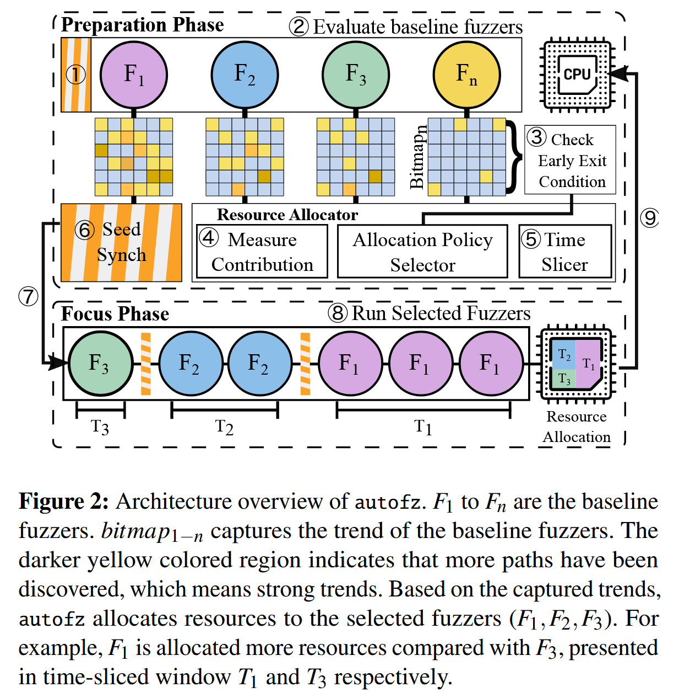
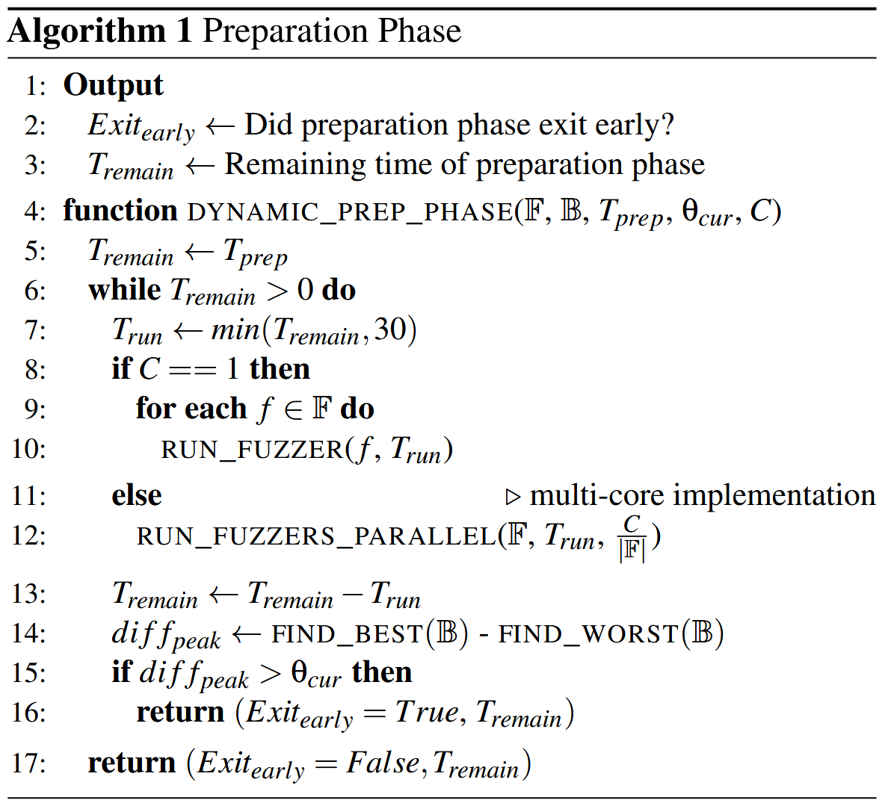
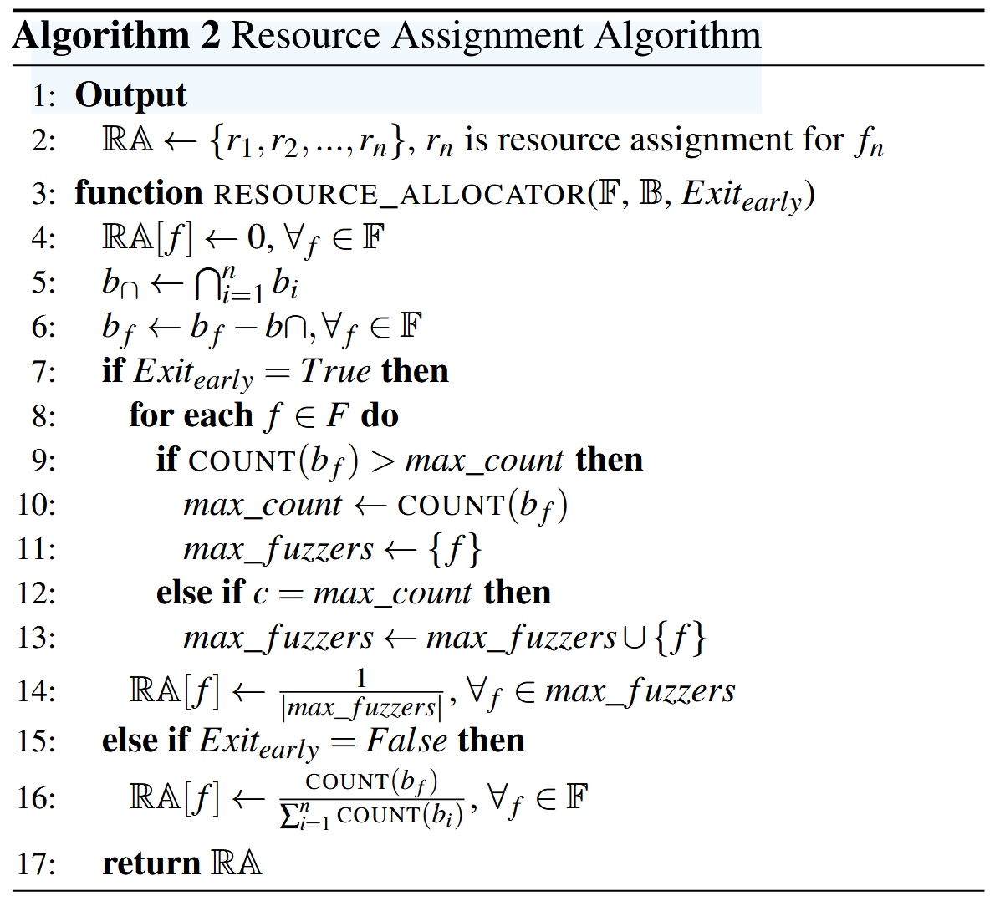
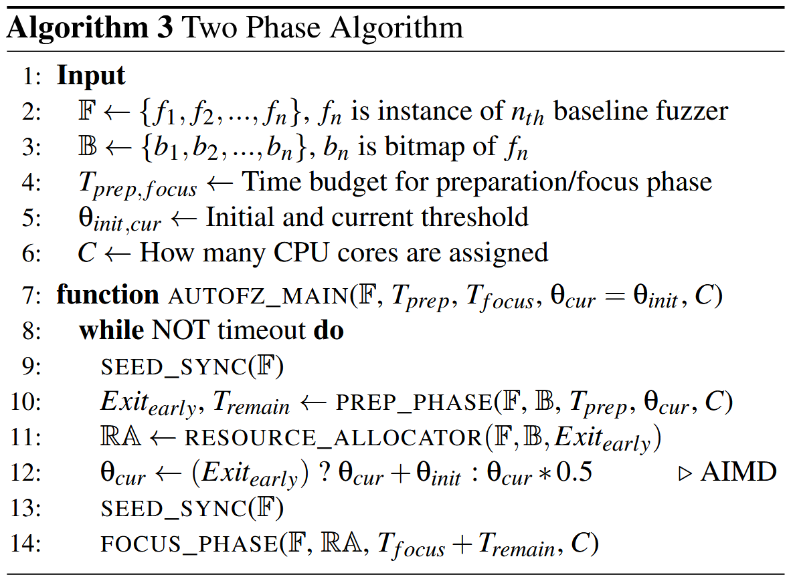

# autofz: Automated Fuzzer Composition at Runtime [USENIX 2023]

虽然现在大量的 fuzzing benchmarks 被提出并用于评估 fuzzers 的各方面性能, 但是平均性能最好的 fuzzer 在用户目标上未必能达到的最好结果. 面对复杂真实软件, 选择 fuzzer 组件上存在 selection burden 问题. 为了解决 selection burden 问题, 论文提出动态选择 SOTA fuzzer 组件以最大化收益的非侵入式 meta fuzzer, 称为 autofz. 

autofz 运行时推断一组适合工作负载的 fuzzers, 在 11/12 个 benchmarks 中优于表现最好的模糊器, 在 19/20 个 benchmarks 中无先验知识的情况下优于最好的 collaborative fuzzers. 

Open Source: https://github.com/sslab-gatech/autofz

## Motivation

1. 没有通用最优 fuzzer: 更换 fuzzing 目标不同 fuzzers 之间的性能排名会变化.

2. 相同 fuzzer 效率也会变化: 随着时间推移, 不同 fuzzer 的效率排名会变化
3. 天真的资源分配导致效率低下: collaborative fuzzing 方法只关注组合各个组件获取最好结果, 未考虑资源分配, 需要考虑不同 fuzzer 组价的性能分配资源, 可以达到更好效率.
4. 随机性导致 fuzzing 结果不可复现性: 不同轮次的 fuzzing 结果存在差异, 单纯使用静态先验知识组合 fuzzer 组件, 未必会达到相同工作负载下的最好结果. 

## Overview

autofz 会在运行过程中根据趋势 (trend) 变化, 动态调整资源而不是固定使用一组 fuzzer 组件. 与使用 benchmarks 和离线分析预先选择合适的 fuzzers 不同, autofz 不需要大量的工程或事后分析, 因为它在运行时动态地采用趋势并自动配置最佳 fuzzer 集. 

### Contributions

+ 单位工作负载的动态 fuzzer 组成: 仔细考虑每个工作负载的动态趋势可以使 autofz 避免基于基准的决策偏向于特定的目标程序. 同时给一开始未被选中但是潜在适用的组件第二次机会.
+ 自动化和非侵入式方法: 对于最终用户来说，autofz 是一种按下按钮就能自动为任何给定目标选择最佳模糊器的解决方案. 对于模糊器开发人员来说, 每个模糊器都可以以最小的工程量集成到 autofz 中. 由此, autofz 称为 meta fuzzer.
+ 高效资源调度算法: 在选定的 fuzzer 之间合理分配资源, 可以使协作效果最大化.

## Design

autofz 由两个 phases 组成: 准备 (preparation) & 聚焦 (focus). 

测试准备阶段会在运行时周期性地监控各个模糊测试器的进度, 这称为趋势, 并将其作为选择下一组模糊测试器的反馈. 为了公平地比较基准 fuzzer 的趋势, autofz 在每一轮测试准备阶段 (1) 都会同步所有模糊器的种子. 此外, 它为所有基线 fuzzer 分配相同数量的资源. 然后，每个 fuzzer 在很短的时间间隔内轮流运行, 直到遇到退出条件 (2,3). autofz 利用基准 fuzzer 的评价结果 AFL bitmap 来衡量所有 fuzzer 的趋势; 考虑到这一趋势, autofz 选择了一个基准 fuzzer 子集及其资源分配元数据, 以决定每个 fuzzer 相对于当前工作负载的优先级 (4).

根据资源分配数据, autofz时间片分配 CPU 核 (5). autofz 支持单核和多核模式. 单核模式允许 autofz 集成到模糊测试基准中. 多核模式可以根据资源分配元数据为每个 fuzzer 分配不同数量的 CPU 核. 

过渡到聚焦阶段 (6,7) 之前的种子同步允许不同的 fuzzer 共享在准备阶段产生的独特测试用例. 然后, 聚焦阶段根据资源分配元数据逐个运行选定的模糊器; 每个模糊测试器都分配了一个特定的 CPU 时间窗口来进行测试 (8). 在聚焦阶段, 目标是实现最大性能, 而不是公平比较. 因此, 在一个模糊测试器执行后, 对种子进行同步, 以允许其余的模糊测试器探索其他模糊测试器未发现的路径. 当整个分配的资源被消耗后, 它回到准备阶段并测量趋势 (9). 

准备和聚焦两个阶段之间的执行流程会一直持续，直到模糊测试结束 (如24小时). 算法 3 给出了两阶段算法的形式化定义.

autofz 集成的基准 fuzzer 各自用其内部指标 (如上下文敏感覆盖率, 块覆盖率等) 进行评估效果, 不修改 fuzzer 的代码实现等. 两个阶段中, 每个 fuzzer 可以根据其内部度量和算法生成不同的感兴趣输入. autofz 通过检索所有基线模糊器的 AFL bitmap 以公平比较趋势. autofz 使用每个模糊器感兴趣的不同输入调用 afl-instrumented 的二进制文件并计算各个 fuzzer 的 AFL bitmap. 比如 Angora fuzzer 生成一个新的输入在 "queue" 文件夹 (包括其他配置为 interesting 的文件夹) 下时, 每次进入准备阶段, autofz 会使用新生成的输入到 afl-instrumented 二进制文件计算 AFL bitmap 覆盖率.

