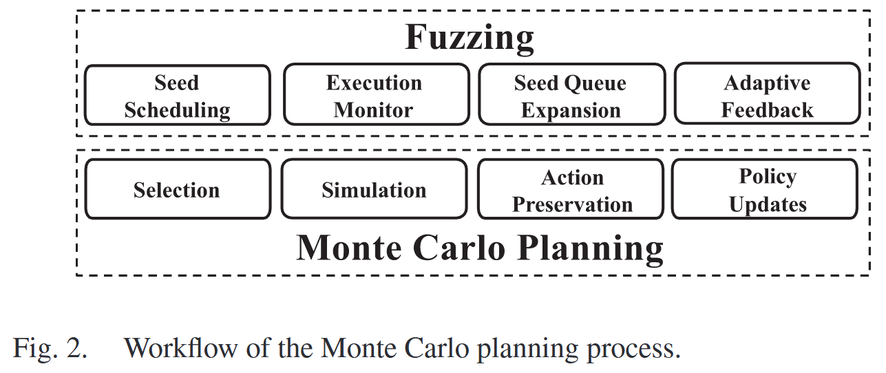
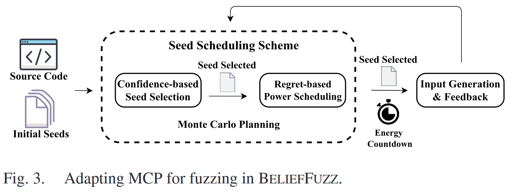

# Balance Seed Scheduling via Monte Carlo Planning [TDSC 2024]

现有改进种子调度的工作无法摆脱高成本陷阱或高效益陷阱: 一类方法认为高成本意味着高效益, 因此更喜欢探索不常访问路径的种子; 另一种方法直接计算潜在效益, 例如能够覆盖的块的数量, 并偏好效益高的种子. 由于这些方法忽略成本或收益的影响, 它们经常使模糊器在不增加覆盖率的情况下对种子进行变异. 

本文提出 BELIEFFUZZ 算法, 将模糊测试问题转化为一个具有置信上界的蒙特卡洛规划问题. 该系统动态地计算模糊测试过程中的收益和成本. 实验结果与目前最先进的方法相比, BELIEFFUZZ 在达到相同覆盖率的前提下, 加速比达到 2.12x - 5.63x, 执行次数减少 1.18x - 2.77x. 此外, 在评估的真实项目中发现 31 个新 bug, 分配 18 个 CVEs.

## Contributions

1. 提供一个新的概率模型来解释现有工作的弱点, 显示灰盒模糊测试在实现最优覆盖率方面的最大损失
2. 提出一种新的种子优先排序机制, 以更少的时间提高灰盒模糊测试的覆盖率
3. 提出一种有效的功率调度策略, 避免为覆盖率较低的种子节点分配过多的能量
4. https://github.com/belieffuzz/belieffuzz_artifacts

## Challenges

+ C1 同时量化成本和收益. 在成本导向型方法中使用的模型不能同时考虑这两个因素, 多臂老虎机模型无法处理目标 (种子) 数量可变的情形; 即使利益导向方法中使用的模型可以同时考虑这两个因素, 但适当的量化目标函数仍然需要人工专家来设计. 

  Alphuzz [42] 中使用的蒙特卡洛树搜索 (MCTS) 完全基于可观察的统计量, 即执行频率, 来衡量潜在的可能性. 我们还需要衡量潜在的收益, 即无法观察到的统计量, 以帮助模糊器跳出高成本陷阱.

+ C2 避免陷入无效的种子. 实际情况下, 模糊器无法获得所有路径的精确概率, 不同模型利用成本或收益来近似各路经概率并指导种子调度. 然而, 这些方法都未能意识到由于信息不完备导致的非理想选择.

## Methods

BELIEFFUZZ 采用成本-效益分析方法, 在 MCUCB 中定义“置信” (confidence) 的概念, 通过基于其成本的置信区间, 动态地衡量潜在效益判断该种子是否仍然值得探索. 此外, 为缓解不完美信息带来的失效, 提出一种基于后悔的能量调度方法, 提前停止对不能带来预期新覆盖率的种子进行变异. 

蒙特卡罗规划 (Monte Carlo planning, MCP) 将模糊测试建模为具有理论保证的演化决策过程. MCP 旨在无约束条件下为无法从巨大搜索空间中获取完整知识的领域找到最优选择. 具体来说, MCP 使用有状态搜索树来保存之前的搜索统计信息, 以优化之后的决策. 每个节点表示搜索过程中的一个中间操作. 然后, MCP 使用一种树策略来基于先前的结果进行增量搜索. 树策略由 4 个步骤组成:

+ Selection: 选择树上当前最优的节点进行进一步的探索
+ Simulation: 模拟搜索过程
+ Action Preservation: 使用所选节点的后继节点展开搜索树
+ Policy Update: 根据模拟反馈更新选择策略

如图2所示, 模糊测试的初始种子为检查目标程序的搜索空间提供了初始状态, 可以将其视为搜索树的根节点. 然后, 模糊器在每次迭代中选择最有希望的种子来探索目标程序. 类似地, 树策略首先选择当前树中期望带来最大收益的节点. 然后, 对选定的种子节点进行变异以获得新的覆盖范围, 可以看作是对当前节点的模拟; 通过监控程序的执行, 如果发现新的程序行为, 模糊器就会扩大其种子队列, 这也可以成为确定搜索树是否扩展的条件. 最后, fuzzing 和 MCP 根据执行反馈更新潜在收益, 以保持选择的有效性. 

三种关键技术应用于 Fuzzing, 具体细节详见论文

+ Seed Discovery as Tree Expansion
+ Quantify the Seed Potential With the Variant Upper Confidence Bound
+ Early Terminate the Mutation With Regret

## Evaluation

### Comparing to the State of the Art

### Ablation Study

## References

[42] Y. Zhao, X. Wang, L. Zhao, Y. Cheng, and H. Yin, “Alphuzz: Monte Carlo search on seed-mutation tree for coverage-guided fuzzing,” in Proc. 38th Annu. Comput. Secur. Appl. Conf., New York, NY, USA, 2022, pp. 534–547. [Online]. Available: https://doi.org/10.1145/3564625. 3564660
