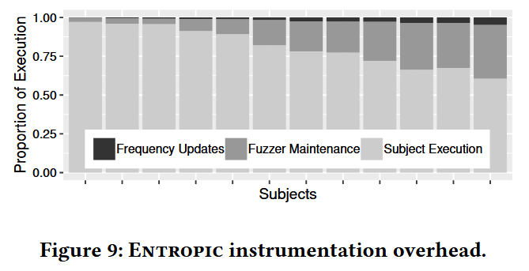

# Boosting Fuzzer Efficiency: An Information Theoretic Perspective [ESEC/FSE 2020]

模糊测试之前, 模糊器对程序 $$P$$ 的行为一无所知, 执行一个输入, 可以了解 $$P$$ 在该输入下的行为. 因此每次执行都可以揭示 $$P$$ 的信息, 信息的度量是香农熵 (Shannon’s entropy), 度量熵可以量化从每个生成的测试输入中了解到程序行为的多少. 用熵度量概率模型的模糊器发现程序新行为的效率, 高效的模糊器应该最大化信息. 

从信息论的角度出发, 作者开发 Entropic, 一种基于熵的灰盒模糊测试能量调度策略, 为那些最大化信息的种子分配更多的能量. 作者将 Entropic 实现到流行的灰盒模糊器 LibFuzzer 中, 对超过 250 个开源程序 (6000万行代码) 进行的实验表明, Entropic 显著提高效率, 并验证论文的假设: 高效的模糊测试器能够最大化信息. Entropic 已通过独立评估, 并被邀请集成到主线 LibFuzzer 中.

## Contributions

1. 为非确定性模糊测试开发信息论基础, 研究每个测试揭示程序行为的平均信息量
2. 将香农熵与模糊测试器的行为发现率正式关联, 即将效率建立为一个信息论量
3. 介绍几种在模糊测试背景下有用的信息估计方法
4. 提出第一个基于熵的能量调度方法, 以提高灰盒模糊测试器的效率
5. 提供开源实现, 称为 Entropic, (暂时没找到 libfuzzer 里对应的代码)
6. 对超过 250 个广泛使用的开源 C/C++ 程序进行大量的实证评估, 产生了超过 2 个 CPU 年的数据. 数据和 R 脚本开源: https://doi.org/10.6084/m9.figshare.12415622.v2

## Methods

信息论应用到灰盒模糊测试上, 需要解决三个问题:

+ 香农熵在每个输入恰好属于一个物种 (species) 的前提下定义的. 如果一个输入可能属于多个物种, 该如何定义熵? 

+ 除非事先知道每个物种的测试用例, 否则无法确定程序 $$P$$ 的所有物种及它们相对于模糊器 $$F$$ 的概率. 如何能够快速地计算一个近似熵?

+ 为灰盒模糊测试设计信息论增强 (information-theoretic boosting) 方法. 对于灰盒模糊器来说, 物种的概率 $$\{p_i\}^S_{i=1}$$ 在整个模糊测试过程中是可能变化的, 这违反物种概率不变假设. 那是否有一种实际可行的方法, 能够让灰盒模糊器满足物种概率不变假设?

### MEASURE OF FUZZER EFFICIENCY

设有 $$S$$ 个物种, 信息熵的计算公式为:

$$
H=-\sum_{i=1}^S p_i \log \left(p_i\right)
$$

香农熵是为多项分布定义的, 其中每个输入只属于一个物种. 程序执行一条路径为一个物种, 考虑 $$P$$ 中的一个分支为一个物种, 每个输入执行多个分支. 此时, $$\Sigma_{i=1}^{S}p_i \geq 1$$, 需要规范化 $$p_i' = p_i / \Sigma_{j=1}^{S} p_j$$. 则多物种的信息熵公式为:

$$
H=-\sum_{i=1}^S p_i^{\prime} \log \left(p_i^{\prime}\right)=\log \left(\sum_{j=1}^S p_j\right)-\frac{\sum_{i=1}^S p_i \log \left(p_i\right)}{\sum_{j=1}^S p_j} \ \ \ \  (12)
$$

对特定的种子 $$t \in C$$, 模糊测试它生成的输入属于物种 $$D_i$$ 的概率 $$\{p_i^t\}^S_{i=1}$$, 称为该种子 $$t$$ 的局部物种分布 (local species distribution). 此外, 将集合 $$\{D_i | p_i^t > 0 \cap 1 \leq i \leq S\}$$ 称为种子 $$t$$ 的邻域 (neighborhood). 根据种子 $$t$$ 的局部物种分布, 可计算局部信息熵 (local entropy) $$H_t$$:

$$
H^t=\log \left(\sum_{j=1}^S p_j^t\right)-\frac{\sum_{i=1}^S p_i^t \log \left(p_i^t\right)}{\sum_{j=1}^S p_j^t}
$$

了解程序行为的速度, 即程序中的物种, 可以量化黑盒模糊器的效率. **定理1** 在无限长的模糊测试后, 第 n+1 个种子对程序物种的发现效率可以由公式计算:

$$
H=\log (c)+\sum_{n=1}^{\infty} \frac{\Delta(n)}{c n}
$$

其中, $$c=\Sigma_{i=1}^S p_i$$ 为规范化后的常量 (证明过程见论文附录).

通过观测每个已发现物种的出现频率 (incidence frequency), 来估计香农熵 $$H$$. 设物种 $$D_i$$ 的出现频率为 $$Y_i$$, 即该物种为测试输入数量, 未被发现的物种, $$Y_i = 0$$. 无偏局部概率计算公式为 $$\hat{p}_i = Y_i / n$$, 带入熵计算公式 (12) 得到:

$$
\hat{H}_{\text {MLE }}=\log \left(\sum_{j=1}^S Y_j\right)-\frac{\sum_{i=1}^S Y_i \log \left(Y_i\right)}{\sum_{j=1}^S Y_j}
$$

这个公式即可度量模糊器当前对程序行为多样性的探索程度.

对于黑盒模糊测试, 假设在整个模糊测试过程中, 全局物种分布 (global species distribution) $$\Sigma_{i=1}^S p_i$$ 保持不变. 然而, 这一假设**不适用于灰盒模糊测试**, 因为灰盒模糊器会利用程序反馈. 在模糊过程中, 凡是生成能够发现新物种 (即提高覆盖率) 的输入, 都会被加入到种子库中. 这些新加入的种子会改变整体的种子分布, 从而**改变全局物种分布** (但不会影响每个已有种子的局部分布). 

与模糊器的**全局熵**不同，某个种子的**局部熵**不受自适应偏差 (adaptive bias) 的影响. 设给定种子输入 $$t$$, 灰盒模糊器可用的变异操作符集合为 $$M$$, 种子 $$t$$ 中可以应用变异操作的位置集合为 $$L_t$$. 不失一般性地, 模糊器仅在将操作符 $$m \in M$$ 应用到种子位置 $$l \in L_t$$ 时, 才会生成新的输入 $$t'$$. 种子 $$t$$ 产生的输入空间由 $$(m, l)$$ 决定, 且在种子加入种子库后就已经决定, 不会同全局熵一样发生动态调整. 因此, 种子 $$t$$ 的局部物种分布和局部熵是**稳定**的, 不受新添加的种子的影响, 不存在自适应偏差. 

### INFORMATION-THEORETIC BOOSTING

种子被选择进行模糊测试的概率称为该种子的能量 (energy). 将能量分配给种子的过程称为模糊器的功率调度 (power schedule), 本文方法修改的即这个功率调度部分. 算法 1 展示了 LibFuzzer 实现灰盒模糊测试的逻辑. Entropic 所做的更改以绿色框标出. 

在一个持续的循环中, 模糊器从一个由种子能量归一化给定的分布中, 采样一个种子 $$t \in C$$. 这个能量是通过 `assignEnergy` 计算的, 它实现本文的信息论功率调度方法. 然后, 种子 $$t$$ 会被随机位翻转和其他变异操作符变异, 以生成一个新输入 $$t'$$. 如果执行导致程序崩溃或违反了模糊器的安全策略 (如限制执行时间、内存使用等), 则 $$t'$$ 会作为崩溃输入返回, 并且 LibFuzzer 停止. 如果执行增加了覆盖率, 则 $$t'$$ 会被添加到种子库中.

作者将通过模糊种子 $$t \in C$$ 生成的并属于物种 $$D_i$$ 的输入数量称为**局部出现频率** (local incidence frequency) 记为 $$Y_{i,t}$$. 

## Evaluation

### RQ.1 What is the empirical coverage improvement over the baseline?

### RQ.2 How much faster are bugs detected compared to the baseline?

### RQ.3 How does the choice of abundance threshold θ influence the performance of our technique?

### RQ.4 What is the cost of maintaining incidence frequencies?

