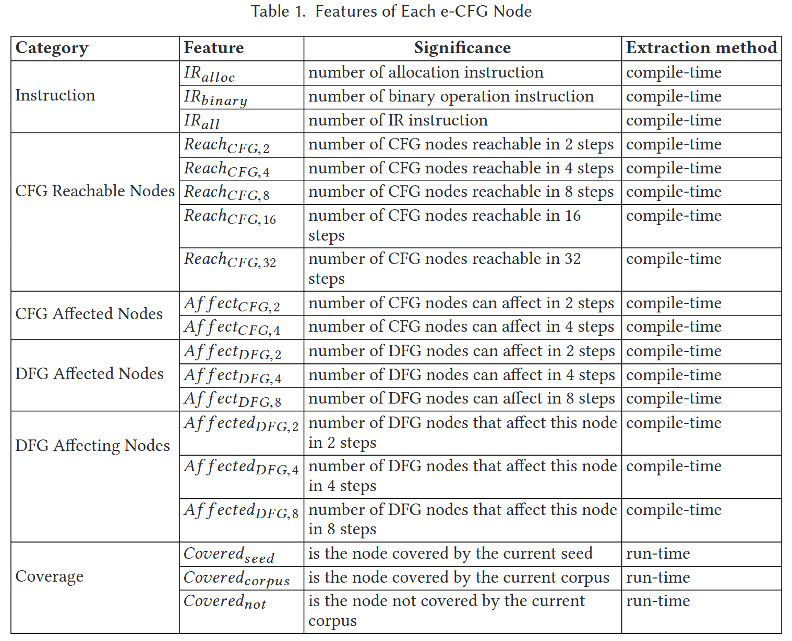
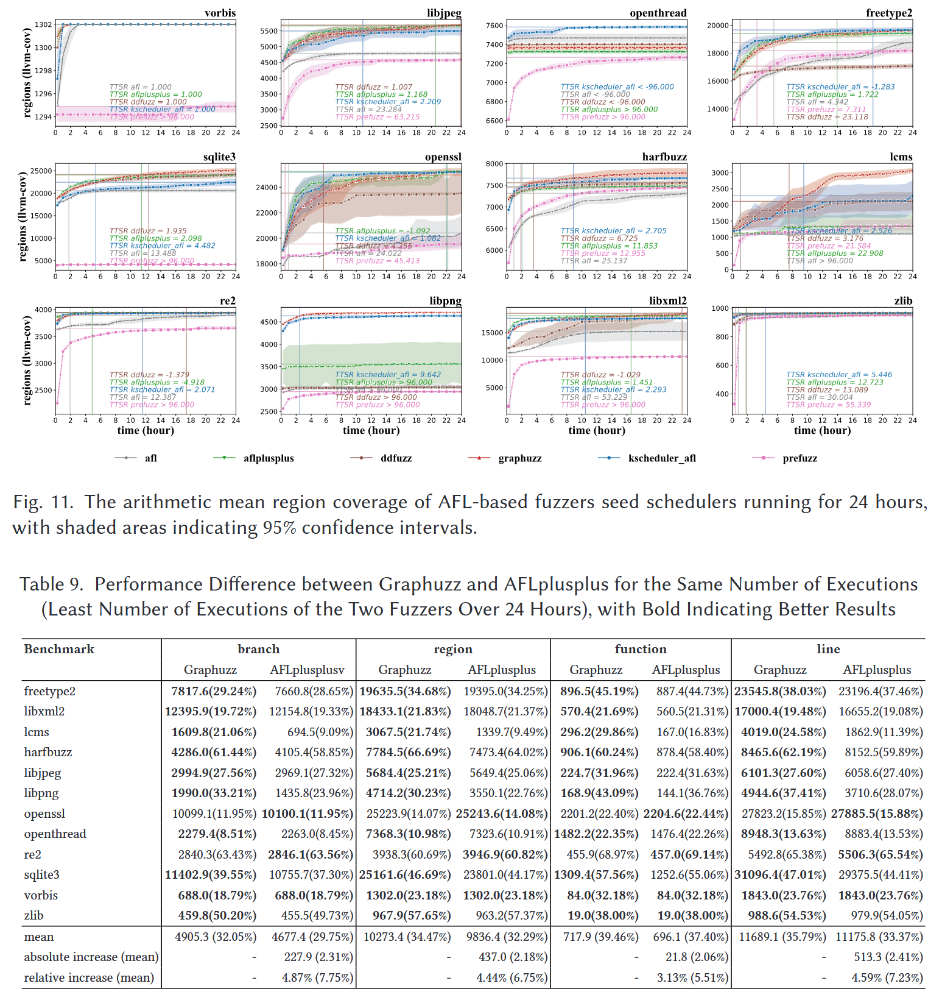

# Graphuzz: Data-driven Seed Scheduling for Coverage-guided Greybox Fuzzing [TOSEM 2024]

现有的种子调度策略依赖人工设计的模型来估计种子的潜力并确定其权重, 无法捕捉到种子及其执行的丰富信息, 从而导致对种子潜力的估计不是最优的. 本文提出了一种新的种子调度解决方案Graphuzz, 利用深度学习模型来估计种子的潜力, 并以数据驱动的方式工作. Graphuzz 设计一种扩展的控制流图 e-CFG 来表示种子执行的控制流和数据流特征, 适用于图神经网络 (graph neural networks, GNN) 处理和估计种子的潜力. 评估每个种子的代码覆盖率增量, 并将其作为标签来训练 GNN 模型. 此外, 提出一种自注意力机制来增强 GNN 模型, 使其能够捕捉被忽视的特征. 

使用 FuzzBench 中的12个基准测试程序进行测试, 结果表明 Graphuzz 在代码覆盖率方面优于 AFLplusplus 和当前最先进的种子调度方案 K-Scheduler 等覆盖率引导的模糊器. 使用 Magma 中的 8 个基准测试程序进行测试, 结果表明 Graphuzz 在缺陷检测方面优于 AFLplusplus 和 SOTA 等基准模糊器.

## Introduction

现有的种子调度策略根据是否采用程序知识特征来表征种子的潜力可分为两类. 

第一种策略不考虑程序的内部知识, 而是使用一些临时的指标, 如种子大小、测试用例执行速度 (AFL 中使用) 和资源利用率 (SlowFuzz [29] 中使用) 等. 这些度量指标不能刻画种子对被测程序 (PUT) 的影响, 因此不能很好地估计种子在覆盖增长方面的一般潜力, 尽管它们可以显示种子在某些特定上下文中的潜力, 例如触发最坏情况下的执行行为. 

第二种类型的种子调度策略使用与程序内部知识相关的指标来估计种子的潜力. PerfFuzz [24] 使用种子执行路径的总长度, CollAFL [13] 使用每个种子执行路径的相邻未覆盖边的数量, VUZZER [31] 使用执行路径深度, Entropic [4] 使用种子执行过程的信息熵, 以及最先进的种子调度方案 K-Scheduler [35] 使用控制流图中心性等. 这些指标基于执行过程中在控制流层面收集的反馈, 可以更细粒度地评估种子在提高代码覆盖率方面的潜力, 这对模糊测试有很大帮助. 然而, 它们没有在数据流层面考虑反馈, 无法跟踪数据传输和程序依赖特征, 无法表征种子程序的全部潜能. 本文尝试使用 PUT 的控制流和数据流特征来评估 seeds 的潜力. 

## Contributions

1. 提出第一个使用GNN模型指导种子调度的解决方案Graphuzz, 以数据驱动的方式应用于覆盖引导的模糊测试, 比人工设计的方法能更好地估计种子的潜力
2. 提出同时利用控制流和数据流特征来表征种子的潜力, 并提出 e-CFG 形式来表示特征
3. 提出一种有效的方法来生成大量的训练数据, 并增加模型对被忽视特征的关注
4. 在24小时模糊测试中, Graphuzz 的分支覆盖率比基准算法 AFLplusplus 提高 4.54%, 比 K-Scheduler 提高 3.57%, 比 DDFuzz 提高 6.09%
5. 在24小时模糊测试中, Graphuzz 比 SOTA 解决方案能够接触和触发更多的错误
6. https://github.com/vul337/Graphuzz.git

## Methods

Graphuzz 分为训练和预测阶段. 训练阶段涉及 DNN 模型训练, 使用标记值和预测值来计算损失并优化模型参数. 预测阶段利用训练的模型和边自注意力机制进行种子调度指导. 

两个阶段所需的 e-CFG 图, 通过提取程序的 CFG、DFG 和 PDG 来构建. 具体来说, 在模糊测试的插桩阶段, 使用编译器在中间表示 (intermediate representation, IR) 级别提取上述图. 然后提取 CFG、DFG 和 PDG 中节点的特征, 并将这 3 种异构图聚合成 e-CFG; 同时, 将种子输入到由源代码编译而成的插桩二进制文件中, 以校准每个种子及其语料库的覆盖信息. 通过分析种子及其语料库的覆盖反馈信息, 对e-CFG进行掩盖 (mask), 保留与该种子及其语料库密切相关的子图. 

### E-CFG Construction

e-CFG 是模糊测试目标的过程间控制流图 (ICFG) 的子图, 通过分析过程间 CFG、DFG、PDG 得到 e-CFG 的节点特征. 在这里使用的 CFGs 是从编译器提供的显式跳转和调用信息派生的, 并且不分析间接跳转和调用. 对于CFG中的每个节点, 提取 6 类共 19 维的特征. 表 1 列出了包含指令、CFG 可达节点、被 CFG 影响节点、被 DFG 影响节点、DFG 影响节点和覆盖率的节点特征类别. 在编译时通过分析 CFG、DFG 和 PDG 得到每个节点的量化特征. 然后, 对语料库中的每个种子, 通过分析其覆盖率反馈, 在运行时使用 one-hot 编码表示其覆盖率特征. 

通过在 DFG 节点上添加 CFG 节点的写访问边, 以及在全局数据流节点和全局控制流节点之间添加 DFG 节点对 CFG 节点入口条件的影响边, 构建全局 PDG. 通过对全局 PDG 的分析, 我们为 e-CFG 增加了 3 类特征, 分别表示 (1) 通过 PDG 影响当前节点输入条件的 CFG 节点数量, (2) 当前节点通过 PDG 影响 DFG 节点数量, (3) 通过 PDG 影响当前节点输入条件的 DFG 节点数量. 

最后, 通过分析种子和语料库的覆盖反馈信息, 添加最后一类特征. 将这三个维度的特征表示为 one-hot 编码, 以表示 e-CFG 中的节点是被种子覆盖、被语料库覆盖还是未覆盖. 提出的 e-CFG 是用来描述种子性能的基本形式, 也是神经网络的输入.

### Dataset Construction

数据集构建有两个具体的问题需要解决: (1) 使用什么来标记数据集; (2) 如何在可行的时间内生成足够的训练集. 

问题 (1) 一个种子的族群进化也会受到突变阶段种子选择顺序的影响, 即它是一个时变系统. 这将导致语料库中特定种子的标签值受到其他种子的干扰, 这意味着使用这种方法暴力标注标签值是不太可行的.

这里假设, 一颗种子的潜力表示为随着时间的推移, 该种子产生的后代所组成的族群的覆盖率相对于该种子当前时间 $$t_0$$ 的语料库的增量, 表示为

$$
\begin{aligned}
P_i & =\text { Improve }_{\text {corpus}, i}^{t_0, \delta_t} \\
& =\frac{\mid \text { Coverage }\left(\text {Ethnic }_i^{t_0 + \delta_t}\right) \cup \text { Coverage }\left(\text {corpus}^{t_0}\right) \mid}{\mid \text { Coverage }\left(\text {corpus }^{t 0}\right) \mid}
\end{aligned}
$$

每个种子单独作为初始语料库开始 fuzzing $$\delta_t$$ 时间后的程序覆盖率为 $$\text { Coverage }\left(\text {Ethnic }_i^{\delta_t}\right)$$, 随机选择一组种子组成初始语料库开始 fuzzing 获得 corpus 的全局覆盖率 $$\text { Coverage }\left(\text {corpus}\right)$$. 使用简化后的公式 $$P_i$$ 计算每个 $$seed_i$$ 的覆盖率增量作为标签构建数据集.

### Edge Self-Attention Mechanism

如果种子集中在某些注意力权重较高的特定节点上, 这些节点的角色 (role) 可能会被忽略. 应该基于语料库中所有种子对节点的关注度, 从全局的角度进一步优化种子调度. 在 SAGPool 中, 池化操作是基于自注意力机制实现的. 具体来说, SAGPool 在每个卷积池化层中基于可训练矩阵进行图卷积以对节点进行评分. 在多个卷积池化层之后留下的节点是 SAGPool 神经网络认为能更好地反映性能图和种子潜力之间关系的节点. 

在得到每个种子在神经网络中被自注意力机制注意到的节点后, 使用平均法得到全局注意力分布表. 计算了对特定种子的注意力分配和欧氏空间中注意力的全局分配之间的距离, 并对所有种子的距离进行归一化.

$$
\text { Distance }_{\text {seed }}^i=\frac{\text { Distance }_{\text {seed }}^i-\min _{j \in\left[1, N_{\text {seed }}\right]}\left(\text { Distance }_{\text {seed }}^j\right)}{\max _{j \in\left[1, N_{\text {seed }}\right]}\left(\text { Distance }_{\text {seed }}^j\right)-\min _{j \in\left[1, N_{\text {seed }}\right]}\left(\text { Distance }_{\text {seed }}^j\right)},
$$

$$
\text { Weight }_{\text {seed }}^i=P_i \cdot \text { Distance }_{\text {seed }}^i
$$

## Evaluation

## Reference

[4] Marcel Böhme, Valentin J. M. Manès, and Sang Kil Cha. 2020. Boosting fuzzer efficiency: An information theoretic perspective. In Proceedings of the 28th ACM Joint Meeting on European Software Engineering Conference and Symposium on the Foundations of Software Engineering. 678–689.

[13] Shuitao Gan, Chao Zhang, Xiaojun Qin, Xuwen Tu, Kang Li, Zhongyu Pei, and Zuoning Chen. 2018. Collafl: Path sensitive fuzzing. In 2018 IEEE Symposium on Security and Privacy (SP). IEEE, 679–696.

[24] Caroline Lemieux, Rohan Padhye, Koushik Sen, and Dawn Song. 2018. Perffuzz: Automatically generating pathological inputs. In Proceedings of the 27th ACM SIGSOFT International Symposium on Software Testing and Analysis. 254–265.

[29] Theofilos Petsios, Jason Zhao, Angelos D. Keromytis, and Suman Jana. 2017. Slowfuzz: Automated domainindependent detection of algorithmic complexity vulnerabilities. In Proceedings of the 2017 ACM SIGSAC Conference on Computer and Communications Security. 2155–2168.

[31] Sanjay Rawat, Vivek Jain, Ashish Kumar, Lucian Cojocar, Cristiano Giuffrida, and Herbert Bos. 2017. VUzzer: Application-aware evolutionary fuzzing. In NDSS, Vol. 17. 1–14.

[35] Dongdong She, Abhishek Shah, and Suman Jana. 2022. Effective seed scheduling for fuzzing with graph centrality analysis. In 2022 IEEE Symposium on Security and Privacy (SP). IEEE, 2194–2211.

