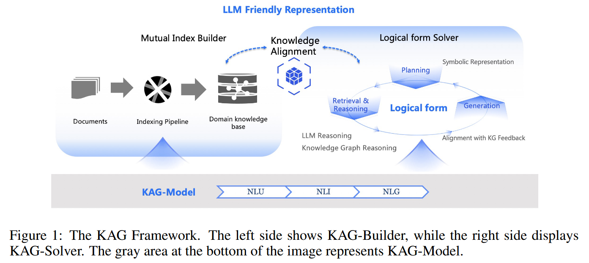
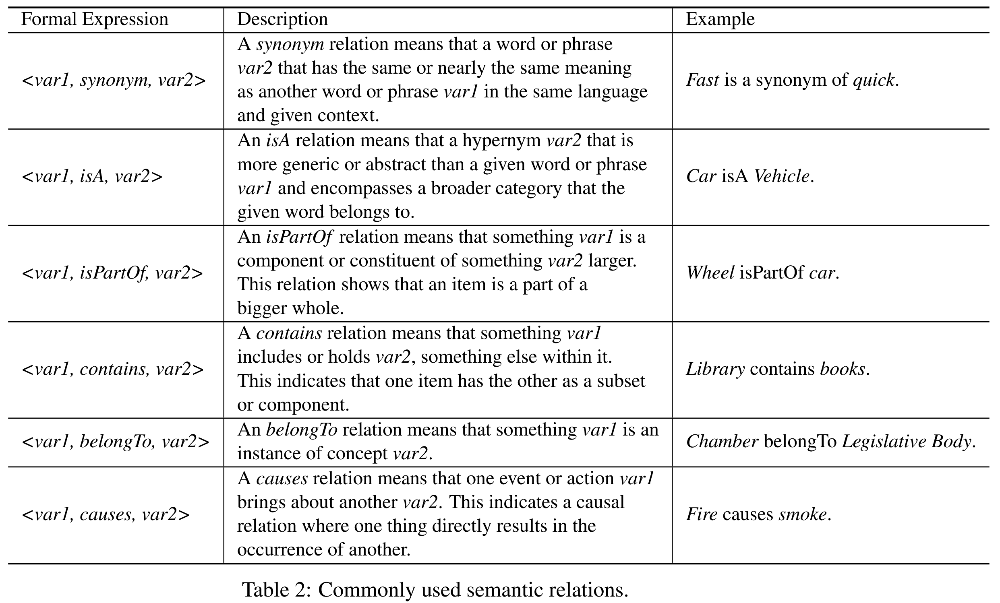
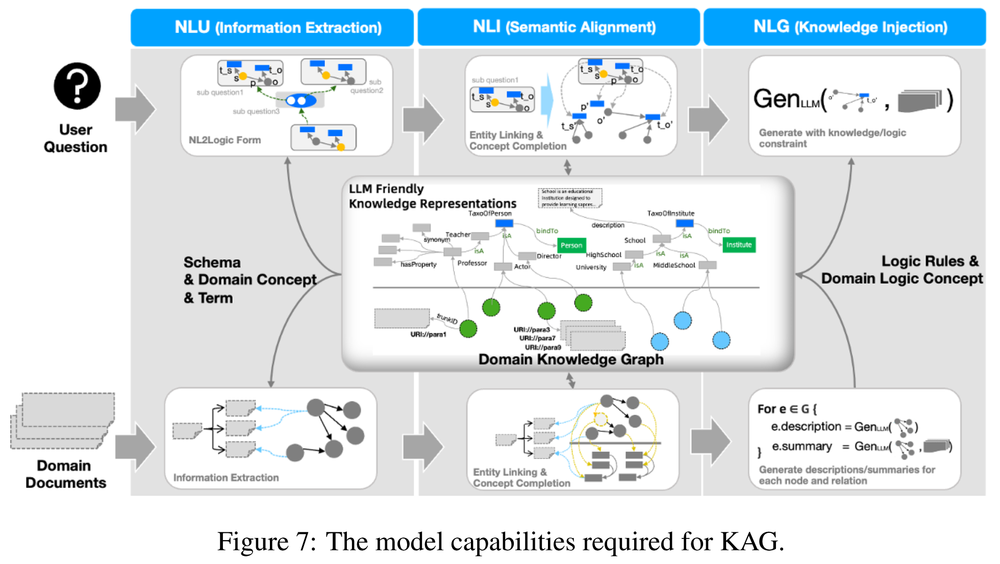
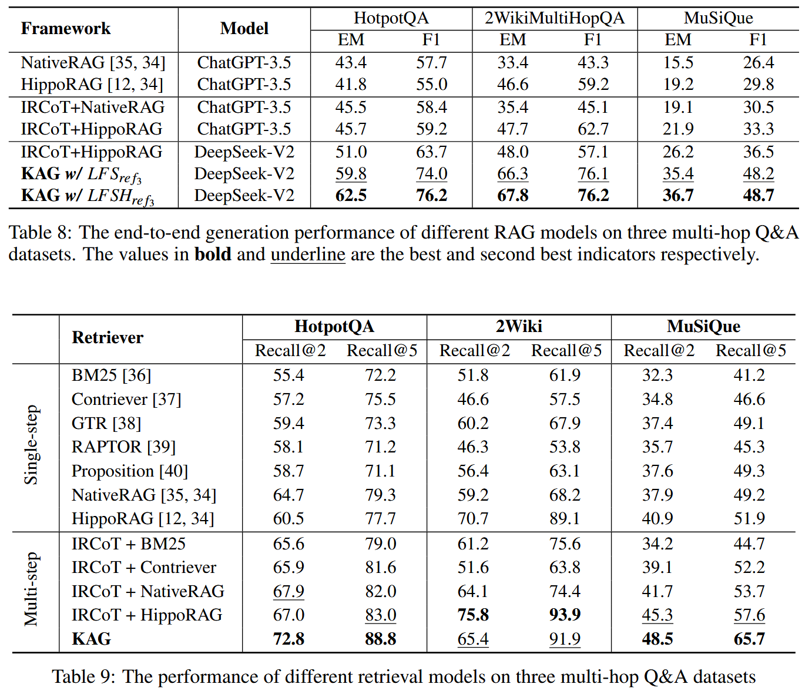

# KAG: Boosting LLMs in Professional Domains via Knowledge Augmented Generation 

检索增强生成 (retrieval-augmented generation, RAG) 存在局限性, 向量相似度与知识推理的相关性之间存在差距, 以及对数值、时间关系、专家规则等知识逻辑不敏感, 阻碍专业知识服务的有效性. 本文提出一种专业领域知识服务框架 —— 知识增强生成 (knowledge Augmented Generation, KAG). KAG 充分利用知识图谱和向量检索的优势, 通过对大型语言模型 (LLM) 和知识图谱的 5 个关键方面进行双向增强, 提高生成和推理效果. (1) LLM 友好的知识表示, (2) 知识图谱与原始块之间的互索引, (3) 逻辑形式引导的混合推理引擎, (4) 语义推理的知识对齐, (5) KAG 的模型能力增强. 

## Contributions

1. 提出一个 LLM 友好的知识表示框架 LLMFriSPG. 借鉴DIKW的数据、信息和知识的层次结构, 使 LLMFriSPG 能够兼容同一知识类型 (如实体类型、事件类型) 上的无模式信息抽取和模式约束的专家知识构建, 并支持图结构与原始文本块之间的互索引表示. 
2. 提出一种逻辑形式引导的混合求解推理引擎. 它包括三种类型的算子: 规划、推理和检索, 将自然语言问题转化为结合语言和符号的问题解决过程. 该过程中的每个步骤都可以利用不同的操作符, 如精确匹配检索、文本检索、数值计算或语义推理, 从而实现四个不同的问题解决过程的集成: 检索、知识图谱推理、语言推理和数值计算. 
3. 提出一种基于语义推理的知识对齐方法. 定义领域知识为各种语义关系, 如同义词、上下位词和包含. 在离线知识图谱索引和在线检索两个阶段都进行语义推理, 允许通过自动化生成的碎片化知识通过领域知识进行对齐和连接. 
4. 提出一种 KAG 模型. 为了支持 KAG 框架运行所需的能力, 如索引构建、检索、问题理解、语义推理和摘要, 增强通用 LLMs 的 3 种特定能力: 自然语言理解 (NLU)、自然语言推理 (NLI) 和自然语言生成 (NLG), 以在每个功能模块中取得更好的性能.

## Methods

**知识图谱** 利用显式语义组织信息, 基础知识单元是SPO三元组, 包含实体及其关系. 

实体具有明确的实体类型和关系. 通过实体归一化将语义相同但表达不同的实体统一起来, 从而减少冗余, 增强知识的互联性. 

在检索过程中, 使用查询语法 (如 SPARQL 和SQL) 可以显式指定实体类型, 减少来自相同名称或相似实体的噪声, 并允许根据查询需求指定关系进行推理知识检索, 而不是盲目地扩展到相似但关键的邻近内容. 同时, 由于知识图谱的查询结果具有明确的语义, 因此可以作为具有特定含义的变量使用. 这使得可以进一步利用 LLM 的规划和函数调用功能, 其中检索结果作为变量替换到函数参数中, 以完成确定性推理, 如数值计算和集合操作.

KAG 充分利用 KG 和 RAG 技术的互补特性, 不仅仅是将图结构融入到知识库过程中, 而是将知识图谱的语义类型和关系以及 KGQA (Knowledge Graph Question Answering) 中常用的逻辑形式融入到检索和生成过程中. 

KAG 框架由三个部分组成

+ KAG- builder: 为离线建立索引而设计, 应用 LLM 友好的知识表示框架以及知识结构与文本块的相互索引. 采用基于语义推理的知识对齐
+ KAG- solver: 逻辑形式引导的混合推理求解器, 集成 LLM 推理、知识推理和数学逻辑推理. 采用基于语义推理的知识对齐
+ KAG- model: 在通用语言模型的基础上, 对每个模块所需的功能进行优化, 提高所有模块的性能

### LLM Friendly Knowledge Representation

LLMFriSPG 包括三个方面: 深层文本 - 上下文感知, 动态属性和知识分层.
$$
\mathscr{M}=\{\mathscr{T}, \rho, \mathscr{C}, \mathscr{L}\}
$$
$$\mathscr{M}$$ 表示 LLMFriSPG 中定义的所有类型, $$\mathscr{T}$$ 表示所有的实体类型、事件类型类以及与 LPG 语法声明兼容的所有预定义属性. $$\mathscr{C}$$ 表示所有的概念类型类、概念和概念关系, 每个概念树的根节点是一个与 LPG 语法兼容的概念类型类, 每个概念节点都有一个唯一的 ConceptType 类. $$\rho$$ 表示从实例到概念的归纳关系. $$\mathscr{L}$$ 表示所有在逻辑关系和逻辑概念上定义的可执行规则. (详细解释见论文 p4-p5).

### Mutual Indexing

KAG-Builder 由三个连贯的过程组成: 结构化信息获取、知识语义对齐和图存储写入. 该模块的主要目标包括: 1) 在图结构和文本块之间建立相互索引, 为图结构添加更多的描述性上下文; 2) 使用概念语义图对齐不同的知识粒度, 以减少噪声并增加图的连通性.

### Logical Form Solver

在解决复杂问题的过程中, 涉及三个关键步骤: 规划、推理和检索. 拆解问题是确定下一个要解决的问题的规划过程. 推理包括根据分解后的问题检索信息, 根据检索结果推断问题的答案, 或者当检索到的内容不能回答问题时重新分解子问题. 检索是指为原问题或分解后的子问题找到可作为参考的内容. 

受 KGQA 中常用的逻辑形式的启发, 设计一种具有推理和检索功能的可执行语言. 这种语言将一个问题分解为多个逻辑表达式, 每个表达式可能包含用于检索或逻辑操作的函数. KAG 求解过程首先将当前问题 $$query_{cur}$$ 分解为逻辑形式表示的子问题 $$lf_{list}$$ 列表, 并进行混合推理求解. 如果能够通过对结构化知识的多跳推理得到精确答案, 则直接返回答案. 否则, 反映到解决结果: 将 $$l$$ 列表对应的答案和检索结果存储在全局内存中, 判断问题是否解决. 如果没有, 则生成补充问题并进入下一次迭代. (具体细节见论文 p9-p10).

### Knowledge Alignment

KAG 提出一种利用概念图通过语义推理来增强离线索引和在线检索的解决方案. 这涉及到知识实例标准化、实例到概念链接、语义关系补全和领域知识注入等任务. 在抽取阶段为每个实例、概念或关系添加描述性文本信息, 以增强其可解释性和上下文相关性. 同时, KAG 支持领域概念和术语知识的注入, 以减少垂直领域知识粒度不匹配带来的噪声问题. 概念推理的目标是充分利用向量检索和概念推理来完成基于上述知识结构的概念关系, 以增强领域知识图谱的准确性和连通性. 如表 2 所示, 总结 6 种常用的语义关系.

在检索阶段, 基于逻辑形式的短语和类型, 利用语义关系推理搜索知识图谱索引. 对于逻辑形式的类型、指称项或关系, 采用语义关系推理与相似性检索相结合的方法代替传统的相似性检索方法. 这种检索方式使检索路径专业化、逻辑化，从而获得正确答案. 首先, 混合推理进行精确类型匹配和实体链接; 如果类型匹配失败, 则执行语义推理. 

### KAG-Model

KAG 包括两个主要的计算过程: 离线建立索引和在线生成查询和答案. 在小型语言模型时代, 这两个任务通常由两个独立的管道处理, 每个管道包含多个特定任务的NLP模型. 这导致了应用系统的高度复杂性, 增加了设置成本, 并且由于错误在模块之间传播而导致不可避免的级联损失. 相比之下, 大型语言模型作为一种能力综合体, 可以潜在地将这些管道集成为统一的、同时的端到端推理过程. 

如图 7 所示, 索引和 QA 的过程都包含类似的步骤. 这两个管道都可以抽象为分类、提及检测、提及关系检测、语义对齐、嵌入和块、实例或查询聚焦摘要. 其中, 分类、提及检测和关系检测可归为 NLU, 而语义对齐和嵌入可归为 NLI. 最后, 将块摘要、实例摘要和聚焦查询摘要进行 NLG 分类. RAG 系统依赖的三种基本的自然语言处理能力是 NLU, NLI 和 NLG.

### Natural Language Understanding

NLU是自然语言处理中最常见的基础任务之一, 包括文本分类、命名实体识别、关系抽取、主客体抽取、触发词检测、事件论元抽取、事件抽取和机器阅读理解等. 实验发现, 简单地将原始数据集转换为指令数据集可以在训练任务上取得与专门模型相当的结果, 但这种方法并没有提高模型在未见过的领域上的 NLU 能力. 因此, 作者进行大规模的指令重建, 设计多种指令合成策略, 创建一个包含 20,000 多条不同指令的 NLU 指令数据集. 通过利用该数据集对给定的基础模型进行监督微调, 提高模型在下游任务中的 NLU 能力. 

指令重构策略主要包括以下三种类型

+ Label bucketing: 在指令合成过程中, 采用一种轮询策略, 从每个训练样本中只指定一个标签作为训练集的一部分, 提高每个训练集的标签多样性, 防止模型过度拟合某种标签而降低对每个标签的理解.
+ Flexible and Diverse Input and Output Formats: 高度一致的输入输出格式可能会导致模型过拟合特定任务, 导致对未见过的格式缺乏通用性. 因此, 作者处理输入和输出格式为 5 种格式化指令和 2 种自然语言指令.
+ Instructoin with Task Guildline: 在 LLM 中使用自我反思的过程来总结任务描述. 这将创建在指令中包含任务描述的训练数据. 此外, 为了增强任务多样性, 采用启发式策略对任务描述和答案进行重新措辞. 这使得模型能够更准确地理解任务描述之间的差异, 并根据指令完成任务.

### Natural Language Inference

NLI 任务用于推断给定短语之间的语义关系. 典型的 NLI 任务包括实体链接、实体消歧、分类法扩展、上位词发现和文本蕴涵. 由于自然语言表达的多样性和歧义性, 以及短语之间语义联系的微妙和不同类型, 需要通过 NLI 任务进一步对齐或检索相关信息. 知识库应用中的关键语义关系分为六类. 其中, $$isA$$ 关系、$$isPartOf$$ 关系和 $$contains$$ 关系具有方向偏序关系和基于距离的偏序关系, 准确确定这些语义关系对推理出目标答案至关重要. 

作者收集一个高质量的概念知识库和不同领域的本体, 创建一个包含 8000 个概念及其语义关系的概念知识集. 基于该知识集, 构建包含6种不同类型概念推理指令的训练数据集, 以增强给定基模型的语义推理能力, 从而为KAG提供语义推理支持.

### Natural Language Generation

未经领域自适应训练的模型往往在领域逻辑和写作风格上与目标文本存在显著差异. 此外, 在特定领域获取足够数量的标注数据是一个挑战. 对此, 作者提出两种特定领域微调技术, 让模型的生成与特定场景对齐.

+ Pre-learning with K-LoRA (K-Lora): 假设利用知识生成答案是从文本中提取知识的反向过程, 通过反转提取过程, 可以创建一个 “三元组到文本” 的生成任务. 通过对大量实例进行广泛的微调, 该模型可以被训练以识别 KG 注入的信息格式.
+ Alignment with KG Feedback (AKGF): 知识图谱可以作为一个自动评估器, 就当前响应的知识正确性提供反馈, 解决模型的幻觉问题. 具体而言, 采用不同的输入格式或随机种子为每个查询生成不同的响应; 随后, 结合 KG 来对这些回答进行评分和排序. 评分过程将生成的答案与KG中的知识进行比较, 以确定其正确性. 

## Evaluation

