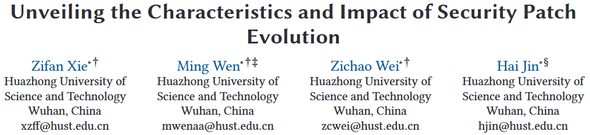
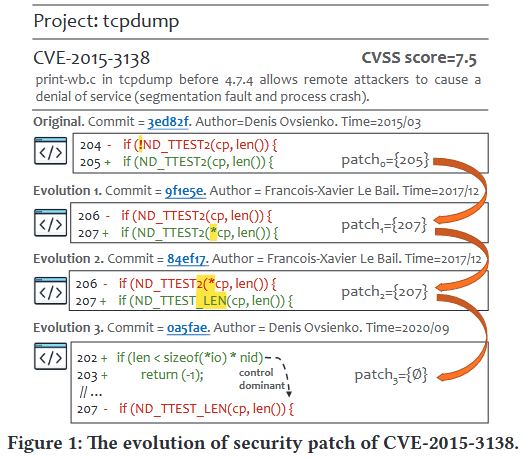
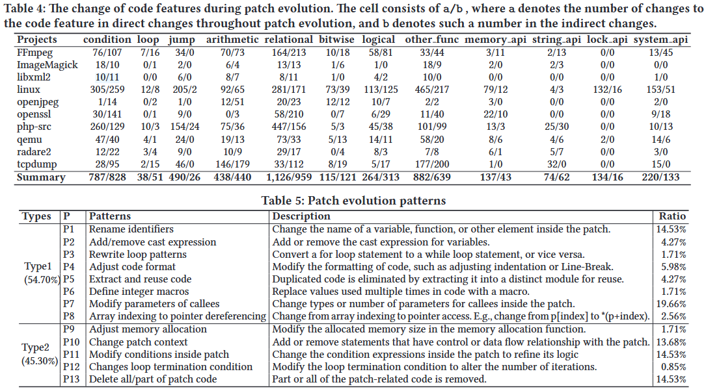

# Unveiling the Characteristics and Impact of Security Patch Evolution [ASE 2024]

由于开源软件广泛的复用和定制现象, 同一项目往往存在多个版本或分支在生态系统中共存. 因此, 确保某个已曝光漏洞被彻底修复, 往往是具有挑战性和复杂性的任务. 近年来涌现出大量面向“1-day 漏洞”的分析工具, 例如函数级漏洞检测与补丁存在性测试工具. 尽管代码演化在开源项目中非常普遍, 现有分析工具却常常忽略一个关键事实: 补丁本身也在不断演化. 本研究首次系统性地探讨了开源项目中安全补丁演化的现象. 我们在一个大规模数据集上进行了深入实验, 数据集中包含来自多个主流开源项目 (如 Linux、OpenSSL) 的 1,046 个不同 CVE 和 2,633 个补丁版本. 本研究揭示了多个有趣且重要的发现, 涉及以下几个方面: 补丁演化的频率、补丁演化的模式, 以及演化对下游 1-day 漏洞分析工具的影响. 

Open Source: https://github.com/CGCL-codes/PatchEvolution

## Motivation

我们首先研究补丁演化发生的频率以及其在主流开源项目中的普遍性. 为此, 我们对相应仓库进行挖掘, 追踪补丁的演化过程. 研究表明, 补丁演化在超过 **81.1% 的 CVE 中发生**. 更重要的是, 约 **29.6% 的 CVE 补丁会在发布后 90 天内发生首次演化**. 这对生态系统构成了严重隐患, 因为很多下游项目会基于 NVD 提供的最初补丁版本进行“回补”, 而忽略后续的演化版本. 

接着, 我们研究补丁演化过程中的特征, 特别是关注补丁作者的变化和代码修改模式. 已有研究 [3] 表明, 同一段代码涉及的开发者越多, 出现缺陷的风险越高, 这促使我们关注补丁作者在演化过程中的变化. 我们的研究发现, 93.2% 的 CVE 补丁其作者发生了变化, 这表明非原作者在不了解补丁初衷的情况下可能引入新的安全风险. 在代码特征方面, 我们发现**条件语句与关系判断结构是演化中最常被修改的部分**, 这些更改通常是为了精细化补丁逻辑. 某些项目 (如 Linux) 还经常修改锁机制或系统 API, 以增强系统正确性. 

目前大多数 1-day 漏洞分析工具忽略了补丁演化, 从而降低了检测效果. 例如, FIBER 仅使用补丁函数的初始版本生成补丁签名 [55], 而近期研究表明, **补丁演化导致其准确率大幅下降** [56]. 为此, 我们进一步探究补丁演化对现有工具的实际影响. 实验发现, 随着补丁演化, 函数级漏洞检测工具 SAFE 和 jTrans 的误报率显著上升, 分别从 0.15 提升至 0.28, 以及从 0.09 提升至 0.19. 补丁存在性检测工具如 PMatch [16] 和 BinXray [50] 也展现出类似趋势. 

Figure 1 中展示了一个实际示例, 该图展示了 CVE-2015-3138 的补丁 (提交号 3ed82f), 该漏洞存在于 tcpdump 工具中. tcpdump 允许用户捕获或过滤经过网络接口的 TCP/IP 数据包, 攻击者可通过构造特定的数据包造成该工具拒绝服务 (DoS) . 

我们注意到, 该补丁在发布后被另一位开发者两次修改 (提交号 9f1e5e 和 84ef17), 最终由原作者新增了一个 sanitizer 检查器, 并删除了原补丁代码 (提交号 0a5fae) . 在这个示例中, 我们将软件演化过程中对 CVE 原始补丁所作的更改定义为补丁演化. 在补丁演化过程中, 可能发生两种主要变化: 

1. 直接修改: 补丁本身的语法发生变动, 例如 Figure 1 中提交 9f1e5e 修改了原补丁的某一行. 
2. 间接修改: 补丁相关的上下文代码 (即与其存在数据流或控制流关系的代码) 发生改变. 例如, Figure 1 中的提交 0a5fae 添加了一个 if 语句, 包裹了原始补丁代码. 

## Methods

Figure 2 展示了本研究所进行的实证调查概览. 我们首先选择了 10 个具有代表性的开源项目 (例如 Linux), 涵盖不同的功能类别. 为收集这些项目的安全补丁, 我们查询了一个公共数据集 PatchDB [43], 同时从 GitHub 上提取了目标项目的所有提交记录, 以支持我们对补丁演化的深入追踪. 进一步地, 我们通过分析补丁相关函数在软件演化过程中的修改, 定位每个演化版本中的安全补丁. PatchDB 是一个广泛认可的安全补丁数据集, 包含超过 12,000 个 CVE 补丁. 我们从中筛选出包含 CVE 补丁最多的项目, 同时满足以下条件: (1) 易于编译: 为了进行后续的实证研究, 我们需要分别编译应用补丁前、补丁后和其他演化版本的项目, 以评估漏洞检测工具的性能, 因此所选项目必须具备较好的可编译性. (2) 补丁演化历史完整: 我们需要基于版本控制系统 (如 Git) 追踪补丁演化, 因此项目必须持续活跃维护且提交历史完整. (3) 更新频繁: 若项目长期不更新, 某个 CVE 补丁可能缺乏演化过程, 难以作为研究对象. 

### Definitions

为便于理解补丁演化的追踪过程, 我们引入以下概念与定义. 

**Security Patch**: 安全补丁指用安全逻辑替换漏洞逻辑的代码修改. 一个补丁通常由一个或多个 hunk 组成. hunk 是补丁的基本单位, 包含上下文语句、删除语句和/或新增语句 [47]. 其中, 上下文语句指与删除和新增语句存在控制或数据依赖的周边语句 [53]. 一个 hunk 可以表示删除、添加或变更等操作类型, 其中“变更类型”的 hunk 通常包含删除与新增组合的语句. 

**Patch-related Functions**: 补丁相关函数指包含某个补丁 hunk 的函数. 由于一个补丁可能涉及多个 hunk, 因此也可能涉及多个函数, 我们将这些函数记为集合 $$F = \{f1, f2, ..., fm\}$$. 在本研究中, 我们选择函数作为补丁演化追踪的载体, 因为函数是封装特定行为的代码单元, 更便于分析补丁变化的直接或间接影响 (如通过控制流与数据流分析判断依赖关系) . 

**Patch Evolution**: 设 patch0 表示原始安全补丁, 并基于其修改识别出补丁相关函数集合 F. 我们通过挖掘项目的完整版本历史, 追踪这些函数的演化. 设 $$C = \{c1, c2, ..., cn\}$$ 为补丁应用后, 对 F 中任一函数的所有提交序列. 通过分析每个提交 $$ci$$ 的修改内容, 我们可以获得补丁演化版本序列 $$\{patch_1, ..., patch_i, ..., patch_n\}$$, 其中 $$patch_i$$ 表示原始补丁在第 i 次提交演化后的版本, 记录了对应的位置与修改信息. 具体而言, 我们通过判断提交 $$ci$$ 是否修改了 $$patch_{i-1}$$ 的新增语句、删除语句或上下文语句, 将补丁变化归类为四类: 直接修改、间接修改、无关修改和删除. 

### Patch Evolution Tracker

**识别补丁相关函数.** 从补丁 diff 的头部行 (以 --- 和 +++ 开头) 识别出补丁相关文件. 我们使用 `git log --follow` 命令收集修改这些文件的所有提交. 然后, 我们提取补丁中的 hunk, 并定位其修改行. 接着, 使用 clang parser [39] 确定每个函数的边界 (起始与结束行), 将修改行映射到函数边界, 从而得到补丁相关函数集合 $$F = \{f1, f2, ..., fm\}$$. 随后, 识别所有对这些函数有修改的提交集合 $$C = \{c1, ..., cn\}$$, 并遍历所有提交, 以确定演化补丁. 

**补丁演化追踪器.** 我们以 patch0 为起点, 重点追踪新增语句, 因为新增语句往往体现了修复逻辑的核心 (例如增加运行时检查器) . 由于删除语句在后续版本中不可见, 因此无法继续追踪. ci 可能产生以下四种变化:

+ 直接修改: 指对 $$patch_{i-1}$$ 中语句的直接变更, 包括行内容更改与删除. 例如 Figure 1 中的第 206 行和 207 行, diff 工具会将细微修改解释为一行删除和一行添加. 我们提出一种启发式方法: 若相邻删除与新增语句在语义上高度相似 (相似度超过 TLineSimilarity 阈值), 则视为“变更语句”；否则视为删除. 本文设定阈值 TLineSimilarity 为 0.7, 参考已有研究 [7]. 

+ 间接修改: 指修改了 $$patch_{i-1}$$ 的上下文语句. 上下文语句与补丁存在数据或控制依赖, 例如 Figure 1 中 0a5fae 提交中的第 202 行 if 语句与第 207 行存在控制依赖. 依赖关系通过 Joern 工具分析获得. 间接修改对于缺陷定位也很重要, 因此纳入追踪范围. 

+ 无关修改: 指对补丁相关函数进行了修改, 但与 $$patch_{i-1}$$ 无直接或间接关联. 此类修改可能是添加新特性或重构, 虽然不影响补丁本身, 但我们仍纳入研究以评估函数演化频率. 

+ 删除: 指补丁相关函数或其所在文件被删除. 注意, 若只是文件重命名 (如 diff 头部中的 --- a.c 与 +++ b.c), 并不视为删除. 

我们遍历所有提交 $$ci$$, 当 $$patch_{i-1}$$ 不再包含任何语句 (如图 1 中 0a5fae 提交将 patch3 置为空) 或被删除时, 终止追踪. 我们将每次直接修改 $$patch_i$$ 的提交称为 patch-evolved commit, 对应的 CVE 为 patch-evolved CVE. 在追踪过程中, $$patch_i$$ 仅由直接修改更新, 以确保其演化逻辑来自原始补丁. 我们不使用间接修改更新 $$patch_i$$, 以防止不相关语句逐步被纳入补丁逻辑, 影响准确理解补丁演化过程. 

## Evaluation

## References

[7] Jiarun Dai, Yuan Zhang, Zheyue Jiang, Yingtian Zhou, Junyan Chen, Xinyu Xing, Xiaohan Zhang, Xin Tan, Min Yang, and Zhemin Yang. 2020. BScout: Direct Whole Patch Presence Test for Java Executables. In 29th USENIX Security Symposium, USENIX Security 2020, August 12-14, 2020, Srdjan Capkun and Franziska Roesner (Eds.). USENIX Association, 1147–1164. https://www.usenix.org/conference/ usenixsecurity20/presentation/dai

[16] Zhe Lang, Shouguo Yang, Yiran Cheng, Xiaoling Zhang, Zhiqiang Shi, and Limin Sun. 2021. PMatch: Semantic-based Patch Detection for Binary Programs. In IEEE International Performance, Computing, and Communications Conference, IPCCC 2021, Austin, TX, USA, October 29-31, 2021. IEEE, 1–10. https: //doi.org/10.1109/IPCCC51483.2021.9679443

[43] Xinda Wang, Shu Wang, Pengbin Feng, Kun Sun, and Sushil Jajodia. 2021. PatchDB: A Large-Scale Security Patch Dataset. In 51st Annual IEEE/IFIP International Conference on Dependable Systems and Networks, DSN 2021, Taipei, Taiwan, June 21-24, 2021. IEEE, 149–160. https://doi.org/10.1109/DSN48987.2021.00030

[47] Yang Xiao, Bihuan Chen, Chendong Yu, Zhengzi Xu, Zimu Yuan, Feng Li, Binghong Liu, Yang Liu, Wei Huo, Wei Zou, et al. 2020. MVP: Detecting Vulnerabilities using Patch-Enhanced Vulnerability Signatures.. In USENIX Security Symposium. 1165–1182.

[50] Yifei Xu, Zhengzi Xu, Bihuan Chen, Fu Song, Yang Liu, and Ting Liu. 2020. Patch based vulnerability matching for binary programs. In ISSTA ’20: 29th ACM SIGSOFT International Symposium on Software Testing and Analysis, Virtual Event, USA, July 18-22, 2020, Sarfraz Khurshid and Corina S. Pasareanu (Eds.). ACM, 376–387. https://doi.org/10.1145/3395363.3397361

[53] Su Yang, Yang Xiao, Zhengzi Xu, Chengyi Sun, Chen Ji, and Yuqing Zhang. 2023. Enhancing OSS Patch Backporting with Semantics. In Proceedings of the 2023 ACM SIGSAC Conference on Computer and Communications Security, CCS 2023, Copenhagen, Denmark, November 26-30, 2023, Weizhi Meng, Christian Damsgaard Jensen, Cas Cremers, and Engin Kirda (Eds.). ACM, 2366–2380. https://doi.org/10.1145/3576915.3623188

[55] Hang Zhang and Zhiyun Qian. 2018. Precise and Accurate Patch Presence Test for Binaries. In 27th USENIX Security Symposium, USENIX Security 2018, Baltimore, MD, USA, August 15-17, 2018, William Enck and Adrienne Porter Felt (Eds.). USENIX Association, 887–902. https://www.usenix.org/conference/ usenixsecurity18/presentation/zhang- hang

[56] Zheng Zhang, Hang Zhang, Zhiyun Qian, and Billy Lau. 2021. An Investigation of the Android Kernel Patch Ecosystem. In 30th USENIX Security Symposium, USENIX Security 2021, August 11-13, 2021, Michael Bailey and Rachel Greenstadt (Eds.). USENIX Association, 3649–3666. https://www.usenix.org/conference/ usenixsecurity21/presentation/zhang- zheng