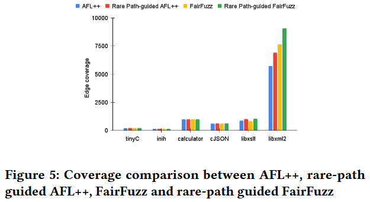

# Rare Path Guided Fuzzing [ISSTA 2023]

模糊测试器通常难以生成能够覆盖由限制性分支条件保护的程序路径的输入. 本文提出, 通过首先识别程序中的稀有路径 (即具有不太可能通过随机输入生成满足的路径约束的程序路径), 然后生成能够触发这些稀有路径的输入/种子, 可以提高模糊测试工具的覆盖率. 具体而言, 1) 通过定量符号分析识别稀有路径；2) 使用路径引导的共符执行 (path-guided concolic execution) 生成能够探索这些稀有路径的输入. 作者对一组程序进行的实验评估表明, 与随机初始种子相比, 使用基于稀有路径的种子集能够使模糊测试器获得更好的覆盖率. 

Open Source: https://github.com/shafiuzzaman-md/Rare-Path-Guided-Fuzzing

## Methods

### Intra-Inter Control Flow Paths (II-Paths)

作者通过结合程序内路径和跨程序路径, 提出了一种新的控制流路径类型, 称为程序内外控制流路径 (II-paths). 作者在 IP-CFG 中为每个调用语句 C 调用顶点 $$call\text{-}pr_C$$ 和返回点顶点 $$return\text{-}pr_C$$ 之间添加一个额外的边. 作者将生成的控制流图称为扩展跨程序控制流图 (Extended Inter-Procedural Control Flow Graph, EIP-CFG). 给定程序 P 的 EIP-CFG, 程序内外控制流路径 II-paths 定义为顶点序列 $$(v_1, v_2, . . . , v_n)$$, 其中任意 $$i$$, 有 $$v_i \rightarrow v_{i+1} \in E $$, $$v_1$$ 是程序入口, $$v_n$$ 是程序出口.

### Path Probability

一种基于启发式的技术用于概率可达性分析 [37], 它通过一种称为分支选择性的概念来减少概率分析的复杂性. 在本文中, 作者专注于使用分支选择性来计算路径概率, 而不是像 [37] 中那样使用离散时间马尔可夫链模型计算程序语句的可达性概率. 

为了计算路径概率, 作者引入了概率控制流图 (Prob-CFG) 的概念. 可以将概率控制流图视为加权控制流图, 其中边的权重是概率估计. Prob-CFG 不是离散时间马尔可夫链, Prob-CFG 节点的出边概率和并不总是加起来为 1. 程序 P 的概率控制流图 $$PG_P^\star$$ 是使用程序 P 的扩展跨程序控制流图 (EIP-CFG)  $$G_P^\star$$ 构造的. 

依赖性分析：程序中的分支条件如果依赖于程序输入的值, 那么这个分支条件就是输入依赖的. 给定一个程序和输入, 作者使用静态依赖性分析来识别控制流图中的输入依赖分支顶点. 静态依赖性分析对输入依赖分支顶点的集合进行过度近似. 

分支选择性：给定条件分支 b, 设 $$D_b$$ 表示出现在 b 中的变量域的笛卡尔积, 设 $$T_b \subseteq D_b$$ 表示使分支条件为真的值集合. 那么分支选择概率估计为 $$S(b) = \frac{|T_b|}{|D_b|}$$, $$0 \leq S(b) \leq 1$$. 通过模型计数约束求解器计算 $$|T_b|$$. 分支选择性随着满足分支条件的值数量减少而趋向 0, 随着满足分支条件的值数量增加而趋向 1. 作者使用依赖性分析和分支选择性的组合来定义概率控制流图 $$PG_P^\star$$ 的概率分数. 算法描述如下:

1) 当 $$v$$ 到 $$u$$ 有且只有一条边, 则概率为 $$F(v \rightarrow u) = 1$$

2) 当 $$v$$ 到 $$u_1$$ 和 $$u_2$$ 分别有条件分支为真和假两条边时, 分两种情况讨论

   a) 当分支 b 依赖于程序输入, 则 $$F(v \rightarrow u_1) = \frac{|T_b|}{|D_b|}, F(v \rightarrow u_2) = 1 - F(v \rightarrow u_1)$$

   b) 当分支 b 不依赖于程序输入, 则 $$F(v \rightarrow u_1) = F(v \rightarrow u_2) = 1$$

3. 如果边的源顶点是调用顶点, 则 $$F(call\text{-}pr_C \rightarrow entry\text{-}pr) = F(call\text{-}pr_C \rightarrow return\text{-}pr_C) = 1$$

示例程序如 Figure 2 所示, 对应的概率控制流图如 Figure 4 所示.

对于 II-paths 的路径概率估计, 为 

$$
\mathcal{P}(P, t)=\prod_{i=1}^{n-1} F\left(v_i, v_{i+1}\right)
$$

作者称一个程序路径为稀有路径, 如果当程序输入随机选择时, 它不太可能被执行. 由于程序中可能存在无界数量的路径, 在给定深度限制 b 的情况下, 作者在所有长度小于等于 b 的路径中识别 k 条稀有路径. 为了识别给定执行深度 b 的稀有路径集合 R (大小为 k), 作者计算所有长度小于等于 b 的路径的路径概率, 并选择概率最小的 k 条路径. 

### INPUT GENERATION FOR RARE PATHS

作者使用路径引导的共符执行来收集稀有路径的路径约束, 然后使用 SMT 求解器来求解路径约束, 并生成能够提供给程序以执行稀有路径的输入. 作者为路径引导的共符执行提供了两种不同的输入生成算法：1) 跨路径引导共符执行, 2) II-path 引导共符执行. 

对于**跨路径引导共符执行** (inter-path guided concolic execution, IP-GCE), 作者使用具体的随机输入运行程序, 并生成相应的跨路径 $$t_C$$. 为了生成稀有路径 $$t_R$$ 的输入, 作者按相同顺序比较 $$t_C$$ 和 $$t_R$$ 中的所有分支. 如果任意一个分支不匹配, 作者就取反该分支, 并求解它, 以检查取反分支后路径的可行性. 如果路径是可行的, 作者就求解路径约束并生成新的输入. 然后, 作者使用新的输入执行程序, 并通过新输入生成的跨路径更新 $$t_C$$. 只要 $$t_C$$ 和 $$t_R$$ 中还有分支需要比较, 或者没有可以导致可行路径的分支, 过程就会继续. 在过程中, 生成的输入将是最终触发路径 $$t_R$$ 的输入, 或者如果 $$t_R$$ 不可行, 则生成一个与稀有路径 $$t_R$$ 非常接近的路径. Algorithm 1 显示使用稀有跨路径引导共符执行的过程. `Execute` 首先在随机输入上执行程序 P 并返回相应的执行路径 $$t_C$$. 该算法查找 $$t_C$$ 和 $$t_R$$ 不同的第一个顶点 (所有路径从相同的顶点开始). `NegatedPath(t_C, index)` 生成一个路径约束, 表示 $$t_C$$ 路径中从顶点 index-1 到 index 之间的分支条件被取反, 并且 index-1 之前的所有分支保持不变. `IsFeasible` 检查给定路径约束的可行性, `Solve` 生成满足给定路径约束的输入值. 

IP-GCE 算法使用分支匹配和取反处理不匹配的分支, 但这种方法不足以引导共符执行来探索稀有的 II-path, 因为 II-path 可能不代表一个具体的执行路径. 与 IP-GCE 算法类似, 在 **II-path 引导共符执行**的 IIP-GCE 算法 (Algorithm 2) 中, 作者首先在具体的随机输入上运行程序, 并收集执行路径 $$t_C$$. 注意, $$t_C$$ 中可能有些分支存在于一个程序中, 而这个程序在输入 II-path $$t_R$$ 中并未被探索. 在这种情况下, 作者比较触发分支和它的取反的输入, 看看哪个输入能创建一个与 $$t_R$$ 更重叠的执行路径 (即增加两个路径中公共顶点的数量), 然后选择哪个分支能够与 $$t_R$$ 重叠更多. 算法 2 中的第 1-5 行生成了一个随机输入的初始具体路径 $$t_C$$, 并使用 `Overlap` 函数计算 $$t_C$$ 和 $$t_R$$ 之间的初始重叠. 第 6-19 行的 `while` 循环遍历 $$t_C$$ 中的节点. 它查找 $$t_C$$ 中的分支节点与 $$t_R$$ 中的对应分支节点的不同. `Differ` 在两种条件下返回真：1) $$t_R$$ 中有一个分支与 $$t_C$$ (index) 的补集相对应 (即 $$t_R$$ 和 $$t_C$$ 对于同一个分支语句采取了不同的分支), 或者 2) $$t_R$$ 中没有分支与 $$t_C$$ (index) 相对应 (这个分支节点在 $$t_C$$ 中对应于一个程序中的分支, 而该程序没有在 $$t_R$$ 中被探索). 在这两种情况下, 作者取反 $$t_C$$ (index) 中的分支条件, 看看是否能够改善 $$t_C$$ 和 $$t_R$$ 之间的重叠, 并在重叠能够改善时更新输入和 $$t_C$$. 注意, 如果重叠不能改善, 那么输入会恢复到前一个输入 (第 17-18 行). 算法 2 在 $$t_C$$ 中的分支上执行单次遍历, 而不进行回溯, 因此它不能保证找到一个使最终 $$t_C$$ 和 $$t_R$$ 之间重叠最大的执行路径. 寻找最大重叠需要在所有执行路径上进行搜索, 这会导致路径爆炸, 这是作者需要避免的, 以保证可扩展性. 

## Evaluation

## References

[37] Seemanta Saha, Mara Downing, Tegan Brennan, and Tevfik Bultan. 2022. PREACH: A Heuristic for Probabilistic Reachability to Identify Hard to Reach Statements. In 44th IEEE/ACM 44th International Conference on Software Engineering, ICSE 2022, Pittsburgh, PA, USA, May 25-27, 2022. ACM, 1706–1717. https://doi.org/10.1145/3510003.3510227

