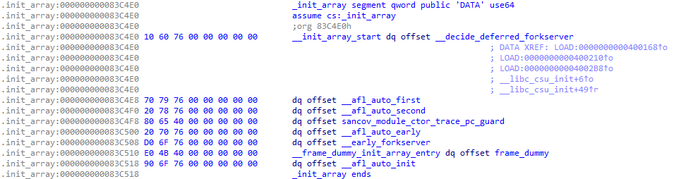

# AFL++ Source Code Reading II - Forkserver

本文从主逻辑开始解析 AFL++ 源代码


## afl-fuzz

AFL++ (AFL) 主逻辑在 `afl-fuzz.c`, 模糊测试的启动程序为 `afl-fuzz`, 通常的启动命令

```shell
afl-fuzz -i [input_seed_corpus] -o [output_results] -- /path/to/target/binary [@@]
```

其中, `@@` 是目标二进制程序读取的输入文件, 如果没有输入文件则默认从 `stdin` 输入.

**启动流程**

1. `afl-fuzz` fork 出子进程并执行目标二进制程序
2. fork 的子进程作为 `forkserver` 继续 fork 子子进程 (fork 的性能成本比执行成本要低)
3. 子子进程执行 fuzzing


`afl-fuzz` 和 `target binary` 之间的通信使用 `control pipe` 和 `status pipe` 进行. 

可见源代码: [forkserver source code](https://github.com/AFLplusplus/AFLplusplus/blob/ea14f3fd40e32234989043a525e3853fcb33c1b6/src/afl-forkserver.c#L667). 

`afl-fuzz` 通过 `control pipe` 发送控制消息到 `target binary`, 反过来则是通过 `status pipe`. `control pipe` 的文件描述符是 `FORKSRV_FD`, 而 `status pipe` 的文件描述符是 `FORKSRV_FD + 1`.

```c
    if (dup2(ctl_pipe[0], FORKSRV_FD) < 0) { PFATAL("dup2() failed"); }
    if (dup2(st_pipe[1], FORKSRV_FD + 1) < 0) { PFATAL("dup2() failed"); }
```


## Instrumentation

ELF 二进制程序运行流程是先运行 `.init_array` 节中的初始化函数, 再到 `main` 函数 <sup>[3, 4]</sup>. 插桩后的二进制程序 `.init_array` 中的函数会有所区别, 方便起见这里列举初始化过程中, 常用的变量、环境变量和宏定义.

```c
/* Regular Variables */
__afl_area_ptr // - The coverage map pointer. By default this is __afl_area_initial. The size of __afl_area_initial is MAP_INITIAL_SIZE (ref [5])
__afl_final_loc // - The last index in __afl_area_ptr accessed by instrumentation
__afl_map_addr // - This is the address that the coverage map will be mmap’d. As far as I know, this only really exists when AFL_LLVM_MAP_ADDR is set in LTO mode. Otherwise, it is 0.
__afl_map_size // - The size of the coverage map
__afl_area_initial // - The coverage map used before shared memory is mapped and if shared memory is not accessible (i.e. we are not running under AFL). This is created as an array in afl-compiler-rt.o.c

/* Environment Variables */
__AFL_SHM_ID // (Aliased to SHM_ENV_VAR) - Shared memory ID for the coverage map.
__AFL_SHM_FUZZ_ID // (Aliased to SHM_FUZZ_ENV_VAR) - Shared memory ID for shared memory fuzzing.
AFL_MAP_SIZE // - Used to set the size of the shared memory buffer allocated by afl-fuzz.

/* Macros */
MAP_SIZE // - a custom value that afl-fuzz can use to force the size of the shared memory map.
MAP_INITIAL_SIZE // - size of __afl_area_initial
```


经过 **PCGUARD** 插桩的二进制程序 `.init_array` 的函数表, 示例



其中, 所有插桩函数均可以在 `afl-compiler-rt.o.c` <sup>[5]</sup> 中找到定义. 逐个查看源码: 


`__afl_auto_first` 设置变量 `__afl_already_initialized_first = 1`

```c
__attribute__((constructor(0))) void __afl_auto_first(void) {

  if (__afl_already_initialized_first) return;
  __afl_already_initialized_first = 1;

  if (getenv("AFL_DISABLE_LLVM_INSTRUMENTATION")) return;

  /*
    u8 *ptr = (u8 *)malloc(MAP_INITIAL_SIZE);

    if (ptr && (ssize_t)ptr != -1) {

      __afl_area_ptr = ptr;
      __afl_area_ptr_backup = __afl_area_ptr;

    }

  */

}  // ptr memleak report is a false positive
```


`__afl_auto_second` 在 PCGUARD 模式下无作用, 因为初始化时 `__afl_final_loc == 0`

```c
__attribute__((constructor(1))) void __afl_auto_second(void) {

  if (__afl_already_initialized_second) return;
  __afl_already_initialized_second = 1;

  if (getenv("AFL_DEBUG")) {

    __afl_debug = 1;
    fprintf(stderr, "DEBUG: debug enabled\n");
    fprintf(stderr, "DEBUG: AFL++ afl-compiler-rt" VERSION "\n");

  }

  if (getenv("AFL_DISABLE_LLVM_INSTRUMENTATION")) return;
  u8 *ptr;

  if (__afl_final_loc > MAP_INITIAL_SIZE) {

    __afl_first_final_loc = __afl_final_loc + 1;

    if (__afl_area_ptr && __afl_area_ptr != __afl_area_initial)
      free(__afl_area_ptr);

    if (__afl_map_addr)
      ptr = (u8 *)mmap((void *)__afl_map_addr, __afl_first_final_loc,
                       PROT_READ | PROT_WRITE,
                       MAP_FIXED_NOREPLACE | MAP_SHARED | MAP_ANONYMOUS, -1, 0);
    else
      ptr = (u8 *)malloc(__afl_first_final_loc);

    if (ptr && (ssize_t)ptr != -1) {

      __afl_area_ptr = ptr;
      __afl_area_ptr_dummy = __afl_area_ptr;
      __afl_area_ptr_backup = __afl_area_ptr;

    }

  }

}  // ptr memleak report is a false positive
```


`sancov_module_ctor_trace_pc_guard` 跟进会发现其调用 `__sanitizer_cov_trace_pc_guard_init`. 其接收编译文件中所有插桩点的 `start` 和 `stop` 两个参数, 初始化覆盖率映射表, 为每个插桩点分配唯一的 ID (`__afl_final_loc`), 根据 `inst_ratio` 决定是否跳过某些插桩点 (跳过时写0). 

```c
void __sanitizer_cov_trace_pc_guard_init(uint32_t *start, uint32_t *stop) {

  u32   inst_ratio = 100;
  char *x;

  _is_sancov = 1;

  if (!getenv("AFL_DUMP_MAP_SIZE")) {

    __afl_auto_first();
    __afl_auto_second();
    __afl_auto_early();

  }

  if (__afl_debug) {

    fprintf(
        stderr,
        "DEBUG: Running __sanitizer_cov_trace_pc_guard_init: %p-%p (%lu edges) "
        "after_fs=%u *start=%u\n",
        start, stop, (unsigned long)(stop - start),
        __afl_already_initialized_forkserver, *start);

  }

  if (start == stop || *start) { return; }

#ifdef __AFL_CODE_COVERAGE
  u32               *orig_start = start;
  afl_module_info_t *mod_info = NULL;

  Dl_info dlinfo;
  if (dladdr(__builtin_return_address(0), &dlinfo)) {

    if (__afl_already_initialized_forkserver) {

      fprintf(stderr, "[pcmap] Error: Module was not preloaded: %s\n",
              dlinfo.dli_fname);

    } else {

      afl_module_info_t *last_module_info = __afl_module_info;
      while (last_module_info && last_module_info->next) {

        last_module_info = last_module_info->next;

      }

      mod_info = malloc(sizeof(afl_module_info_t));

      mod_info->id = last_module_info ? last_module_info->id + 1 : 0;
      mod_info->name = strdup(dlinfo.dli_fname);
      mod_info->base_address = (uintptr_t)dlinfo.dli_fbase;
      mod_info->start = NULL;
      mod_info->stop = NULL;
      mod_info->pcs_beg = NULL;
      mod_info->pcs_end = NULL;
      mod_info->mapped = 0;
      mod_info->next = NULL;

      if (last_module_info) {

        last_module_info->next = mod_info;

      } else {

        __afl_module_info = mod_info;

      }

      if (__afl_debug) {

        fprintf(stderr, "[pcmap] Module: %s Base Address: %p\n",
                dlinfo.dli_fname, dlinfo.dli_fbase);

      }

    }

  } else {

    fprintf(stderr, "[pcmap] dladdr call failed\n");

  }

#endif  // __AFL_CODE_COVERAGE

  x = getenv("AFL_INST_RATIO");
  if (x) {

    inst_ratio = (u32)atoi(x);

    if (!inst_ratio || inst_ratio > 100) {

      fprintf(stderr, "[-] ERROR: Invalid AFL_INST_RATIO (must be 1-100).\n");
      abort();

    }

  }

  // If a dlopen of an instrumented library happens after the forkserver then
  // we have a problem as we cannot increase the coverage map anymore.
  if (__afl_already_initialized_forkserver) {

    if (!getenv("AFL_IGNORE_PROBLEMS")) {

      fprintf(
          stderr,
          "[-] FATAL: forkserver is already up, but an instrumented dlopen() "
          "library loaded afterwards. You must AFL_PRELOAD such libraries to "
          "be able to fuzz them or LD_PRELOAD to run outside of afl-fuzz.\n"
          "To ignore this set AFL_IGNORE_PROBLEMS=1 but this will lead to "
          "ambiguous coverage data.\n"
          "In addition, you can set AFL_IGNORE_PROBLEMS_COVERAGE=1 to "
          "ignore the additional coverage instead (use with caution!).\n");
      abort();

    } else {

      u8 ignore_dso_after_fs = !!getenv("AFL_IGNORE_PROBLEMS_COVERAGE");
      if (__afl_debug && ignore_dso_after_fs) {

        fprintf(stderr,
                "DEBUG: Ignoring coverage from dynamically loaded code\n");

      }

      static u32 offset = 5;

      while (start < stop) {

        if (!ignore_dso_after_fs &&
            (likely(inst_ratio == 100) || R(100) < inst_ratio)) {

          *(start++) = offset;

        } else {

          *(start++) = 0;  // write to map[0]

        }

        if (unlikely(++offset >= __afl_final_loc)) { offset = 5; }

      }

    }

    return;  // we are done for this special case

  }

  /* Make sure that the first element in the range is always set - we use that
     to avoid duplicate calls (which can happen as an artifact of the underlying
     implementation in LLVM). */

  if (__afl_final_loc < 4) __afl_final_loc = 4;  // we skip the first 5 entries

  *(start++) = ++__afl_final_loc;

  while (start < stop) {

    if (likely(inst_ratio == 100) || R(100) < inst_ratio) {

      *(start++) = ++__afl_final_loc;

    } else {

      *(start++) = 0;  // write to map[0]

    }

  }

#ifdef __AFL_CODE_COVERAGE
  if (mod_info) {

    if (!mod_info->start) {

      mod_info->start = orig_start;
      mod_info->stop = stop - 1;

    }

    if (__afl_debug) {

      fprintf(stderr, "DEBUG: [pcmap] Start Index: %u Stop Index: %u\n",
              *(mod_info->start), *(mod_info->stop));

    }

  }

#endif  // __AFL_CODE_COVERAGE

  if (__afl_debug) {

    fprintf(stderr,
            "DEBUG: Done __sanitizer_cov_trace_pc_guard_init: __afl_final_loc "
            "= %u\n",
            __afl_final_loc);

  }

  if (__afl_already_initialized_shm) {

    if (__afl_final_loc > __afl_map_size) {

      if (__afl_debug) {

        fprintf(stderr, "DEBUG: Reinit shm necessary (+%u)\n",
                __afl_final_loc - __afl_map_size);

      }

      __afl_unmap_shm();
      __afl_map_shm();

    }

    __afl_map_size = __afl_final_loc + 1;

  }

}
```


`__afl_auto_early` 调用 `__afl_map_shm` 创建一个共享内存 (shared memory) 实例作为覆盖率映射表 (coverage map), 主进程就可以看到所有子进程修改的覆盖率结果. 具体细节, 跳过边界条件逻辑, 看主逻辑代码的注释. 

```c
__attribute__((constructor(CTOR_PRIO))) void __afl_auto_early(void) {

  if (__afl_already_initialized_early) return;
  __afl_already_initialized_early = 1;

  is_persistent = !!getenv(PERSIST_ENV_VAR);

  if (getenv("AFL_DISABLE_LLVM_INSTRUMENTATION")) return;

  __afl_map_shm();

}

static void __afl_map_shm(void) {

  if (__afl_already_initialized_shm) return;
  __afl_already_initialized_shm = 1;

  // if we are not running in afl ensure the map exists
  if (!__afl_area_ptr) { __afl_area_ptr = __afl_area_ptr_dummy; }

  char *id_str = getenv(SHM_ENV_VAR); // get the shared memory ID

  if (__afl_final_loc) {

    __afl_map_size = __afl_final_loc + 1;  // as we count starting 0

    if (getenv("AFL_DUMP_MAP_SIZE")) {

      printf("%u\n", __afl_map_size);
      exit(-1);

    }

    if (__afl_debug) {

      fprintf(stderr, "DEBUG: AFL_MAP_SIZE=%u\n", __afl_map_size);

    }

    if (__afl_final_loc > MAP_SIZE) { // expand the shared memory to fill in all edges

      char *ptr;
      u32   val = 0;
      if ((ptr = getenv("AFL_MAP_SIZE")) != NULL) { val = atoi(ptr); }
      if (val < __afl_final_loc) {

        if (__afl_final_loc > MAP_INITIAL_SIZE && !getenv("AFL_QUIET")) {

          fprintf(stderr,
                  "Warning: AFL++ tools might need to set AFL_MAP_SIZE to %u "
                  "to be able to run this instrumented program if this "
                  "crashes!\n",
                  __afl_final_loc);

        }

      }

    }

  }

  if (__afl_sharedmem_fuzzing && (!id_str || !getenv(SHM_FUZZ_ENV_VAR) ||
                                  fcntl(FORKSRV_FD, F_GETFD) == -1 ||
                                  fcntl(FORKSRV_FD + 1, F_GETFD) == -1)) {

    if (__afl_debug) {

      fprintf(stderr,
              "DEBUG: running not inside afl-fuzz, disabling shared memory "
              "testcases\n");

    }

    __afl_sharedmem_fuzzing = 0;

  }

  if (!id_str) {

    u32 val = 0;
    u8 *ptr;

    if ((ptr = getenv("AFL_MAP_SIZE")) != NULL) { val = atoi(ptr); }

    if (val > MAP_INITIAL_SIZE && val > __afl_final_loc) {

      __afl_map_size = val;

    } else {

      if (__afl_first_final_loc > MAP_INITIAL_SIZE) {

        // done in second stage constructor
        __afl_map_size = __afl_first_final_loc;

      } else {

        __afl_map_size = MAP_INITIAL_SIZE;

      }

    }

    if (__afl_map_size > MAP_INITIAL_SIZE && __afl_final_loc < __afl_map_size) {

      __afl_final_loc = __afl_map_size;

    }

    if (__afl_debug) {

      fprintf(stderr, "DEBUG: (0) init map size is %u to %p\n", __afl_map_size,
              __afl_area_ptr_dummy);

    }

  }

  /* If we're running under AFL, attach to the appropriate region, replacing the
     early-stage __afl_area_initial region that is needed to allow some really
     hacky .init code to work correctly in projects such as OpenSSL. */

  if (__afl_debug) {

    fprintf(stderr,
            "DEBUG: (1) id_str %s, __afl_area_ptr %p, __afl_area_initial %p, "
            "__afl_area_ptr_dummy %p, __afl_map_addr 0x%llx, MAP_SIZE %u, "
            "__afl_final_loc %u, __afl_map_size %u\n",
            id_str == NULL ? "<null>" : id_str, __afl_area_ptr,
            __afl_area_initial, __afl_area_ptr_dummy, __afl_map_addr, MAP_SIZE,
            __afl_final_loc, __afl_map_size);

  }

  if (id_str) {

    if (__afl_area_ptr && __afl_area_ptr != __afl_area_initial &&
        __afl_area_ptr != __afl_area_ptr_dummy) {

      if (__afl_map_addr) {

        munmap((void *)__afl_map_addr, __afl_final_loc);

      } else {

        free(__afl_area_ptr);

      }

      __afl_area_ptr = __afl_area_ptr_dummy;

    }

#ifdef USEMMAP
    const char    *shm_file_path = id_str;
    int            shm_fd = -1;
    unsigned char *shm_base = NULL;

    /* create the shared memory segment as if it was a file */
    shm_fd = shm_open(shm_file_path, O_RDWR, DEFAULT_PERMISSION);
    if (shm_fd == -1) {

      fprintf(stderr, "shm_open() failed\n");
      send_forkserver_error(FS_ERROR_SHM_OPEN);
      exit(1);

    }

    /* map the shared memory segment to the address space of the process */
    if (__afl_map_addr) {

      shm_base =
          mmap((void *)__afl_map_addr, __afl_map_size, PROT_READ | PROT_WRITE,
               MAP_FIXED_NOREPLACE | MAP_SHARED, shm_fd, 0);

    } else {

      shm_base = mmap(0, __afl_map_size, PROT_READ | PROT_WRITE, MAP_SHARED,
                      shm_fd, 0);

    }

    close(shm_fd);
    shm_fd = -1;

    if (shm_base == MAP_FAILED) {

      fprintf(stderr, "mmap() failed\n");
      perror("mmap for map");

      if (__afl_map_addr)
        send_forkserver_error(FS_ERROR_MAP_ADDR);
      else
        send_forkserver_error(FS_ERROR_MMAP);

      exit(2);

    }

    __afl_area_ptr = shm_base;
#else
    u32 shm_id = atoi(id_str);

    if (__afl_map_size && __afl_map_size > MAP_SIZE) {

      u8 *map_env = (u8 *)getenv("AFL_MAP_SIZE");
      if (!map_env || atoi((char *)map_env) < MAP_SIZE) {

        fprintf(stderr, "FS_ERROR_MAP_SIZE\n");
        send_forkserver_error(FS_ERROR_MAP_SIZE);
        _exit(1);

      }

    }

    __afl_area_ptr = (u8 *)shmat(shm_id, (void *)__afl_map_addr, 0);
	// point __afl_area_ptr to shared memory so that instrumentation
    // can access to shared memory and change coverage map
      
    /* Whooooops. */

    if (!__afl_area_ptr || __afl_area_ptr == (void *)-1) {

      if (__afl_map_addr)
        send_forkserver_error(FS_ERROR_MAP_ADDR);
      else
        send_forkserver_error(FS_ERROR_SHMAT);

      perror("shmat for map");
      _exit(1);

    }

#endif

    /* Write something into the bitmap so that even with low AFL_INST_RATIO,
       our parent doesn't give up on us. */

    __afl_area_ptr[0] = 1;

  } else if ((!__afl_area_ptr || __afl_area_ptr == __afl_area_initial) &&

             __afl_map_addr) {

    __afl_area_ptr = (u8 *)mmap(
        (void *)__afl_map_addr, __afl_map_size, PROT_READ | PROT_WRITE,
        MAP_FIXED_NOREPLACE | MAP_SHARED | MAP_ANONYMOUS, -1, 0);

    if (__afl_area_ptr == MAP_FAILED) {

      fprintf(stderr, "can not acquire mmap for address %p\n",
              (void *)__afl_map_addr);
      send_forkserver_error(FS_ERROR_SHM_OPEN);
      exit(1);

    }

  } else if (__afl_final_loc > MAP_INITIAL_SIZE &&

             __afl_final_loc > __afl_first_final_loc) {

    if (__afl_area_initial != __afl_area_ptr_dummy) {

      free(__afl_area_ptr_dummy);

    }

    __afl_map_size = __afl_final_loc + 1;
    __afl_area_ptr_dummy = (u8 *)malloc(__afl_map_size);
    __afl_area_ptr = __afl_area_ptr_dummy;

    if (!__afl_area_ptr_dummy) {

      fprintf(stderr,
              "Error: AFL++ could not acquire %u bytes of memory, exiting!\n",
              __afl_final_loc);
      exit(-1);

    }

  }  // else: nothing to be done

  __afl_area_ptr_backup = __afl_area_ptr;

  if (__afl_debug) {

    fprintf(stderr,
            "DEBUG: (2) id_str %s, __afl_area_ptr %p, __afl_area_initial %p, "
            "__afl_area_ptr_dummy %p, __afl_map_addr 0x%llx, MAP_SIZE "
            "%u, __afl_final_loc %u, __afl_map_size %u\n",
            id_str == NULL ? "<null>" : id_str, __afl_area_ptr,
            __afl_area_initial, __afl_area_ptr_dummy, __afl_map_addr, MAP_SIZE,
            __afl_final_loc, __afl_map_size);

  }

  if (__afl_selective_coverage) {

    if (__afl_map_size > MAP_INITIAL_SIZE) {

      __afl_area_ptr_dummy = (u8 *)malloc(__afl_map_size);

    }

    if (__afl_area_ptr_dummy) {

      if (__afl_selective_coverage_start_off) {

        __afl_area_ptr = __afl_area_ptr_dummy;

      }

    } else {

      fprintf(stderr, "Error: __afl_selective_coverage failed!\n");
      __afl_selective_coverage = 0;
      // continue;

    }

  }

  id_str = getenv(CMPLOG_SHM_ENV_VAR);

  if (__afl_debug) {

    fprintf(stderr, "DEBUG: cmplog id_str %s\n",
            id_str == NULL ? "<null>" : id_str);

  }

  if (id_str) {

    // /dev/null doesn't work so we use /dev/urandom
    if ((__afl_dummy_fd[1] = open("/dev/urandom", O_WRONLY)) < 0) {

      if (pipe(__afl_dummy_fd) < 0) { __afl_dummy_fd[1] = 1; }

    }

#ifdef USEMMAP
    const char     *shm_file_path = id_str;
    int             shm_fd = -1;
    struct cmp_map *shm_base = NULL;

    /* create the shared memory segment as if it was a file */
    shm_fd = shm_open(shm_file_path, O_RDWR, DEFAULT_PERMISSION);
    if (shm_fd == -1) {

      perror("shm_open() failed\n");
      send_forkserver_error(FS_ERROR_SHM_OPEN);
      exit(1);

    }

    /* map the shared memory segment to the address space of the process */
    shm_base = mmap(0, sizeof(struct cmp_map), PROT_READ | PROT_WRITE,
                    MAP_SHARED, shm_fd, 0);
    if (shm_base == MAP_FAILED) {

      close(shm_fd);
      shm_fd = -1;

      fprintf(stderr, "mmap() failed\n");
      send_forkserver_error(FS_ERROR_SHM_OPEN);
      exit(2);

    }

    __afl_cmp_map = shm_base;
#else
    u32 shm_id = atoi(id_str);

    __afl_cmp_map = (struct cmp_map *)shmat(shm_id, NULL, 0);
#endif

    __afl_cmp_map_backup = __afl_cmp_map;

    if (!__afl_cmp_map || __afl_cmp_map == (void *)-1) {

      perror("shmat for cmplog");
      send_forkserver_error(FS_ERROR_SHM_OPEN);
      _exit(1);

    }

  }

#ifdef __AFL_CODE_COVERAGE
  char *pcmap_id_str = getenv("__AFL_PCMAP_SHM_ID");

  if (pcmap_id_str) {

    __afl_pcmap_size = __afl_map_size * sizeof(void *);
    u32 shm_id = atoi(pcmap_id_str);

    __afl_pcmap_ptr = (uintptr_t *)shmat(shm_id, NULL, 0);

    if (__afl_debug) {

      fprintf(stderr, "DEBUG: Received %p via shmat for pcmap\n",
              __afl_pcmap_ptr);

    }

  }

#endif  // __AFL_CODE_COVERAGE

  if (!__afl_cmp_map && getenv("AFL_CMPLOG_DEBUG")) {

    __afl_cmp_map_backup = __afl_cmp_map = malloc(sizeof(struct cmp_map));

  }

  if (getenv("AFL_CMPLOG_MAX_LEN")) {

    int tmp = atoi(getenv("AFL_CMPLOG_MAX_LEN"));
    if (tmp >= 16 && tmp <= 32) { __afl_cmplog_max_len = tmp; }

  }

}
```


## Forkserver

`__early_forkserver` 只是调用 `__afl_auto_init` 

```c
__attribute__((constructor(EARLY_FS_PRIO))) void __early_forkserver(void) {

  if (getenv("AFL_EARLY_FORKSERVER")) { __afl_auto_init(); }

}
```


`__afl_auto_init` 会调用 `__afl_manual_init -> __afl_start_forkserver`. 

最终, forkserver 模式的 fuzzing  由 `__afl_start_forkserver` 函数启动, 主逻辑见 `while(1)` 中的注释

```c
__attribute__((constructor())) void __afl_auto_init(void) {

  if (__afl_already_initialized_init) { return; }

#ifdef __ANDROID__
  // Disable handlers in linker/debuggerd, check include/debuggerd/handler.h
  signal(SIGABRT, SIG_DFL);
  signal(SIGBUS, SIG_DFL);
  signal(SIGFPE, SIG_DFL);
  signal(SIGILL, SIG_DFL);
  signal(SIGSEGV, SIG_DFL);
  signal(SIGSTKFLT, SIG_DFL);
  signal(SIGSYS, SIG_DFL);
  signal(SIGTRAP, SIG_DFL);
#endif

  __afl_already_initialized_init = 1;

  if (getenv("AFL_DISABLE_LLVM_INSTRUMENTATION")) return;

  if (getenv(DEFER_ENV_VAR)) return;

  __afl_manual_init();

}

void __afl_manual_init(void) {

  static u8 init_done;

  if (getenv("AFL_DISABLE_LLVM_INSTRUMENTATION")) {

    init_done = 1;
    is_persistent = 0;
    __afl_sharedmem_fuzzing = 0;
    if (__afl_area_ptr == NULL) __afl_area_ptr = __afl_area_ptr_dummy;

    if (__afl_debug) {

      fprintf(stderr,
              "DEBUG: disabled instrumentation because of "
              "AFL_DISABLE_LLVM_INSTRUMENTATION\n");

    }

  }

  if (!init_done) {

    __afl_start_forkserver();
    init_done = 1;

  }

}

/* Fork server logic. */

static void __afl_start_forkserver(void) {

  if (__afl_already_initialized_forkserver) return;
  __afl_already_initialized_forkserver = 1;

  struct sigaction orig_action;
  sigaction(SIGTERM, NULL, &orig_action);
  old_sigterm_handler = orig_action.sa_handler;
  signal(SIGTERM, at_exit);

  u32 already_read_first = 0;
  u32 was_killed = 0;
  u32 version = 0x41464c00 + FS_NEW_VERSION_MAX;
  u32 tmp = version ^ 0xffffffff, status2, status = version;
  u8 *msg = (u8 *)&status;
  u8 *reply = (u8 *)&status2;

  u8 child_stopped = 0;

  void (*old_sigchld_handler)(int) = signal(SIGCHLD, SIG_DFL);

  if (getenv("AFL_OLD_FORKSERVER")) {

    __afl_old_forkserver = 1;
    status = 0;

    if (__afl_final_loc > MAP_SIZE) {

      fprintf(stderr,
              "Warning: AFL_OLD_FORKSERVER is used with a target compiled with "
              "non-colliding coverage instead of AFL_LLVM_INSTRUMENT=CLASSIC - "
              "this target may crash!\n");

    }

  }

  /* Phone home and tell the parent that we're OK. If parent isn't there,
     assume we're not running in forkserver mode and just execute program. */

  if (!__afl_old_forkserver) {

    // return because possible non-forkserver usage
    if (write(FORKSRV_FD + 1, msg, 4) != 4) { return; }

    if (read(FORKSRV_FD, reply, 4) != 4) { _exit(1); }
    if (tmp != status2) {

      write_error("wrong forkserver message from AFL++ tool");
      _exit(1);

    }

    // send the set/requested options to forkserver
    status = FS_NEW_OPT_MAPSIZE;  // we always send the map size
    if (__afl_sharedmem_fuzzing) { status |= FS_NEW_OPT_SHDMEM_FUZZ; }
    if (__afl_dictionary_len && __afl_dictionary) {

      status |= FS_NEW_OPT_AUTODICT;

    }

    if (write(FORKSRV_FD + 1, msg, 4) != 4) { _exit(1); }

    // Now send the parameters for the set options, increasing by option number

    // FS_NEW_OPT_MAPSIZE - we always send the map size
    status = __afl_map_size;
    if (write(FORKSRV_FD + 1, msg, 4) != 4) { _exit(1); }

    // FS_NEW_OPT_SHDMEM_FUZZ - no data

    // FS_NEW_OPT_AUTODICT - send autodictionary
    if (__afl_dictionary_len && __afl_dictionary) {

      // pass the dictionary through the forkserver FD
      u32 len = __afl_dictionary_len, offset = 0;

      if (write(FORKSRV_FD + 1, &len, 4) != 4) {

        write(2, "Error: could not send dictionary len\n",
              strlen("Error: could not send dictionary len\n"));
        _exit(1);

      }

      while (len != 0) {

        s32 ret;
        ret = write(FORKSRV_FD + 1, __afl_dictionary + offset, len);

        if (ret < 1) {

          write_error("could not send dictionary");
          _exit(1);

        }

        len -= ret;
        offset += ret;

      }

    }

    // send welcome message as final message
    status = version;
    if (write(FORKSRV_FD + 1, msg, 4) != 4) { _exit(1); }

  }

  // END forkserver handshake

  __afl_connected = 1;

  if (__afl_sharedmem_fuzzing) { __afl_map_shm_fuzz(); }

  while (1) {

    int status;

    /* Wait for parent by reading from the pipe. Abort if read fails. */

    if (unlikely(already_read_first)) {

      already_read_first = 0;

    } else {

      if (unlikely(read(FORKSRV_FD, &was_killed, 4) != 4)) {

        write_error("read from AFL++ tool");
        _exit(1);

      }

    }

#ifdef _AFL_DOCUMENT_MUTATIONS
    if (__afl_fuzz_ptr) {

      static uint32_t counter = 0;
      char            fn[32];
      sprintf(fn, "%09u:forkserver", counter);
      s32 fd_doc = open(fn, O_WRONLY | O_CREAT | O_TRUNC, DEFAULT_PERMISSION);
      if (fd_doc >= 0) {

        if (write(fd_doc, __afl_fuzz_ptr, *__afl_fuzz_len) != *__afl_fuzz_len) {

          fprintf(stderr, "write of mutation file failed: %s\n", fn);
          unlink(fn);

        }

        close(fd_doc);

      }

      counter++;

    }

#endif

    /* If we stopped the child in persistent mode, but there was a race
       condition and afl-fuzz already issued SIGKILL, write off the old
       process. */

    if (unlikely(child_stopped && was_killed)) {

      child_stopped = 0;
      if (unlikely(waitpid(child_pid, &status, 0) < 0)) {

        write_error("child_stopped && was_killed");
        _exit(1);

      }

    }

    if (unlikely(!child_stopped)) {

      /* Once woken up, create a clone of our process. */

      child_pid = fork(); // fork child process to grand child and execute
      if (unlikely(child_pid < 0)) {

        write_error("fork");
        _exit(1);

      }

      /* In child process: close fds, resume execution. */
	  // fork returns 0 to child and child_pid to parent
      if (unlikely(!child_pid)) {  // just to signal afl-fuzz faster

        //(void)nice(-20);
		// reset signal handlers
        signal(SIGCHLD, old_sigchld_handler);
        signal(SIGTERM, old_sigterm_handler);
		// close pipes
        close(FORKSRV_FD); 
        close(FORKSRV_FD + 1);
        return; // return to main

      }

    } else {

      /* Special handling for persistent mode: if the child is alive but
         currently stopped, simply restart it with SIGCONT. */

      kill(child_pid, SIGCONT);
      child_stopped = 0;

    }

    /* In parent process: write PID to pipe, then wait for child. */
	// send the grandchild_pid to parent
    if (unlikely(write(FORKSRV_FD + 1, &child_pid, 4) != 4)) {

      write_error("write to afl-fuzz");
      _exit(1);

    }
	// wait for child process finishing
    if (unlikely(waitpid(child_pid, &status, is_persistent ? WUNTRACED : 0) <
                 0)) {

      write_error("waitpid");
      _exit(1);

    }

    /* In persistent mode, the child stops itself with SIGSTOP to indicate
       a successful run. In this case, we want to wake it up without forking
       again. */

    if (likely(WIFSTOPPED(status))) { child_stopped = 1; }

    /* Relay wait status to pipe, then loop back. */
	// send completed message to parent for further fuzzing
    if (unlikely(write(FORKSRV_FD + 1, &status, 4) != 4)) {

      write_error("writing to afl-fuzz");
      _exit(1);

    }

  }

}
```


## Persistent Mode

比 forkserver 更快的持久化模式 (persistent mode) 用于高效测试代码片段. 持久化模式通过一个循环来反复调用目标函数/代码, 而不必每次输入都要 fork 子进程, 因此可以 10x - 20x 倍提高效率. 持久化模式代码示例

```c
#include "what_you_need_for_your_target.h"

main() {
  // anything else here, e.g. command line arguments, initialization, etc.
  unsigned char buf[1024];
  
  while (__AFL_LOOP(10000)) { //loop
    int len = read(0,buf,1024);  
                                    
    if (len < 8) continue;  // check for a required/useful minimum input 
    target_function(buf, len);
    memset(buf, 0, 1024); //reset the state
    /* Reset state. e.g. libtarget_free(tmp) */
  }

  return 0;
}
```

相应地, forkserver 的等待子进程逻辑需要调整 (`instrumentation/afl-compiler-rt.o.c`)

```c
if (unlikely(waitpid(child_pid, &status, is_persistent ? WUNTRACED : 0) < 0))
```


## Shared Memory Fuzzing

将输入文件也存储到共享内存中, 可以进一步提高 fuzzing 效率, 称为 Shared Memory Fuzzing. 代码示例

```c
#include "what_you_need_for_your_target.h"
__AFL_FUZZ_INIT();
main() {
  // anything else here, e.g. command line arguments, initialization, etc.
  unsigned char *buf = __AFL_FUZZ_TESTCASE_BUF;  // must be after __AFL_INIT
                                                 // and before __AFL_LOOP!
  while (__AFL_LOOP(10000)) {
    int len = __AFL_FUZZ_TESTCASE_LEN;  // don't use the macro directly in a
                                        // call!
    if (len < 8) continue;  // check for a required/useful minimum input length
    /* Setup function call, e.g. struct target *tmp = libtarget_init() */
    /* Call function to be fuzzed, e.g.: */
    target_function(buf, len);
    /* Reset state. e.g. libtarget_free(tmp) */
  }
  return 0;
}
```

其中, `__AFL_FUZZ_TESTCASE_BUF` 是保存输入的共享内存缓冲区, 开启共享内存模糊测试的变量为 `__afl_sharedmem_fuzzing`, 调用 `__AFL_FUZZ_INIT` 时变量 `__afl_sharedmem_fuzzing` 也会被设置为 1. 只当 `afl-clang-fast` 插桩目标程序时, 下面 `src/afl-cc.c` 的 `__AFL_FUZZ_INIT` 宏定义才会编译时加入. 

```c
  insert_param(aflcc,
               "-D__AFL_FUZZ_INIT()="
               "int __afl_sharedmem_fuzzing = 1;"
               "extern __attribute__((visibility(\"default\"))) "
               "unsigned int *__afl_fuzz_len;"
               "extern __attribute__((visibility(\"default\"))) "
               "unsigned char *__afl_fuzz_ptr;"
               "unsigned char __afl_fuzz_alt[1048576];"
               "unsigned char *__afl_fuzz_alt_ptr = __afl_fuzz_alt;");
```


[*] 更深入的理解 persistent mode 和 shared memory fuzzing 

使用插桩器编译 `utils/persistent_mode/persistent_demo_new.c`, 然后用 IDAPro 对比分析差异. 


## Reference

[1] https://github.com/AFLplusplus/AFLplusplus

[2] https://blog.ritsec.club/posts/afl-under-hood/

[3] https://www.gnu.org/software/hurd/glibc/startup.html

[4] https://github.com/bminor/glibc/blob/9e2ff880f3cbc0b4ec8505ad2ce4a1c92d7f6d56/elf/dl-init.c#L70

[5] https://github.com/AFLplusplus/AFLplusplus/blob/ea14f3fd40e32234989043a525e3853fcb33c1b6/instrumentation/afl-compiler-rt.o.c#L91
