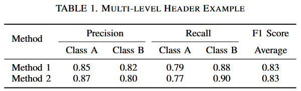
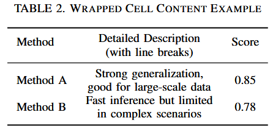
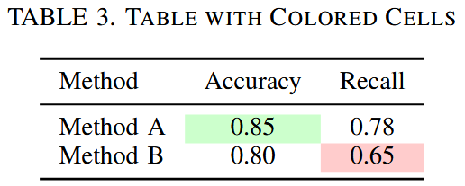
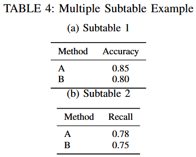
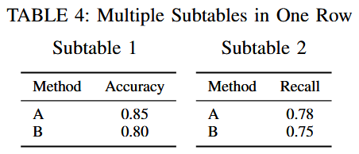
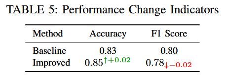

# Awesome Table Templates Collections

收集 paper writing 需要用到的各类精致优雅的 latex table 模板, 以便之后 / 后来者参考使用


## Multi-level Header Table

```latex
\usepackage{multirow}

\begin{table}[htbp]
  \centering
  \caption{Multi-level Header Example}
  \label{tab:multiheader}
  \begin{tabular}{lccccc}
    \toprule
    \multirow{2}{*}{Method} & \multicolumn{2}{c}{Precision} & \multicolumn{2}{c}{Recall} & F1 Score \\
    \cmidrule(r){2-3} \cmidrule(r){4-5}
     & Class A & Class B & Class A & Class B & Average \\
    \midrule
    Method 1 & 0.85 & 0.82 & 0.79 & 0.88 & 0.83 \\
    Method 2 & 0.87 & 0.80 & 0.77 & 0.90 & 0.83 \\
    \bottomrule
  \end{tabular}
\end{table}
```




## Table with Wrapped Text Cells

```latex
\usepackage{booktabs}
\usepackage{array}
\usepackage{makecell}

\begin{table}[htbp]
  \centering
  \caption{Wrapped Cell Content Example}
  \begin{tabular}{l >{\centering\arraybackslash}m{3cm} c}
    \toprule
    Method & \makecell{Detailed Description \\ (with line breaks)} & Score \\
    \midrule
    Method A & Strong generalization, good for large-scale data & 0.85 \\
    Method B & Fast inference but limited in complex scenarios & 0.78 \\
    \bottomrule
  \end{tabular}
\end{table}
```




## Table with Cell Colors

```latex
\usepackage[table]{xcolor}
\usepackage{colortbl}

\begin{table}[htbp]
  \centering
  \caption{Table with Colored Cells}
  \begin{tabular}{lcc}
    \toprule
    Method & Accuracy & Recall \\
    \midrule
    Method A & \cellcolor{green!20}0.85 & 0.78 \\
    Method B & 0.80 & \cellcolor{red!20}0.65 \\
    \bottomrule
  \end{tabular}
\end{table}
```




## Subtables in One Table Environment

```latex
\usepackage{subcaption}

\begin{table}[htbp]
  \centering
  \caption{Multiple Subtable Example}
  \begin{subtable}{0.45\textwidth}
    \centering
    \caption{Subtable 1}
    \begin{tabular}{lc}
      \toprule
      Method & Accuracy \\
      \midrule
      A & 0.85 \\
      B & 0.80 \\
      \bottomrule
    \end{tabular}
  \end{subtable}
  \hfill
  \begin{subtable}{0.45\textwidth}
    \centering
    \caption{Subtable 2}
    \begin{tabular}{lc}
      \toprule
      Method & Recall \\
      \midrule
      A & 0.78 \\
      B & 0.75 \\
      \bottomrule
    \end{tabular}
  \end{subtable}
\end{table}
```



```latex
\usepackage{booktabs}
\usepackage{subcaption}

\begin{table*}[htbp]
  \centering
  \caption{Multiple Subtables in One Row}
  \begin{minipage}{0.15\textwidth}
    \centering
    \caption*{Subtable 1}
    \begin{tabular}{lc}
      \toprule
      Method & Accuracy \\
      \midrule
      A & 0.85 \\
      B & 0.80 \\
      \bottomrule
    \end{tabular}
  \end{minipage}
  \hspace{0.01\textwidth}
  \begin{minipage}{0.15\textwidth}
    \centering
    \caption*{Subtable 2}
    \begin{tabular}{lc}
      \toprule
      Method & Recall \\
      \midrule
      A & 0.78 \\
      B & 0.75 \\
      \bottomrule
    \end{tabular}
  \end{minipage}
\end{table*}
```




## Table with Colorful Change Indicators

```latex
\usepackage{booktabs}
\usepackage[table]{xcolor}
\usepackage{amsmath}   % support upper/lower index
\usepackage{amssymb}   % support arrow

\begin{table}[htbp]
  \centering
  \caption{Performance Change Indicators}
  \begin{tabular}{lcc}
    \toprule
    Method   & Accuracy                            & F1 Score                             \\
    \midrule
    Baseline & 0.83                                & 0.80                                 \\
    Improved & $0.85^{\textcolor{green!60!black}{\uparrow+0.02}}$ & $0.78_{\textcolor{red}{\downarrow-0.02}}$ \\
    \bottomrule
  \end{tabular}
\end{table}
```



