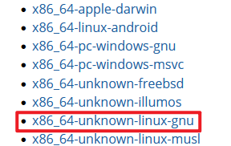

# Rust 基础语法 I

环境安装, 变量, 数据类型, 函数, 注释, 控制流 if-else

## 环境安装

下载安装软件 [https://www.rust-lang.org/tools/install](https://www.rust-lang.org/tools/install)

以 Ubuntu20.04 操作系统为例, 选择 `x86_64-unknown-linux-gnu`



下载至Ubuntu系统运行, 或者使用命令行完成安装

```shell
# one line command to install rust
curl --proto '=https' --tlsv1.3 https://sh.rustup.rs -sSf | sh

# output example
info: downloading installer

Welcome to Rust!

This will download and install the official compiler for the Rust
programming language, and its package manager, Cargo.

Rustup metadata and toolchains will be installed into the Rustup
home directory, located at:

  /home/fa1c4/.rustup

This can be modified with the RUSTUP_HOME environment variable.

The Cargo home directory is located at:

  /home/fa1c4/.cargo

This can be modified with the CARGO_HOME environment variable.

The cargo, rustc, rustup and other commands will be added to
Cargo's bin directory, located at:

  /home/fa1c4/.cargo/bin

This path will then be added to your PATH environment variable by
modifying the profile files located at:

  /home/fa1c4/.profile
  /home/fa1c4/.bashrc
  /home/fa1c4/.zshenv

You can uninstall at any time with rustup self uninstall and
these changes will be reverted.

Current installation options:


   default host triple: x86_64-unknown-linux-gnu
     default toolchain: stable (default)
               profile: default
  modify PATH variable: yes

1) Proceed with standard installation (default - just press enter)
2) Customize installation
3) Cancel installation
>1
...

# set the environment variables
source $HOME/.cargo/env

# test installation
rustc --version # rust compiler
# rustc 1.83.0 (90b35a623 2024-11-26)
cargo --version # rust package manager like pip for python
# cargo 1.83.0 (5ffbef321 2024-10-29)
```

基本使用

```shell
# compile single rust source code
rustc test.rs

# for general development it's recommended use cargo to maintain rust project
# create new rust project which named test_proj
cargo new test_proj
# it will generate Cargo.toml(Tom's Obvious, Minimal Language, the configure file of Cargo), src/main.rs
# probably include .git, .gitignore

# if you didn't create project from scratch and write some code firstly
# convert the source code into cargo project by moving all code into src directory and write the Cargo.toml file yourself

# build the project using cargo
cargo build
# it will generate cargo.lock file at root directory of rust project
# which contains the trace information of versions of packages. Do not modify it.

# compile and run the project using cargo
cargo run

# check if the source code can pass compiling process without generating binary
cargo check 
# this command checking source code error more efficiently than cargo build

# release version, speedup the binary execution with longer compiling time 
cargo build --release
# the binary will generate at target/release instead of target/debug
```


## 变量


## 数据类型


## 函数


## 注释


## 控制流: IF ELSE

