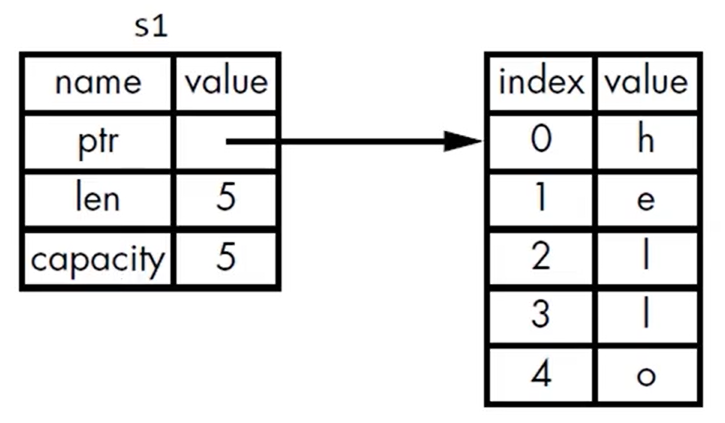
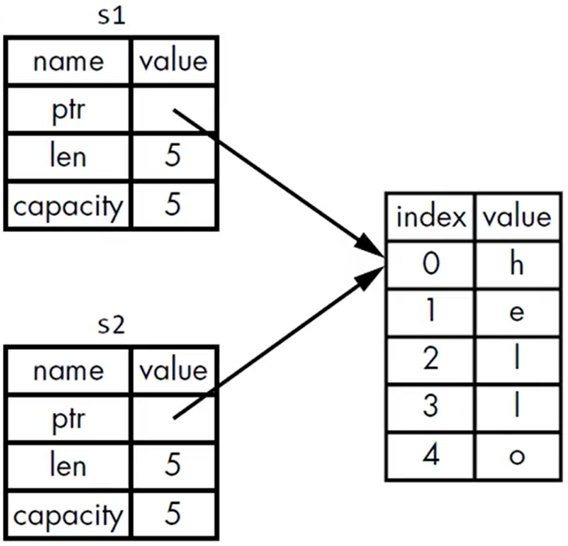
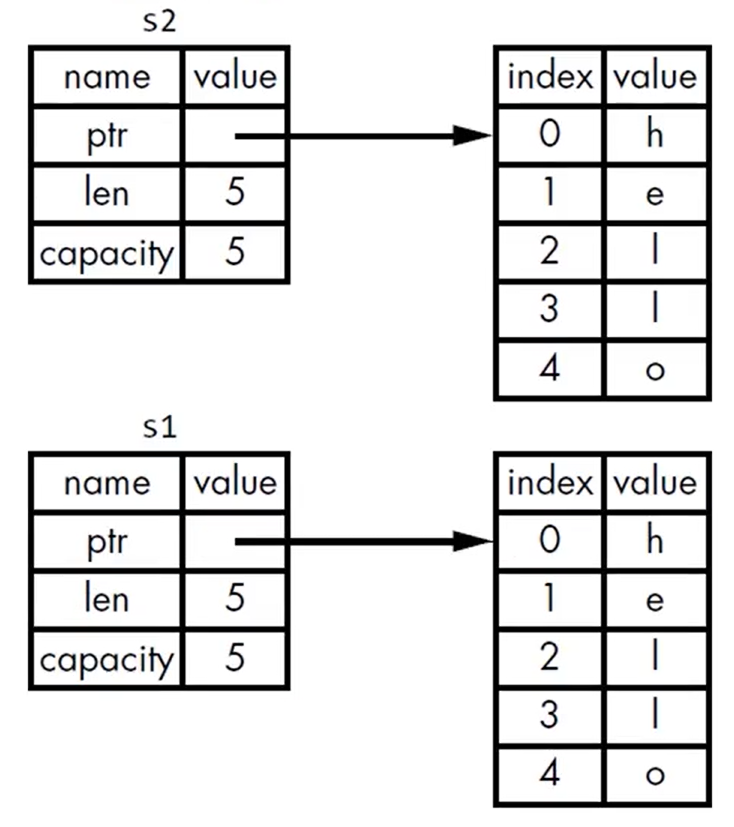
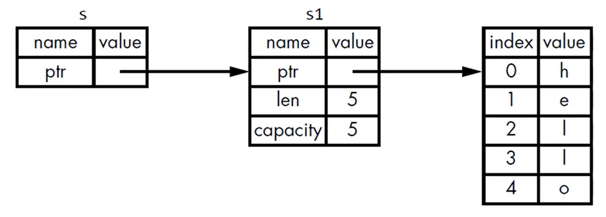

# Rust 基础 II

所有权, 引用与借用, 切片, struct


## 所有权

保证内存安全三条路:

+ 程序员自己显示分配和释放来管理内存
+ 垃圾收集机制 GC (garbage collector) 保证内存安全
+ Rust的核心特性, 所有权系统管理内存, 不会造成额外运行时开销


Stack 按顺序存储数据, 相反顺序移除, Last In First Out (LIFO). 所有 Stack 数据必须已知且固定大小. 数据操作效率更高.

Heap 编译时未知或者运行时大小可变的数据必须放在 heap 上. 对 heap 的使用需要进行分配, 标记为在用并返回内存指针. 

函数调用: 函数本地变量入 stack, 函数结束后变量出 stack.


所有权特性 (目的是管理 heap 数据)

+ 跟踪代码正在使用 heap 的数据
+ 最小化 heap 重复数据量
+ 清理 heap 未使用的数据


**所有权规则**

+ 每个值的所有者为该值的变量
+ 每个值同时只有一个所有者
+ 所有者超作用域 (scope) 时, 值被删除


变量作用域

```rust
fn main() {
    // s unavailable
    let s = "test"; // s available
} // s unavailable
```

变量离开作用域时, rust 会自动调用 drop 函数移除变量值.


以 **String** 类型为例讲解所有权规则

```rust
fn main() {
    let s1 = String::from("hello");
    let s2 = s1;
}
```

对于 `let s1 = String::from("test");` rust 会在 heap 中分配容量 (capacity) 为5, 长度为5, ptr指向 heap 的内存空间. 



`let s2 = s1;` 会直接让s2 ptr 指向 s1的同一内存地址, 而不是重新申请. 并且, s2声明时, 会移除s1变量. 如果再使用 s1 会报使用 moved 变量的错误.



变量的数据包括 (ptr, len, capacity) 保存于 stack 上, 变量的值保存在 heap 上. Rust 不会自动进行深拷贝, 保证性能. 而且 Rust 没有浅拷贝的操作, 而是用 move (移动) 代替.

如果要进行深拷贝, 需要显示操作 `clone()`

```rust
let s1 = String::from("hello");
let s2 = s1.clone();
```




对于 stack 上的数据, 因为所有编译时确定大小的数据复制操作效率高, 复制时 rust 自动进行深拷贝. 


**copy trait**

+ 任何标量及其组合类型都可有 copy trait. 如整数, bool, char, f64(32), tuple(标量类型)等.
+ 任何需要分配内存或其他资源的类型都不能有 copy trait. 如 String 等.


**函数的所有权**

函数的值传递, 变量只有移动或复制. 如下面示例, s 变量 (String 类型没有 copy trait) 会在传入函数 `take_ownership` 时移动而被移除, x 变量因为具有 copy trait, 传入函数 `makes_copy` 时发生复制, 在 `main` 函数中依然有效. 

这个特性对函数的返回值同理. `gives_back_ownership` 函数会返回传入的变量所有权, `main` 函数中可以得到与 `t1` 相同的变量 `t2`. 当一个值没有被变量所有, 触发 drop 函数时就会被清理. 

```rust
fn main() {
	let s = String::from("fa1c4");
    take_ownership(s); // s free
    
    let x = 233;
    makes_copy(x);
    println!("x: {}", x);
    
    let t1 = String::from("falca");
    let t2 = gives_back_ownership(t1); // t1 free but same memory returns to t2
}

fn take_ownership(sstring: String) {
    println!("{}", sstring);
} // sstring value free

fn makes_copy(snumber: i32) {
    println!("{}", snumber);
}

fn gives_back_ownership(tstring: String) {
    tstring
}
```


## 引用 & 借用

函数的所有权转移规则, 使得函数之间传参比较麻烦, 因此 rust 提供 Reference (引用) 机制进行函数间传递变量. 将变量的引用作为函数参数的行为称为借用. 如果借用的变量没有显示声明为 `mut` 则调用者无法修改借用的变量. 引用的变量同时 (或者同作用域) 最多被借用一次 (该机制克服了条件竞争漏洞的可能性). 并且, 对一个变量, 不可同时存在可变和不可变引用. 

```rust
fn main() {
    let s1 = String::from("hello");
    let len = cal_length(&s1); // reference of s1
    println!("the length of {} is {}.", s1, len);
    
    let len = mut_length(&mut s1); // mutable reference of s1
    println!("the length of {} is {}.", s1, len);
}

fn cal_length(s: &String) -> usize {
    s.len()
}

fn mut_length(s: &mut String) -> usize {
    s.push_str(" test");
    s.len()
}
```



引用的两个规则:

+ 一个可变引用
+ 任意数量不可变引用


## 切片

slice 是 rust 支持的一种不持有所有权的数据类型. 注意, 字符串切片索引必须在 UTF-8 字符范围内, 无法在多字节的字符进行字符串切片. 字符串切片作为函数参数类型, 相比 String 类型通用性更好.

```rust
fn main() {
    let s = String::from("hello falca");
    let hello = &s[..5];
    let falca = &s[6..];
    let whole = &s[..];
    println!("{}, {}, {}", hello, falca, whole);
    
    let first_word = get_first_word(&s[..]); // slice type to transfer parameter 
    println!("the first word is {}", first_word);
}

fn get_first_word(s &str) -> &str {
    let bytes = s.as_bytes();
    for (i, &item) in bytes.iter().enumerate() {
        if item == b' ' {
            return &s[..i];
        }
    }
    &s[..]
}
```


## struct

使用关键字 `struct` 定义结构体, 并为每个 `field` 定义名称和类型, 类型最后 (包括最后一个field) 都需要 `,`. 注意, struct 只能作为一个整体可变或者不可变, 不存在部分 fields 可变, 部分 fields 不可变的情况. 

```rust
struct User {
    username: String,
    email: String,
    sign_in_count: u64,
    active: bool,
}

fn main() {
    let mut user1 = User {
        email: String::from("xxx@example.com"),
        username: String::from("xxx"),
        sign_in_count: 1,
        active: true,
    };
    user1.email = String::from("updated@example.com");
    
    // struct syntactic sugar
    let user2 = User {
        ..user1 // inherit user1 values
    };
}
```

struct 可以用来定义 tuple struct, 即显示声明 tuple 的类型

```rust
struct Color(i32, i32, i32);
struct Point(i32, i32, i32);

let black = Color(0, 0, 0);
let origin = Point(2, 3, 3);
```

struct 里面的 field 也可以是引用类型, 但是要严格定义生命周期, 确保 struct 类型有效与 field 的引用类型有效是严格绑定的, 否则 rust 会报错. (生命周期详见之后的blog)


struct 的方法 (enum 和 trait 同理), 使用 `impl` 关键字接 struct 变量名来定义方法, 在 `impl` 里可以也定义关联函数, 一般用来定义构造器.

```rust
#[derive(Debug)]
struct Rectangle {
    width: u32,
    length: u32,
}

impl Rectangle {
    // method: first parameter is &self
    fn area(&self) -> u32 {
        self.width * self.length
    }
    
    // function: first parameter is NOT &self
    fn square(size: u32) -> Rectangle {
        Rectangle {
            width: size,
            length: size,
        }
    }
}

fn main() {
    let rect = Rectangle {
        width: 22,
        length: 33,
    };
    
    // use :: to call function square
    let sqr = Rectangle::square(233);
    
    println!("{}", rect.area());
    println!("{:#?}", rect);
    println!("{}", sqr.area());
    println!("{:#?}", sqr);
}
```


