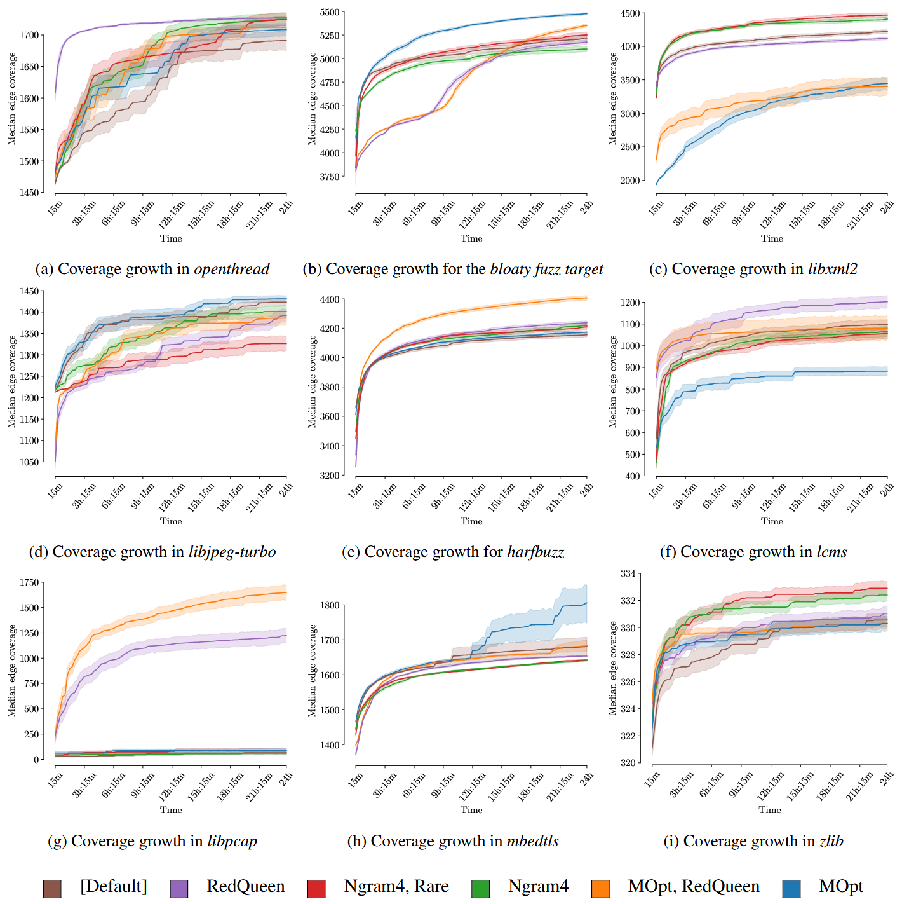

# AFL++: Combining Incremental Steps of Fuzzing Research [WOOT 2020]

**AFL++**, 由社区驱动的开源 Fuzzer, 结合最先进的模糊测试研究成果, 使得研究成果可以比较, 复现, 组合以及使用. 提供定制变异器 API, 可在多阶段扩展模糊测试过程. 最后揭示一个事实: 每种模糊器在不同目标上不具有泛化性.

## Contributions

1. 将近期的模糊测试研究整合到一个工具 AFL++ 中
2. 创新定制变异器 API
3. 评估集成的技术和特性
4. https://github.com/AFLplusplus

## AFL

### Coverage Guided Feedback

AFL 的覆盖反馈结合边覆盖率和在一次运行中每个边被执行的次数. 这个计数被以 2 的幂次进行分桶, 以避免路径爆炸. 如果某个输入探索了至少一个新的边的分桶, 它就被认为是有趣的 (即保存到队列中). 这些分桶, 或称为命中计数, 在执行过程中被记录到一个共享的位图中, 其中每个字节表示一边 (该位图的大小有限, 因此可能会发生冲突). 通过覆盖反馈, AFL 尝试在修剪阶段对队列中的每个测试用例进行裁剪, 以减少测试用例的大小并提高目标的速度, 同时保持覆盖率不变. 

### Mutations

AFL 的变异分为两类: 确定性变异和混乱 (havoc) 变异. 确定性变异包括对测试用例内容进行单一确定变异, 如位翻转、添加、使用一组常见有趣值 (如-1、INT_MAX等) 进行替代等. 在混乱阶段, 变异是随机堆叠的, 还包括对测试用例大小的修改 (例如添加或删除输入的某些部分). 此外, 在后续拼接阶段, AFL 会将两个测试用例合并为一个, 并应用混乱变异. 

### Forkserver

模糊器将一个通过 IPC 机制控制的 forkserver 注入到目标中. 每当 AFL 需要执行一个测试用例时, 它会写入输入数据, 然后告诉目标进程进行 fork. 子进程将执行该测试用例, 而父进程则在此期间等待. forkserver 可以避免程序初始化和启动例程的成本.

### Persistent Mode

持久模式下, 目标程序不会为每个测试用例进行 fork. 相反, 可以将一个循环修补到目标程序中, 每次迭代执行一个测试用例. 为了使其正常工作, 每次迭代需要尽量减少状态变化.

## Integrated Fuzzers

+ AFLFast
+ MOpt
+ LAF-Intel
+ RedQueen
+ AFLSmart

## AFL++

### Seed Scheduling

AFL++ 结合 AFLfast, 并在此基础上扩展额外的功率调度策略. 

包括 AFLfast 中的所有调度策略: fast、coe、explore、quad、lin 和 exploit. 这些调度策略是以下变量的函数:

1. 从队列中选择种子的次数
2. 具有相同覆盖率的生成输入数量
3. 通常具有相同覆盖率的生成测试用例的平均数量

默认的调度策略是 explore. 此外, AFL++ 添加 mmopt 和 rare 调度策略. Mmopt 增加最新种子的得分, 以帮助深入挖掘新发现的路径. Rare 则忽略种子的运行时间, 并且特别关注那些其他种子很少覆盖的边.

### Mutators

#### Custom Mutator API

AFL++ 可以轻松扩展以适应学术界的新研究, 并能够为漏洞发现定制特定的目标. 为此, 它提供一个不断扩展的API. 

自定义变异器允许模糊测试研究在 AFL++ 基础上构建新的调度、变异和最小化功能, 无需像许多现有工具那样分叉和修补 AFL. 插件可以用与 C ABI 兼容的语言编写, 甚至可以用 Python 原型化. 通过当前的 API, 如 AFLsmart 可以完全重写为 AFL++ 插件.

目前实现的功能: 

- **afl_custom_(de)init**: 每个自定义变异器可以使用这些自解释函数来初始化或反初始化模块, 分别为 `afl_custom_init` 和 `afl_custom_deinit`. AFL++ 的伪随机生成器种子会传递给 `init` 函数. 自定义变异器应确保给定相同种子时, 模糊测试结果是可复现的
- **afl_custom_queue_get**: 这是一个回调函数, 用于确定自定义模糊测试器是否应对当前队列项进行模糊测试. 在这个例程中, 用户还可以初始化与输入相关的元数据, 例如, 用于结构化模糊测试的虚拟结构
- **afl_custom_fuzz**: 在给定输入上执行自定义变异. 它接受一个额外的测试用例.
- **afl_custom_havoc_mutation**: 在给定输入上执行一次自定义变异. 这个变异将与混乱阶段中的其他变异叠加
- **afl_custom_havoc_mutation_probability**: 返回在混乱阶段调用自定义变异的概率, 启用调优 (默认为6%, 灵感来自AFLsmart)
- **afl_custom_post_process**: 在某些情况下, 来自自定义变异器的变异数据格式不适合直接使用该输入执行目标. 例如, 在使用libprotobuf-mutator时, 返回的数据是 protobuf 格式, 符合特定语法, 必须先转换为目标的纯文本格式. 在这种情况下, 用户可以定义 `afl_custom_post_process` 函数
- **afl_custom_queue_new_entry**: 在将新测试用例添加到队列后调用, 这是一个有用的钩子, 可以将元数据存储到磁盘中

**Trimming Support**

AFL++ 实现的通用修剪例程, 可能会破坏复杂格式的结构. 这尤其适用于当目标可以处理输入的某一部分 (产生覆盖), 但在处理剩余输入时出错的情况. 在这种情况下, 实现自定义修剪例程是有意义的. 该 API 包含多个方法, 因为在每个修剪步骤后, 覆盖位图必须与修剪前的位图进行比较

- **afl_custom_init_trim**: 在每次修剪操作开始时调用, 接收初始缓冲区. 它应返回此输入可以进行的迭代步骤数 (例如, 如果输入有 n 个元素, 其中一个应被移除, 则返回 n-1). 如果实现的修剪算法无法确定 (剩余的) 步骤数量, 则可以返回1, 表示仍然可以进行进一步的修剪, 直到 `afl_custom_post_trim` 返回 0 为止
- **afl_custom_trim**: 每次修剪操作时调用. 它记住当前的状态, 因此可以为每次迭代节省重新解析步骤. 它应返回修剪后的输入缓冲区, 返回的数据长度不得超过初始输入数据的长度
- **afl_custom_post_trim**: 每次修剪操作后调用, 用于指示修剪步骤是否成功 (就相同的覆盖率而言). 此方法必须返回下一个修剪迭代的索引 (从 0 到 `afl_custom_init_trim` 中返回的最大步骤数)

#### Others

其他变异器支持

+ Input-To-State Mutator
+ MOpt Mutator

### Instrumentations

与插桩器的后端无关, 作者为 AFL 的命中计数机制开发一种优化方法. 使用字节来表示位图条目的一个问题是, 边的执行次数可能会发生溢出. 当发生溢出时, 如果一个边被执行多次, 达到256的倍数, 导致相应的位图条目溢出为0, 模糊测试器就会进入不一致状态. 作者尝试通过两种解决方案来解决这个问题: NeverZero 和饱和计数器 (Saturated Counters). 

- **NeverZero**：此方法通过始终将进位标志添加到位图条目, 避免溢出为 0 的问题. 如果一个边至少被执行一次, 条目将始终非零. 
- **Saturated Counters**: 此方法在计数器达到 255 时冻结计数器

在一系列实验中, 作者发现 NeverZero 非常有效, 并且在覆盖率和速度方面提升 AFL (现在种子选择考虑之前被隐藏的边). 然而, 饱和计数器反而降低了 AFL 的整体性能. 作者选择将 NeverZero 作为 AFL++ 在大多数可用插桩器后端的默认选项. 

#### LLVM

支持从 LLVM 3.4 到 LLVM 11 (beta版本) 的范围. 在LLVM模式下, AFL++ 除支持边覆盖率外, 还支持一系列覆盖度量: 

- **上下文敏感的边覆盖**: 边覆盖通过对每个块分配的 ID 与被调用者的唯一 ID 进行 XOR 操作. 这一解决方案在代码覆盖率方面有效, 尽管其缺点是会增加碰撞并降低速度.
- **N-gram**: 与考虑前一个块和目标块的方式不同, 在记录边时, 模糊测试器考虑目标块和 N-1 个前块, 其中 N 是一个介于 2 和 16 之间的数字.

#### Others

其他的插桩支持包括

+ GCC
+ QEMU
+ Unicornafl
+ QBDI

## Evaluation

