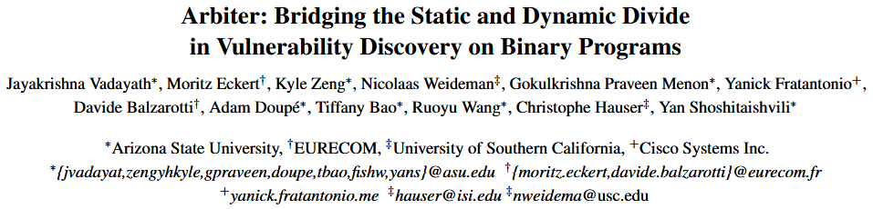
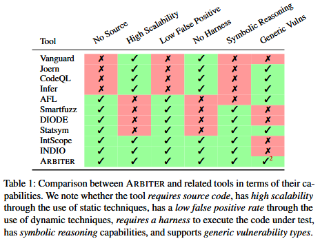
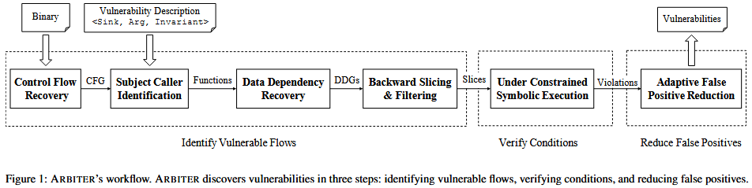
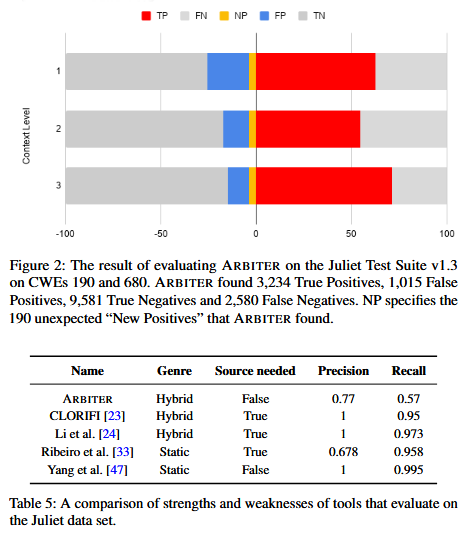

# Arbiter: Bridging the Static and Dynamic Divide in Vulnerability Discovery on Binary Programs [USENIX 2022]

尽管在漏洞发现方面效果显著, 但当前最先进的二进制程序分析方法仍受限于准确性和可扩展性之间的内在权衡. 在本文中, 我们确定了一组漏洞属性, 这些属性能够同时辅助静态和动态漏洞检测技术, 提高前者的精度和后者的可扩展性. 通过精心整合静态和动态技术, 我们在大规模的真实世界程序中检测出具有这些属性的漏洞. 我们实现在二进制代码分析方面取得了多项进展, 并创建了一个名为 ARBITER 的原型. 我们通过针对四个常见漏洞类别 CWE-131 (缓冲区大小计算错误)、CWE-252 (未检查返回值)、CWE-134 (不受控制的格式字符串) 和 CWE-337 (伪随机数生成器中的可预测种子) 的大规模评估, 展示我们方法的有效性. 我们在 Ubuntu 存储库中的超过 76516 个 x86-64 二进制文件上评估了我们的方法, 并发现了新的漏洞, 包括在编译过程中插入到程序中的缺陷. 

## Background

Table 1 列出了我们认为对漏洞挖掘技术在现实世界中广泛采用至关重要的六个特性. 尽管已有大量研究致力于漏洞发现, 但几乎没有一种技术能够同时具备自动化、可扩展性和通用性, 而这正是我们本研究的目标. 我们将与 ARBITER 密切相关的现有漏洞发现技术分为三个主要方向. 

+ White-box Static Vulnerability Analysis. 目前存在多种用于源代码漏洞检测的技术. 但主要关注, 基于图的漏洞检测方法, 如 Joern、Chucky 和 CodeQL, 依赖一系列精心设计的查询, 用以在程序源代码的图表示上表达特定模式 [35, 44, 46]. 它们的主要目标是缩小人工分析的范围, 使人只需关注可能存在漏洞的部分, 因此, 这些方法并不追求完全自动化或高精度. 
+ Dynamic Analysis on Binaries. 已有大量文献探讨如何通过静态分析与 DSE 驱动模糊测试中的测试用例生成. 例如, SmartFuzz 结合了模糊测试与 DSE, 用于识别 Linux x86 程序中的整数错误. 它不仅通过 DSE 生成新测试用例, 还结合约束求解器来进一步检测整数运算中的断言错误, 如算术溢出、非值保持的宽度转换、危险的有符号/无符号转换等. 然而, 和其他动态方法一样, SmartFuzz 的扩展性严重受限于其从程序入口点进行的符号化探索. 还有一些方法采用污点分析或 DSE 发现应用程序中的漏洞, 例如 Statsym [48] 使用基于统计的 DSE, DIODE [39] 结合污点分析定位内存分配代码位置, 并通过 DSE 检查这些内存分配操作的参数是否存在整数溢出风险. 
+ Binary Static Analysis enhanced by DSE. 将静态分析与 DSE 结合以验证结果、减少误报并非新思路. 例如, INDIO [51] 是一种基于模式匹配的方法, 用于识别并排名可能存在漏洞的代码位置, 之后通过路径剪枝的 DSE 进行验证. 遗憾的是, INDIO 总是从程序入口点启动 DSE, 这极大地限制了其扩展能力. 另一个例子是 IntScope [42], 它利用路径敏感的数据流分析识别整数溢出, 结合污点分析和 DSE 验证是否满足溢出约束. 这种结合静态分析与 DSE、且能以较低误报率检测整数溢出的方式与 ARBITER 十分类似. 但问题在于, 这些方法仅针对特定类型漏洞 (如整数溢出), 而 ARBITER 的目标则更广泛. 

## Methods

我们的核心洞见在于：**通过精心选择具备可被静态和动态分析同时利用的特性 (properties) 的漏洞类型**, 可以合理界定漏洞检测的范围, 融合这两类方法, 实现高精度与良好可扩展性的平衡. 为此, 我们总结出一组“漏洞属性”, 这些属性一方面适用于静态分析, 另一方面也为引入动态分析技术提供了提升精度的契机. 

**(P1) 数据流敏感型漏洞 (Data-flow sensitive vulnerabilities)**
 这类漏洞可通过分析输入源 (input source) 与漏洞点 (sink) 之间的数据流关系进行发现. 值得注意的是, 数据流敏感型漏洞的范畴要比传统的“污点传播模型”更广泛——后者通常仅关注未对用户输入进行清洗的情况. 尽管静态分析在这方面存在精度局限, 但它仍可以胜任初步发现, 而引入动态验证 (如运行时数据流追踪) 则可以进一步提升检测精度. 

**(P2) 易于识别的源 (source) 与汇 (sink)**
 漏洞检测过程中的“源”用于启动数据流追踪, 而“汇”用于结束追踪. 对于很多漏洞类型, 准确识别源和汇往往需要对整个二进制程序进行精确别名分析 (alias analysis), 这在实际中代价极高、难以扩展. 举例来说, 如果某漏洞源定义为“读取 `/tmp/secret` 文件的所有数据”, 那么我们需要准确分析每一个打开文件的函数/系统调用的参数, 以及与文件指针、文件描述符、相关结构体的数据传播路径. 这显然难以实现. 

相反, 部分漏洞的源和汇可以通过简单、可扩展的静态分析过程自动识别, 例如通过控制流图 (CFG) 生成的分析结果. 一个典型例子是：将“所有对库函数 `malloc()` 的调用点”作为漏洞汇. 这类源汇组合可以通过程序切片 (program slicing) 技术从源到汇构建路径. 尽管该方法通常用于静态分析, 但其生成的切片也可以作为动态分析 (如 DSE) 的输入, 后者可以进一步推理和纠正切片中的过度近似, 从而提升整体检测精度. 

**(P3) 由控制流决定的别名关系 (Control-flow-determined aliasing)**
 数据流追踪几乎总需要处理别名信息, 这通常意味着要进行代价高昂的全程序别名分析. 但我们观察到, 许多漏洞相关的数据流要么不涉及指针解引用, 要么所涉及的指针在控制流上具有明确唯一的目标对象. 例如, 通过栈指针访问的局部变量, 其内存位置是确定的. 因此, 我们将这类别名情况称为“由控制流决定的别名关系”. 这种别名属性是我们选择支持漏洞类型的前提条件之一. 

Figure 1 展示 ARBITER 的整体框架概览 从高层次上看, ARBITER 将可扩展的静态分析技术与精确的动态符号执行 (DSE) 技术相结合. 静态分析部分可识别出程序中属性符合型 (Property-Compliant, PC) 漏洞候选项的超集, 而 DSE 则作为误报过滤器使用, 并允许在精度与扩展性之间进行配置权衡. 

ARBITER 完全作用于二进制代码. 虽然其底层分析思想源于对源代码的成熟研究, 但在二进制级别的应用仍需要若干创新的分析改进才能实现. 

+ 输入：(1) 目标二进制程序, 为了分析二进制代码, ARBITER 需要提供目标程序的二进制文件. 与纯动态分析方法 (如模糊测试) 不同, 该二进制文件不需要可执行. (2) 漏洞描述 (Vulnerability Description, VD), PC 型漏洞具有一些可被静态分析识别的特性. 这些特性以漏洞描述的形式传递给 ARBITER. 漏洞描述是对第 3 节中提到的静态和符号分析特征的程序化表示 (例如第 3.1 节针对 CWE-131、第 3.2 节针对 CWE-252 的描述) . ARBITER 支持通过新建 VD 来扩展其他 PC 漏洞类型的分析能力. 

+ 识别潜在漏洞路径. ARBITER 使用多种技术相结合, 识别出可能满足漏洞描述 (VD) 的数据流. 它首先在重建的控制流图 (CFG) 上查找与 VD 匹配的目标位置, 然后在计算出的数据依赖图 (DDG) 上查询这些目标之间是否存在满足 VD 条件的数据流. 之后, ARBITER 会计算出这些数据流路径, 并将其送入下一阶段. (详见论文第 5 节)

+ 验证漏洞条件. ARBITER 使用受限条件符号执行 (Under-Constrained Symbolic Execution, UCSE) 对上一阶段得到的路径进行执行, 恢复源点与汇点之间的符号数据关系. 如果该关系满足 VD 中定义的约束条件, 则该路径会进入下一阶段. (详见论文第 6 节)

+ 减少上下文引起的误报. 为了提高扩展性, ARBITER 的静态分析限制了上下文敏感性. 由此可能导致对某些漏洞候选路径中的约束条件分析不足, 进而产生误报. 为缓解这一问题, ARBITER 会从检测到的汇点出发, 使用更高上下文敏感性重新进行程序切片, 并对其进行符号执行, 以查找缺失的约束条件. 在这一阶段, ARBITER 有意识地牺牲一定的扩展性以换取更高的检测精度. 如果 ARBITER 无法在该阶段找到任何可驳回现有漏洞候选的约束条件, 则该漏洞候选将被正式上报给分析人员, 作为告警. (详见论文第 7 节)

## Evaluation

## References

[35] Semmle. CodeQL. https://securitylab.github.com/ tools/codeql.

[39] Stelios Sidiroglou-Douskos, Eric Lahtinen, Nathan Rittenhouse, Paolo Piselli, Fan Long, Deokhwan Kim, and Martin Rinard. Targeted automatic integer overflow discovery using goal-directed conditional branch enforcement. In Proceedings of the Twentieth International Conference on Architectural Support for Programming Languages and Operating Systems, pages 473–486, 2015.

[42] Tielei Wang, Tao Wei, Zhiqiang Lin, and Wei Zou. IntScope: Automatically detecting integer overflow vulnerability in x86 binary using symbolic execution. In NDSS, 2009.

[44] Fabian Yamaguchi, Nico Golde, Daniel Arp, and Konrad Rieck. Modeling and discovering vulnerabilities with code property graphs. In 2014 IEEE Symposium on Security and Privacy, pages 590–604. IEEE, 2014.

[46] Fabian Yamaguchi, Christian Wressnegger, Hugo Gascon, and Konrad Rieck. Chucky: Exposing missing checks in source code for vulnerability discovery. In Proceedings of the 2013 ACM SIGSAC conference on Computer & communications security, pages 499–510, 2013.

[48] Fan Yao, Yongbo Li, Yurong Chen, Hongfa Xue, Tian Lan, and Guru Venkataramani. Statsym: vulnerable path discovery through statistics-guided symbolic execution. In 2017 47th Annual IEEE/IFIP International Conference on Dependable Systems and Networks (DSN), pages 109–120. IEEE, 2017.

[51] Yang Zhang, Xiaoshan Sun, Yi Deng, Liang Cheng, Shuke Zeng, Yu Fu, and Dengguo Feng. Improving accuracy of static integer overflow detection in binary. In International Symposium on Recent Advances in Intrusion Detection, pages 247–269. Springer, 2015.

