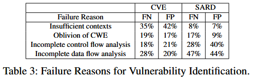

# Chain-of-Thought Prompting of Large Language Models for Discovering and Fixing Software Vulnerabilities [Hidden 2024]


传统深度学习方法在漏洞检测和修复中面临数据集规模小、标注质量差以及泛化能力不足等瓶颈. 论文探索如何利用LLMs (large language models) 和 CoT (chain-of-thought), 完成三类核心漏洞任务: (1) 指定类型漏洞的识别; (2) 各类漏洞的发现; (3) 漏洞的自动修复. 

提出统一的漏洞语义引导提示方法VSP (Vulnerability-Semantics-guided Prompting), 将CoT技术具体应用于上述任务, 通过引导模型理解漏洞语义和推理过程提升效果. 在两个真实漏洞数据集上, 针对三大任务对比五个基线方法, 使用三种不同的LLM进行广泛测试. 结果显示VSP在漏洞识别、发现和修复任务上, F1准确率分别提升了553.3%、36.5%和30.8%. 


## Method

**Vulnerability Semantics**. 与漏洞直接相关的关键代码行是漏洞语义的核心, 但是只有代码行而没有适当的上下文也不能触发漏洞, 因此控制流和数据流相关的上下文代码对漏洞分析也至关重要. 于是, 作者定义 vulnerability semantics 来表达漏洞代码行为和其上下文代码. 由此避免包含所有代码, 并帮助 LLM 集中注意力到关键部分上. 

Figure 1(a) 展示一个涉及 use-after-free 和 null-pointer-dereference 漏洞的示例, 并标注了漏洞语义. 为了理解这些语义, 首先定位可能存在这两类漏洞的语句, 即第 8 行中使用的指针, 该行用青色标记. 然后找出与第 8 行存在数据流和控制流依赖关系的语句: 第 2 行和第 6 行与第 8 行存在数据流关系, 可能导致空指针解引用和使用后释放漏洞, 用红色虚线箭头标示. 第 6 行和第 7 行之间存在控制流关系, 可能导致使用后释放漏洞, 用红色实线箭头标示. 因此, 第 2、6、7 行构成漏洞上下文, 标记为黄色. 综上, 第 8 行及其上下文共同构成了漏洞语义. 


基于 CoT 技术并结合漏洞语义, 提出 **Vulnerability-Semanticsguided Prompting (VSP)** 方法. 

**Prompting Strategy.** 每个VSP提示由两部分组成. 第一部分是一组示例, 这些示例为模型提供推理步骤的样本, 每个示例包含一个任务问题、一段代码样本, 以及该问题的答案, 答案中包括详细的推理步骤, 重点聚焦于上述的漏洞语义. 第二部分是希望模型分析的测试样本. 

Figure 2 展示整体设计框架: 在每个具体任务的详细提示方案下, 统一采用 VSP 作为通用策略. 


### Task1: Vulnerability Identification

目标: 判断给定代码样本是否存在特定类型的漏洞 (如某 CWE 漏洞)

任务: 将漏洞识别任务形式化为二分类问题. 在大语言模型 (LLM) 的输入提示中, 以文本形式提供代码样本, 并询问模型该代码是否存在指定的 CWE-xxx 漏洞.

提示设计: 如 Figure 1 (b) 所示, 对于每个示例提出漏洞识别问题, 并提示模型关注存在漏洞的部分, 每个示例的答案部分包括对 CWE 编号含义的解释以增强清晰度. 然后根据漏洞类型及其控制流和数据流关系, 定位可能的漏洞语句及其上下文, 分析上下文条件, 判断代码是否存在该漏洞. 最后通过对测试样本提出与示例相同的问题, 要求模型给出回答. 

```c
Q: Does the following code have exploitable vulnerabilities? Please check whether the inputs can be maliciously used for crashing the program.
1 void func(double X)
2 {
3     int a;
4     int b;
5     a=1;
6     char buf[20];
7     if (OK)
8         sprintf(buf,"%f", X);
9     b=1;
10    int c;
11    c=a+b;
12 }
A: Step 1: Find vulnerability semantics:
The function has an double-type input X. It is converted to a string at line 8 and the string is assigned to "buf", which is defined at line 6. Therefore, the vulnerability semantics is:
1 void func(double X)
6     char buf[20];
8         sprintf(buf,"%f", X);
Step 2: Vulnerability semantics analysis:
At line 6, "buf" is defined with size 20.
At line 8, "X" is converted into a string and assigned to "buf". However, it is possible that the converted string is longer than 20, which may cause a stack-based buffer overflow (CWE-121) vulnerability.
Conclusion: the code has an exploitable vulnerability.
```


### Task2: Vulnerability Discovery

目标: 要求大语言模型 (LLM) 在未提供具体 CWE 编号的情况下, 发现代码中可能存在的漏洞

任务: 将漏洞发现任务形式化为多分类问题. 给定一段文本形式的代码, 询问模型该代码是否存在漏洞, 如存在, 属于哪些 CWE 类型

提示设计: 如 Figure 1 (c) 所示, 每个示例中提出漏洞发现问题, 随后给出代码样本. 答案部分会列举可能存在漏洞的语句类型并定位于代码中. 针对每条潜在漏洞语句, 我们基于相关漏洞的控制流和数据流关系确定其上下文. 通过对漏洞语义的分析, 判断漏洞是否存在及其对应的 CWE 类型. 最后以示例中相同的问题形式提供测试样本, 要求模型给出回答. 

```c
Q: Which CWE does the following exploitable/vulnerable code have? Please classify it into one of the following CWEs: CWE-121 stack-based buffer overflow, CWE-122 heap-based buffer overflow, CWE-190 integer overflow, CWE-415 double free, CWE-416 use after free.
1 void read(struct st1 *info, struct st2 *str)
2 {
3     int a;
4     int b;
5     a=1;
6     int num=str->getCharSize();
7     for(int i=0; i<num; ++i)
8         info[i]=str->getChar();
9     b=1;
10    int c;
11    c=a+b;
12 }
A: Step 1: Find vulnerability semantics:
The function has inputs "info" and "str". The char size of "str" is assigned to "num" at line 6. At lines 6-7, the char of "str" is assigned to "info" with size "num". Therefore, the vulnerability semantics is:
1 void read(struct st1 *info, struct st2 *str)
6     int num=str->getCharSize();
7     for(int i=0; i<num; ++i)
8         info[i]=str->getChar();
Step 2: Vulnerability semantics analysis:
At line 6, the char size of "str" is assigned to "num".
At lines 6-7, the char of "str" is assigned to "info" which is allocated outside the function. The assignment size is "num". However, the size of "info" may be less than "num", causing a heap-based buffer overflow (CWE-122).
Conclusion: the code has a CWE-122 vulnerability.
```


## Evaluation

### Datasets

作者手工构建用于基于 CoT 少样本学习的示例, 针对 C/C++ 代码中最危险的五类CWE漏洞: (1) CWE-787 (越界写), (2) CWE-125 (越界读), (3) CWE-476 (空指针解引用), (4) CWE-416 (使用后释放), (5) CWE-190 (整数溢出). 针对每个 CWE 漏洞, 提供 4 组样本对, 每组包含一个有漏洞的样本及对应的修复样本, 共计20组样本. 这些样本参考了 CWE 报告官网上的示例 [1]. 示例的编写遵循了上文描述的策略. 


### Baselines

+ Standard Prompting. 不提供任何示例或指导
+ Standard Few-Shot Learning. 对于每个示例, 仅提供最终答案, 不包括推理步骤. 
+ Naive CoT-based Few-Shot Learning. 不专注于漏洞语义, 而是逐行分析代码来完成任务
+ Zero-Shot VSP Prompting. 不提供示例, 但在提示中提供基于VSP的漏洞分析步骤. 
+ Other-type VSP Prompting. 所使用的示例在目标测试 CWE 类型上与任何测试样本不同, 用于检测 LLM 迁移能力


### Task1


### Task2

省略...


### Failures Analysis

VSP 失败的根本原因分析

+ 提供给 LLM 的代码上下文不充分, 比如没有包含自定义/外部函数调用信息
+ 漏洞推理缺乏作为漏洞语义一部分的控制流信息
+ 缺乏关键数据流信息




## References

[1] 2022 cwe top 25 most dangerous software weaknesses. https://cwe.mitre.org/top25/archive/ 2022/2022_cwe_top25.html, 2022.
