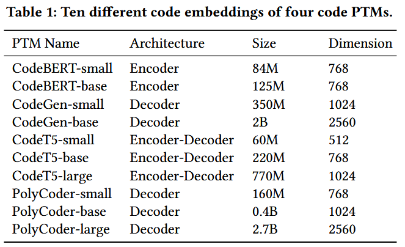
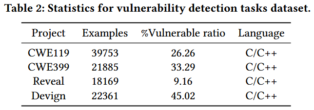
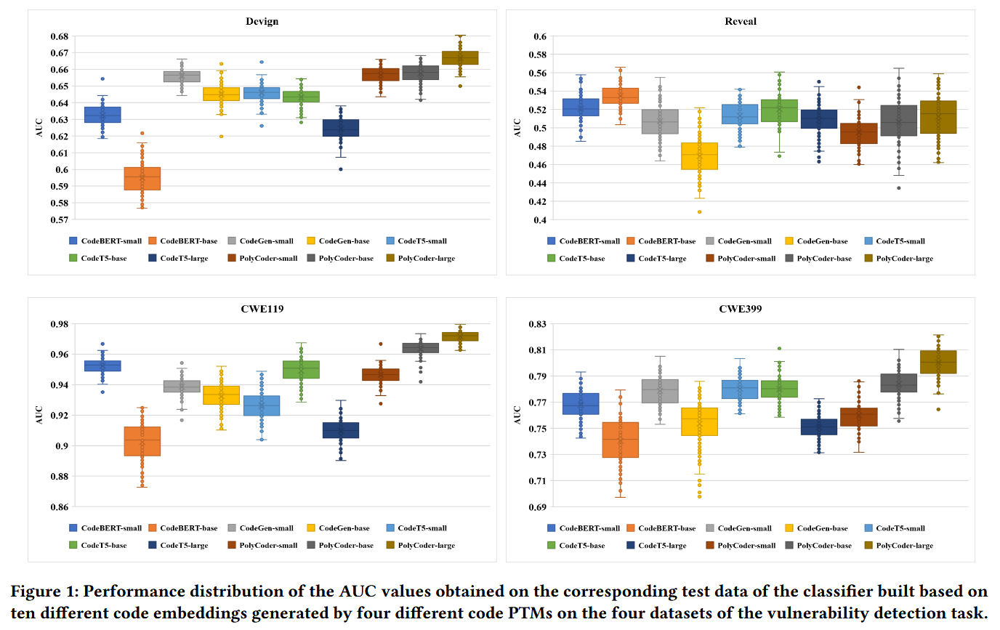
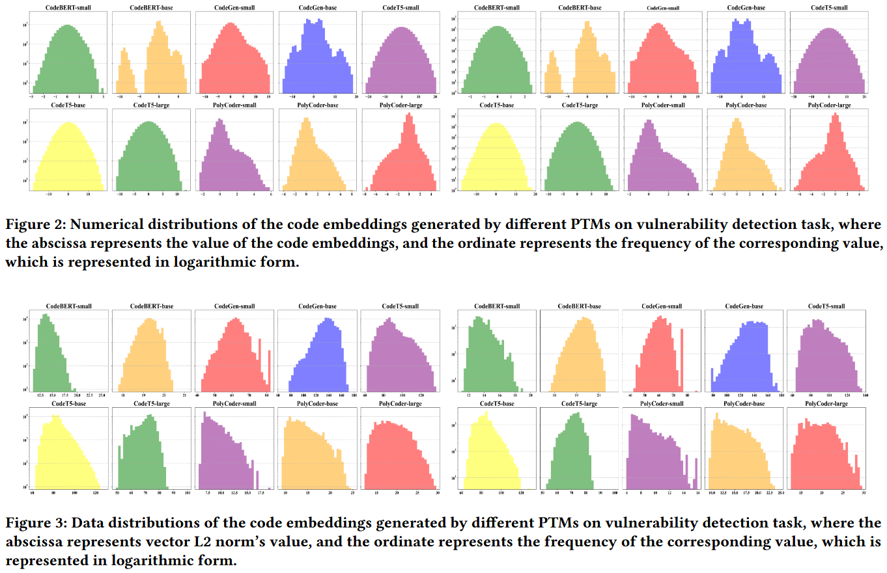

# Coding-PTMs: How to Find Optimal Code Pre-trained Models for Code Embedding in Vulnerability Detection? [ASE 2024]

不同 PTMs (pre-trained models) 在漏洞检测任务上的影响不同, 作者评估了 10 种不同 PTMs 得到结论: 不同 PTMs 生成的代码嵌入会影响性能, 并且根据参数规模和嵌入维度选择嵌入技术并不可靠. 作者分析了不同预训练模型生成的代码嵌入的数值表示和数据分布, 以评估差异和特征. 基于这些见解, 提出 Coding-PTMs, 一个推荐框架, 可帮助工程师为其特定的漏洞检测任务选择最佳的代码预训练模型. 在三个维度 (即统计、范数和分布) 上定义 13 个代码嵌入指标, 以构建一个专门的代码预训练模型推荐数据集. 之后, 使用随机森林分类器训练推荐模型, 并从候选模型库中识别出最佳的代码预训练模型. 

## Evaluation

**Observation 1** 在相同的参数规模下, 由不同的代码预训练模型生成的维度大致相同的代码嵌入, 在语义内容和任务表现方面存在显著差异. 

**Observation 2** 在相同的模型系列中, 用于漏洞检测任务的不同代码预训练模型 (PTM) 的参数规模越大, 初始代码嵌入的维度通常也会增加. 然而, 代码 PTM 中更大的参数规模并不一定意味着包含更丰富语义信息的更高维度代码嵌入以及更好的任务性能. 有时较小的 PTM 反而能生成质量更高的代码嵌入和更好的性能. 

Figure 2 展示了不同预训练模型在漏洞检测任务中生成的嵌入表示的数值分布. Figure 3 展示了不同预训练模型在漏洞检测任务中生成的嵌入表示的数据分布. 两张图的左侧是使用训练数据集生成的代码嵌入, 右侧是使用测试数据集生成的代码嵌入. 

**Observation 3** 在漏洞检测任务中, 来自不同家族的 PTMs 会生成数值范围各异的代码嵌入表示. 此外, 即使在同一个家族中, 参数大小不同的程序变换模型也会生成数值范围不同的代码嵌入表示. 

**Observation 4** 在漏洞检测任务中, 不同的预训练模型 (PTM) 生成的代码嵌入具有不同的数值分布. 具体而言, 由 CodeT5 系列生成的代码嵌入往往呈现出近乎完美的正态分布. 同时, 来自 CodeBERT 和 CodeGen 系列的代码嵌入也倾向于正态分布, 但存在一定的不完美之处. 另一方面, 来自 PolyCoder 系列的代码嵌入往往表现为偏态分布. 

**Observation 5** 在漏洞检测任务中, 不同的预训练模型 (PTM) 对于相同的训练集会产生具有不同数据分布的代码嵌入. 虽然训练集和测试集之间的代码嵌入数据分布通常看起来相似, 但细微的差异也能被观察到. 