# FOX: Coverage-guided Fuzzing as Online Stochastic Control [CCS 2024]

本文提出了一种端到端的在线随机控制模型, 用于覆盖引导的模糊测试. 该方法包含一个新的调度器和可以适应分支逻辑的自定义修改器, 最大化在多个阶段实现的聚合边缘覆盖. 该调度器利用细粒度的分支距离度量来识别前沿分支, 其中可能实现新的覆盖. 突变器利用分支距离信息进行高效和有针对性的种子突变, 以最小的开销实现鲁棒的进展. 

在FuzzBench数据集和复杂的真实程序 (共38个测试程序) 上进行的 6 CPU 年的测试结果表明, 与目前最先进的模糊测试器相比, FOX在独立程序上的覆盖率平均提高了26.45%, 在FuzzBench程序上的覆盖率平均提高了6.59%. 

## Theory

### Problem Definition

覆盖率导向基于变异的模糊测试可以定义为在线优化问题 [28], 目标是最大化目标程序的边覆盖. 设目标程序为 $$P$$, 接受输入最长为 $$M$$ 比特, 对于 fuzzing 的每次迭代 $$i$$, fuzzer 从 corpus $$S_i$$ 中选择下标为 $$u_i$$ 的种子 $$S_i[u_i]$$, 并通过变异操作生成测试用例 $$x = mut(S_i[u_i])$$, 之后输入 $$P$$ 执行并获取 $$x$$ 对于 $$S_i$$ 的边覆盖增量 $$cov(x, S_i)$$, 再根据边覆盖增量决定更新 $$S_i \rightarrow S_{i+1}$$, 若 $$x$$ 使得边覆盖增加则并入 $$S_i$$. 

定向灰盒模糊测试的边覆盖率最大化描述为, 找到下标 $$u_i$$ 序列, 使得所有 K 次迭代基于种子库 $$S_i$$ 突变的所有种子 $$mut(S_i[u_i])$$ 的累积覆盖率最大. 如公式 (1) 所示

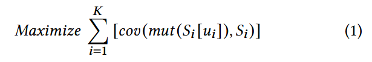

因为模糊器只能在每个阶段先后应用变异操作, 再观察 $$cov$$ 函数的输出. 在线优化环境中, 决策者 (在本例中是fuzzer) 必须在不完全知道目标函数未来各阶段值的情况下于每个阶段做出选择. 模糊测试器的目标是最大化测试阶段序列的累积覆盖率. fuzzing 的在线优化问题, 即找到最优种子选择和变异序列, 使得整个 fuzzing 过程的覆盖率最大化. 

### Stochastic Optimal Control Problem

因为变异的随机性和目标程序行为的不确定性, 系统动态可以表示为随机过程. 因此, 基于变异的模糊测试可以建模为随机最优控制问题. 

在最优控制问题中, 主要目标是给定状态空间和控制空间, 找到最优控制策略. 模糊测试场景中, 状态空间表示模糊测试器在每个阶段的状态, 即当前种子语料库 $$S_i$$, 控制空间对应于模糊测试器所做的选择, 例如选择变异的种子. 建模为随机最优控制问题, 一共有 5 个关键组件: 

**状态空间** 包含系统在任何给定阶段的所有可能配置或状态. 在模糊测试的背景下, 它包含了关于阶段 i 的当前种子语料库, 记为 $$S_i$$. 

**控制空间** 包含了所有可能影响系统行为的决策. 在模糊测试环境中, 它指在每个阶段选择哪个种子, 用种子语料$$S_i\ (1 \le u_i \le |S_i|)$$ 中的索引 $$u_i$$ 表示. 

**Fuzzer Dynamics.** 变异种子得到 $$x$$, 输入目标程序获得覆盖率 $$g_i$$, 更新状态 $$S_{i+1}$$. 

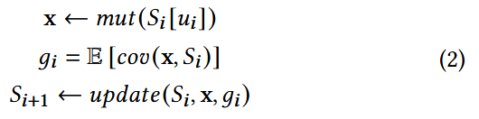

**目标函数** 定义了系统的目标或期望的结果. 在模糊测试的背景下, 它的目标是最大化 K 个阶段的总覆盖率增益: 

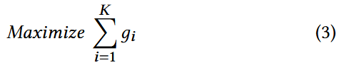

**约束** 表示系统需要满足的限制. 模糊测试通常受到资源限制, 比如总执行时间 (即每个阶段的执行时间之和 $$t_i$$) 不能超过模糊测试活动的总时间预算 $$T$$: 

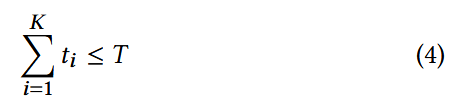

根据**为不同种子生成的不同程序输入是独立分布**的假设, 对特定分支 $$b$$ 的覆盖进行建模, 记为 $$cov_b (x, S_i)$$, 其中 $$x \leftarrow mut (S_i [u_i])$$ 为遵循伯努利分布的随机变量 $$x$$, 其成功概率为 $$Pr (b\ flip | mut (S_i [u_i]))$$. 每个 b 是阶段 i 未见的分支, $$cov_b (x, S_i)$$ 取值为 {0, 1} 表示分支反转与否. $$cov$$ 函数的期望可以表示为

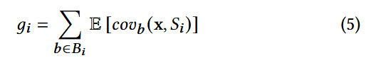

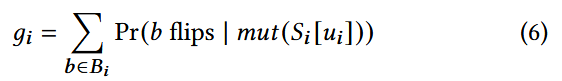

想要最大化期望覆盖率增量, 需要对 $$Pr(b\ flips\ |\ mut(S_i[u_i]))$$ 有一个好的估计, 传统做法是通过观测 $$mut(S_i[u_i])$$ 触发某分支的频率来估计触发概率, 但这种方法在当前任务中不可行, 因为未触发的分支概率为 0 (0频率估计为0概率). 

为了解决这个难点, 在基于图中心性的种子调度中, 作者利用了与 She 等人 [49] 提出的地平线节点 (horizon node) 密切相关的前沿节点 (frontier node) 的概念. 根据代码覆盖信息将 N 分为未访问的节点集U和已访问的节点集V. 与She等人将 horizon 节点识别为一组位于已访问和未访问代码区域边界的未访问节点不同, 作者将 frontier 节点定义为一组已访问节点, 它们支配未访问节点: 

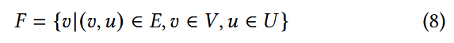

为了使用前沿节点来理解覆盖率, 只关注包含导致条件跳转的控制指令的边界节点子集 $$FB_i$$. 对于条件类型 (<, ≤, >, ≥, =, ≠), 给定前沿分支 $$b \in FB_i$$, 定义分段线性函数计算分支距离, $$f_b(x) = x - const$$, 其中 $$const$$ 为条件跳转的比较值.

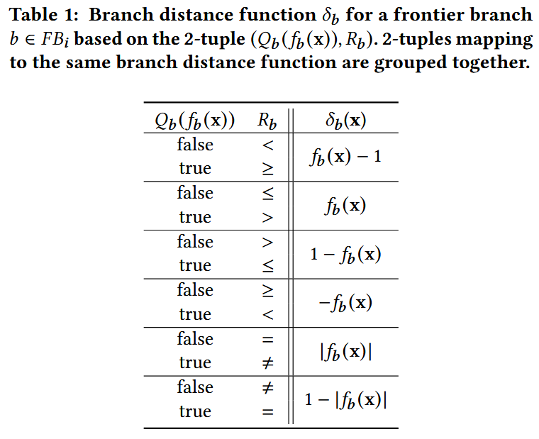

根据观察: branch 翻转时, 一定有分支距离减小; 但分支距离减小, 未必会导致 branch 翻转. 所以得到概率不等式

$$ Pr(b\ flips\ |\ mut(S_i[u_i])) \leq Pr(\delta_b\ decreases\ |\ mut(S_i[u_i])) $$

又因为没触发的 branch 不能计算分支距离 $$\delta_b$$, 所以覆盖率增量的期望可以估计为

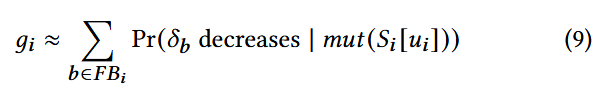

### Optimal-control-based Scheduler

使用贪心方法求解优化问题, 目标是在流式环境下高效选择种子, 从而最大化分支条件分支距离下降的概率. 

两步求解: **步骤 (a)**: 为每个分支 b, 找到能最大化 $$Pr\left(\delta_b \text { decreases } \mid mut\left(S_i\left[u_i\right]\right)\right)$$ 的种子. **步骤 (b)**: 选择具有最大概率 $$Pr$$ 的分支 $$b$$ 并更新种子与分支距离. 

数据结构: 使用映射 $$T_S$$ 来维护每个阶段 $$i$$ 的分支 $$b$$ 与对应的最优种子 $$T_S[b].s$$ 和分支距离 $$T_S[b].d$$

更新规则: 

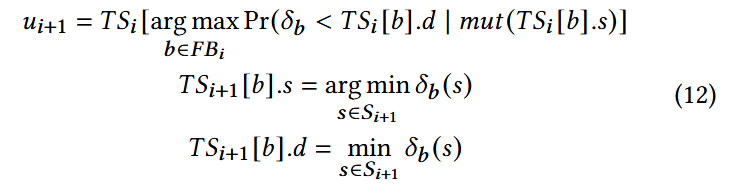

设 $$\lambda_b$$ 是映射到前沿分支 b 的种子的调度次数的衰减系数 (调度次数越多则衰减越大), $$pt(b)$$ 是降低前沿分支 b 的分支距离的总运行时间, $$tt(b)$$ 是从执行输入到触发前沿分支 b 的总执行时间. 最后分支距离减小的概率估计公式为: 

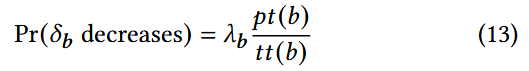

### Optimizing Mutation

通过优化变异阶段, 提高所有前沿分支的分支距离减少概率. 

**本地线性下界估计 (Local Search) **通过局部搜索构造一个线性下界近似器, 用于分支距离函数 $$\delta_b(x)$$​. 线性近似器提供一个局部下界, 确保在当前点 $$x$$ 的邻域 $$N(x)$$ 内, 分支距离的估计稳定. 并采用最小化“欠估计误差” (under-approximation error) 的策略, 而非平均误差, 保障后续牛顿法的稳定性. 

 **牛顿法 (Newton’s Method)** 如果局部搜索得到了有效梯度 $$g$$ (即非零向量) , 则利用牛顿法优化输入. 沿着梯度方向 $$g$$ 更新输入
$$
x=x-\frac{\delta_b(x)}{g}
$$
目标是找到一个 $$x$$, 使得分支距离 $$\delta_b(x)$$ 变为 0, 从而触发分支翻转. 

讨论: 使用牛顿法变异测试用例, 需要假设局部分支函数是线性且可达的, 如果非线性, 但是良性凸函数, 牛顿法变异优化依然可以降低分支距离 [18].

## References

[18] Stephen Boyd and Lieven Vandenberghe. 2004. Convex Optimization. Cambridge University Press.

[28] Elad Hazan et al. 2016. Introduction to online convex optimization. Foundations  and Trends® in Optimization (2016).

[49] Dongdong She, Abhishek Shah, and Suman Jana. 2022. Effective Seed Scheduling for Fuzzing with Graph Centrality Analysis. 2022 IEEE Symposium on Security and Privacy (SP) (2022), 2194–2211.

