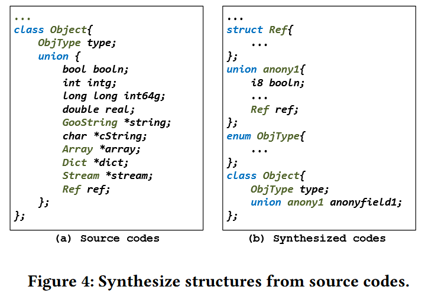
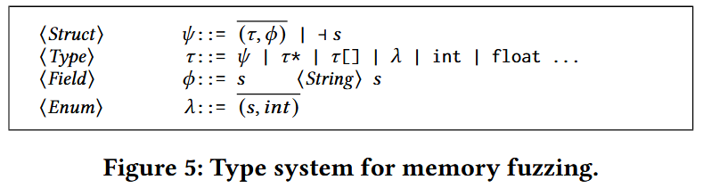
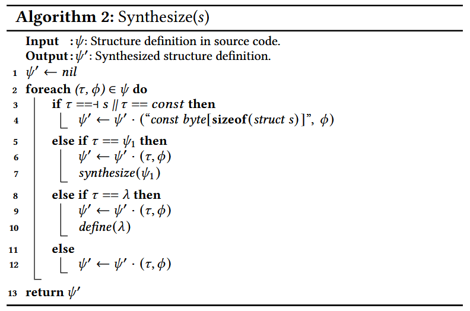
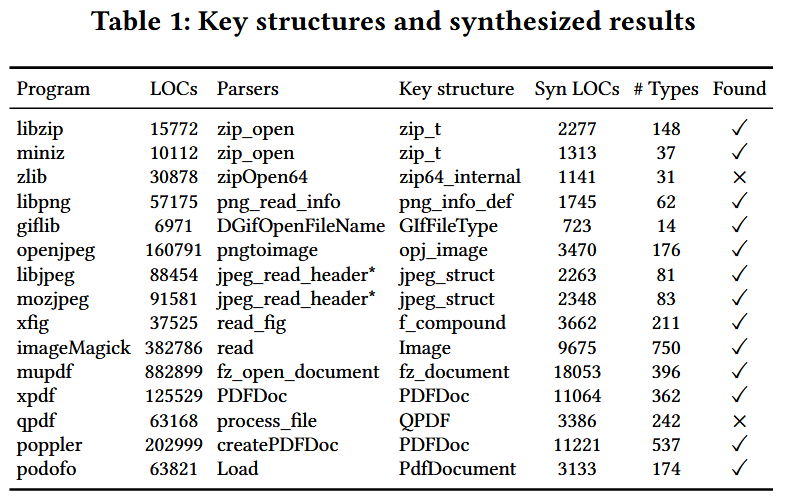
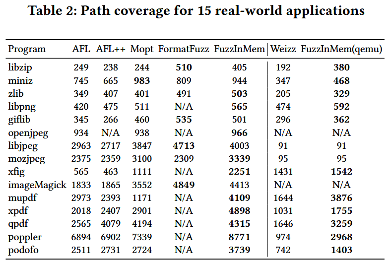
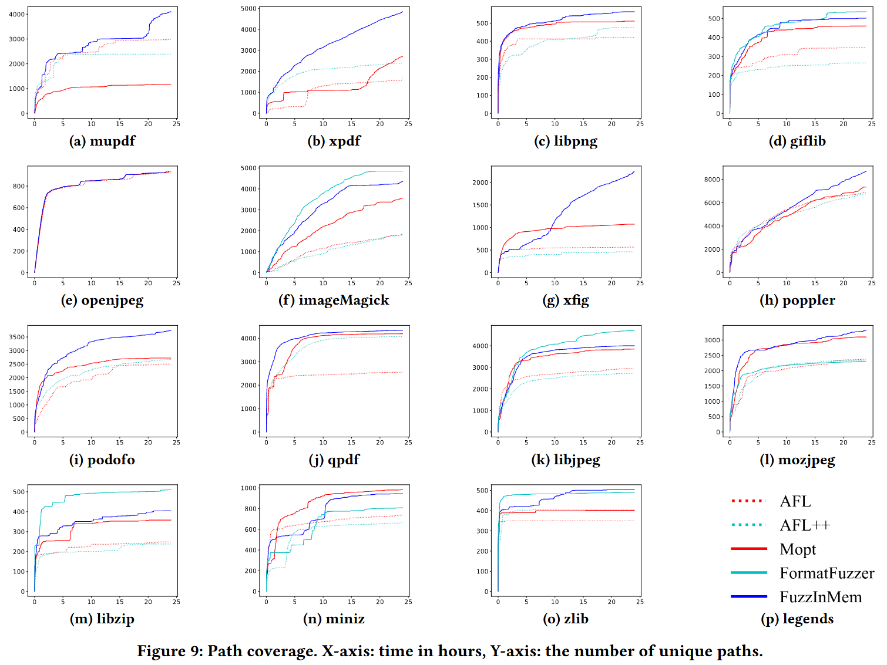
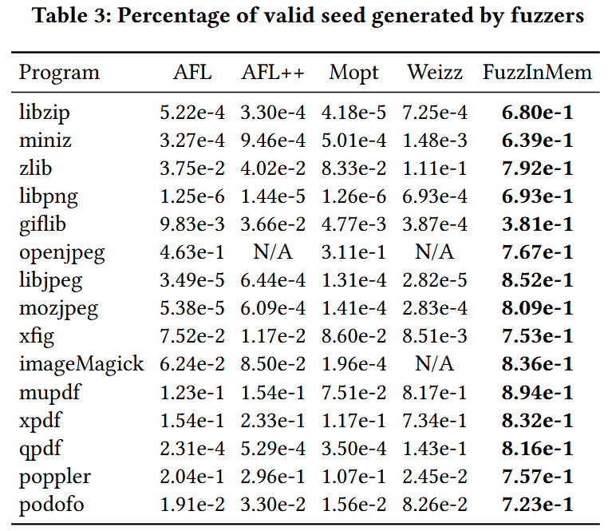

# FuzzInMem: Fuzzing Programs via In-memory Structures [ICSE 2024]

如何变异复杂的文件格式 (如PDF) 依然是灰盒模糊测试中一个尚未解决的问题. 现有的模糊测试工具一般通过对输入文件进行位 / 字节变异, 生成的突变文件往往无法被应用程序解析. 观察发现, 大多数文件格式的内存表示是简单的, 且设计良好的应用程序通常具有内置的打印功能来将这些结构重新生成为文件. 作者提出一种新技术, 通过变异输入的内存结构, 并利用打印函数重新生成变异后的文件. 与之前需要复杂分析以学习文件格式约束的方法不同, 本文方法通过利用打印函数来保持格式约束. 

作者实现原型 FuzzInMem, 并将其与 AFL 以及其他一些最先进的模糊测试工具进行了比较, 包括AFL++、Mopt、Weizz 和 FormatFuzzer. 结果表明, FuzzInMem 具有可扩展性, 并在有效种子生成和路径覆盖率方面显著优于通用模糊测试工具. 通过将 FuzzInMem 应用于真实世界的应用程序, 发现 29 个独特的漏洞, 并获得 5 个 CVE.

## Contributions

1. 提出一种新颖的基于变异的模糊测试技术. 该技术从一个种子输入开始, 对其进行解析, 修改其内存中的结构, 并重用打印函数生成格式合法的数据文件, 从而作为高质量的新种子输入
2. 设计一种自动化技术, 能够基于关键数据结构的原始定义, 自动合成数据结构定义及其对应的变异函数
3. 实现一个原型系统 FuzzInMem, 并在 15 个真实世界的应用程序上进行了评估, 同时与最先进的模糊测试工具 (包括 AFL、AFL++、Mopt、Weizz 和 FormatFuzzer) 进行对比. 结果显示, FuzzInMem 在路径覆盖率方面提升了42%-70%, 在有效种子生成数量上提升达 10 倍至 10000 倍
4. 在真实应用中应用 FuzzInMem, 共发现 29 个新的独特漏洞, 并获得了5个可利用的 CVE

## Methods

图 2 展示 FuzzInMem 的整体工作流. 可以被重新用于内存变异的应用程序通常由几个部分组成, 包括解析器、数据处理器和内容打印器. 在 A 部分, FuzzInMem 搜索在解析文件过程中生成的重要内存结构. 它定位解析器函数, 这些函数生成内存结构, 并截获应用程序的控制流, 以插入代码进行变异操作. FuzzInMem 使用一个合成器, 该合成器以源代码和一些用户定义的变异规则 (如魔术数字字典) 为输入, 自动生成一个变异器 (B部分). 变异器被插入到 A 部分找到的位置, 以内存结构为输入并对其进行修改, 以生成内存数据结构的变异体. 变异后的内存结构不再传递给处理器, 而是传递给 FuzzInMem 通过污点分析在 C 部分找到的打印器. 打印器确保文件的有效性, 因为它根据变异结构推导出适当的大小和偏移量. 在许多情况下, 它甚至可以裁剪变异结构, 例如丢弃超出大小限制的数组元素. 然后, 变异体被传递给目标程序, 变异器收集覆盖率反馈以指导进一步的模糊测试.

FuzzInMem 基于 AFL, 因此继承了位 / 字节变异的特点. 它通过管道和共享内存与内存变异器进行通信, 支持额外的内存模糊测试.

### Locate key structures

FuzzInMem 首先需要定位解析器函数, 以提取内存中的关键结构. FuzzInMem 通过采用动态分析技术来获取应用程序的调用序列, 并进行序列的比较分析, 进而定位解析的开始和结束, 从而找到解析器函数. 算法 1 用来识别解析器函数

### Mutator Synthesis

图 4 说明如何自动合成变异器来修改内存中的结构. 合成器接受一个左侧的关键数据结构 `Object`, 并推导右侧的一组新数据结构, 每个新结构对应于 `Object` 中引用的一个结构. 

FuzzInMem 定义一种基本类型系统, 用于描述从源代码合成的结构, 如图 5. 

一个结构 $$\Psi$$ 是一组向量, 每一对由字段 $$\tau$$ 和其类型 $$\psi$$ 组成, 当包含该结构的头文件是项目的一部分时, 它是一个自定义类型. 否则, 如果该结构仅在第三方库的头文件中定义, 则用结构名称 $$s$$ 表示. 类型 $$\tau$$ 可以分为原始类型、结构类型和引用类型. 原始类型包括四种整数类型、两种浮点类型、void 类型和枚举类型. 枚举类型 $$\lambda$$ 是一个字符串列表和相应的整数值. 引用类型包括数组和指向其他类型的指针. 

从找到的关键结构开始, 工具以递归方式合成所有在关键结构中引用的后代自定义类型. 算法 2 展示如何接受源代码中的关键数据结构定义 $$\Psi$$, 并生成合成的定义 $$\Psi '$$.

### Reuse printer function

打印函数 (隐式地) 在输出时检查内存结构的完整性. 如果结构没有损坏, 打印函数会生成一个遵循格式约束的数据文件, 否则打印函数会失败并退出. FuzzInMem 通过使用 LLVM 进行静态污点分析, 在源代码中定位打印函数的候选. 具体来说, 它查找那些以关键结构作为参数并输出来自该关键结构的数据的函数. 这可以通过将**关键结构标记为源 (source), 将文件输出标记为汇 (sink)** 实现. 此分析非常轻量, 通常只需要几秒钟就可以完成. 

打印函数重用的一个主要挑战是, 打印函数可能由于无法导出内存结构或因完整性检查失败而崩溃. 作者通过分析内存约束来缓解这个问题. 大多数打印失败, 是由某些不变整数在循环中的长度与动态数组不匹配导致, 通过动态分析来探查**长度-数组**关系. 一个观察是, 长度和数组通常存在于同一个结构体中, 并且彼此相近. 对于每个数组, 只在同一个结构体内查找对应的长度. 选择一个整数字段, 检查它是否与数组的长度匹配, 直到找到匹配的整数作为长度. 

## Evaluation

### RQ1: Popularity of printer functions

打印函数在真实世界的应用程序中是否广泛存在? 作者注意到, 应用程序通常使用开源的第三方库来进行解析, 为了回答这个问题, 作者调查总计 71 个库, 覆盖多种文件格式, 包括语言解析器、图像、音频 / 视频、文档、归档、字体和协议文件格式. 这些库来自于 Google Fuzzer 测试套件、其他模糊测试论文或 GitHub 上超过 100 颗星的项目. 

调查结果显示, 71个库中有 **67.61% (48个)** 库包含打印函数. 具体来说, 所有音频、视频和归档库都包含打印函数, 因为它们通常同时包括压缩和解压缩算法的编码器和解码器. 90.91% 的文档库和 79.16% 的图像库也包含打印函数, 因为大多数库支持编辑文档和图像. 只有少数语言解析器支持转储内存中的结构. 字体库和协议库都没有包含打印函数. 

### RQ2: Key structures and synthesizer results

FuzzInMem 使用 Valgrind [33] 进行运行时插桩, 以获取简化的调用序列. 实验中, 使用一个随机选择长度 (30字节) 的文件, 并用零初始化作为无效种子, 同时使用两个有效种子进行分析. 表 1 列出 15 个程序以及它们的解析器和关键结构的详细信息. 2个程序涉及多个解析器和打印函数. 

FuzzInMem 能够从 15 个程序中的 13 个程序中自动定位解析器和关键结构. 例外的是 zlib 和 qpdf. 对于 zlib, FuzzInMem 能够正确地定位解析器函数 `zipOpen64`, 但未能找到关键结构, 因为解析器返回一个 void 指针, 这并未暴露有关实际返回类型的信息. 总结来说, FuzzInMem 可以有效地在大多数程序中找到解析器和关键结构. 如果没有找到, 需人工查看源代码.

### RQ3: Path coverage and seed generation

