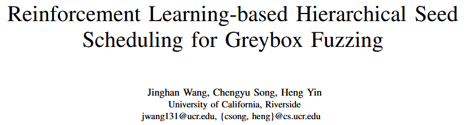
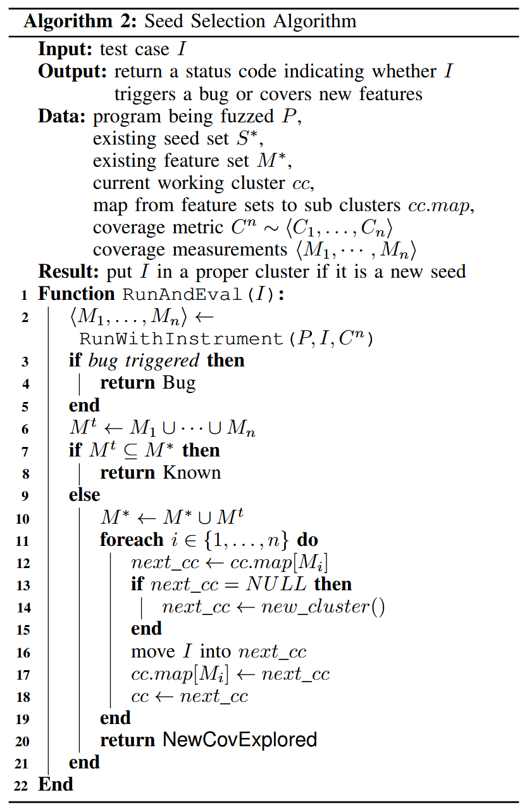
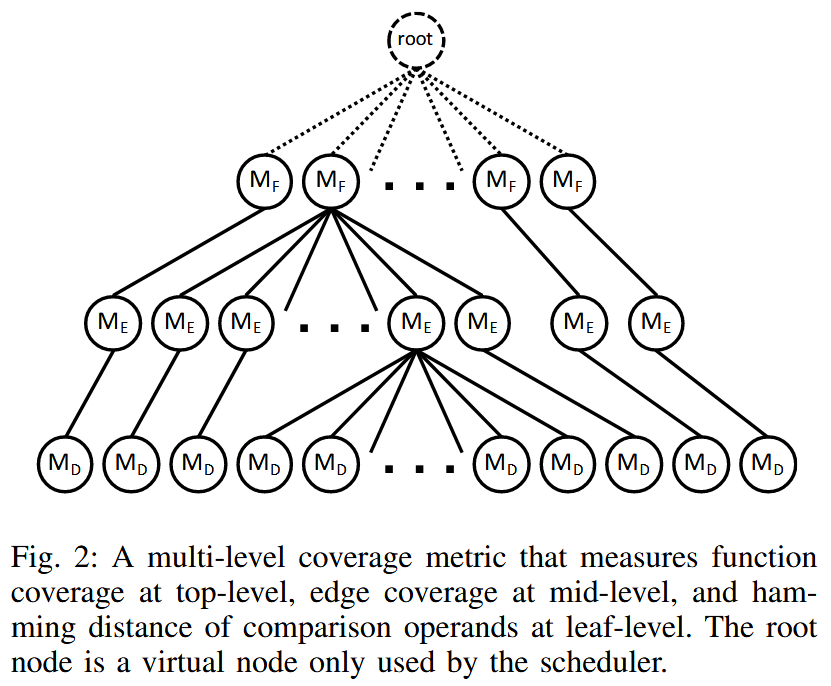
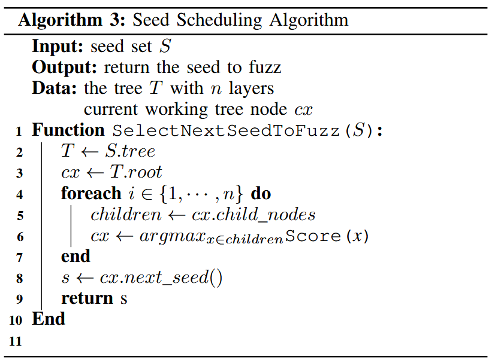
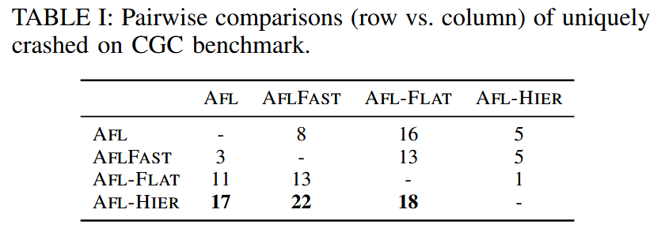
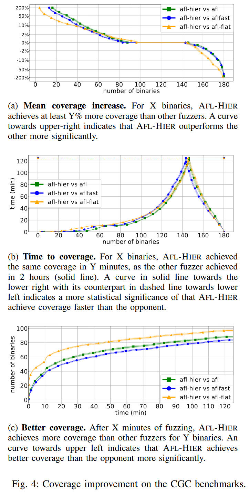

# Reinforcement Learning-based Hierarchical Seed Scheduling for Greybox Fuzzing [NDSS 2021]

细粒度的覆盖率度量可以使模糊测试器检测到传统边缘覆盖率无法覆盖的漏洞. 然而, 细粒度的覆盖率度量也会选择更多的种子, 这些种子无法通过现有算法高效调度. 本文通过引入多层次覆盖率度量的新概念及相应的基于强化学习的层次调度器来解决这一问题. 

本文方法 Hier 优于 AFL 和 AFLFAST: 能够检测到多 20% 的漏洞, 在 180 个挑战中, 有 83 个挑战的覆盖率更高, 60 个挑战的覆盖率相同. Hier 能够更快地检测到相同数量的漏洞, 并实现相同的覆盖率. 在 FuzzBench 上, Hier 在 20 个项目中, 有 10 个项目的覆盖率超过了AFL++.

## Contributions

1. 提出多层次覆盖率度量, 引入敏感的覆盖率度量提供一种新颖的方法
2. 设计一种基于多臂老虎机模型的层次化种子调度算法, 以支持多层次覆盖率度量
3. 将方法实现为 AFL 和 AFL++ 的扩展, 并在 https://github.com/bitsecurerlab/aflplusplus-hier 发布源代码
4. 在 DARPA CGC 和 Google FuzzBench 上评估原型. 结果表明, 方法不仅可以触发更多的漏洞并实现更高的代码覆盖率, 还可以比现有方法更快地实现相同的覆盖率

## Methods

### Multi-Armed Bandit Model

多臂老虎机模型可以在不确定性下随着时间学习最优资源分配策略. “老虎机”一词源自赌博场景, 玩家面临一排老虎机 (也称为单臂老虎机), 这些老虎机的回报是随机的, 玩家寻求最佳的策略, 以在这些机器上获得最高的长期回报. 最初, 玩家对哪个臂预计有最高的奖励一无所知, 因此随机选择一些臂并观察奖励. 随着时间的推移获得更多的信息. 然而, 玩家需要在**利用** (exploitation) 选择至今为止奖励期望最高的臂, 和**探索** (exploration) 选择其他臂来获取更多关于它们的奖励期望的信息之间做出权衡, 以避免仅通过不尝试某些臂而错过一个有价值的臂. 

为在 “利用” 和 “探索” 之间做出最优的权衡提出的各种算法中, 上置信界 (Upper Confidence Bound, UCB) 算法是一类表现出色的多臂老虎机算法. 具体来说, 它通过构造置信区间来估计每个臂的真实奖励, 并每次选择置信区间最大 (UCB最高) 的臂. 值得注意的是, 当某个臂被更多采样时, 置信区间会收缩. 因此, 尽管该算法倾向于选择具有高平均奖励的臂, 但它会周期性地尝试那些较少被探索的臂, 因为它们的估计奖励具有较宽的置信区间. 

种子调度可以被建模为一个多臂老虎机问题, 其中种子被视为臂. 为让模糊测试器从这个模型中受益, 如最大化代码覆盖率, 需要仔细设计调度种子的奖励.

### Sensitivity of Coverage Metrics

模糊测试开始时, 通常会有一组初始种子. 随着模糊测试的进行, 通过突变现有种子, 会向种子池中添加更多的种子. 通过追踪种子池的演变, 可以看到每个种子如何通过突变链追溯到初始种子, 其中每个种子是通过突变其直接前辈生成的. 如果将触发漏洞的测试用例视为链的终点, 并将相应的初始种子视为起点, 那么链中的内部种子充当了中转点, 允许模糊测试器逐步缩小搜索空间, 以找到漏洞.

模糊测试器使用的覆盖率度量在创建这样的链中起着至关重要的作用. 首先, 如果链在达到触发漏洞的测试用例之前就提前终止, 那么漏洞可能永远不会被模糊测试器发现. 现有工作将模糊器保持种子链中关键中转点的能力建模为**覆盖率度量的灵敏度** (sensitivity). 研究者还观察到, 分支覆盖率的无序性和哈希碰撞可能导致模糊测试器丢失关键中转点, 从而防止某些代码 / 漏洞被发现. 

其次, 覆盖率度量的灵敏度还决定了一个新生成的测试用例作为新种子被保存的可能性. 例如, 使用边缘覆盖率的模糊测试器发现一个新种子比使用块覆盖率的模糊测试器更容易. 现有研究将发现一个邻近种子所需的最小努力建模为所需的功率 (即突变次数). 基于这种建模, 更灵敏的覆盖率度量需要较少的功率来取得进展, 即种子之间的步幅更短. 尽管每个种子仅携带很小的一步进展, 但它们的积累可以更快地缩小搜索空间. 

但是, 更灵敏的覆盖率度量未必会使模糊测试器检测到更多的漏洞. 更灵敏的覆盖率度量也会创建一个更大的种子池. 这会增加调度器的工作量, 更大的种子池还增加种子探索的难度, 即尽可能多地尝试新的种子. 由于模糊测试的时间是固定的, 更多的种子也意味着每个种子的平均模糊测试时间会减少, 这可能会负面影响种子利用, 即没有给有趣的种子足够的时间去找到关键的中转点.

更灵敏的覆盖率度量提高模糊测试器探索更深程序状态的能力 (即上限). 然而, 为有效利用其能力并缓解由此产生的过多种子的副作用, 覆盖率度量及其相应的种子调度器应在**探索和利用之间找到平衡**.

### Seed Clustering via Multi-Level Coverage Metrics

灰盒模糊测试中大多数覆盖率度量的敏感性是可比的 (即更敏感的覆盖率度量可以包含较不敏感的度量所能提供的信息), 作者提出一种直观的方法: 使用粗粒度的覆盖率度量来对由细粒度度量选出的种子进行聚类. 

此外, 引入多层次聚类机制, 在更高的层级提供更抽象的视图, 在更低的层级保留更精细的信息. 为实现这一目标, 覆盖率度量应允许多种覆盖信息的共存. 作者将这种支持多级度量能力的覆盖率度量称为**多层次覆盖率度量 (multi-level coverage metric)**.

### Incremental Seed Clustering

在引入多层次覆盖率度量后, 只要一个测试用例在任意层级的度量中被判断为触达了新的覆盖, 它就会被保留为一个新的种子, 并根据算法 2 被放入合适的聚类中. 除了顶层度量 $$M_1$$ 会将所有种子直接划分到不同的聚类外, 接下来的每一层度量 $$M_i (i = 2, ..., n)$$ 都会分别在其上一层 $$M_{i-1}$$ 生成的每个聚类中继续细分, 把种子进一步划分为更小的子聚类, 这种方式被称为**增量种子聚类 (incremental seed clustering)**.

### Scheduling against A Tree of Seeds

如算法 3 中的 `SelectNextSeedToFuzz()` 函数, 从根节点开始, 调度算法选择具有最高得分的子节点, 得分是基于覆盖度量计算的, 直到到达最后一层, 选择与真实种子关联的叶子节点. 因为在叶子层级所有种子的覆盖率是相同的, 为简单起见对它们进行轮询调度.

在每一轮模糊测试结束时, 沿着调度路径的节点将根据当前种子在本轮测试中取得的进展进行奖励, 表现良好的种子预计会在接下来的轮次中获得更高的得分, 而进展较小的种子则会被降低优先级.

### Seed Scoring

种子分数公式:

$$
{Score}(a)={Rareness}(a) \times F u z z {Per} f(a)
$$

其中, Rareness 和 FuzzPref 如下

$$
F u z z {Per} f(a) = Q(a) + U(a)
$$

其中, $$Q(a)$$ 是当前种子 $$a$$ 的模糊测试奖励的经验平均值, 而 $$U(a)$$ 是上置信区间的半径

$$
Rareness(a^l) = {SeedRareness}(s, l)=\sqrt{\frac{\sum_{F \in C_l(P, s)} \text { rareness }^2[F]}{\left|\left\{F: F \in C_l(P, s)\right\}\right|}}
$$

其中, $$F$$ 是特征, $$P$$ 是测试程序, $$C_l$$ 是度量指标, $$s$$ 是种子, $$rareness[F] = 1 / num\_hits[F]$$.

## Evaluation

### RQ 1. Bug Detection

### RQ 2. Code Coverage

