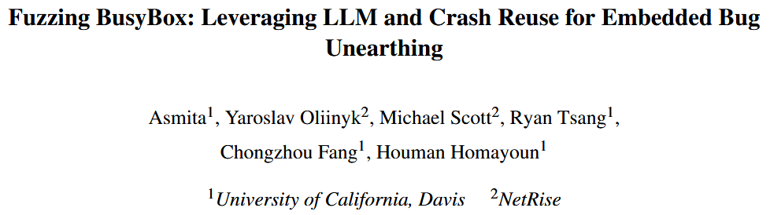
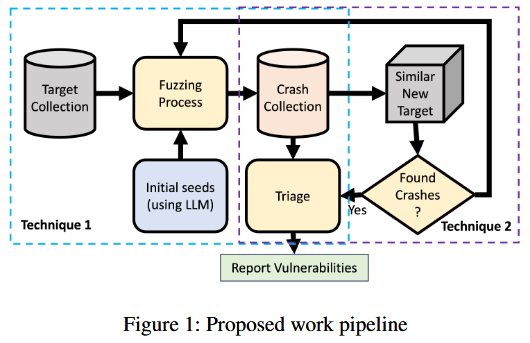
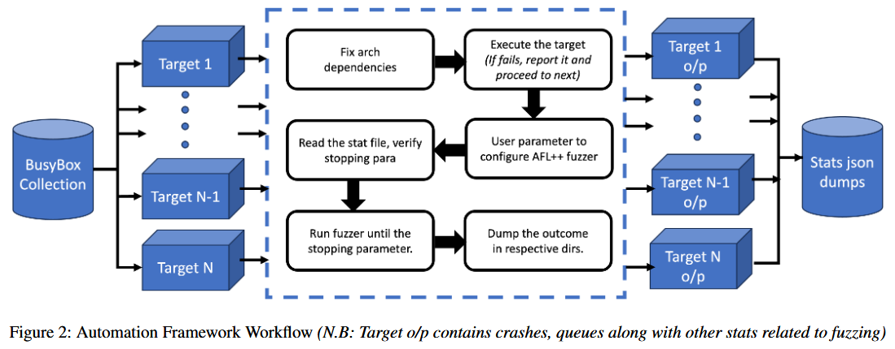
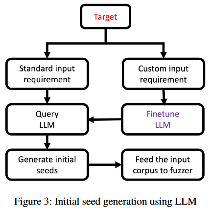
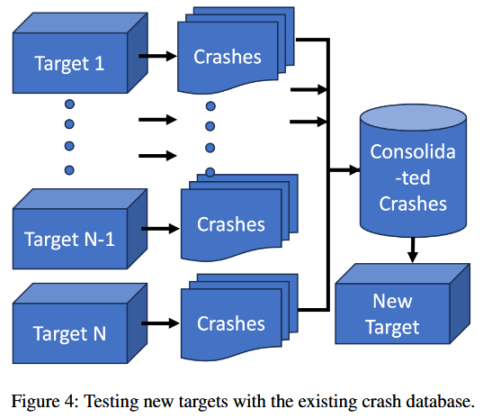
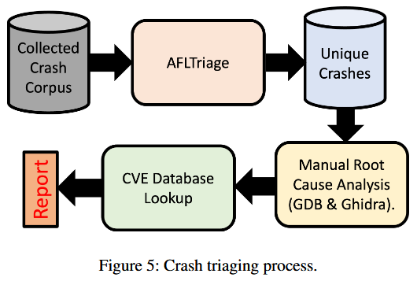
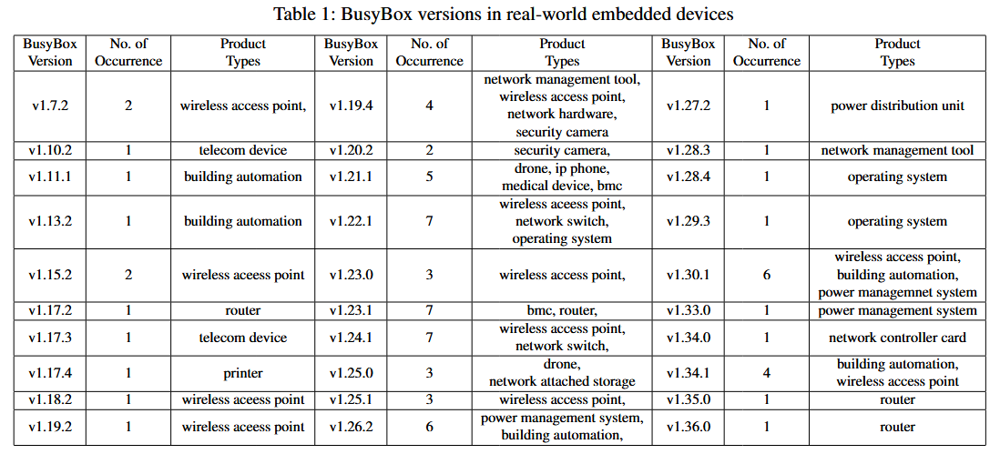
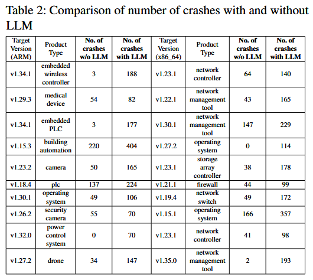
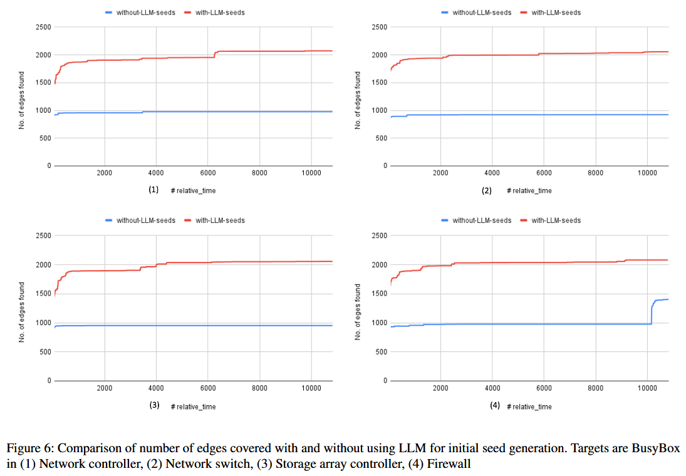
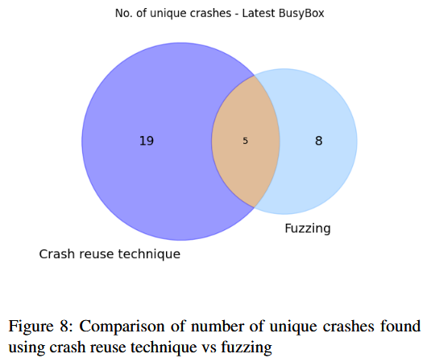

# Fuzzing BusyBox: Leveraging LLM and Crash Reuse for Embedded Bug Unearthing [USENIX 2024]



BusyBox 是将 300 多个 Linux 必备命令打包成一个单一的可执行文件的开源软件, 在基于 Linux 的嵌入式设备中广泛使用. 研究揭示现实世界中的嵌入式产品中, 旧版本的 BusyBox 广泛存在, 这促使我们对 BusyBox 进行模糊测试. 在本研究中, 作者提出两种强化软件测试的技术. 第一种技术通过利用大型语言模型 (LLM) 生成特定目标的初始种子, 从而增强模糊测试. 研究表明, 在使用 LLM 生成的初始种子时, 崩溃数量大幅增加, 突显 LLM 在高效处理通常需要大量人工的目标特定初始种子生成任务中的潜力. 第二种技术是在对新目标进行模糊测试之前, 重新利用从相似模糊目标中获取的崩溃数据. 这种方法通过在开始模糊测试之前直接将崩溃数据提供给新目标, 从而简化费时的模糊测试过程. 作者成功地在最新的 BusyBox 目标中识别出崩溃, 而无需进行传统的模糊测试, 强调 LLM 和崩溃数据重用技术在增强软件测试和提高嵌入式系统漏洞检测方面的有效性. 


## Contributions



1. 识别仍在商业嵌入式设备中使用的 BusyBox 版本, 强调更新这些版本的必要性
2. 实现基于大型语言模型 (LLM) 的种子生成, 通过利用 LLM 生成目标特定的初始种子来增强模糊测试, 进而实现更快速、更高效的种子生成, 更多的崩溃以及更多的选项来进行漏洞筛选. 作者开发一个自动化脚本, 可以对大量的 BusyBox 目标进行模糊测试, 无需人工干预, 且该脚本开源: https://github.com/asmitaj08/FuzzingBusyBox_LLM
3. 提出崩溃重用作为首次漏洞发现策略, 该策略将崩溃输入重用于不同的程序变种, 以便在黑盒测试条件下快速找到重复的漏洞
4. 在最新版本的 BusyBox 中的 awk 小程序中识别了崩溃, 并进行手动崩溃分类, 以确定它们是源自 BusyBox 还是底层库中的依赖项. 随后将这些技术应用于其他小程序, 包括 dc、man 和 ash


## Methods

### Analyzing BusyBox Versions in Real-World Products

作者对旧版本 BusyBox 在现实产品中的普及情况进行简要调查. 为实现这一目标, 利用公司提供的专有固件数据集. 该数据集通过公司的平台进行策划, 并使用该平台提取收集到的固件样本. 在这些提取的文件系统中, 识别 BusyBox ELF 二进制文件. 在提供的数据集的小范围内, 识别分布在各种现实固件二进制文件中的 293 个 BusyBox ELF 二进制文件. 在分析范围内, 重点关注约 80 个来自 ARM_32 和 x86_64 架构的 ELF 文件, 其中包含 30 个不同的 BusyBox 变种. 每个 BusyBox ELF 二进制文件都拥有一个独特的文件哈希名称. 为从这些二进制文件中提取版本信息, 作者设计一个简单的 Python 脚本, 该脚本使用命令: `strings $busybox_file | grep ’BusyBox v’` 来扫描每个 ELF 文件中的 `BusyBox v` 字符串. 此外还采用基于正则表达式的版本模式匹配技术来提取版本信息. 作者识别出的这 80 个二进制文件被用作模糊测试实验和崩溃重用分析的数据集. 


### Leveraging LLMs for Initial Seed Generation

针对 x86 架构编译的二进制文件在 Ubuntu x86_64 上进行评估, 针对 ARM 架构的二进制文件则在 QEMU 仿真器中进行评估. 公司的平台此前已提取目标二进制文件的完整文件系统, 其中包含所需的依赖文件. 模糊测试器的参数由用户定义, 包括初始输入集、需要设置的 AFL 环境变量以及模糊测试终止标准. 这些标准包括统计指标, 如运行时间、崩溃数量、循环次数和其他相关因素. 模糊测试过程的结果会被单独存储, 并按各自目标进行分类, 以便后续分析. 失败的目标会被标记以进一步检查和诊断. 此外, 还会收集与每个目标对应的统计文件的 JSON 转储, 并存储在共享目录中, 便于进行比较和分析. 图 2 展示框架整体工作流程, 从依赖性管理到模糊测试和结果收集的步骤顺序. 



图 3 展示通过 LLM 生成初始种子进行模糊测试的方法. 在两种情况下需要生成初始种子: 当目标输入格式已明确和 / 或标准化时, 以及当输入格式定义或未知时. 当输入格式明确时, LLM 不需要额外的训练, 因为它已经通过初步的互联网训练了解了预期的输入格式. 然而, 当目标的输入格式不明确或未知时, 如自定义通信协议, LLM 则需要微调. 在这种情况下, LLM 需要使用已知样本进行初步训练, 以便理解预期的输入格式. 在 BusyBox awk 小程序的例子中, GPT-4 已经了解输入格式. 因此, 作者没有进行微调 (~~本来就微调不了~~). 




在种子生成方面, 提供以下提示来引导 awk 的种子生成过程: 

```json
"role": "system", 
"content": "You are initial seed generator for a fuzzer that has to fuzz BusyBox awk applet. In response only provide the list of awk scripts" 
"role": "user", 
"content": "Generate initial seed to fuzz BusyBox awk applet"
```

LLM 返回的结果处理后, 作为输入语料库作为模糊测试过程的初始种子集. 


### Crash Reuse

崩溃重用在软件测试中提供几个优势: 

1. **效率**: 最初通过将新目标与整合的崩溃数据库进行对比测试, 有可能显著节省时间和资源. 通过利用在对相似目标进行模糊测试时发现的崩溃, 可以将之前在模糊测试中投入的资源加以利用, 并通过将这些崩溃包含在未来的种子中, 来加速模糊测试器的覆盖率探索. 因此, 可以在没有进行广泛模糊测试的情况下, 潜在地识别新变种中已经发现的崩溃
2. **黑盒测试**: 这种技术在对之前已测试过的目标的新变种进行黑盒测试时非常有用. 它在目标使用可访问或开源软件组件的情况下尤为优势, 即使进一步的细节无法获取. 通过对开源变种进行模糊测试, 收集崩溃输入, 并将其作为高质量的种子, 这些种子可能有助于发现重复的漏洞. 这比进行资源密集型的二进制黑盒模糊测试更为可取, 因为根据被测试系统的复杂性, 这种测试可能非常困难

图 4 展示崩溃重用方法. 作者积极策划一个崩溃数据库, 收集从先前模糊测试过的软件组件中获得的崩溃数据. 然后, 在未来遇到这些软件组件的变种时, 利用已收集的崩溃数据来识别新变种中的潜在问题, 而无需进行模糊测试. 这样, 能快速对新目标进行初步评估, 之后可以对其进行更深入的模糊测试以进行详细检查.




### Evaluating a New Target

测试最新版本 BusyBox 的方法分为两个阶段, 以有效地利用这两种技术: 

**阶段 1: 崩溃重用**
在此阶段, 应用崩溃重用技术. 这一技术涉及将最新版本与我们研究中获得的所有崩溃进行对比测试, 而不进行额外的模糊测试. 目标是确定某些已有的崩溃是否能导致最新版本的 BusyBox 崩溃, 即在不进行数小时模糊测试的情况下扩展漏洞发现的范围

**阶段 2: 模糊测试**
第二阶段, 使用 GPT-4 生成的初始种子, 在 AFL-QEMU 模式下对目标进行模糊测试, 目的是揭示额外的潜在崩溃和漏洞. 在运行 Ubuntu 22.04 的 x86_64 主机上对最新的 BusyBox 进行 10 小时的模糊测试

在测试阶段后, 分析收集到的崩溃数据, 以识别独特的崩溃, 确定根本原因, 并查明这些问题是否在以前已被记录. 根据研究情况, **尚不存在能够可靠且全面地分析模糊测试引发的崩溃的完全自动化工具**, 因此工具辅助的人工分析成为最可靠的调查方法. 图 5 展示崩溃分类过程的概览. 




## Evaluation

### BusyBox Versions in Real-World Embedded Devices




### Leveraging LLMs for Initial Seed Generation






### Crash Reuse




