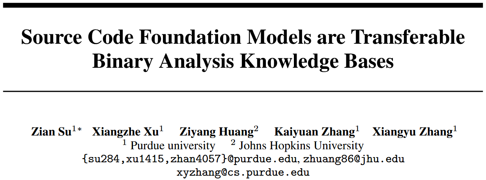
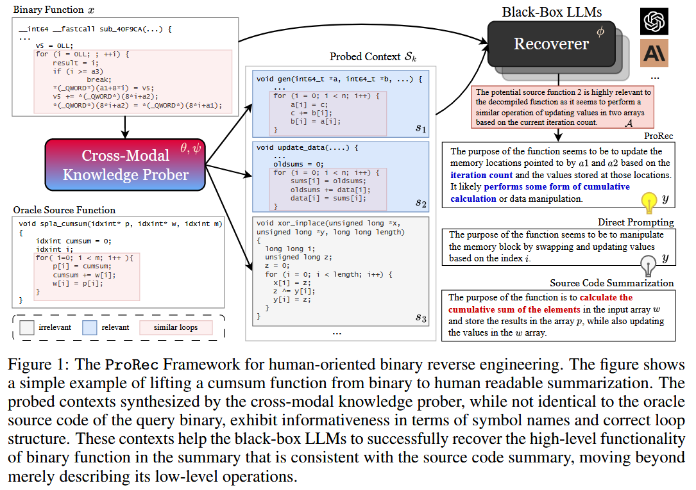
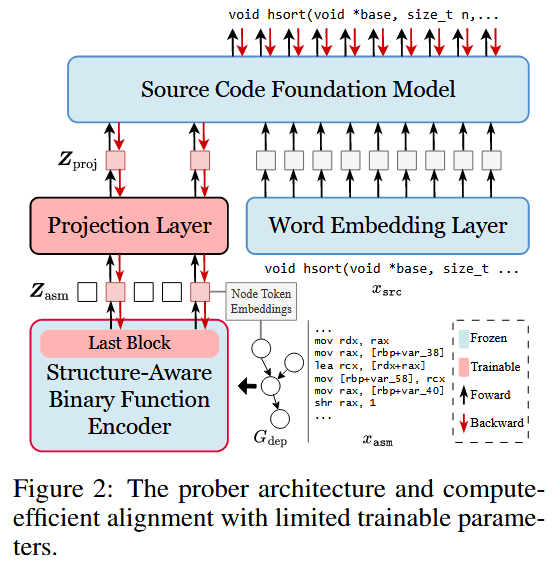
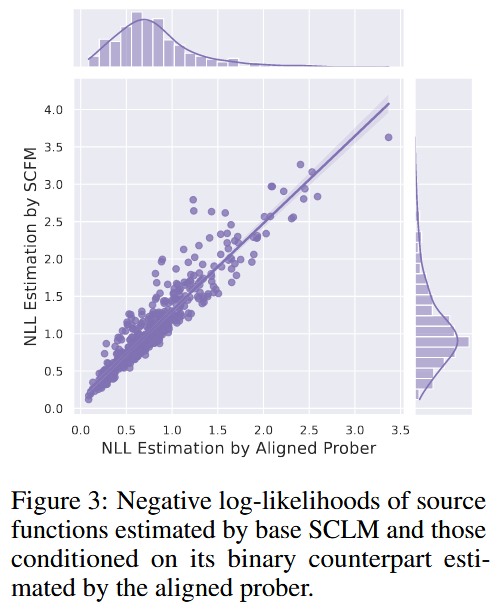

# Source Code Foundation Models are Transferable Binary Analysis Knowledge Bases [NIPS 2024]

面向人类的二进制逆向工程 (Human-Oriented Binary Reverse Engineering, HOBRE) 处于二进制代码和源代码的交叉领域, 旨在将二进制代码提升为与源代码相关的人类可读内容, 从而弥合二进制与源代码之间的语义鸿沟. 现有的 HOBRE 方法严重依赖于 (Source Code Foundation Models, SCFM) 单模态模型的监督微调, 或依赖通用大语言模型 (LLM) 的提示工程, 导致性能欠佳. 本文提出一种探测与恢复 (probe-and-recover, ProRec) 框架, 结合二进制-源代码编码器-解码器模型和用于二进制分析的黑盒 LLM. 利用 SCFM 中预训练的知识来合成上下文相关的、富含符号的代码片段, 提高黑盒 LLM 的恢复准确性. ProRec 在零样本二进制摘要和二进制函数名称恢复方面取得改进, 其中摘要的 CHRF 相对增益为 10.3%, 基于 GPT4 的度量相对增益为 16.7%, 函数名称恢复的令牌级精确率和召回率分别绝对增加了 6.7% 和 7.4%. 

## Methods

### The Probe-and-Recover Framework

Figure 1 是 ProRec 框架的示例. ProRec 假设存在一个由 $$\theta$$ 参数化的二进制理解模型, 一个由 $$\Phi$$ 参数化的开源 SCFM, 以及一个由 $$\Phi$$ 参数化的黑盒 LLM. 如 Figure 1 所示, 二进制模型与 SCFM 一起构成跨模态知识探测器. 黑盒 LLM 则充当恢复器. 跨模态探测器可以根据二进制输入合成源代码片段. 恢复器则接收带有二进制代码的增强上下文, 以进行分析并执行最终的恢复. 

从概念上讲, ProRec 框架将生成 $$y$$ 的概率分解为三个部分: 一组 $$k$$ 个源代码片段 $$S_k=\{s_1, ..., s_k\}$$ 与输入相关的概率 $$P(S_k | x)$$, LLM 对源代码片段相关性分析的概率 $$P(A | S_k, x)$$, 以及在给定分析和源代码片段的条件下生成恢复结果的概率. 

$$
P(y \mid x)=\sum_{\mathcal{S}_k \sim P_{\theta, \psi}(\cdot \mid x), \mathcal{A} \sim P_\phi\left(\cdot \mid \mathcal{S}_k, x\right)} P_\phi\left(y \mid \mathcal{A}, \mathcal{S}_k, x\right) \cdot P_\phi\left(\mathcal{A} \mid \mathcal{S}_k, x\right) \cdot P\left(\mathcal{S}_k \mid x\right)
$$

### Model Architecture and Instantiation

ProRec 的核心是跨模态探测器, 它是一个在 SCFM 的令牌嵌入空间中对齐的编码器-解码器模型, 如 Figure 2 所示. 作者希望同时受益于拥有二进制领域知识的预训练二进制函数编码器以及用于通用探测的强大 SCFM. 作者选择目前最先进的 CODEART [58] 作为结构感知二进制函数编码器 g($$\cdot$$). CODEART 是一个类似 BERT 的 Transformer 编码器, 它接收反汇编的二进制函数 $$x_{asm}$$ 及其通过程序分析获得的依赖图 $$G_{dep}$$ 作为输入, 并输出所有汇编代码令牌和图节点令牌的嵌入 (每个图节点令牌对应于汇编代码中的一条指令, 例如 `mov rax, [rbp+var_40]`). 作者选择 Code-Llama [55] 系列作为基础 SCFM. 

### Prober Training

## References

[55] Baptiste Rozière, Jonas Gehring, Fabian Gloeckle, Sten Sootla, Itai Gat, Xiaoqing Ellen Tan, Yossi Adi, Jingyu Liu, Romain Sauvestre, Tal Remez, Jérémy Rapin, Artyom Kozhevnikov, Ivan Evtimov, Joanna Bitton, Manish Bhatt, Cristian Canton Ferrer, Aaron Grattafiori, Wenhan Xiong, Alexandre Défossez, Jade Copet, Faisal Azhar, Hugo Touvron, Louis Martin, Nicolas Usunier, Thomas Scialom, and Gabriel Synnaeve. Code llama: Open foundation models for code, 2024.

[58] Zian Su, Xiangzhe Xu, Ziyang Huang, Zhuo Zhang, Yapeng Ye, Jianjun Huang, and Xiangyu Zhang. Codeart: Better code models by attention regularization when symbols are lacking. Proceedings of the ACM on Software Engineering, 1(FSE):562–585, 2024.

