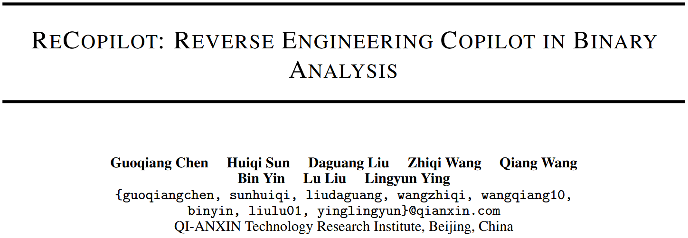
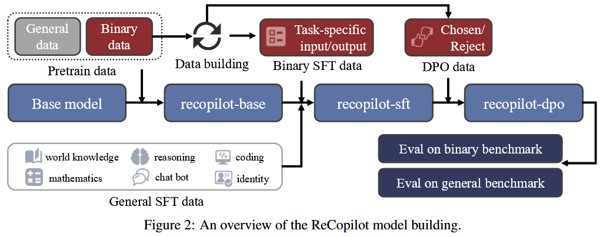
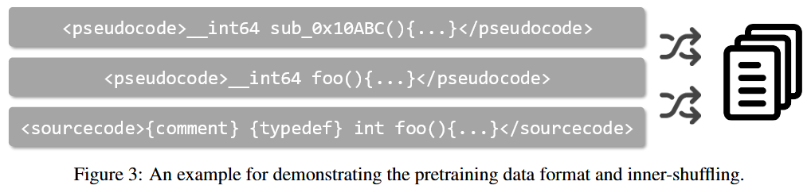
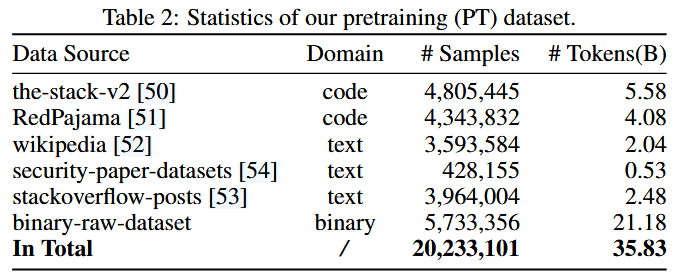
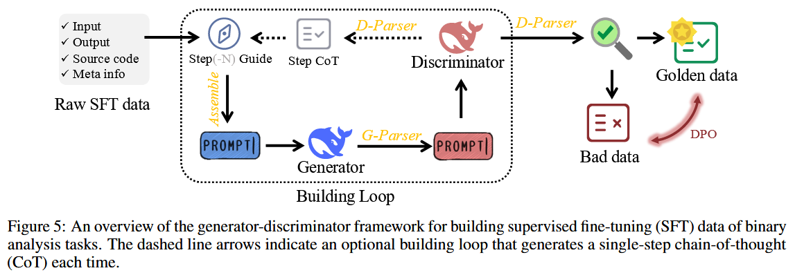

论文提出 ReCopilot, 一个专为二进制分析任务设计的专家级LLM. ReCopilot 通过一个精心构建的数据集来整合二进制代码知识, 其训练过程包含持续预训练 (CPT)、监督式微调 (SFT) 和直接偏好优化 (DPO) 三个阶段. 它利用变量数据流和函数调用图来增强上下文感知能力, 并采用测试时扩展 (test-time scaling) 来提高推理能力. 在全面的二进制分析基准上进行的评估表明, ReCopilot 在反编译伪代码的函数名恢复和变量类型推断等任务上取得了当前最佳性能, 比现有工具和LLM高出13%. 研究结果凸显了领域特定训练和上下文增强的有效性, 同时也揭示了在构建超长思维链 (super long chain-of-thought) 方面存在的挑战. 

## Method

Figure 2 展示了模型构建过程的概览, 该过程主要包含三个训练阶段. 具体而言, 作者首先在一个预训练的基座模型上进行持续预训练 (CPT), 以学习领域的语言和知识. 接着, 作者使用一个混合的监督式微调 (SFT) 数据集进行微调, 以赋予模型推理能力, 并使其适应下游任务. 最后, 作者采用直接偏好优化 (DPO) 来进一步提升模型在遵循格式方面的表现. 

为了进行这些训练, 作者从零开始构建了相应的数据集. 作者首先设计了数个流水线 (pipelines) 来收集原始的二进制数据集, 然后对其进行过滤和清理, 以构建最终的训练数据集. 为了构建一个针对二进制分析的特定任务监督式微-调 (SFT) 数据集, 作者设计了一个“生成器-判别器” (generator-discriminator) 框架, 以自动生成带有思维链 (chain of thought) 的领域样本. 

总体而言, 作者构建了一个包含600亿 (60B) 个词元 (tokens) 的大规模预训练数据集, 一个包含17亿 (1.7B) 个词元的混合SFT数据集, 以及一个包含2400 (2.4K) 个样本的直接偏好优化 (DPO) 数据集. 

### Training Strategy

**CPT (持续预训练) **

预训练通常用于从大规模数据中获取基础知识和学习语言特征, 从而通过迁移学习有效适应多样化的下游任务. 通用大型语言模型 (LLM) 是在书籍、维基百科和网页等广泛的语料库上进行预训练的, 这些语料库很少包含二进制代码 (即反编译的伪代码) . 此外, 公开可见的伪代码通常缺乏对应的源代码信息, 这表明其数据质量较低. 这些事实说明, 通用大型语言模型在二进制领域存在拟合不足 (underfitting) 的问题. 

为了更好地对伪代码进行建模, 作者使用自定义的数据集在一个基础大型语言模型上进行了持续预训练 (CPT) . 同时, 作者进一步努力使模型学习二进制代码、源代码和自然语言之间的映射关系. 总体而言, 作者的持续预训练 (CPT) 为模型注入了领域知识, 并提升了其对二进制代码的理解能力, 这对于后续针对下游任务的微调至关重要. 

**SFT (监督式微调) **

作者采用监督式微调 (SFT) 技术, 将经过预训练的模型 (即 Figure 2中的 `recopilot-base`) 适配于预先定义的二进制分析任务. SFT 能让模型遵循用户指令, 并以特定格式生成结果, 这对作者的下游应用至关重要. 

此外, 作者认为二进制分析任务通常是推理密集型的, 如同解决数学问题, 这意味着模型需要学习如何对代码语义进行推理并生成准确的结果. 受 OpenAI-o1 [40] 和 DeepSeek-R1 [41] 的启发, 作者计划为作者的模型赋予测试时扩展 (test-time scaling) 的能力. 为此, 作者提出了一个“生成器-判别器”框架, 用以自动生成带有思维链 (Chain-of-Thought, CoT) 的 SFT 数据, 从而使作者能对模型进行微调, 让它在给出答案前进行深思. 

最终, 作者的 `recopilot-sft` 模型能接收一个由反编译二进制码构建的提示 (prompt), 并针对用户指定的任务生成一个推理过程, 随后以 JSON 格式给出最终预测, 这种格式易于解析并应用于反编译工具中. 

**DPO (直接偏好优化)**

作者进一步部署了直接偏好优化 (DPO) [42], 以提升 `recopilot-sft` 模型在遵循格式和推理一致性方面的表现. 格式错误会直接影响模型的可用性, 而严谨的逻辑对于生成正确的推理至关重要. 

具体而言, DPO 是一种强化学习方法, 它通过直接从用户偏好中学习来优化模型的输出. 这涉及到使用数据对, 其中每个数据对都包含针对同一提示 (prompt) 的“被选中的回答”和“被拒绝的回答”. 与传统的基于人类反馈的强化学习 (RLHF) [43] 方法相比, DPO 不需要人类反馈和复杂的奖励函数, 这使得作者能够在有限的计算资源上高效地开展训练. 

### Pretraining Dataset

作者从原始数据集中采样构建了一个大规模的领域预训练数据集, 用于学习数据表示, 并建立二进制、源代码和自然语言之间的联系. 为此, 如 Figure 3 所示, 每个样本都由一个精简的二进制函数伪代码、其对应的源代码以及一段自然语言注释构成. 作者还在每个样本中包含了带有调试符号的反编译伪代码, 以帮助模型更好地学习二进制代码. 同时, 作者在源代码部分加入了复杂类型 (即结构体 `struct` 和枚举 `enum`) 的定义. 

大型语言模型 (LLM) 通过“下一词元预测” (next-token prediction) 任务来学习预训练材料, 即学习根据一段数据中前面的词元序列来预测后续的词元. 为了建立不同数据模态之间的双向映射而非单向映射, 作者采用了内部打乱 (inner-shuffling) 的方法, 将单个数据中的三个部分 (二进制、源代码、自然语言) 的顺序打乱. 

为防止作者的模型在二进制数据上过拟合, 作者进一步从开源数据集中收集了通用的文本和代码数据. 具体来说, 作者从 The Stack v2 [50] 和 RedPajama [51] 数据集中随机采样了 C/C++/Python/Rust/Go/Shell 代码. 至于自然语言数据, 作者从以下高质量数据集中采样：Wikipedia [52]、stackoverflow-posts [53] 和 security-paper-datasets [54], 其中只选择了英文和中文文本, 并优先采样与逆向工程相关的文档. 

由于作者的重点是构建一个专家级LLM, 作者主动让二进制代码数据在最终的预训练数据集中占据主导地位. 总而言之, 作者最终的预训练数据集包含360亿 (36B) 个词元 (tokens), 其中包括210亿 (21B) 个来自二进制领域的词元, 100亿 (10B) 个来自通用代码的词元, 以及50亿 (5B) 个来自自然语言的词元. 详细的统计数据如 Table 2 所示. 

### Generator-Discriminator Framework

## Reference

[40] OpenAI, :, Aaron Jaech, Adam Kalai, Adam Lerer, Adam Richardson, and Ahmed El-Kishky etc. Openai o1 system card, 2024. URL: https://arxiv.org/abs/2412.16720, arXiv:2412.16720.

[41] DeepSeek-AI, Daya Guo, Dejian Yang, Haowei Zhang, and etc. Deepseek-r1: Incentivizing reasoning capability in llms via reinforcement learning, 2025. URL: https://arxiv.org/abs/2501.12948, arXiv:2501.12948.

[42] Rafael Rafailov, Archit Sharma, Eric Mitchell, Stefano Ermon, Christopher D. Manning, and Chelsea Finn. Direct preference optimization: Your language model is secretly a reward model, 2024. URL: https://arxiv.org/ abs/2305.18290, arXiv:2305.18290.

[43] Long Ouyang, Jeff Wu, Xu Jiang, Diogo Almeida, Carroll L. Wainwright, Pamela Mishkin, Chong Zhang, Sandhini Agarwal, Katarina Slama, Alex Ray, John Schulman, Jacob Hilton, Fraser Kelton, Luke Miller, Maddie Simens, Amanda Askell, Peter Welinder, Paul Christiano, Jan Leike, and Ryan Lowe. Training language models to follow instructions with human feedback, 2022. URL: https://arxiv.org/abs/2203.02155, arXiv:2203.02155.

[50] Anton Lozhkov, Raymond Li, Loubna Ben Allal, Federico Cassano, Joel Lamy-Poirier, Nouamane Tazi, Ao Tang, Dmytro Pykhtar, Jiawei Liu, Yuxiang Wei, Tianyang Liu, Max Tian, Denis Kocetkov, Arthur Zucker, Younes Belkada, Zijian Wang, Qian Liu, Dmitry Abulkhanov, Indraneil Paul, Zhuang Li, Wen-Ding Li, Megan Risdal, Jia Li, Jian Zhu, Terry Yue Zhuo, Evgenii Zheltonozhskii, Nii Osae Osae Dade, Wenhao Yu, Lucas Krauß, Naman Jain, Yixuan Su, Xuanli He, Manan Dey, Edoardo Abati, Yekun Chai, Niklas Muennighoff, Xiangru Tang, Muhtasham Oblokulov, Christopher Akiki, Marc Marone, Chenghao Mou, Mayank Mishra, Alex Gu, Binyuan Hui, Tri Dao, Armel Zebaze, Olivier Dehaene, Nicolas Patry, Canwen Xu, Julian McAuley, Han Hu, Torsten Scholak, Sebastien Paquet, Jennifer Robinson, Carolyn Jane Anderson, Nicolas Chapados, Mostofa Patwary, Nima Tajbakhsh, Yacine Jernite, Carlos Muñoz Ferrandis, Lingming Zhang, Sean Hughes, Thomas Wolf, Arjun Guha, Leandro von Werra, and Harm de Vries. Starcoder 2 and the stack v2: The next generation, 2024. URL: https://arxiv.org/abs/2402.19173, arXiv:2402.19173.

[51] Maurice Weber, Daniel Y. Fu, Quentin Anthony, Yonatan Oren, Shane Adams, Anton Alexandrov, Xiaozhong Lyu, Huu Nguyen, Xiaozhe Yao, Virginia Adams, Ben Athiwaratkun, Rahul Chalamala, Kezhen Chen, Max Ryabinin, Tri Dao, Percy Liang, Christopher Ré, Irina Rish, and Ce Zhang. Redpajama: an open dataset for training large language models. NeurIPS Datasets and Benchmarks Track, 2024.

[52] Wikimedia Foundation. Wikimedia downloads, 2025. URL: https://dumps.wikimedia.org.

[53] mikex86. stackoverflow-posts, 2025. URL: https://huggingface.co/datasets/mikex86/ stackoverflow-posts.

[54] clouditera. security-paper-datasets, 2025. URL: https://huggingface.co/datasets/clouditera/ security-paper-datasets.
