# Automata-Guided Control-Flow-Sensitive Fuzz Driver Generation [USENIX 2023]

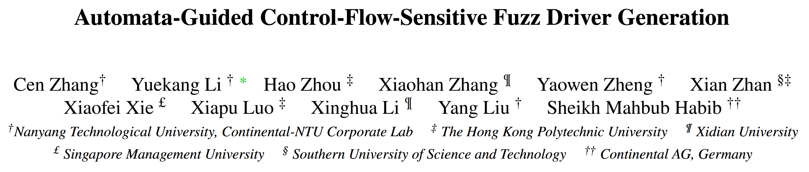

自动生成的模糊测试驱动程序面临三个挑战: 1) 如何学习和利用 API 的控制依赖, 2) 如何处理学习到的 API 使用噪声, 3) 如何组织驱动程序内部的 API 集合以更好地协调模糊测试器. 论文提出 RUBICK, 一种控制流敏感的模糊驱动自动生成技术. RUBICK有三个关键特性: 1) 它将API使用 (包括API数据和控制依赖) 建模为确定性的有限自动机; 2) 利用主动自动机学习算法提取学习到的API使用; 3) 结合一个单自动机引导的模糊测试驱动, 为模糊测试器提供调度接口以测试独立的API使用集合.

在实验中, RUBICK 生成的模糊测试驱动程序比 FUZZGEN 生成的模糊测试驱动程序平均多覆盖 50.42% 的边, 比 OSS-Fuzz 或人工编写的模糊测试驱动程序平均多覆盖 44.58% 的边, 表现出明显的性能优势. 

## Challenges

**C1** 工作学习到的 API 使用强调 API 之间的数据依赖, 而忽略了 API 之间的大多数控制依赖. 

**Solv**: RUBICK 将 API 控制依赖 (如分支和循环) 表示为自动机, API 控制依赖被解释为事件序列. 设计提取算法, 从API使用者中提取使用自动机 (usage automaton).

**C2** 现有工作学习到的 API 使用受到噪声的影响, 如冗余的 API 使用或错误的 API 依赖. 如果不能消除噪声, 模糊驱动生成技术的可用性就会受到限制, 在复杂的真实世界的消费者程序上更为明显.

**Solv**: 自动机本质上表示一组接受事件序列, 对提取的使用进行去噪意味着生成一个只接受有效序列的最小化自动机. RUBICK 采用主动自动机学习算法 L*, 从一个空自动机开始, 使用来自 MQ (membership queries) 和 EQ (equivalence query) 的反馈不断改进该自动机, 直到满足EQ. RUBICK 将静态和动态信息相结合来解决序列的有效性问题. 当自动机不错误地接受或拒绝序列时, 它是可接受的. 每个提取的自动机都被单独去噪, 然后与其他自动机合并为一个使用自动机.

**C3** 现有工作可以为单个目标库生成多个模糊测试驱动程序, 但如何组织和利用这些模糊测试驱动程序以保证它们能够被模糊器有效地测试还有待研究. 组织不良的模糊测试驱动程序会分散模糊测试器的注意力, 影响模糊测试的性能.

**Solv**: RUBICK 不生成多个模糊测试驱动, 而生成一个由自动机引导的模糊测试驱动. 它提供一个调度接口, 模糊测试器可以通过改变输入的特定字节来选择测试用例集.

## Methods

RUBICK 有三个组成部分: 

学习材料准备. 材料包括原始 NFA (non-deterministic finite automaton) 格式的事件序列、API 数据依赖关系和 API 元信息

自动机学习. RUBICK 首先统一所有原始 NFAs 的字母表. 然后使用 L* 算法为每个原始 NFA 生成一个蒸馏 (去噪) 的 DFA. 经过提炼, RUBICK 将这些 DFA 合并为一个使用自动机

模糊测试驱动合成. RUBICK 合成一个自动引导的模糊驱动器

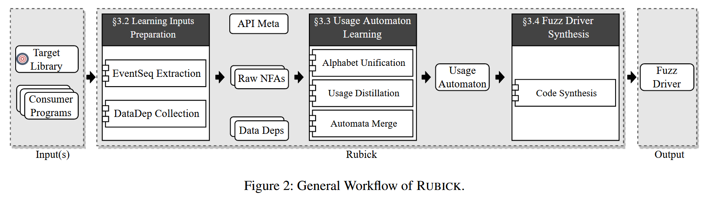

### API Usage Modeling

RUBICK 通过使用自动机来表示 API 的使用情况. 使用自动机包含两类事件: 函数事件和条件事件. 在自动机的上下文中, 函数可以绑定零个或多个输出变量. 条件表达式由常量和输出变量组成. 函数事件表示调用 API 函数并更新其绑定输出变量的值的操作. 条件事件表示条件表达式的计算结果为 true 的操作.

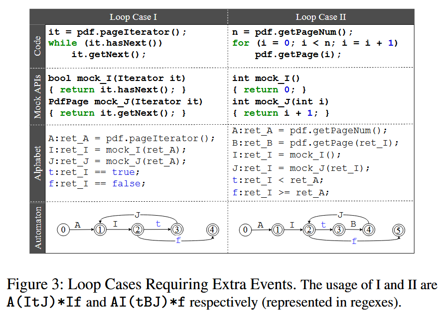

### Learning Inputs Preparation

RUBICK 通过静态分析从用户程序中收集学习输入. RUBICK 不需要目标库的先验知识. 给定库, RUBICK 收集候选事件和事件序列; 说明 API 数据依赖关系; API 元信息, 指API函数的基本信息, 如函数签名、参数类型和返回值等. 每个库只收集一次。

RUBICK 通过将用户程序的控制流图 (CFG) 转换为非确定有限自动机 (NFA) 来提取事件序列. API 函数相关事件的识别: 调用任何 API 函数的指令都是一个函数事件, 任何条件表达式被 API 函数输出污染的分支指令都是一对条件事件 (true和false分支).

算法1展示原始 NFA 的提取过程. 提取的原始 NFA 包含模糊驱动的控制流信息, 例如 API 函数的正确顺序, 或者调用API函数的条件等. 

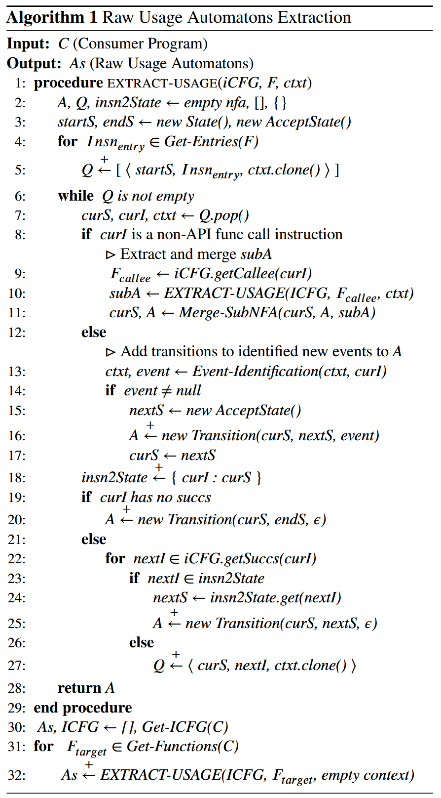

### Usage Automaton Learning

收集到的原始 NFA 有自己的字母表. RUBICK 通过识别相同的字母, 将它们的字母统一. 对于 API 函数事件, RUBICK 会为具有相同函数签名的事件分配相同的字母. 对于条件事件, RUBICK 需要在分配字母之前对齐它们的条件表达式并解决潜在的冲突. 对于与 mock API 函数相关的事件, RUBICK会将它们分组进行比较.

提取的原始 NFAs 可能包含无效的事件序列. 使用蒸馏的目标是找到一个最小化的自动机, 它只接受 NFA 中正确的事件序列. RUBICK 使用 L* 算法主动学习最小化 DFA. 最后, RUBICK 使用 DFA 组合和最小化算法从提取的使用自动机中生成最终的使用自动机. 

### Automata-Guided Fuzz Driver Synthesis

RUBICK 基于学习到的使用自动机合成一个模糊测试驱动程序. RUBICK 首先使用基于深度优先搜索 (Deep-First Search, DFS) 算法来统计自动机内部所有独立的使用场景. 它加载使用自动机并在执行期间维护其状态. 对于每次执行, 它从初始状态开始, 尝试遍历自动机, 直到没有后续状态. 在遍历的每一步之后, 驱动程序都会执行相应的代码, 并相应地更新状态. 在遍历过程中, 当有多个选择来选择下一个状态时, 选择由变化的输入或执行上下文决定. 如果下一个事件属于多个使用场景, 则选择由输入决定.

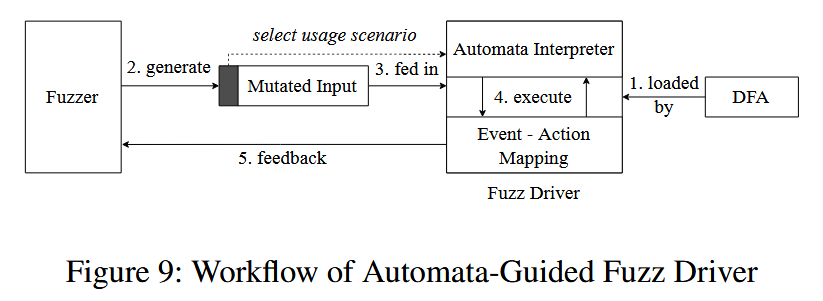

## Evaluation

**RQ1**: How is the performance when applying RUBICK on real world fuzzing projects?

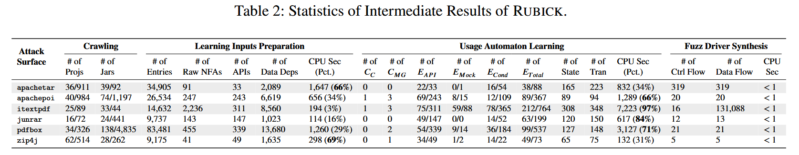

**RQ2**: How is the quality of the fuzz drivers generated by RUBICK compared with fuzz drivers generated by state-ofthe-art techniques and manually written ones?

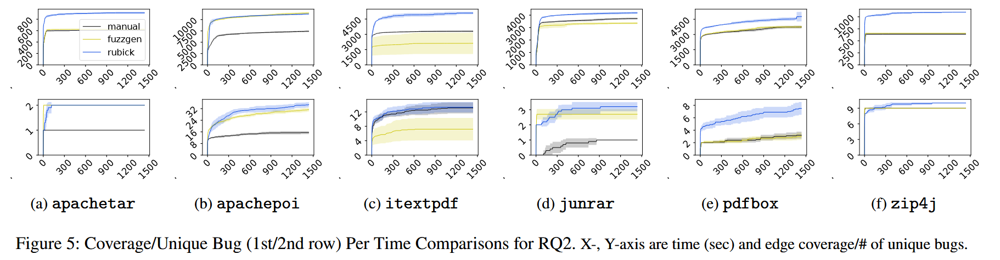

**RQ3**: Are the fuzz drivers improved by addressing the three key challenges?

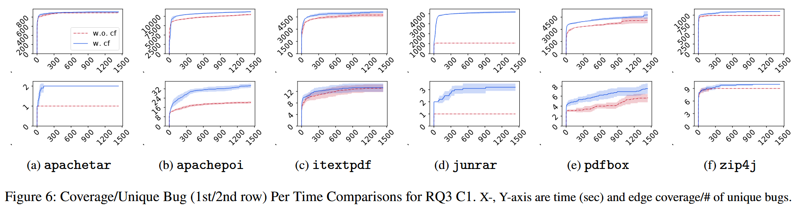

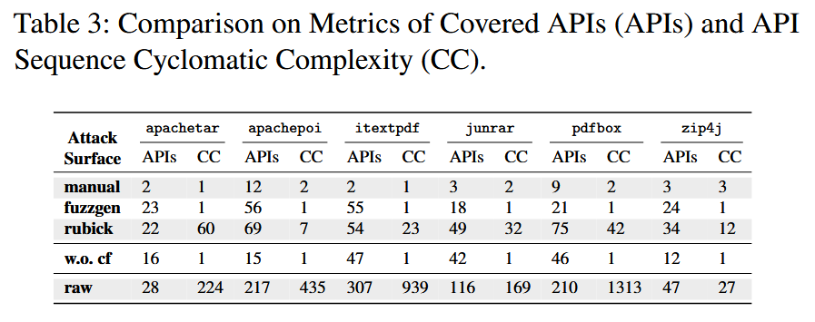

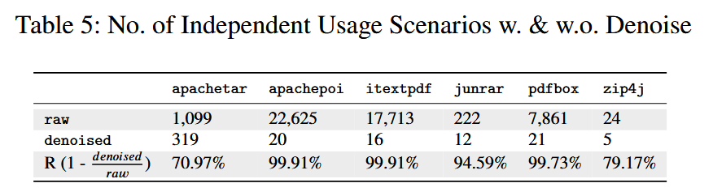

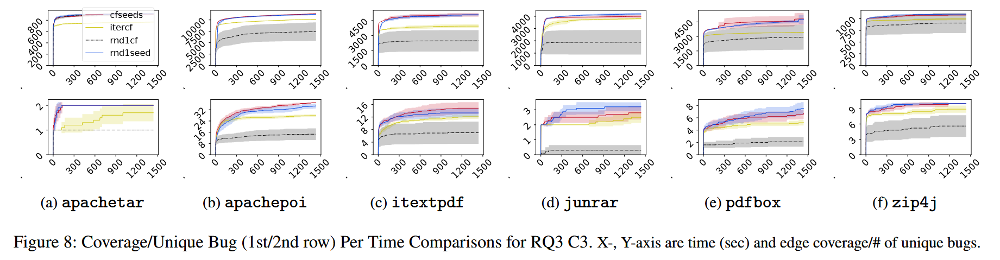

**RQ4**: How are the false positives produced by the fuzz drivers of RUBICK and other existing methods?

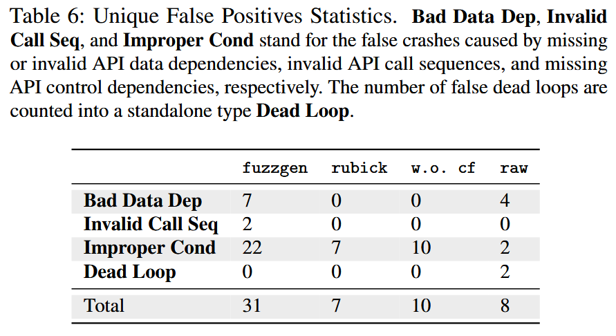

**RQ5**: Can the fuzz drivers generated by RUBICK help to find vulnerabilities in real world fuzzing scenarios?

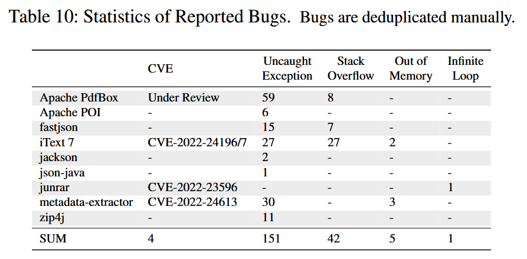
