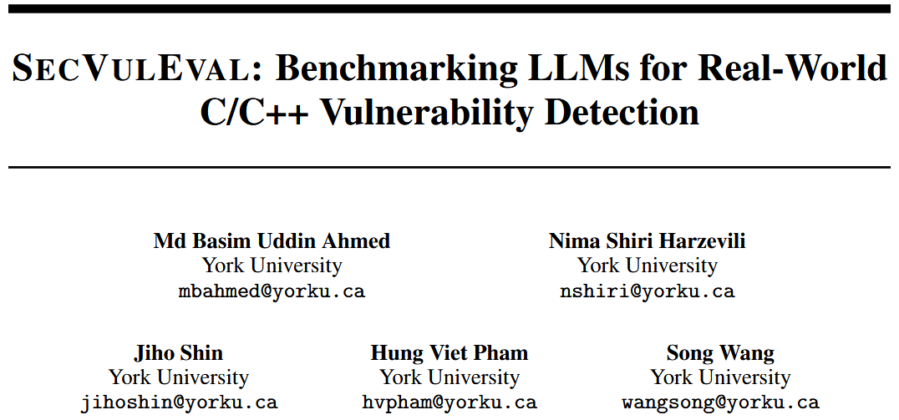
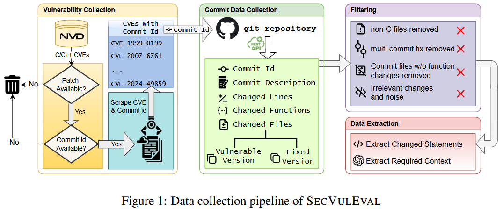
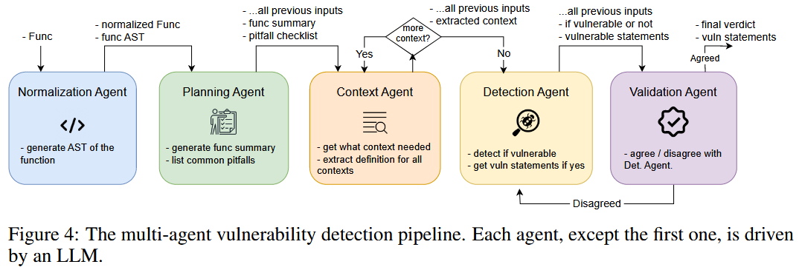
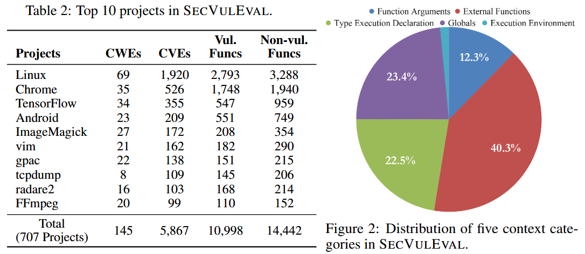

现在的 LLM 漏洞评估基准有各种问题. 数据集质量差: 存在标注错误、不一致和重复; 粒度粗: 大多数数据集只提供函数级标签, 无法评估模型对漏洞位置的定位能力; 缺乏上下文信息: 缺少跨函数调用、数据/控制依赖等真实场景中必不可少的上下文; 评估不真实: 在理想化假设下评估模型, 导致泛化能力差、实用性弱. 

为了解决上述问题, 作者构建 SECVULEVAL, 具备以下特点: 覆盖广泛: 包含 25,440 个函数样本, 覆盖 5,867 个真实 CVEs, 时间跨度从 1999 年至 2024 年; 细粒度标注: 以语句级别 (statement-level) 标注漏洞, 而非传统的函数级; 上下文丰富: 保留程序中的数据依赖、控制依赖和跨函数调用信息; 真实项目来源: 来自真实的开源 C/C++ 项目, 提升数据现实性和挑战性. 

## Method

## Dataset

### Filtering & De-noising

在收集完漏洞修复相关的提交 (commit artifacts) 后, 设计了多层次的过滤流程, 从源头上减少无关信息与噪声, 确保保留的是高质量的、真实反映漏洞的修改. 共 5 个层次

+ 去除非 C/C++ 文件: 删除如 `.S`、`.rst` 和配置文件等
+ 排除多次提交修复: 仅保留通过**一次提交 (single-commit) **完成修复的 CVE. 
+ 剔除未修改函数的提交: 过滤掉那些没有函数体变动的 commit
+ 使用启发式规则剔除非漏洞相关的代码改动: 筛选保留以下两类函数: (i) 文件中**唯一被修改**的函数; (ii) **在 CVE 或 commit message 中被明确提及**的函数; 
+ 去重: 对函数进行 标准化处理 (去除首尾空格、换行符、制表符); 使用 md5 哈希 生成唯一标识; 如果多个函数哈希值相同, 则保留其中一份. 

