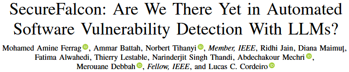
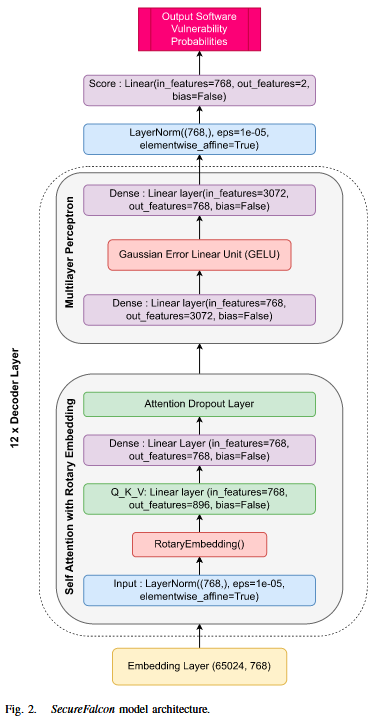
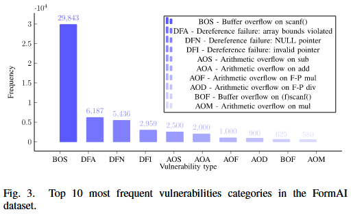
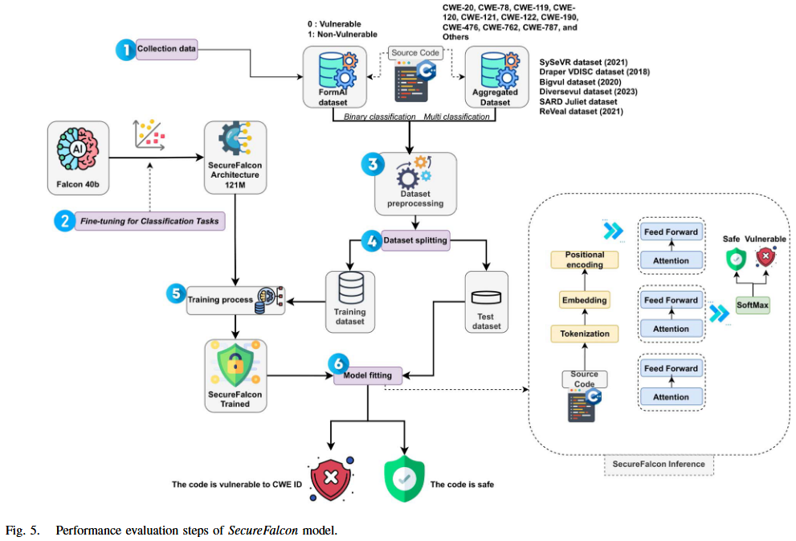
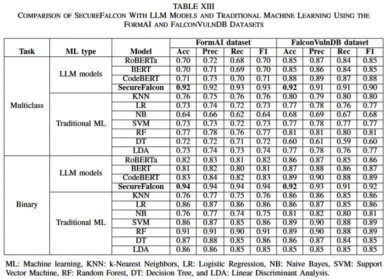
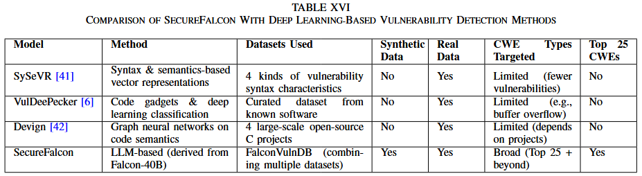

# SecureFalcon: Are We There Yet in Automated Software Vulnerability Detection With LLMs? [TSE 2025]

本文提出一种创新的模型架构 SecureFalcon, 采用仅 121 百万参数的 Falcon-40B 模型, 并专门为软件漏洞分类而量身定制. 为了实现最佳性能, 作者使用了两个数据集来训练作者的模型, 分别是 FormAI 数据集和 FalconVulnDB. FalconVulnDB 是由一系列最新的公共数据集组成的, 包括 SySeVR 框架、Draper VDISC、Bigvul、Diversevul、SARD Juliet 和 ReVeal 数据集. 这些数据集包含了 25 个最危险的软件漏洞类型, CWE-119、CWE-120、CWE-476、CWE-122、CWE-190、CWE-121、CWE-78、CWE-787、CWE-20 和 CWE-762 等. SecureFalcon 在二分类任务中取得了 94% 的准确率, 在多分类任务中最高可达到 92% , 并且能在即时 CPU 推理时间内完成任务. 

## Models

SecureFalcon模型, 来源于40B参数的FalconLLM, 包含如图2所示的组件, 其中out_features=12用于多分类, out_features=2用于二分类. 该架构包括四个主要组件: 词嵌入、编码器层、最终层归一化和评分层.  

1) 词嵌入: 词嵌入作为语言模型中的初始转换层. 该层将离散的单词转换为密集的连续向量, 这些向量概括单词的语义和句法信息. 它们的维度为768, 且模型在65024的词汇表大小上进行训练. 

2) 解码器层: 这些构成了语言模型的主要部分, 并包含四个堆叠的 transformers. 归一化层, 这种正则化技术在特征维度上对输入进行标准化处理, 使模型更加稳定且训练速度更快. **自注意力与旋转位置嵌入** (Self-Attention with Rotary Position Embedding, RoPE), 位置编码的最新进展显示了它在变换器架构中的有效性, 为不同序列位置的元素之间的依赖建模提供了有价值的监督. 多层感知机 (MLP) : MLP包含输入层, 隐藏层使用高斯误差线性单元 (GELU) 激活函数, 引入非线性, 输出层则用于生成最终结果. 
3) 最终层归一化: 来自最后一个解码器层的输出经过额外的层归一化操作, 以标准化输出, 然后进行最终的线性变换和 softmax 操作. 该操作遵循与解码器层中的层归一化相同的数学原理. 该层的参数也是768维向量. 这一层有助于保持网络中激活值和梯度的一致分布, 从而提高模型性能. 
4) 评分层: 评分阶段涉及一个线性层, 该层为输入的源代码生成漏洞评分. 该层的设计目的是将 768 维的归一化解码器输出转化为一个二维向量, 以匹配漏洞类别 (“漏洞”与“非漏洞”) . 类似地, 输出特征在多分类任务中扩展到 12 维. 

## Dataset

SecureFalcon 使用 FormAI 数据集 [28] 对模型进行微调. FormAI 数据集包含 112,000 个可编译的 C 代码片段, 这些代码片段是通过动态 zero-shot 提示方法使用GPT-3.5-turbo 模型创建的. 对 FormAI 数据集执行的预处理步骤对于在将数据输入 FalconLLM 模型之前准备数据至关重要. 预处理包括去除头信息并清理文本, 去除 HTML 标签、链接和电子邮件地址. 这些步骤有助于标准化文本数据, 消除噪声或无关信息, 从而有利于后续分析. 此外, 作者计算每个文本条目的单词数, 并为单词计数添加一个新列. 该新列计算了分词器接受的最大输入序列长度. 作者使用标签编码将分类的‘标签’列转换为数字表示. 通常, 这一预处理阶段确保数据集已被清洗、标准化, 并为使用 FormAI 数据集对 FalconLLM 进行微调的过程做好准备. Fig. 3 展示了经过预处理后的 FormAI 数据集中最常见的 10 个漏洞类别. 

作者还使用文献中引用的数据集对 SecureFalcon 进行了微调, 具体包括: SySeVR框架 [41]、Draper VDISC、Bigvul、Diversevul、SARD Juliet 和ReVeal. 除Juliet数据集外, 其他数据均来自开源项目. Juliet中的测试用例是有漏洞设计的, 并附有相关的修补程序. 此外, 由于函数和变量名是显式的, 会影响模型的训练, 因此作者对其进行了混淆. 至于其他数据集, 对它们进行了有限的预处理, 如函数提取、处理换行符、删除注释、CWE映射和统一特征等. 尽管多个数据集已有 CWE 映射, 但有些数据集缺少 CWE, 而是使用了 CVE. 在 ReVeal 数据集中, 没有CWE, 仅标注为漏洞或非漏洞. 同时, Draper 数据集是唯一一个多标签数据集. 数据集的合并最终得出了表III中呈现的结果. 数据集最初包含170万个样本, 但不同数据集之间存在重叠, 预处理后作者去除了这些重复数据. 作者使用了超过 750,000 个样本来训练模型, 其中20%作为测试集. 

作者认识到像 BigVul 这样的广泛使用的数据集存在已知的数据质量问题, 正如先前的研究, 如LineVul [63], 所指出. 为了确保结果的可靠性, 作者实施了严格的预处理流程, 包括去重以消除冗余记录, 通过与公开的漏洞描述交叉验证漏洞标签, 去除不完整或模糊的条目. 作者采用了结构化的集成和标准化过程, 以确保在合并这些异构数据源时的一致性、可靠性和透明性. 首先, 作者建立了一个统一的模式, 标准化了漏洞标签、CWE 标签和严重性度量等字段. 对于提供直接 CWE 映射的数据集, 作者按原样纳入；对于仅提供 CVE 参考或二分类漏洞标签 (如 ReVeal) 的数据集, 作者通过与权威数据库 (如NVD) 交叉检查这些标识符, 以便在可能的情况下映射或推断出最可能的 CWE 类别. 例如, 如果 ReVeal 中标记为漏洞的函数引用了一个后来被 NVD 确认与缓冲区溢出漏洞相关的 CVE, 作者就将该样本标注为相应的CWE (例如CWE-120) . 当无法分配可靠的CWE分类时, 作者保留二分类漏洞标签, 以保持数据集的多样性. 

## Evaluation

## References

[28] N. Tihanyi, T. Bisztray, R. Jain, M. A. Ferrag, L. C. Cordeiro, and V. Mavroeidis, “The formAI dataset: Generative AI in software security through the lens of formal verification,” in Proc. 19th Int. Conf. Predictive Models Data Analytics Softw. Eng., 2023, pp. 33–43.

[41] Z. Li, D. Zou, S. Xu, H. Jin, Y. Zhu, and Z. Chen, “SySeVR: A framework for using deep learning to detect software vulnerabilities,” IEEE Trans. Dependable Secure Comput., vol. 19, no. 4, pp. 2244–2258, Jul./Aug. 2022.

[63] M. Fu and C. Tantithamthavorn, “LineVul: A transformer-based linelevel vulnerability prediction,” in Proc. 19th Int. Conf. Mining Softw. Repositories, 2022, pp. 608–620.

