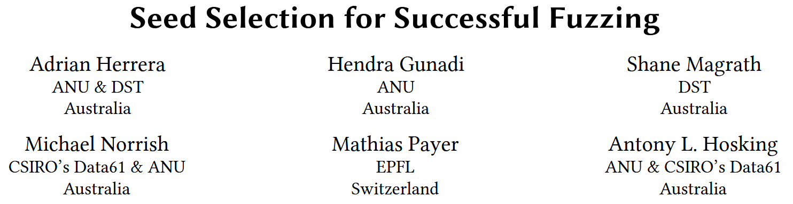
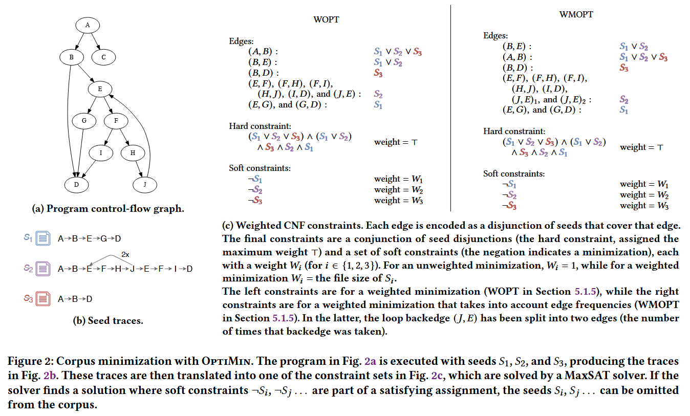
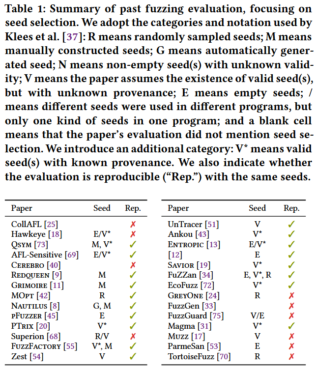
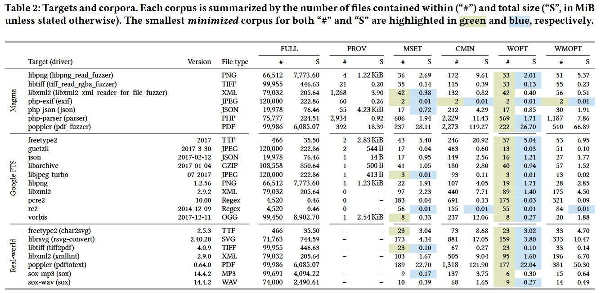
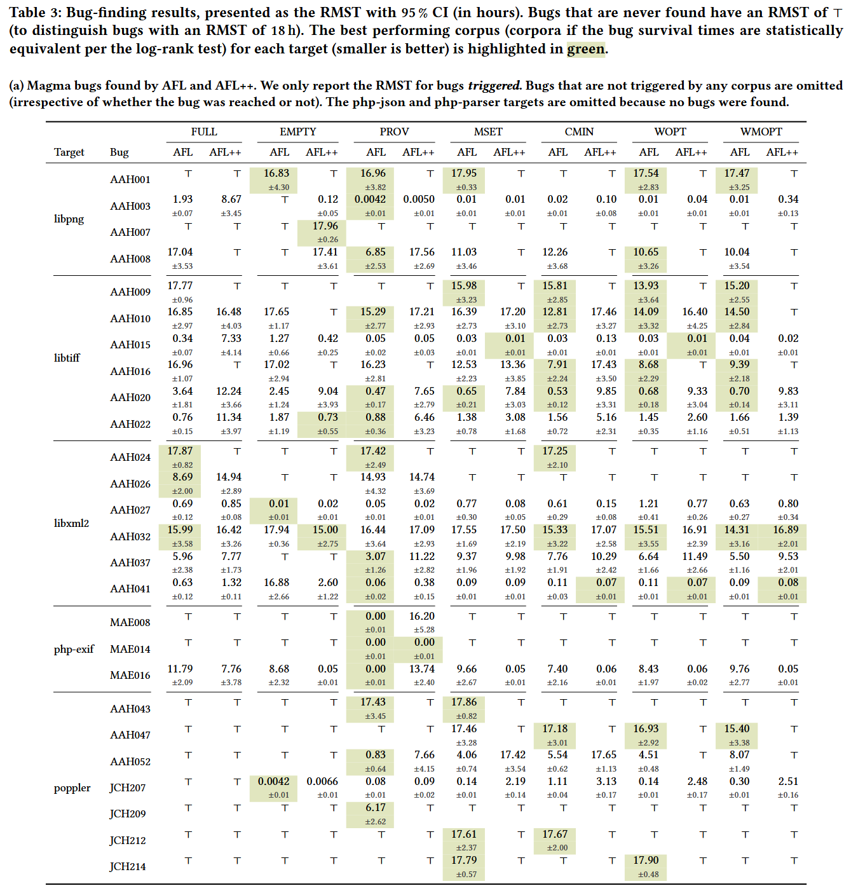
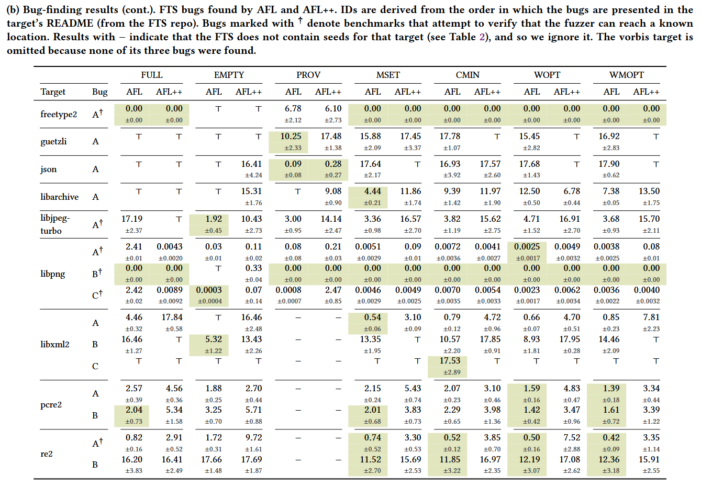
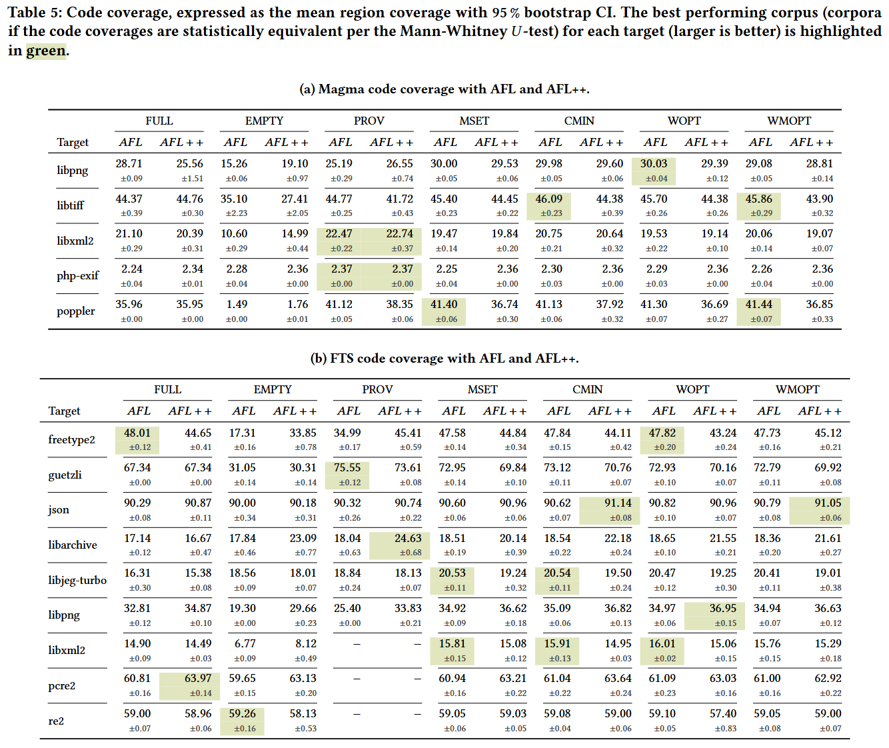

# Seed Selection for Successful Fuzzing [ISSTA 2021]

构建 fuzzing 种子库的常见方法包括: (i) 使用空文件; (ii) 使用目标输入格式的单一种子代表; (iii) 收集大量种子 (如爬取互联网). 在种子选择上, 没有就哪种方法最好达成共识. 为解决该问题, 本文系统地研究和评估了种子选择如何影响模糊器在真实世界软件中找到 bug 的能力. 这包括对评估和部署环境中使用的种子选择实践的系统回顾, 以及对六种种子选择方法的大规模实证评估 (超过 33 CPU-years). 这六种种子选择方法包括三种语料库最小化技术 (选择触发与完整语料库相同范围插桩数据点的最小种子的子集). 

实验结果表明, 模糊测试的结果明显取决于用于引导模糊器的初始种子, 最小化语料库的性能优于单种子集、空种子集和大种子集 (几千个种子). 

## Contributions

1. 对模糊器评估和部署中使用的种子选择实践和语料库最小化技术进行系统回顾. 发现种子选择的实践差异很大, 对选择种子的最佳方法没有共识
2. 提出一种新的最小化种子库工具 OptiMin, 可以产生一个最优的最小种子库
3. 对各种子选择方法进行定量评价和比较. 对 3 种种子库最小化工具 (包括OptiMin) 进行测试, 发现生成的种子库在 bug 发现能力方面优于单例和空种子库
4. https://github.com/HexHive/fuzzing-seed-selection

## Methods

Abdelnur 等人 [5] 最早将最小种子集问题形式化为最小集覆盖问题 (minimum set cover problem, MSCP). MSCP 表述为, 给定集合 $$U$$, 和一组集合 $$S = s_1, s_2, ..., s_N$$, 集合 $$S$$ 的并集等于 $$U$$, 求使得并集仍然等于 $$U$$ 的最小集覆盖 (minimum set cover) $$C \subseteq S$$. 如果每个元素 $$s_i \in S$$ 带有权重, 则 weighted MSCP 目标是求最小权的最小集覆盖 $$C$$. 

(W)MSCP 问题是 NP-完全问题, 目前只能用贪心算法求解. 由于在 fuzzing 测试中发现的 bug 与代码覆盖率之间存在很强的正相关关系, 代码覆盖率继续被用来表征模糊测试语料库中的种子. 因此, 查找 $$C$$ 等价于查找仍然保持在集合语料库中观察到的代码覆盖率的最小种子集合.

作者总结 2 种, 并提出的 1 种最小化种子集技术

+ Minset 是 Abdelnur 工具的扩展, 结合种子执行时间和文件大小计算最小集覆盖 $$C$$. 

+ afl-cmin 使用贪心算法计算最小集覆盖 $$C$$, 沿用 AFL 的边覆盖概念, 统计每边的频率. 给定边计数, afl-cmin 会在种子库中选出最小种子的集合达到目标计数.

+ OptiMin 使用 EvalMaxSAT 求解器将语料库最小化作为 MaxSAT 问题进行建模和求解. 最大可满足性问题 (MaxSAT) 将约束分为硬约束和软约束, 旨在满足所有硬约束并最大化满足软约束的总数 (或加权总数). OptiMin 将边覆盖视为硬约束, 而在解决方案中不包含特定的种子则视为软约束. 这种方法确保解决方案以最少的种子数覆盖所有的边, 并且是最优的, 因为解决方案 $$C$$ 保证是精确的.

  

## Evaluation

### Preliminary Analysis

**Seed Selection** of 28 papers published since 2018.

作者详细地研究了 Suricata (OSSFuzz) 语料库, 因为它提供了最多的种子数量 (62,726). 这62,726个种子中存在大量的冗余: 通过丢弃具有相同MD5散列值的种子, 将语料库减少到31,234个种子 (减少50%). 通过再次应用 afl-cmin, 能够进一步减少语料库的大小到 145 个种子 (减少99%). 这种冗余会导致种子阻塞模糊测试队列, 从而阻碍和延迟更有希望的种子的突变. 

### RQ1 How effective are corpus minimization tools at producing a minimal corpus?

### RQ2 What effect does seed selection have on a fuzzer’s bug finding ability?

### RQ3 How does seed selection affect code coverage?

## Reference

[5] Humberto Abdelnur, Radu State, Obes Jorge Lucangeli, and Olivier Festor. 2010. Spectral Fuzzing: Evaluation & Feedback. Research Report RR-7193. INRIA. https: //hal.inria.fr/inria- 00452015

[10] Florent Avellaneda. 2020. A short description of the solver EvalMaxSAT. In MaxSAT Evaluations. http://florent.avellaneda.free.fr/dl/EvalMaxSAT.pdf

