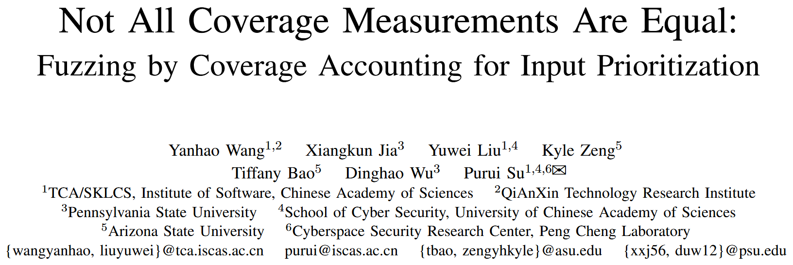
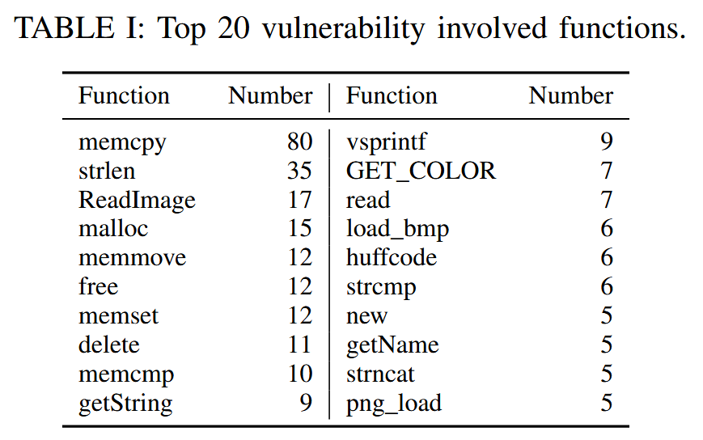
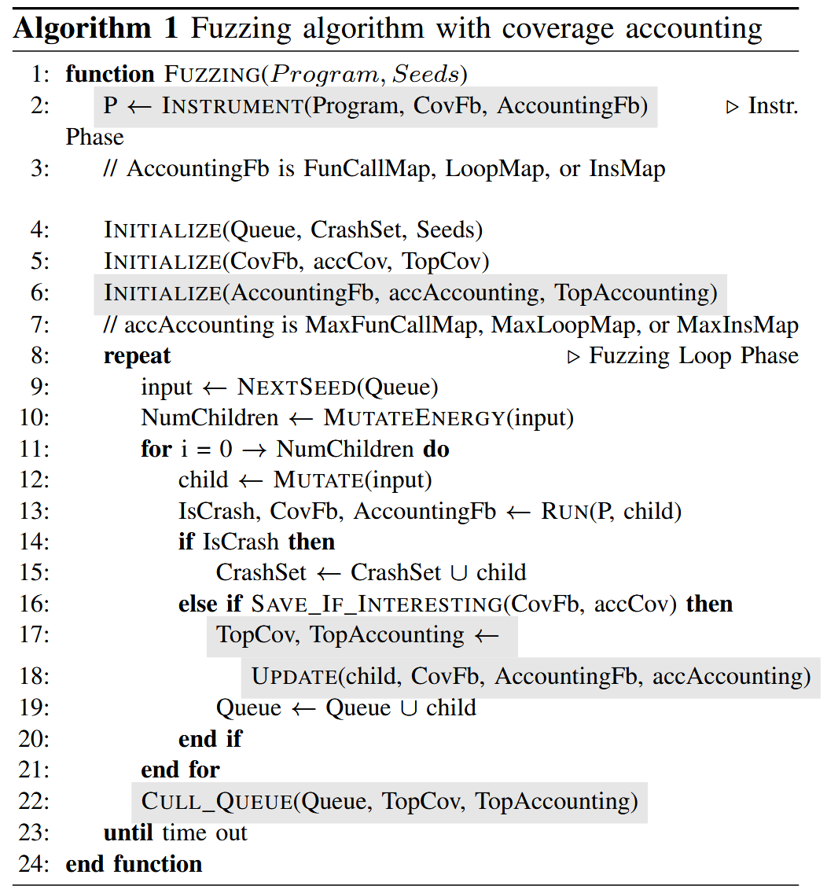
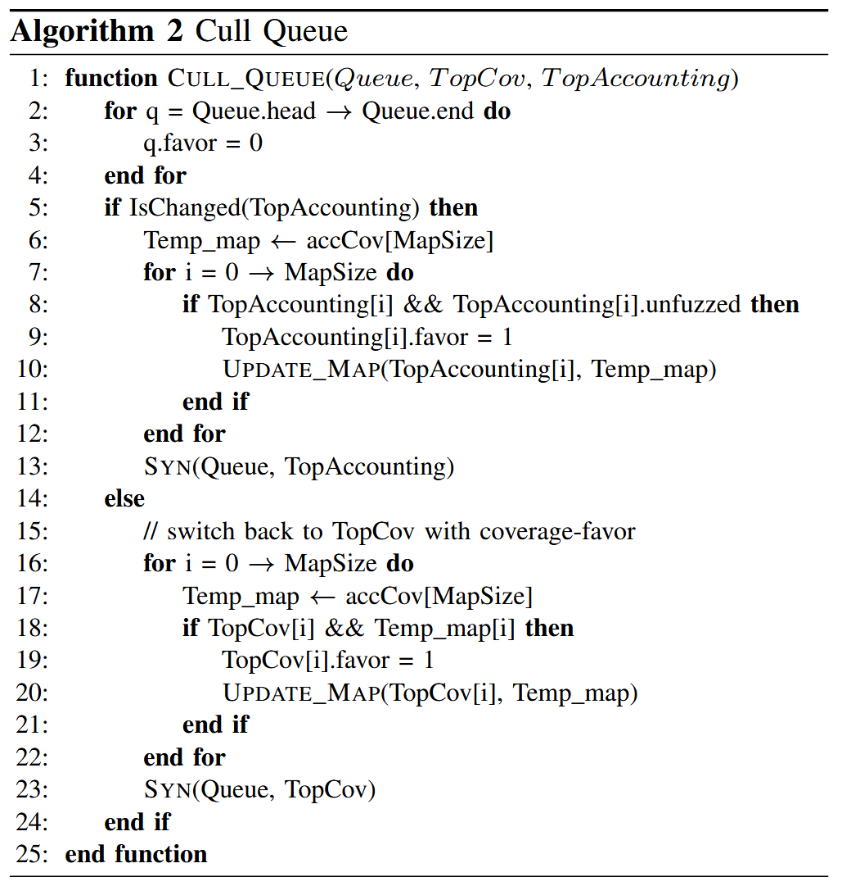
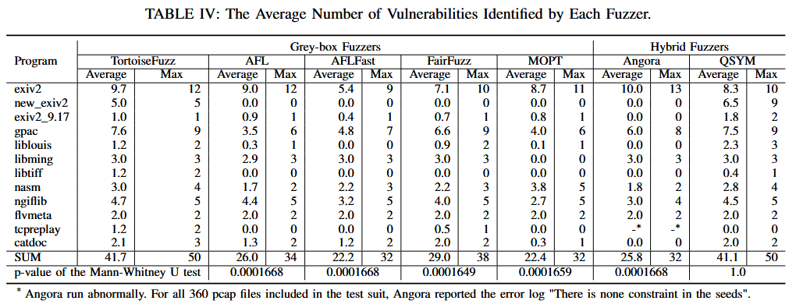
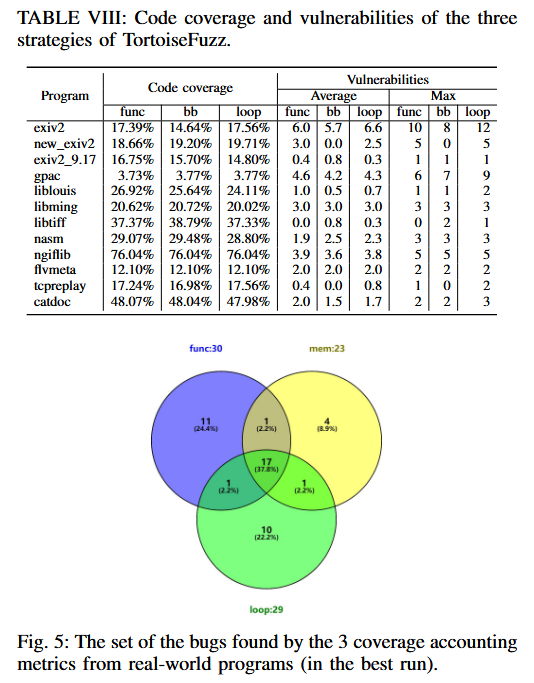

# Not All Coverage Measurements Are Equal: Fuzzing by Coverage Accounting for Input Prioritization [NDSS 2020]

当前的基于覆盖率的模糊测试工具对覆盖的代码处理是平等的, 所有贡献新语句或转换的输入都会被保留用于未来的变异, 而不考虑这些语句或转换是什么, 或者它们对安全性的影响有多大. 这种设计旨在实现全面的代码覆盖率是合理的, 但对于漏洞发现来说效率较低. 为解决平等覆盖率带来的局限性, 作者提出覆盖率计量 (coverage accounting), 一种通过安全影响来评估覆盖率的新方法. 覆盖率计量通过三个度量 (基于函数、循环和基本块三个不同级别) 对边进行属性赋值. 基于这些度量设计一个新的方案来优先考虑模糊测试输入, 并开发 TortoiseFuzz, 一个用于发现内存损坏漏洞的灰盒模糊测试工具. 

## Contributions

1. 提出覆盖率计量 (coverage accounting), 一种新的输入优先级排序方法, 通过评估边的度量来衡量与内存损坏漏洞的相关性. 该方法轻量且不需要像污点分析和符号执行等昂贵的分析, 并且受反模糊测试技术的影响较小
2. https://github.com/TortoiseFuzz
3. 在30个真实世界的应用程序上评估, 与 6 个最先进的灰盒和混合模糊测试工具进行比较: AFL、AFLFast、FairFuzz、MOPT、QSYM 和 Angora. TortoiseFuzz 发现的漏洞比 6 个模糊测试工具中的 5 个 (AFL、AFLFast、FairFuzz、MOPT 和 Angora) 更多, 并且与 QSYM 的结果相当, 但平均只消耗 QSYM 内存使用量的约2%. 作者还将覆盖率计量度量与另外两个度量 (AFL-Sensitive 和 LEOPARD) 进行比较, 结果表明 TortoiseFuzz 在发现漏洞方面明显优于这两种度量. 此外, 将覆盖率计量度量应用于 QSYM, 覆盖率计量帮助平均增加 28.6% 的发现漏洞数量. TortoiseFuzz 共发现 20 个零日漏洞, 其中 15 个得到 CVE 确认. 

## Related Works

边覆盖率虽然在代码覆盖率和路径覆盖率之间取得了良好的平衡, 但对于输入优先级排序来说仍然不足, 因为它没有考虑更细粒度的上下文. 

Angora [12] 提出添加调用栈, 而 AFL-Sensitive [53] 则引入多种附加信息, 如内存访问地址 (内存访问感知分支覆盖率) 和 n 个基本块执行路径 (n-gram分支覆盖率).  但存在一个问题: 输入可能会落入程序的“冷”部分, 这部分代码不太可能存在内存损坏漏洞, 然而它可能贡献新的覆盖率. 

CollAFL [18] 提出新的度量标准, 它将内存访问的指令总数作为输入优先级排序的度量标准. 然而, CollAFL 无法保证优先排序的输入覆盖所有已访问的边. 它可能会陷入一个涉及大量内存操作的代码片段, 但该片段并不包含漏洞, 例如一个带有字符串赋值的循环. 

LEOPARD [15] 通过函数级别的覆盖度量来优先排序从队列剪枝中选出的输入, 而不是像 AFL 那样随机选择. 这种方法能够在每次模糊测试循环中覆盖所有已访问的边, 但它需要对目标程序进行预处理以进行函数复杂度分析, 带来性能开销. 

## Methods

基于内存损坏漏洞直接与内存访问操作相关的直觉, 作者设计用于内存错误的覆盖率计量, 作为衡量边的未来内存访问操作的度量. 在不同级别上处理内存访问操作, 提出从函数调用、循环和基本块三个粒度考虑最近和未来内存访问操作. 

**函数层面** 爬取 CVE 描述中的参考网页及其子页面, 从参考网页中提取调用栈, 以及相关函数. 表 I 中展示前20个涉及漏洞的函数. 

**循环层面** 为目标程序的每个模块构建控制流图 (CFG), 并通过检测反向边来分析自然循环. 

**基本块层面** 通过涉及内存操作的指令数来评估边的优先级. 设 `IsContainMem(i)` 为布尔函数, 表示指令 $$i$$ 是否包含内存操作. 边的基本块度量为

$$
\mathrm{BB}(e)={card}\left(\left\{i \mid i \in d s t_e \wedge {IsContainMem}(i)\right\}\right)
$$

基于 AFL 设计 TortoiseFuzz, 并保留输入过滤和队列剪枝相结合的输入优先级排序方法. 算法 1 展示模糊测试过程, 灰色部分表示不同的组件/逻辑. TortoiseFuzz 由两个阶段组成: 插桩阶段和模糊测试循环阶段. 在插桩阶段, 目标程序会被插入代码以进行初步分析和运行时执行反馈. 在模糊测试循环阶段, TortoiseFuzz 会迭代地使用测试用例执行目标程序, 根据执行反馈将有趣的样本添加到模糊测试队列中, 并选择输入用于迭代. 

### Instrumentation Phase

对于源代码, 在编译期间添加分析代码; 否则, 重写代码以完成插桩. 如果目标程序需要特定类型的输入, 则修改输入 / 输出接口并进行插桩. 插入的运行时分析代码负责收集覆盖率和安全敏感性评估的统计信息. 

### Fuzzing Loop Phase

算法 1 其他部分和 AFL 差异不大. 主要改进为变异阶段的样本选择. 

变异阶段对于 Queue 中的样本, 函数 NextSeed 会根据概率选择下一个测试轮次的种子 (第9行), 该概率由样本的 favor 属性决定. favor 的原始目的是拥有一个能够覆盖到目前为止所有边的最小样本集, 并将其优先用于模糊测试. 作者改进这个机制, 通过两个步骤: Update (第18行) 和 Cull_Queue (第22行) 来优先选择变异样本. 更具体地, Update 会更新结构 accAccounting, 并返回 TopCov 和 TopAccounting 的高评分列表, 这些列表会在函数 Cull_Queue 中使用. 

TopAccounting 中记录的高评分候选样本是可覆盖到目前为止所有安全敏感边的样本超集. 为优化模糊测试的工作量, 如算法 2 所示, TortoiseFuzz 会在每轮测试后重新评估所有高评分候选样本, 从中选择一个准最小子集, 这些样本能够覆盖所有已累积的与内存相关的边, 并且尚未被模糊测试过. 

## Evaluation

这里省略 RQ1/4/5. 

### RQ2: How do the results of TortoiseFuzz compare to previous greybox or hybrid fuzzers in real-world programs?

### RQ3: How do the results of the three coverage accounting metrics compare to other coverage metrics or input prioritization approaches?

## Reference

[12] P. Chen and H. Chen, “Angora: Efficient fuzzing by principled search,” in Proceedings of the 2018 IEEE Symposium on Security and Privacy. IEEE Computer Society, 2018.

[15] X. Du, B. Chen, Y. Li, J. Guo, Y. Zhou, Y. Liu, and Y. Jiang, “Leopard: Identifying vulnerable code for vulnerability assessment through program metrics,” in Proceedings of the 41st International Conference on Software Engineering. IEEE Press, 2019.

[18] S. Gan, C. Zhang, X. Qin, X. Tu, K. Li, Z. Pei, and Z. Chen, “Collafl: Path sensitive fuzzing,” in Proceedings of the 2018 IEEE Symposium on Security and Privacy. IEEE, 2018.

[53] J. Wang, Y. Duan, W. Song, H. Yin, and C. Song, “Be sensitive and collaborative: Analyzing impact of coverage metrics in greybox fuzzing,” in 22nd International Symposium on Research in Attacks, Intrusions and Defenses (RAID 2019). USENIX Association, 2019.
