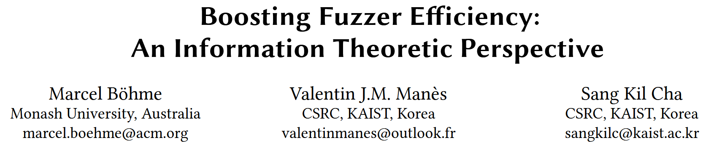
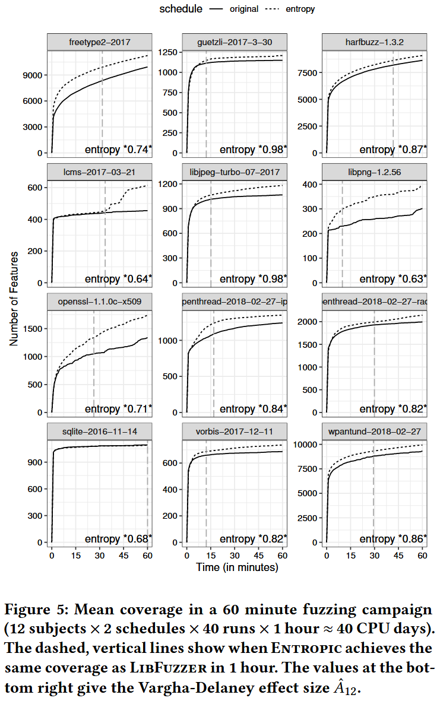
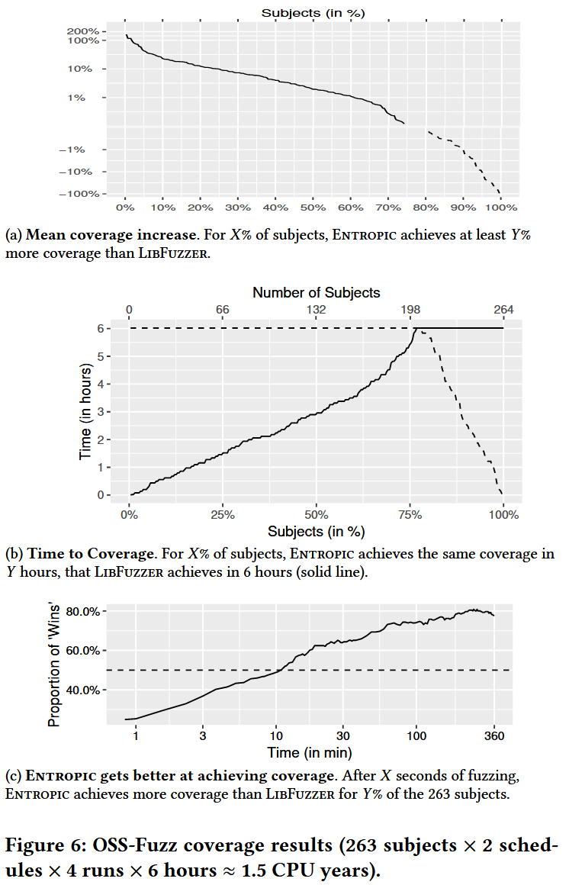
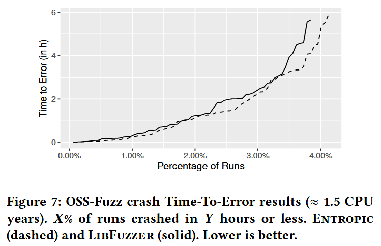
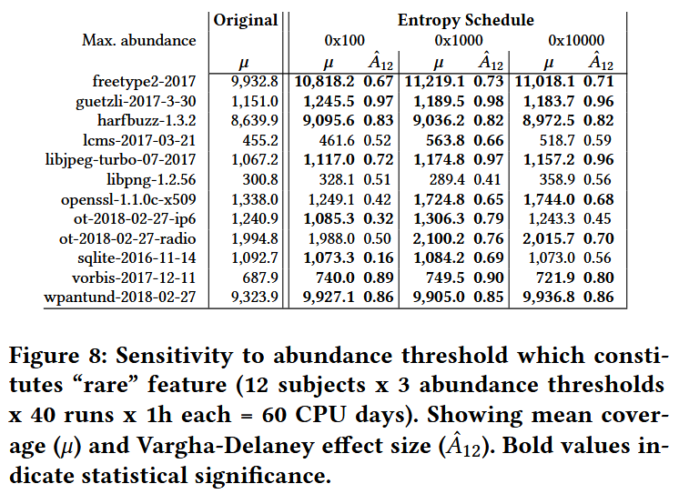
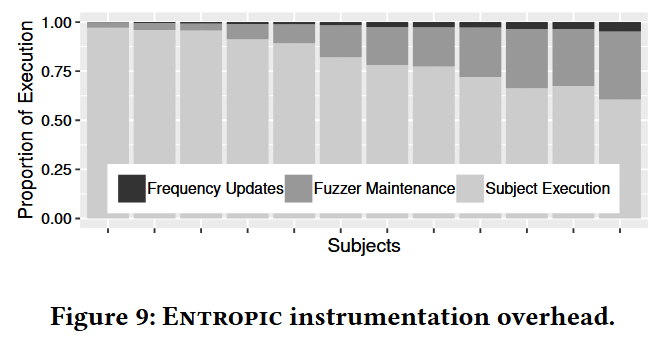

# Boosting Fuzzer Efficiency: An Information Theoretic Perspective [ESEC/FSE 2020]

模糊测试之前, 模糊器对程序 $$P$$ 的行为一无所知, 执行一个输入, 可以了解 $$P$$ 在该输入下的行为. 因此每次执行都可以揭示 $$P$$ 的信息, 信息的度量是香农熵 (Shannon’s entropy), 度量熵可以量化从每个生成的测试输入中了解到程序行为的多少. 用熵度量概率模型的模糊器发现程序新行为的效率, 高效的模糊器应该最大化信息. 

从信息论的角度出发, 作者开发 Entropic, 一种基于熵的灰盒模糊测试能量调度策略, 为那些最大化信息的种子分配更多的能量. 作者将 Entropic 实现到流行的灰盒模糊器 LibFuzzer 中, 对超过 250 个开源程序 (6000万行代码) 进行的实验表明, Entropic 显著提高效率, 并验证论文的假设: 高效的模糊测试器能够最大化信息. Entropic 已通过独立评估, 并被邀请集成到主线 LibFuzzer 中.

## Contributions

1. 为非确定性模糊测试开发信息论基础, 研究每个测试揭示程序行为的平均信息量
2. 将香农熵与模糊测试器的行为发现率正式关联, 即将效率建立为一个信息论量
3. 介绍几种在模糊测试背景下有用的信息估计方法
4. 提出第一个基于熵的能量调度方法, 以提高灰盒模糊测试器的效率
5. 提供开源实现, 称为 Entropic, (暂时没找到 libfuzzer 里对应的代码)
6. 对超过 250 个广泛使用的开源 C/C++ 程序进行大量的实证评估, 产生了超过 2 个 CPU 年的数据. 数据和 R 脚本开源: https://doi.org/10.6084/m9.figshare.12415622.v2

## Methods

### MEASURE OF FUZZER EFFICIENCY

### INFORMATION-THEORETIC BOOSTING

## Evaluation

### RQ.1 What is the empirical coverage improvement over the baseline?

### RQ.2 How much faster are bugs detected compared to the baseline?

### RQ.3 How does the choice of abundance threshold θ influence the performance of our technique?

### RQ.4 What is the cost of maintaining incidence frequencies?

