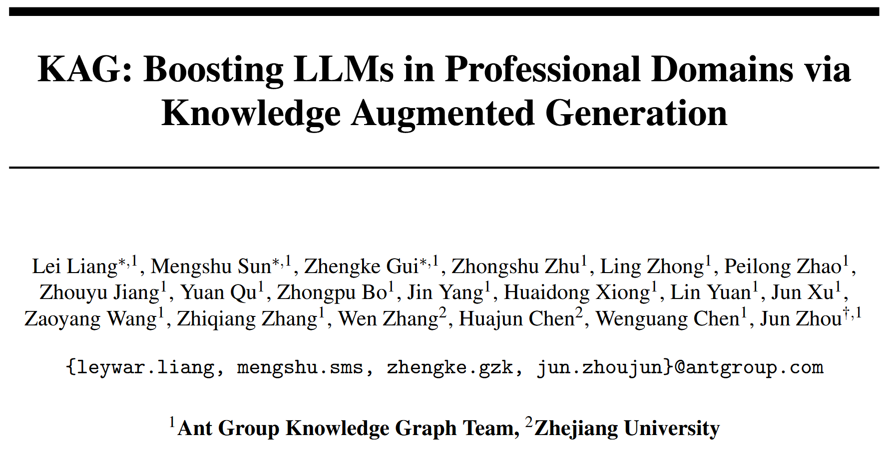
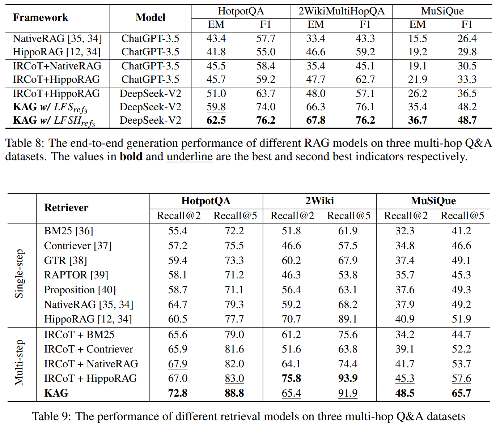

# KAG: Boosting LLMs in Professional Domains via Knowledge Augmented Generation 

检索增强生成 (retrieval-augmented generation, RAG) 存在局限性, 向量相似度与知识推理的相关性之间存在差距, 以及对数值、时间关系、专家规则等知识逻辑不敏感, 阻碍专业知识服务的有效性. 本文提出一种专业领域知识服务框架 —— 知识增强生成 (knowledge Augmented Generation, KAG). KAG 充分利用知识图谱和向量检索的优势, 通过对大型语言模型 (LLM) 和知识图谱的 5 个关键方面进行双向增强, 提高生成和推理效果. (1) LLM 友好的知识表示, (2) 知识图谱与原始块之间的互索引, (3) 逻辑形式引导的混合推理引擎, (4) 语义推理的知识对齐, (5) KAG 的模型能力增强. 

## Contributions

## Methods

**知识图谱** 利用显式语义组织信息, 基础知识单元是SPO三元组, 包含实体及其关系. 

实体具有明确的实体类型和关系. 通过实体归一化将语义相同但表达不同的实体统一起来, 从而减少冗余, 增强知识的互联性. 

在检索过程中, 使用查询语法 (如 SPARQL 和SQL) 可以显式指定实体类型, 减少来自相同名称或相似实体的噪声, 并允许根据查询需求指定关系进行推理知识检索, 而不是盲目地扩展到相似但关键的邻近内容. 同时, 由于知识图谱的查询结果具有明确的语义, 因此可以作为具有特定含义的变量使用. 这使得可以进一步利用 LLM 的规划和函数调用功能, 其中检索结果作为变量替换到函数参数中, 以完成确定性推理, 如数值计算和集合操作.

KAG 充分利用 KG 和 RAG 技术的互补特性, 不仅仅是将图结构融入到知识库过程中, 而是将知识图谱的语义类型和关系以及 KGQA (Knowledge Graph Question Answering) 中常用的逻辑形式融入到检索和生成过程中.

### LLM Friendly Knowledge Representation

### Mutual Indexing

### Logical Form Solver

### Knowledge Alignment

### KAG-Model

## Evaluation

