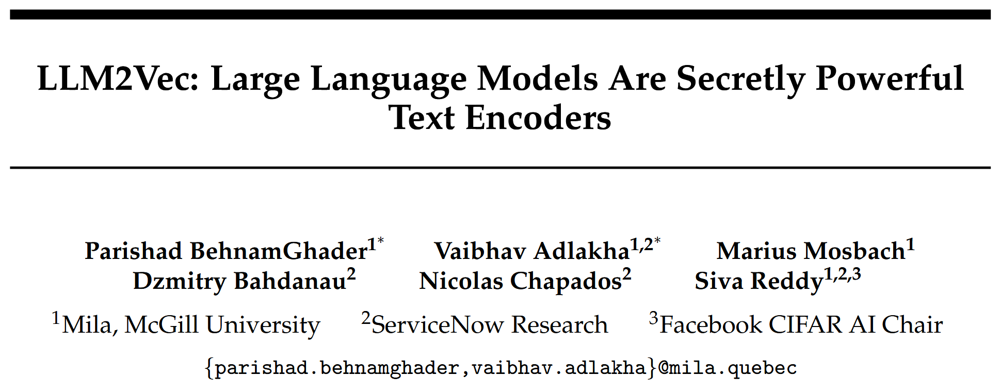
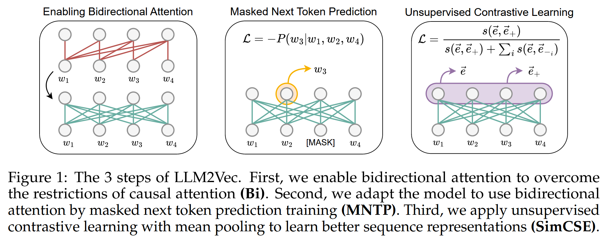

# LLM2Vec: Large Language Models Are Secretly Powerful Text Encoders

学术界将大模型应用于文本嵌入任务, 与应用于自然语言任务相比进展缓慢. 本研究提出 **LLM2Vec**, 一种简单的无监督方法, 能够将任意仅解码器的 LLM 转换为强大的文本编码器. LLM2Vec 包含三个简单的步骤: 1.启用双向注意力机制; 2.使用掩码的下一词预测任务; 3.进行无监督对比学习. 实验结果表明, LLMs 可以被高效地转化为通用文本编码器, 无需昂贵的模型适配或依赖 GPT-4 生成的数据. 

## Methods

### Enabling bidirectional attention (Bi)

LLM2Vec 方法的第一步是将仅解码器 LLM 中的注意力掩码替换为全为 1 的矩阵. 这样, 每个 token 都可以访问序列中的所有其他 token, 从而将模型转化为一个双向的 LLM. 

### Masked next token prediction (MNTP)

提出一种简单的策略, 使模型能够意识到其双向注意力机制的存在, 通过**掩码下一词预测 (Masked Next Token Prediction, MNTP)** 进行适配. 一个任意的输入序列 $$x = (x_1, x_2, ..., x_N)$$, 首先随机掩盖一部分输入 token, 然后训练模型根据前后文来预测这些被掩盖的 token. 关键在于: 在预测第 $$i$$ 个位置上的掩码 token 时, 并不是使用该位置的表示来预测, 而是使用前一个位置 $$i-1$$ 上的 token 表示所生成的 logits 来计算损失. 

### Unsupervised contrastive learning (SimCSE)

仅解码器的 LLM 并未被显式地训练去捕捉整个序列的上下文信息, 引入**无监督对比学习**, SimCSE 方法: 给定一个输入序列, 将其输入模型两次, 并使用独立采样的 dropout 掩码, 从而得到该序列的两个不同表示. 然后训练模型最大化这两个表示之间的相似度, 同时最小化它们与同一批次中其他序列表示之间的相似度. 