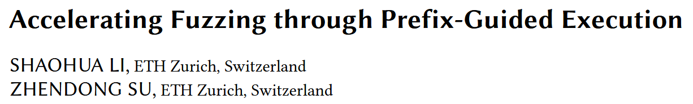
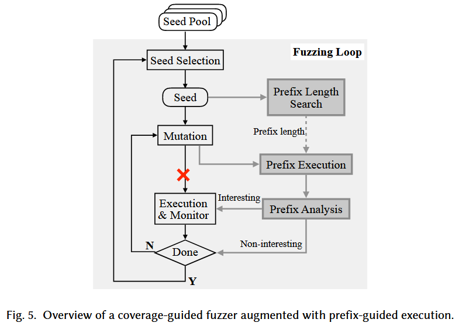
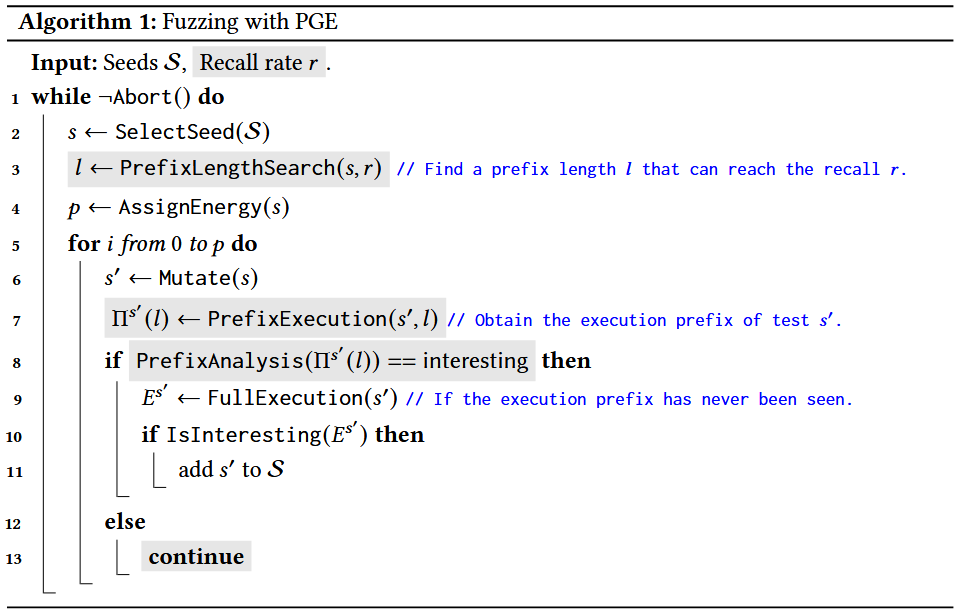
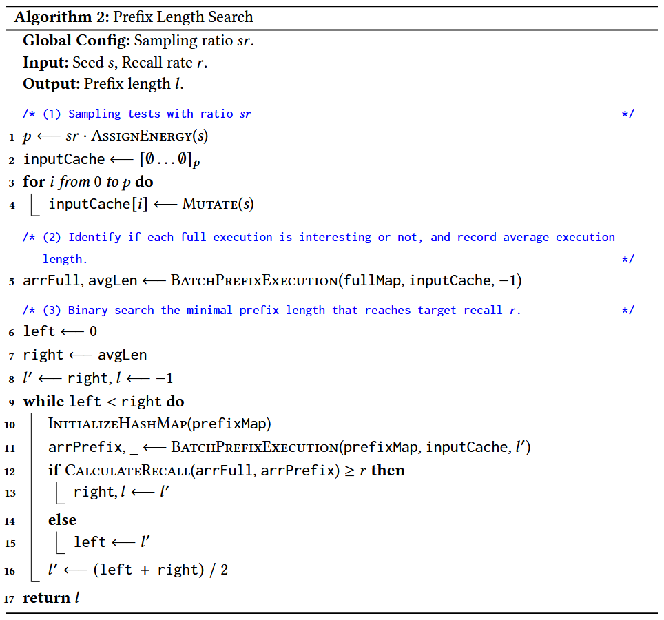
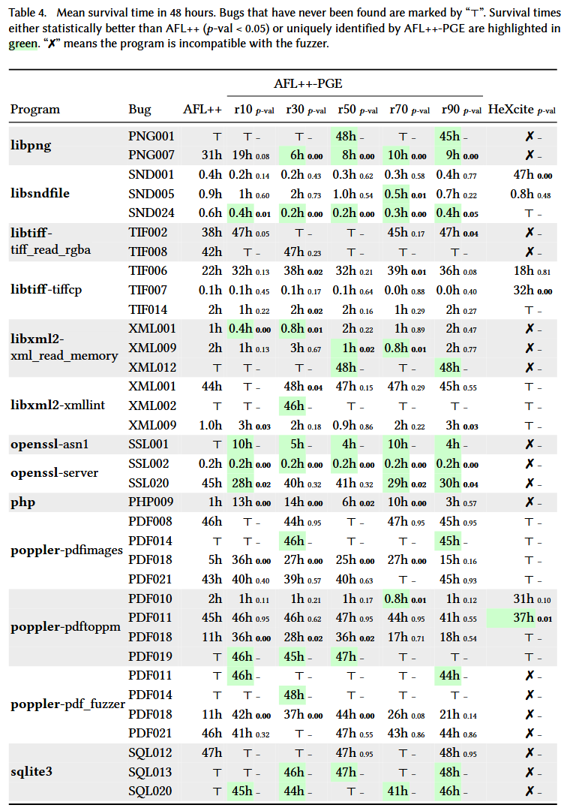
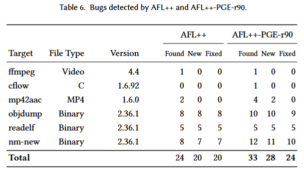
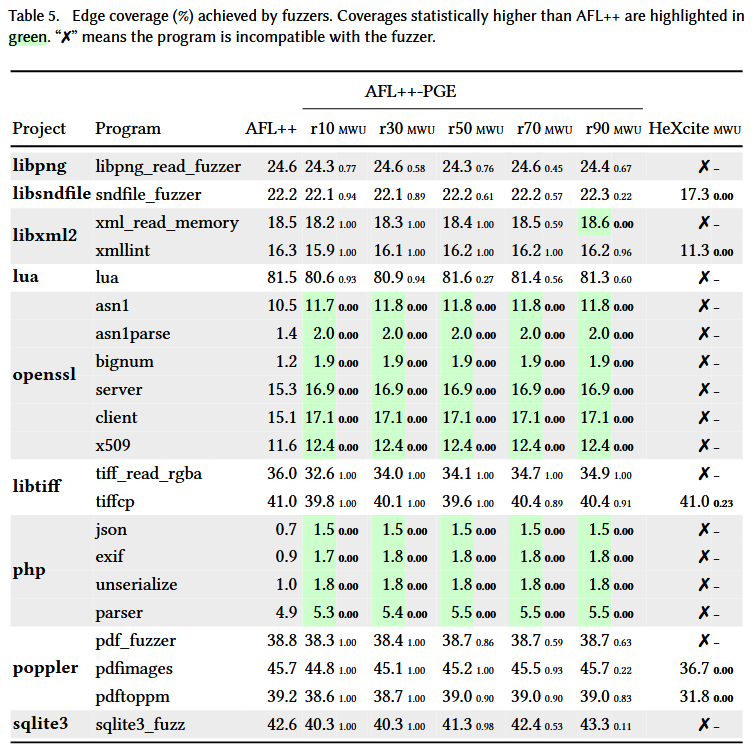

# Accelerating Fuzzing through Prefix-Guided Execution [OOPSLA 2023]

执行种子的每个变异输入, 会带来很大的性能负担. 因此, 如果能够不实际执行就能判断输入是否会带来覆盖率增加, 就能够提升 fuzzing 性能. 本文提出 prefix-guided execution (PGE) 来解决这个挑战. PGE 利用两个关键的观察, (1) 只有少部分变异输入会增加覆盖率; (2) 一个输入是否增加覆盖率可以通过其部分执行精确推断. 主要思想: PGE 观测一个输入的前缀执行 (execution prefix) 当其增加覆盖率可能性很低时提前中止执行.

基于 AFL++ 的原型系统实现 AFL++ -PGE, 在 MAGMA 的 9 个项目共 21 个程序上评估, 显示 AFL++ -PGE 发现的 bug 更多, 发现速度更快, 覆盖率更高.

## Methods

Observation 1: Only a tiny fraction of tests are coverage-increasing.

Observation 2: Execution prefixes correlate highly with a test’s coverage increasingness.

Observation 3: Not all bug-triggering tests are coverage-increasing.

Definition 2.1 (Execution Prefix) 给定长 $$n$$ 的执行路径 $$T^k$$, 执行的 $$l$$ 长前缀定义为 $$\Pi^k(l) = multiset(<e_0^k, e_1^k, ..., e_{l-1}^k>) = \{e_0^k, e_1^k, ..., e_{l-1}^k\}$$. 

Definition 2.2 (Interesting Execution Prefix) 给定长度 $$l$$, 和已知的执行 $$E = \{E^0, E^1, ..., E^{l-1}\}$$ 及其执行前缀 $$\mathcal{P} = \{\Pi^0(l), \Pi^1(l), ..., \Pi^{m-1}(l)\}$$. 如果 $$\Pi^m(l) \notin \mathcal{P}$$, 则认为该执行前缀是有趣的. 

算法 1 展示 PGE 的工作流. 模糊器提供一组种子 $$S$$ 和目标召回率 $$r$$. 每次测试循环, 从 $$S$$ 中选择 $$s$$, 在当前循环生成所有测试都从 $$s$$ 中变异得到, 然后搜索能达到召回率 $$r$$ 的最小前缀长度 $$l$$. 对于每个测试 $$s'$$, 模糊器执行目标二进制文件, 收集长度 $$l$$ 的执行前缀 $$\Pi^{s'}(l)$$. 如果 $$s'$$ 增加代码覆盖率, 将 $$s'$$ 添加到 $$S$$, 如果 $$s'$$ 导致独特崩溃则缓存 $$s'$$; 否则执行下一个测试. 

图 5 中灰色模块是 PGE 的三个关键组件

+ Prefix Execution: 给定一个测试和前缀长度 $$l$$, 该模块执行目标二进制文件, 并在执行访问 $$l$$ 个边时终止它
+ Prefix Analysis: 展示有兴趣前缀的输入会被完全执行, 而非兴趣前缀的输入将被丢弃

+ Prefix Length Search: 通过二分搜索找到达到目标召回率 $$r$$ 的最小前缀长度. `CalculateRecall` 计算公式如下:

$$
r=\frac{\sum_{i=0}^{p-1}({arrFull}[i] \wedge {arrPrefix}[i])}{\sum_{i=0}^{p-1} {arrFull}[i]}
$$

## Evaluation

RQ1/2/3/4/5 是每个模块的贡献研究实验, 具体见论文

### RQ6. Effectiveness of fuzzing in terms of bug finding

### RQ7. Effectiveness of fuzzing in terms of code coverage

