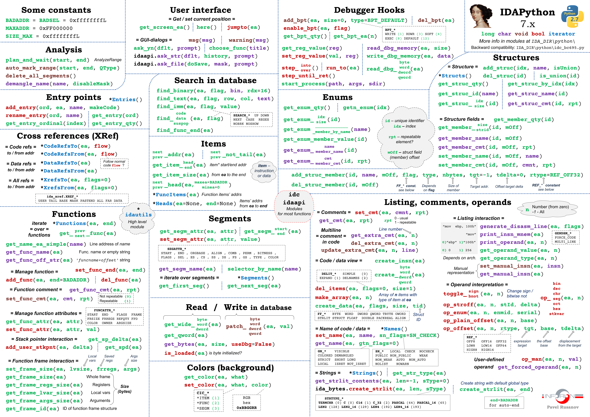

# IDAPro-7.7 Cheat Sheet

最近在写插桩后二进制文件的控制流以及数据流等数据的抽取的 IDAPro 脚本, 需要用到很多 IDAPro 提供的 APIs, 这里做一个总结. (持续更新中

>  Environments: IDAPro 7.7, Python=3.9

## One Figure for All




## Constants

```python
ida_idaapi.BADADDR == 0xFFFFFFFF
ida_idaapi.SIZE_MAX == 0xFFFFFFFF

FUNC_LIB == 0x4
FUNCATTR_FLAGS == 0x10
INF_MIN_EA == 0x13
INF_MAX_EA == 0x14
FUNC_THUNK == 0x80
```


## Entry

```python
def add_entry(*args) -> "bool":
    r"""
    add_entry(ord, ea, name, makecode, flags=0) -> bool
    Add an entry point to the list of entry points.

    @param ord: (C++: uval_t) ordinal number if ordinal number is equal to 'ea' then ordinal is
                not used
    @param ea: (C++: ea_t) linear address
    @param name: (C++: const char *) name of entry point. If the specified location already has a name,
                 the old name will be appended to the regular comment. If name ==
                 nullptr, then the old name will be retained.
    @param makecode: (C++: bool) should the kernel convert bytes at the entry point to
                     instruction(s)
    @param flags: (C++: int) See AEF_*
    @return: success (currently always true)
    """
    return _ida_entry.add_entry(*args)


def get_entry(*args) -> "ea_t":
    r"""
    get_entry(ord) -> ea_t
    Get entry point address by its ordinal

    @param ord: (C++: uval_t) ordinal number of entry point
    @return: address or BADADDR
    """
    return _ida_entry.get_entry(*args)
```


## Cross References (XRef)

```python
def CodeRefsTo(ea, flow):
    """
    Get a list of code references to 'ea'

    @param ea:   Target address
    @param flow: Follow normal code flow or not
    @type  flow: Boolean (0/1, False/True)

    @return: list of references (may be empty list)

    Example::

        for ref in CodeRefsTo(get_screen_ea(), 1):
            print(ref)
    """
    # TO_REFACTOR_ON_PY2_REMOVAL
    # we can use the new generators
    # xref = ida_xref.xrefblk_t()
    # if flow == 1:
    #     yield from xref.crefs_to(ea)
    # else:
    #     yield from xref.fcrefs_to(ea)
    if flow == 1:
        return refs(ea, ida_xref.get_first_cref_to, ida_xref.get_next_cref_to)
    else:
        return refs(ea, ida_xref.get_first_fcref_to, ida_xref.get_next_fcref_to)
    
    
def CodeRefsFrom(ea, flow):
    """
    Get a list of code references from 'ea'

    @param ea:   Target address
    @param flow: Follow normal code flow or not
    @type  flow: Boolean (0/1, False/True)

    @return: list of references (may be empty list)

    Example::

        for ref in CodeRefsFrom(get_screen_ea(), 1):
            print(ref)
    """
    # TO_REFACTOR_ON_PY2_REMOVAL
    if flow == 1:
        return refs(ea, ida_xref.get_first_cref_from, ida_xref.get_next_cref_from)
    else:
        return refs(ea, ida_xref.get_first_fcref_from, ida_xref.get_next_fcref_from)
    
    
def XrefsFrom(ea, flags=0):
    """
    Return all references from address 'ea'

    @param ea: Reference address
    @param flags: one of ida_xref.XREF_ALL (default), ida_xref.XREF_FAR, ida_xref.XREF_DATA

    Example::
           for xref in XrefsFrom(here(), 0):
               print(xref.type, XrefTypeName(xref.type), \
                         'from', hex(xref.frm), 'to', hex(xref.to))
    """
    xref = ida_xref.xrefblk_t()
    return xref.refs_from(ea, flags)


def XrefsTo(ea, flags=0):
    """
    Return all references to address 'ea'

    @param ea: Reference address
    @param flags: one of ida_xref.XREF_ALL (default), ida_xref.XREF_FAR, ida_xref.XREF_DATA

    Example::
           for xref in XrefsTo(here(), 0):
               print(xref.type, XrefTypeName(xref.type), \
                         'from', hex(xref.frm), 'to', hex(xref.to))
    """
    xref = ida_xref.xrefblk_t()
    return xref.refs_to(ea, flags)
```


## Functions

```python
def Functions(start=None, end=None):
    """
    Get a list of functions

    @param start: start address (default: inf.min_ea)
    @param end:   end address (default: inf.max_ea)

    @return: list of function entrypoints between start and end

    @note: The last function that starts before 'end' is included even
    if it extends beyond 'end'. Any function that has its chunks scattered
    in multiple segments will be reported multiple times, once in each segment
    as they are listed.
    """
    if start is None: start = ida_ida.cvar.inf.min_ea
    if end is None:   end = ida_ida.cvar.inf.max_ea

    # find first function head chunk in the range
    chunk = ida_funcs.get_fchunk(start)
    if not chunk:
        chunk = ida_funcs.get_next_fchunk(start)
    while chunk and chunk.start_ea < end and (chunk.flags & ida_funcs.FUNC_TAIL) != 0:
        chunk = ida_funcs.get_next_fchunk(chunk.start_ea)
    func = chunk

    while func and func.start_ea < end:
        startea = func.start_ea
        yield startea
        func = ida_funcs.get_next_func(startea)

        
def get_func(*args) -> "func_t *":
    r"""
    get_func(ea) -> func_t
    Get pointer to function structure by address.

    @param ea: (C++: ea_t) any address in a function
    @return: ptr to a function or nullptr. This function returns a function entry
             chunk.
    """
    return _ida_funcs.get_func(*args)


def get_func_name(*args) -> "qstring *":
    r"""
    get_func_name(ea) -> str
    Get function name.

    @param ea: (C++: ea_t) any address in the function
    @return: length of the function name
    """
    return _ida_funcs.get_func_name(*args)


def get_frame_id(ea):
    """
    Get ID of function frame structure

    @param ea: any address belonging to the function

    @return: ID of function frame or None In order to access stack variables
             you need to use structure member manipulaion functions with the
             obtained ID.
    """
    frame = ida_frame.get_frame(ea)

    if frame:
        return frame.id
    else:
        return None
    

def get_func_cmt(*args) -> "qstring *":
    r"""
    get_func_cmt(pfn, repeatable) -> str
    Get function comment.

    @param pfn: (C++: const func_t *) ptr to function structure
    @param repeatable: (C++: bool) get repeatable comment?
    @return: size of comment or -1 In fact this function works with function chunks
             too.
    """
    return _ida_funcs.get_func_cmt(*args)


def get_prev_func(ea):
    """
    Find previous function

    @param ea: any address belonging to the function

    @return: BADADDR - no more functions
            otherwise returns the previous function start address
    """
    func = ida_funcs.get_prev_func(ea)

    if not func:
        return BADADDR
    else:
        return func.start_ea
    
    
def get_prev_func(ea):
    """
    Find previous function

    @param ea: any address belonging to the function

    @return: BADADDR - no more functions
            otherwise returns the previous function start address
    """
    func = ida_funcs.get_prev_func(ea)

    if not func:
        return BADADDR
    else:
        return func.start_ea
    

def get_next_func(ea):
    """
    Find next function

    @param ea: any address belonging to the function

    @return:        BADADDR - no more functions
            otherwise returns the next function start address
    """
    func = ida_funcs.get_next_func(ea)

    if not func:
        return BADADDR
    else:
        return func.start_ea
```


## Reference

[1] https://github.com/inforion/idapython-cheatsheet

[2] https://python.docs.hex-rays.com/annotated.html

[3] https://skyi23.github.io/2024/11/11/IDA%20Python%20%E4%BD%BF%E7%94%A8%E6%80%BB%E7%BB%93/

